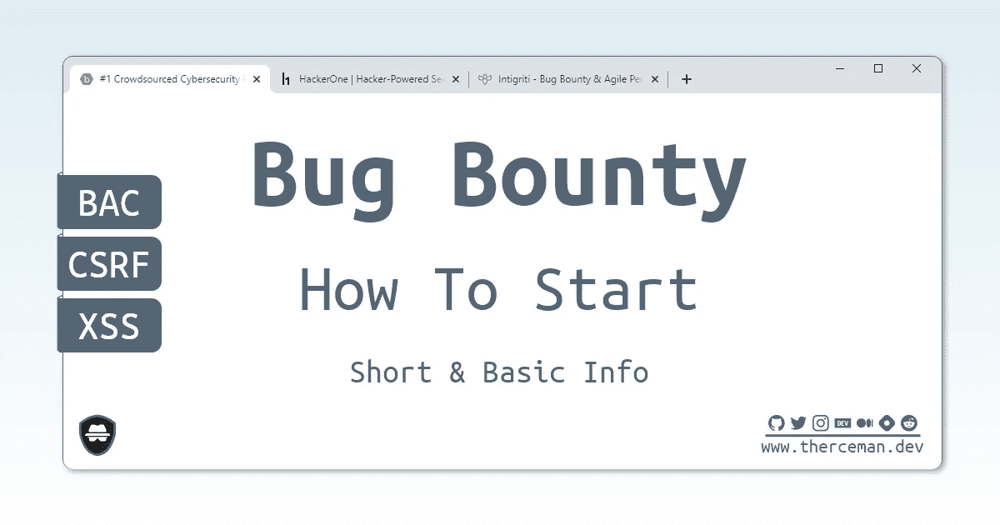

# 如何开始 Bug 赏金狩猎

> 原文：<https://infosecwriteups.com/how-to-start-bug-bounty-hunting-94b1ff3dda27?source=collection_archive---------0----------------------->

## 臭虫赏金世界的简单介绍

我推荐在以下众包网络安全平台(bug bounty 平台)注册:

*   [https://www.bugcrowd.com](https://www.bugcrowd.com/)
*   [https://www.hackerone.com](https://www.hackerone.com/)
*   [https://www.intigriti.com](https://www.intigriti.com/)

在野外(而不是在 bug bounty 平台上)搜索 bug 可能很棒，但这可能不是最好的起点，因为不能保证公司会对你的报告做出回应，也不能保证你的工作会得到任何奖励或认可。

随着时间的推移，Bug bounty 平台可以提供私人邀请，与公共项目相比，这可以为你提供更低的竞争，增加你找到独特东西的机会。

试着把重点放在范围广泛的程序上，在那里你可以管理用户(创建角色)、文档、图像等等。

然后从一个简单的开始——创建两个用户(一个基本用户和第二个管理员)，打开两个浏览器，开始测试 **BAC** (破坏访问控制)漏洞。

简而言之，这是一种基本用户可以执行管理操作的漏洞。

其中一些漏洞可以通过直接链接到部分/端点来发现，但其他漏洞需要您修改发送到浏览器的请求

我推荐使用 [@Burp_Suite](https://twitter.com/Burp_Suite) 进行请求捕获&修改。你可以免费下载社区版。

推荐插件:Logger++

在测试网站/应用程序的 BAC 错误时，您可以突出显示对关键操作的所有 GET 请求。例如`/delete_user?id=1`

可以直接发送给用户的具有关键操作(如删除用户)的请求被视为一个 **CSRF** (跨站点请求伪造)漏洞

POST 请求也可以用来执行 CSRF 攻击，但通常有 CSRF 保护机制(如`csrf_tokens`或`referrer`检查)

CSRF 保护有时会被绕过。尝试切换 POST 方法以获取或移除密钥的令牌值— `csrf_token=`

有了推荐人保护，你可以尝试将你的域名附加到一个推荐人，就像这样`[http://example.com.yourdomain.com](http://example.com.yourdomain.com)`

或者，如果有一个检查，该域应该在引用的结尾，你可以尝试这样做:`[http://yourdomain.com/site.com](http://yourdomain.com/site.com)`

执行 bug 赏金猎人的第三个基本规则是在所有可能的输入中加入一个基本的有效载荷:`qwe'"<X</`

和观看网站上的文字反射。如果你会在某处看到`qwe'"`(没有尖括号)——这可能是一个 **XSS** 的机会

另外，在页面的源代码中搜索`qwe`文本。使用浏览器中的开发人员工具完成此任务。

有效载荷可以反映在任何地方

1.在标签参数中:

`qwe'"<x`

2.在标签属性中:

`<a class="qwe'"<x</">`

3.在用位置改变逻辑标记事件属性中:

`<a onclick="location.href='qwe'">`

这里可以尝试注入 javascript 协议。例如:

`location.href='javascript:alert(1)'`

4.在`<script>`标签内:

`<script>let a = "qwe'"<x</"<script>`

目前就这些。

干杯，狩猎愉快👍

*继续阅读……*

🔗[如何找到你的第一个 Bug:Bug 赏金的动机和技巧](https://therceman.medium.com/how-to-find-your-first-bug-motivation-and-tips-for-bug-bounty-hunting-5e7343066d0c)
🔗[$ 350 XSS 15 分钟](https://medium.com/bugbountywriteup/350-xss-in-15-minutes-dcb74ad93d5f)

分享臭虫奖励提示

🔸[LinkedIn.com/in/therceman](https://LinkedIn.com/in/therceman)

🔸【Twitter.com/therceman】

🔸[Telegram.me/therceman](https://Telegram.me/therceman)

🔸[TikTok.com/@therceman](https://TikTok.com/@therceman)

🔸[YouTube.com/therceman](https://YouTube.com/therceman)

最诚挚的问候，安东