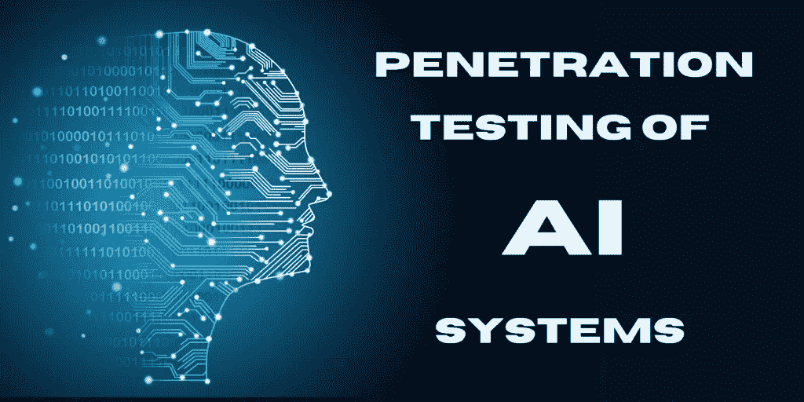
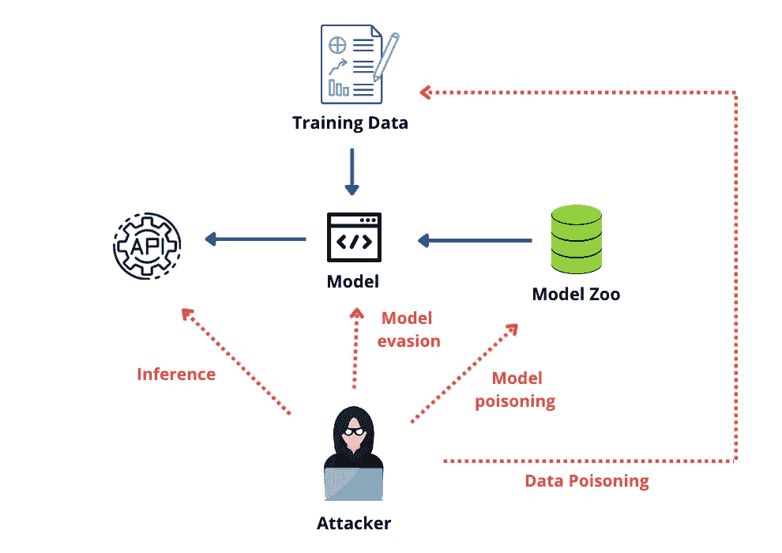
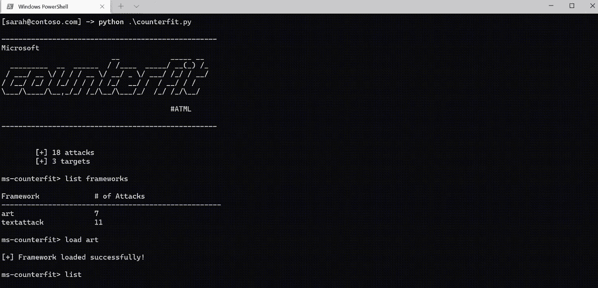
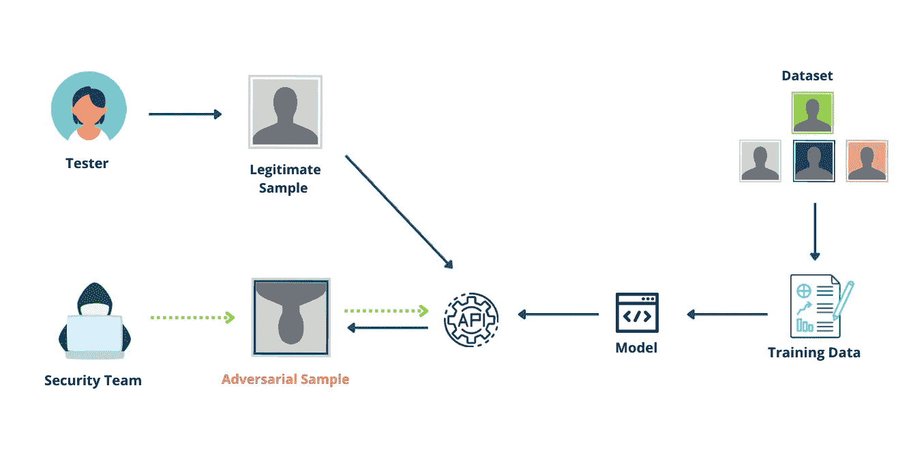

# 如何开始人工智能的渗透测试

> 原文：<https://infosecwriteups.com/how-to-start-penetration-testing-of-artificial-intelligence-c11e97b77dfa?source=collection_archive---------0----------------------->

## Pentesting 需要发展以发现基于人工智能的风险

在过去的几十年里，软件安全已经走过了漫长的道路。现在很难相信，但是曾经有一段时间**渗透测试**只在主机/网络层进行，安全团队完全知道应用级攻击，如 **SQL 注入、跨站点脚本**等。因此，攻击者开始通过攻击应用层来绕过网络防火墙等传统防御，我们看到了 Web 应用防火墙(WAF)、Appsec 审查、安全代码等控制措施的出现。

今天，软件安全已经发展到通过 DevSecOps 运动涵盖无服务器、API 控制和管道安全等技术

> ***这历史课有什么意义？概括来说，今天的软件是建立在以前的技术经验之上的，我们面临着在安全审查和渗透测试*** 中没有涉及的基于人工智能的系统上重复同样错误的危险

# 新出现的威胁

正如安全团队所知，黑客是出了名的聪明。一旦在应用程序中实施了一层安全措施，他们就会将目标转移到不具备相同成熟度的新兴技术上。请记住，今天基于人工智能的系统是过去的 web 应用程序，即网络安全团队没有意识到的一个全新的攻击领域。

对于实施基于人工智能的系统的公司，网络安全团队通常会对软件栈进行渗透测试，直到应用层，但*忽略了一个关键点*:

> 基于人工智能(AI)的系统最重要的特征是根据提供的数据做出决策的能力。*如果这些数据和决策能力遭到破坏或窃取，那么整个人工智能生态系统都会受到损害*

不幸的是，今天的大多数网络安全团队都没有意识到人工智能系统引入的新型攻击。在这些攻击中，攻击者操纵人工智能系统如何工作的独特特征，以利于他的恶意意图。

许多商业模型已经被操纵或欺骗，这种类型的攻击只会随着人工智能的大规模采用而增加。

# 人工智能攻击的独特类型

人工智能引入的新威胁面相当多样化。数据可能会被**有意或无意地**毒害，从而导致被操纵的决策。类似地，一旦攻击者弄清楚了底层的决策逻辑，人工智能逻辑或数据可以被"**"推断出来，导致数据提取，而模型可以被"**"回避。****

********

****来源:作者****

****如果这听起来有点太模糊，那么下面将深入介绍这些攻击的更多细节:****

****⚠ ️ **数据中毒**:攻击者可以毒害用于训练机器学习模型的训练数据。通过污染这个数据源，攻击者可以创建一个“后门”,因为他知道该模型是根据错误数据训练的，并且知道如何利用它。这有助于进一步的攻击，如后面提到的模型规避。****

****⚠ ️ **模型中毒**:和之前的攻击一样，但是这次攻击者的目标是模型而不是数据。一个预先训练好的模型被破坏并注入了后门，攻击者可以利用这些后门绕过它的决策过程。大多数公司不是从零开始建立模型，而是使用预先训练的模型，这些模型通常是可用的，如微软的 [ResNet](https://www.microsoft.com/en-us/research/blog/microsoft-vision-model-resnet-50-combines-web-scale-data-and-multi-task-learning-to-achieve-state-of-the-art/) 或 [Clip](https://openai.com/blog/clip/) OpenAI。这些模型存储在模型动物园中，这是开源框架和公司组织其机器学习和深度学习模型的常见方式。这就像一个软件供应链攻击，攻击者可以对许多用户下毒****

****⚠ ️ **数据提取**:攻击者可以查询模型，了解在学习中使用了哪些训练数据。这可能导致敏感数据的泄露，因为攻击者可以推断出模型训练中使用的数据，如果涉及敏感数据，这将特别危险。这种类型的攻击也称为“成员推理”,不需要访问模型的功能，只需观察模型的输出就可以完成****

****⚠ **️Model 提取:**攻击者可以通过反复查询模型并观察其功能来创建模型的离线副本。事实上，大多数模型公开地暴露了它们的 API，并且没有适当地净化它们的输出，这可能会助长这些攻击。这种技术允许攻击者深入分析离线拷贝，并了解如何绕过生产模型****

****⚠ **️Model 规避:攻击者**通过提供特定的输入来欺骗模型，从而导致错误的决策。这通常通过观察运行中的模型并理解如何绕过它来实现。例如，攻击者可以试图欺骗基于人工智能的反恶意软件系统不检测他们的样本或绕过生物特征验证系统。****

****毫无疑问，随着人工智能应用的增加；上述攻击将变得像今天的 SQL 注入一样普遍，并且将被一并提及。防范这些攻击的最佳解决方案之一是通过将它们合并到当前的渗透测试实践中来进行早期检测。****

# ****笔测试人工智能应用****

****好消息是你不必从头开始。如果你曾经作为网络安全团队的一员参与过渗透测试或 red teaming，那么你可能会熟悉 [**米特 ATT & CK**](https://attack.mitre.org/) 框架，这是一个基于真实世界示例的可公开访问的对手攻击和技术框架。****

****它在全球范围内被各种公共和私营部门组织用于威胁模型和风险评估。任何人都可以访问它，并了解攻击者将用来攻击特定系统的战术和技术，这对参与渗透测试或红队的人非常有用。****

****这个流行的框架被用作创建 [**MITRE ATLAS**](https://atlas.mitre.org/) (人工智能系统的对抗性威胁格局)的模型，它被描述为****

*****“机器学习(ML)系统的对手战术、技术和案例研究的知识库，基于真实世界的观察、ML red 团队和安全小组的演示以及学术研究的可能状态*”****

****ATLAS 遵循与 MITRE 相同的框架，因此当网络安全从业者想要测试其内部人工智能系统的漏洞和安全风险时，他们可以非常容易地研究和采用它的技术。它还有助于在网络安全社区中建立对这些风险的意识，因为这些风险是以他们已经熟悉的格式呈现的。****

# ****人工智能渗透测试工具****

****标准安全工具通常没有内置基于人工智能的技术，这些技术可以评估模型对模型推断或规避等风险的脆弱性。值得庆幸的是，网络安全团队可以使用免费工具来补充他们现有的渗透测试工具包。这些工具是开源的，但是你也可以寻找商业替代品。****

****无论您喜欢哪种类型，都要确保工具具有以下特征。****

1.  ******模型不可知:**可以测试所有类型的模型，不局限于任何一个特定的模型****
2.  ******技术不可知**:它应该能够测试托管在任何平台上的人工智能模型，无论是在云上还是在本地。****
3.  ******与您现有的工具包集成:**应该具有命令行功能，以便为您的安全团队轻松编写脚本和实现自动化。****

****您可以找到的一些免费工具有****

*   ****[**由微软**](https://github.com/Azure/counterfit) 抗衡:被微软描述为“作为开源项目的一个 *n 用于安全测试 AI 系统的自动化工具。Counterfit 帮助组织进行人工智能安全风险评估，以确保其业务中使用的算法是健壮、可靠和值得信赖的*。Counterfit 提供了一种很好的方式来自动化和测试针对 AI 系统的攻击，并且可以在红队和渗透测试中使用。它包含预加载的人工智能攻击模式，安全专业人员可以通过脚本从命令行运行，并可以与现有的工具包集成****

********

*   ****[**对抗性鲁棒性工具箱(ART)**](https://github.com/Trusted-AI/adversarial-robustness-toolbox) 被描述为*一个用于机器学习安全的 Python 库。ART 提供工具，使开发人员和研究人员能够防御和评估机器学习模型和应用程序，抵御规避、中毒、提取和推理的对抗性威胁。ART 支持所有流行的机器学习框架"*****

********

****来源:作者****

****为了使这些工具有效，请确保将其映射到 **ATLAS** 框架，以便您可以将其与通用标准保持一致。您可以使用这些工具进行 red 团队/渗透测试以及进行 AI 系统的漏洞评估。使用它们来定期扫描您的人工智能资产，并建立人工智能特定风险的风险跟踪器。通过随着时间的推移跟踪这些风险，您可以看到您的安全状况有所改善，并随着时间的推移监控进度。****

****获得更好的攻击背景和意识的另一个有价值的资源是此处[列出的 Atlas 案例研究页面](https://atlas.mitre.org/studies)。这个页面列出了对生产 AI 系统的已知攻击，安全团队可以使用它来更好地了解对他们系统的影响。****

****我希望这是有用的，给你一个将 AI 渗透测试添加到你的网络安全保证活动的起点。请放心，由于人工智能应用的大量增加以及网络罪犯对滥用人工智能的兴趣，这个领域将在未来几年内大受欢迎。****

> ******祝您的人工智能安全之旅好运！如果你有兴趣了解更多，那么可以查看我的关于 AI 安全的书** [**这里**](https://www.amazon.com/Artificial-Intelligence-Governance-Cyber-Security-beginners/dp/B09YHK8L2T/) **或者我的打折大师班关于题目** [**这里**](https://cloudsecguy.gumroad.com/l/aigovernance/1tojq7p?_gl=1*1c51k6t*_ga*MzQ0NDEyMjc4LjE2NDM3MTgwOTU.*_ga_6LJN6D94N6*MTY2MzA5NTE4Ni4yNzEuMS4xNjYzMDk1MTkzLjAuMC4w)****

**** [## 通过我的推荐链接加入 Medium-Taimur Ijlal

### 阅读 Taimur Ijlal(以及媒体上成千上万的其他作家)的每一个故事。您的会员费直接支持…

taimurcloud123.medium.com](https://taimurcloud123.medium.com/membership)**** 

## ****来自 Infosec 的报道:Infosec 每天都有很多内容，很难跟上。[加入我们的每周简讯](https://weekly.infosecwriteups.com/)以 5 篇文章、4 个线程、3 个视频、2 个 Github Repos 和工具以及 1 个工作提醒的形式免费获取所有最新的 Infosec 趋势！****