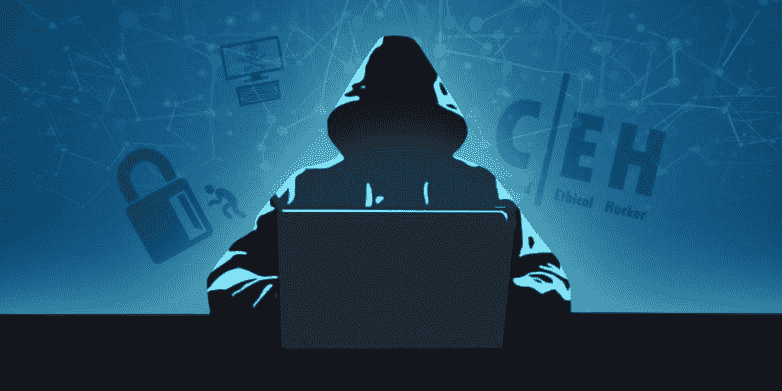

# 初学者指南|如何成为一名有道德的黑客

> 原文：<https://infosecwriteups.com/how-to-start-your-career-in-any-field-related-to-information-security-841adcf20901?source=collection_archive---------0----------------------->

你是否厌倦了阅读无休止的关于道德黑客的新闻故事，却不知道这意味着什么？让我们改变这一切！

这篇文章是写给那些:

*   没有网络安全(黑客)经验
*   经验有限。
*   那些不能休息的人

好了，让我们深入这篇文章，并建议一些你可以在网络安全方面领先的方法。

我收到许多关于如何成为黑客的电子邮件。“我是黑客初学者，应该怎么开始？”或者“我想黑掉我朋友的脸书账户”是一些更常见的问题。在这篇文章中，我将尝试回答这些和更多的问题。我将给出详细的技术指导，告诉你如何作为一个初学者开始，以及如何随着你在这个领域获得更多的知识和专业技能而发展。黑客是一种技能。你必须记住，如果你想学习黑客技术，仅仅是为了获得侵入你朋友的脸书账户或电子邮件的乐趣，那是行不通的。你应该决定学习黑客技术，因为你对技术非常着迷，并且渴望成为计算机系统专家。是时候改变你帽子的颜色了😀

> 我已经有很多帽子了。黑色、白色或有时呈暗灰色。天色越暗，你就越开心。马克曼

# ***游戏攻略！***

首先，让我们一致认为，说“网络安全职业生涯”有点像说“银行业职业生涯”，也就是说，这是一个涵盖行业内几十个细分市场的总称。例如，在网络安全领域，我们可以将数字取证作为一种职业，或者将恶意软件/软件检测、审计、测试、社会工程和许多其他职业作为一种职业。网络安全中的每一个子类别都应该有一个单独的博客帖子，但是，为了本文的目的，让我们关注一些每个人在开始成功的 IT 安全职业生涯之前都需要的重要的通用要求。

如果你没有经验，不要担心。我们都必须从某个地方开始，我们都需要帮助才能走到今天。没有人是一座孤岛，也没有人生来就具备所有必要的技能。句号。好吧，所以你没有经验和有限的技能…在这种情况下，我的建议是你自学一些绝对的基础知识。

让我们开始派对吧。

## 1.什么是黑客？

黑客攻击是**识别**某个系统的弱点和漏洞并**获得对它的访问权**。

*黑客*通过目标系统获得未经授权的访问，而*道德黑客*拥有合法的官方许可来评估目标系统的安全状况。

有一些类型的黑客，有点“术语”。
**白帽子**——道德黑客。
**黑帽** —经典黑客，获得非授权访问。
**灰帽子** —获得未经授权的访问，却向公司暴露弱点的人。
**剧本 kiddie**——一个没有任何技术技能的人只是用了预先做好的工具。
**Hacktivist** —为某个想法而黑客，并留下一些消息的人。例如反对版权罢工。

实际上，道德黑客的目标是揭示系统的弱点和漏洞，让公司来修复它们。道德黑客记录了他所做的一切。

## 2.成为道德黑客所需的技能。

首先，要成为一名 Pentester，你需要愿意不断地学习新事物，或者在家快速学习。其次，您需要对至少一种编码/脚本语言有很强的基础理解，并对网络和 Web 安全有所了解。

所以，如果你想从现在开始，这里有一些步骤…

1.  学习编码(编程)。
2.  理解操作系统的基本概念
3.  网络和安全基础
4.  标记和尽可能多的技术！

## 3.在什么平台上编码:-

这取决于你将在什么平台上工作。对于 web 应用，建议你学习 *HTML、PHP、JSP、*和 *ASP* 。手机应用，试试 *Java(安卓)**Swift(iOS)**(Windows Phone)*。对于基于桌面的软件，试试 *Java，C#，C++* 。

我还想推荐 *Python* ，因为它是一种通用语言，而且由于其可移植性，现在越来越受欢迎。

但是对于每一种编程语言来说，真正必要的是学习编程的基础知识，如数据类型、操作系统级别的程序变量操作以及子例程(也称为函数)的使用等概念。如果你学会了这些，除了一些语法上的变化，其他编程语言都是一样的。

**保护提示:-**

1.  要成为任何一种编程语言的专家，都要理解该语言的操作系统级操作(在不同的编译器中有所不同)，或者学习汇编语言以便更通用化
2.  如果你不能在短时间内取得成果，就不要期望太高。我更喜欢“宫城”式的学习。所以，要为接下来的事情保持动力。
3.  永远不要低估网络和系统管理员的力量。在企业信息安全环境中，他们可以让你成为他们的“假想”奴隶😀

## 入门资源:

我想分享一些我从零开始学习中发现最好的资源。

 [## 闯入信息安全领域:学习诀窍 101

### 所有的基本主题，让你从零到初级 pentester 水平-涵盖一切你需要知道的…

leanpub.com](https://leanpub.com/ltr101-breaking-into-infosec)  [## 网络黑客 101

### 2015 年 12 月 22 日，Twitter 因暴露漏洞向道德黑客支付了超过 14000 美元。这不是一个…

leanpub.com](https://leanpub.com/web-hacking-101) 

我为你的帮助创建了一个完整的资源列表😉([***https://github . com/husnainfareed/Resources-for-learning-ethical-hacking/***](https://github.com/hussnainfareed007/Resources-for-learning-ethical-hacking/)*)*

另一个建议……定期关注*到 b 更新与 [**HackerOne**](https://hackerone.com/) 公开 Bug 报告你可以从他们那里学到很多，关注[https://www.owasp.org/index.php/Cat…](https://l.facebook.com/l.php?u=https%3A%2F%2Fwww.owasp.org%2Findex.php%2FCategory%3AOWASP_Top_Ten_Project&h=ATP6M5CYo8XcNfkhbXy1uUqgVjIEjm34WsiCUlwktlALUHUzA1fP5Iay_QyJXEBCChZMdCNer3-9mWWENPn56M6LcA34n76WJdmzUTBEmr0TO5S5XCjK4DDHbMZJaXUkxPESev1o-Wph)*

*或者，你可以加入黑客 Slack 社区*

*[*https://bugbounty-world.slack.com/*](https://bugbounty-world.slack.com/)*

*[*https://bugbountyforum.com/*](https://bugbountyforum.com/)*

> ****你也应该考虑在*** 上练习你的技能*

*[*http://www.itsecgames.com/*](http://www.itsecgames.com/)*

*[*http://www.dvwa.co.uk/*](https://l.facebook.com/l.php?u=http%3A%2F%2Fwww.dvwa.co.uk%2F&h=ATN77lf6_OywSkg6e8d0nvFNQaig25G2rh_9hC_DTHp-rpOwTrIZDOIT79q8QdT8a8EJTy1T6poSUTc4hbqvNku7wxELirfdIJn7sshMFtuHCtrToCRgjt-PIxAyfMke8ul8wymnjc-g)*

*[*http://www.vulnerablewebapps.org/*](http://www.vulnerablewebapps.org/)*

*【http://hackyourselffirst.troyhunt.com/*T42**

*[*https://github.com/s4n7h0/xvwa*](https://github.com/s4n7h0/xvwa)*

*[*http://zero.webappsecurity.com/*](http://zero.webappsecurity.com/)*

*[*http://crackme.cenzic.com/kelev/view/home.php*](http://crackme.cenzic.com/kelev/view/home.php)*

**【http://demo.testfire.net】T5[T6](http://demo.testfire.net/)**

**[*https://www . OWASP . org/index . PHP/Category:OWASP _ web goat _ Project*](https://www.owasp.org/index.php/Category:OWASP_WebGoat_Project)**

# **HackerOne 公开报道！**

**这些报告可能会帮助你们深入了解 BugBounty 狩猎...**

**[**hacker one Public reports . CSV**](https://github.com/upgoingstar/hackerone_public_reports/blob/master/HackeronPublicReports.csv)**

## **需要注意的一些要点:**

*   ****由自学者:**为什么？因为没有它，你就不能从你经历的事情中学习，你就不能解决你的问题。**
*   ****每天自学:**阅读文章、评论、视频或幻灯片来自学**
*   **了解你的目标，在行动之前确保了解你的目标。花大部分时间确定你的目标，确定目标使用的服务。**
*   **绘制目标地图:更好地观察目标的基础设施，以便更好地了解目标。**
*   **走没人走过的路:不要做外面的普通人。跳出框框思考，思考开发者错过了什么，思考普通人的目标是什么，这取决于选择你的道路。**
*   ****成为忍者**:作为忍者你需要快速精准。知道，绘制地图，准确快速地锁定目标。只有当你擅长走一条不同的路，并且你是独一无二的时候，这才有用。**

**如果你想了解更多关于侦查和如何追逐 Bug 赏金的信息，请阅读这篇文章**[**在追逐一个 Bug 赏金**](https://medium.com/secjuice/guide-to-basic-recon-bug-bounties-recon-728c5242a115)**。******

******让我们希望你的余生不会被这篇文章列入黑名单。我有很多有趣的事情要做。再见。******

## ******如果你喜欢这个故事，请点击👏按钮并分享，以帮助其他人找到它。你也可以[给我买杯咖啡](https://www.buymeacoffee.com/hussnainfareed)帮我给你写更多有趣的内容！******

******如果你对道德黑客或逆向工程感兴趣，你应该看看我们在 Guided Hacking 的朋友提供的信息安全教程集。******