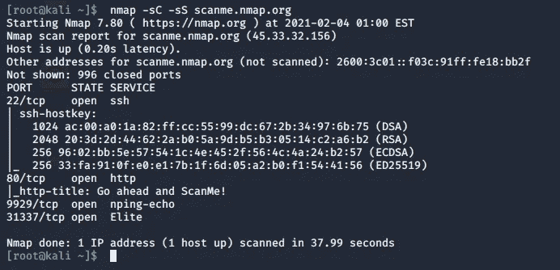

# 如何理解和开发自己的 Nmap 第 1 部分——网络锻造

> 原文：<https://infosecwriteups.com/how-to-understand-and-develop-a-nmap-of-your-own-part-1-cyberforged-ee92dd4bb901?source=collection_archive---------2----------------------->


让我们开发 Nmap 吧！

正如我们在上一集所看到的，Nmap 是识别服务器上开放的服务的一把瑞士军刀。

在这一系列文章中，我们不打算谈论同样的事情，但我们将看到 Nmap 最实用和技术性的部分:我们将看到它是如何工作的，以及我们如何用 Java(一种通用的跨平台语言)开发它的操作。通过这种方式，我们将能够在将它与其他应用程序集成时复制它的行为，并且我们将能够清楚简明地理解它的行为和流程。

我们将把我们自己的 Nmap 的开发分为 4 个阶段:这篇文章本身就是一个意图声明，因为我们将为我们接下来要做的事情打下基础。在第二部分中，我们将只编写其功能的一小部分(最基本的，TCP 端口检测)，然后我们将开发一个扩展来覆盖更多类型的服务(UDP)，在最后一部分中，我们将研究如何使用该工具运行自动化脚本。

需要注意的是，我们将使用 Kali 作为我们的操作系统，它默认安装了 nmap。如果您不使用 Kali，您可以通过在终端中运行这些行来安装 Nmap(您需要 root 权限)

```
//Update the list of packages available 
sudo apt-get update //Install nmap 
sudo apt-get install nmap //Verify the installation 
nmap --version
```

让我们去吧！

# Nmap 在现实中是什么样子的？

我认为，在我们进入如何开发我们自己的 Nmap 以及它如何工作之前，我们应该看看 Nmap 在现实中是什么样子的。

要运行 Nmap(如果不使用 Kali 就安装一次)，我们所要做的就是使用它的名称，在这种情况下，我们可以看到我们安装了哪个版本:


为了测试我们运行它后会得到什么样的结果，我们可以使用 Nmap 组织提供的 URL:scanme.nmap.org



这里值得注意的是，我们使用了两个标志:

*   -sC:它运行默认脚本，以便对服务器上公开的服务执行完整的检测。
*   -sS:使用一种特定类型的扫描，称为 TCP 连接，这是最简单的一种。

我们看到 scanme.nmap.org 的端口 22、80、9929 和 31337 是开放的。这些端口对应于 SSH、Web 服务器、Nping 和 Elite 服务，它们在服务器上处于活动状态并进行监听。

# 发现开放端口

既然我们已经看到了 Nmap 在现实中的样子，我们必须开始理解它是如何发挥其魔力的。首先，我们必须列出我们感兴趣的特性:

*   服务器上开放端口的列表
*   检测这些端口上的服务(识别)
*   运行自动化安全脚本

对于第一个任务，有很多技巧。事实上，在网上[http://phrack.org/issues/51/11.html#article](http://phrack.org/issues/51/11.html#article)我们可以看到 Nmap 使用的技术。其中，主要的有:

*   TCP connect()扫描:这是所有扫描中最简单的。它只是尝试使用 TCP 三次握手连接到一个端口，如果连接成功，就意味着该端口是开放的。这就是我们将在这一系列文章中使用的。
*   TCP SYN 扫描:也叫“半开”。TCP 握手的第一部分被使用(发送一个 SYN 包),如果端口应答，这意味着端口是开放的。
*   TCP FIN 扫描:有时防火墙会阻止 SYN 数据包，因此无法通过之前的扫描进行检测。TCP FIN 扫描发送一个 FIN 数据包，如果端口实际上是打开的，则等待 RST 数据包。
*   UDP ICMP 端口不可达扫描:在这种情况下，我们可以使用这种类型的扫描来检测 UDP 上的开放端口，而不是 TCP。这种扫描利用了这样一个事实，即如果 UDP 端口被关闭，当 UDP 数据包被发送到它时，它将“正常地”用 ICMP_PORT_UNREACH 数据包作出响应。在这种情况下，我们将检测关闭的端口，因此，我们将知道哪些是开放的。

还有更多类型的扫描，但这些是我们目前最感兴趣的。

对于第二项任务，即检测那些开放端口上的服务，我们必须做一些实地工作，看看通过这些端口侦听的每个程序回答什么类型的数据。当我们开始开发这个部分时，我们将不得不构建一个服务和它们对探测包的相应回复的字典，以便自动识别它们。

对于最后一个，自动化脚本的执行，我们将利用 bash 脚本，并且从我们闪亮的新 Nmap 中，我们将运行它们以便自动化测试，例如检测那些端口上暴露的服务中的漏洞。

准备好了吗？在下一篇文章中，我们将设计第一个任务，并开始编码我们全新的 Nmap！

你现在有什么意见吗？留在评论框吧！

*原载于 2021 年 2 月 8 日*[*【https://cyberforged.com】*](https://cyberforged.com/how-to-understand-develop-nmap-part-1/)*。*