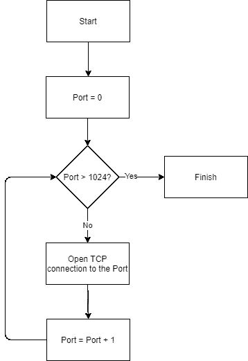
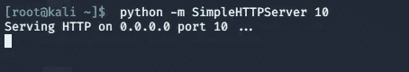
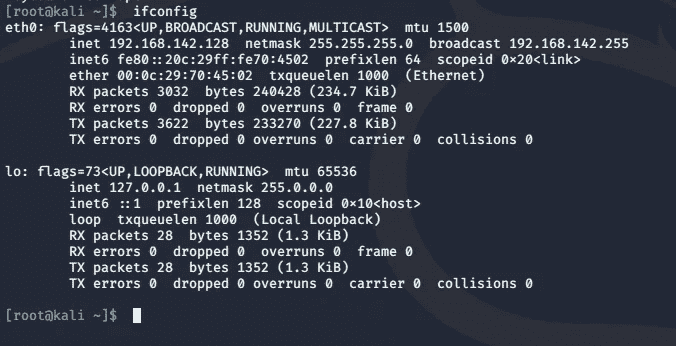
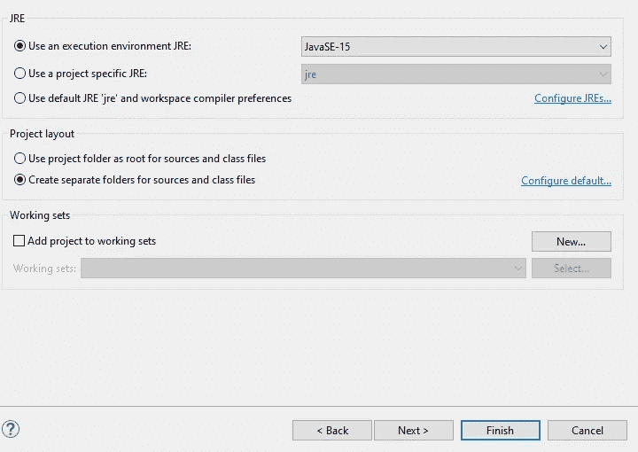
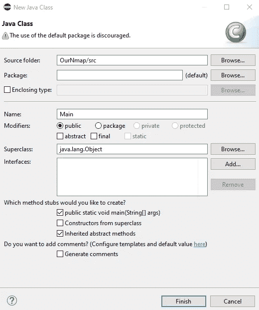
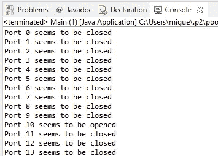

# 如何理解和开发自己的 Nmap 第 2 部分——网络锻造

> 原文：<https://infosecwriteups.com/how-to-understand-and-develop-a-nmap-of-your-own-part-2-cyberforged-35f4ea6f01cf?source=collection_archive---------2----------------------->


Nmap 开发，开始了

这是我们撰写的关于如何剖析和开发 Nmap 及其所有特性的系列文章的第二部分。如果你错过了上一篇文章的介绍，请点击这里:[https://infosecwriteups . com/how-to-understand-and-develop-a-nmap-of-your-own-part-1-cyber forged-ee 92 DD 4 bb 901](/how-to-understand-and-develop-a-nmap-of-your-own-part-1-cyberforged-ee92dd4bb901)

在本系列的这一部分，我们将开始开发 Nmap。为这项任务选择的语言是 Java，因为它是一种多平台语言，已经在市场上销售了很多年，这样可以让更多的读者更容易理解。

嗯，那么…我们去吗？

# 目标

我们必须做的第一件事是定义我们的 Nmap，或者说我们的第一个版本的目标。我们要开发的第一件事是它的功能，以发现哪些端口是开放的，哪些端口不在目标服务器上。

为此，我们将使用我们在本系列第一部分中看到的一种扫描类型:TCP 连接。这个扫描是所有选项中最简单的:我们要做的是打开一个到目标端口的完整 TCP 连接(使用三次握手):

*   如果它拒绝连接，我们认为端口关闭。
*   如果它接受连接，我们认为端口是开放的。

就这么简单明了。

至于程序本身，我们将创建遵循以下模式的功能:



1.  我们将通过 Eclipse 向导(IDE 顶部的绿色箭头)启动程序
2.  我们的 Nmap 版本将打开到第一个端口的 TCP 连接，确定它是否打开。
3.  我们在端口号上加 1。
4.  然后，如果端口大于 1024，我们就停止程序。

决定不采用 1024 以上的程序是因为端口 0-1023 被认为是“众所周知”的端口，这意味着最知名的程序或服务将始终侦听这些端口。在任何情况下，应该注意的是，只有通过改变上限变量的数值变量，我们才能修改这种行为。在这个链接中，你可以看到带有不同类型端口的表格，以及在哪里可以找到每个服务[https://en . Wikipedia . org/wiki/List _ of _ TCP _ and _ UDP _ port _ numbers](https://en.wikipedia.org/wiki/List_of_TCP_and_UDP_port_numbers)。

# 编程！

为了在没有问题的情况下测试服务器，我们使用 VMWare 启动了一个 Kali 虚拟机(任何 Linux 虚拟机都可以)。启动后，我们利用 SimpleHTTPServer python 库在端口 10 上打开一个 web 服务器:



如果您使用 python3，您应该运行以下命令:

```
python3 -m http.server
```

为了能够指向其 IP 地址，最好将虚拟机配置为 NAT 模式，这样它会自动为自己配置一个只有主机才能看到的 IP。为了能够看到它的 IP，我们只需要使用 ifconfig 命令:



这就是我们必须在 eclipse 程序中配置的 IP(eth 0 中的 inet)。

对于编程任务，我们将使用最扩展的 IDE:Eclipse(2020–12 版)。

我们首先在文件>新建>项目中创建一个新项目。然后我们选择 Java > Java Project 来创建我们自己的 Nmap 版本。这些是我们将在这个项目中使用的设置。



默认情况下，Eclipse 将创建一个名为 module-info.java 的 java 类(模块)。在这种情况下，我们不打算使用它，所以我们可以从项目中删除它。同时，我们创建了一个名为 Main.java 的新 Java 类，我们所有的逻辑都将放在那里。

要创建它，右键单击 project > New > Class 的 src 文件夹。选中这个框很重要，这样它会自动创建“公共静态 void main ”,这将是我们所有程序中的根方法。



现在，让我们在主类中开发代码。

第一件事是添加三个变量:我们要在每次迭代中检查的端口号，它将从 0 开始，我们希望它达到的最大端口，最后是定义我们要扫描到哪个 IP 的变量(我们在虚拟机中见过的那个)。

下一件事是定义停止条件，如果满足该条件(目的端口号超过最大限制)，我们应该完成 Nmap。

接下来要做的就是用 Java Socket 类打开一个到目的端口的 TCP 连接，看看连接有没有异常:如果有，端口关闭，如果没有，端口打开:

作为最后一步，我们必须增加端口的数量，以便能够逐个检查:

如果我们把这个类的所有部分放在一起，看起来会像这样:

如果我们在 Eclipse 中执行这段代码，它会逐个端口地检查，看看哪些端口打开了，哪些没有打开。

一旦完成，剩下唯一要做的事情就是在 Eclipse 中运行它，我们将得到以下输出:



正如我们所看到的，我们的 Nmap 能够检测到目标服务器上的端口号 10 是打开的，并在屏幕上显示一条消息。

# 警告

> 如果当您尝试运行代码时，Eclipse 说“Selection does not contain a main type”这样的问题，您必须右键单击项目中的 src 文件夹>构建路径>配置构建路径>编辑>下一步>添加多个> Main.java。这样，您就已经配置了要运行的类。

# 结论

这是我们系列的第二部分，我们将最终开发一个全功能的 Nmap。有了创建的功能，我们将能够看到哪些端口是打开的，哪些不是。

当然，这仍然是一个概念验证，需要很多改进，其中之一就是提高系统的速度。但这将在本指南的后续步骤中介绍。

你怎么看，你有什么要评论的吗？把它放在下面的盒子里！

*原载于 2021 年 2 月 9 日*[*【https://cyberforged.com】*](https://cyberforged.com/how-to-understand-and-develop-a-nmap-of-your-own-part-2/)*。*