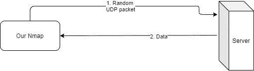
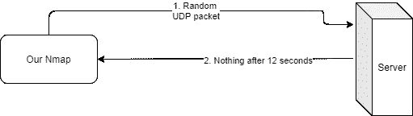
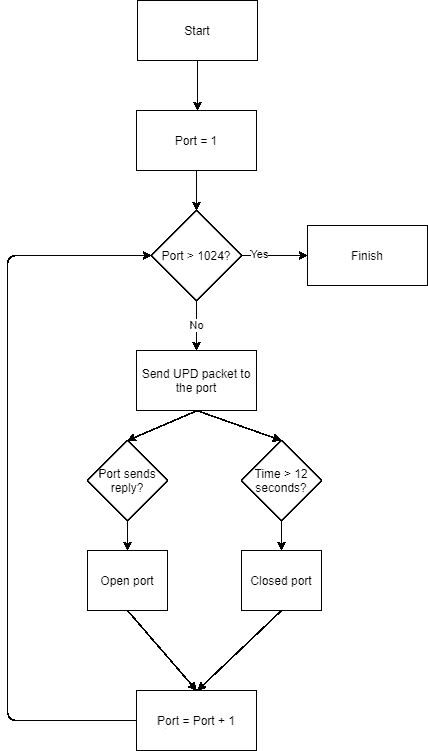
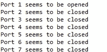
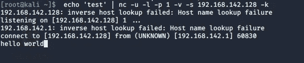

# 如何理解和开发自己的 Nmap 第 3 部分——网络锻造

> 原文：<https://infosecwriteups.com/how-to-understand-and-develop-a-nmap-of-your-own-part-3-cyberforged-d757dca0dc72?source=collection_archive---------0----------------------->

嗯……我们继续吗？😀

欢迎回到本教程/指南，学习如何使用 Java 作为基本语言来复制 Nmap。本指南面向那些希望了解如何能够在其软件中包含 Nmap 的主要功能(如发现开放端口)而无需集成整个系统的人。与此同时，我们正在学习 Nmap 使用什么样的技术来做它所做的一切。

在本系列的前一部分(第 2 部分，您可以在这里看到)中，我们看到了如何用几行代码制作一个软件来检测服务器上开放的 TCP 端口，这是 Nmap 最基本的功能。在今天的文章中，我们将看到如何复制这种行为，但尝试检测 UDP 端口。

我们可以开始了吗？

# UDP 和它的小东西

在开始疯狂编程之前，我们必须知道检测 TCP 和 UDP 端口的真正区别是什么，也就是这两种协议的主要区别是什么？

如果我们只看我们对自己的 Nmap 版本感兴趣的内容，最关键的区别是 TCP 是面向连接的，也就是说，为了与通过 TCP 公开的任何端口对话，我们必须首先设置一些参数。我们可以将这种连接建立视为要连接的端口(源和目的地)之间的“聊天”。这个聊天只是试图同步源端口和目的端口，以确保两者都准备好通信。端口之间通信之前的这种对话称为三次握手。

一旦这种“握手”结束，两个端口都知道对方的期望，数据交换就开始了。TCP 的好处是它真的很关心数据包和它们的数据，它就像它们的母亲:它检测它们是否有错误，试图纠正它们，试图重新传输那些没有到达的数据包，亲吻它们道晚安……它们得到了最好的照顾。

好吧，让我们想象一下 UDP 也是这样，但是没有任何关系:UDP 真正错误对待数据包的唯一方式就是直接用头撞它们。这是一个完全不关心任何事情的协议，它在连接/数据交换之前没有对话，也不关心错误，也不关心重新传输…什么都不关心。这是自私的，非常自我的。但它也有一些优点:正因为它不关心任何事情，所以它非常快，所以它非常适合需要很高速度的应用程序，如果数据包丢失，也不会有太大影响(例如，YouTube 上的视频)。

从这个意义上说，UDP 和 TCP 很像这个模因。TCP 干净准确，解渴。UDP 就像往自己身上浇一壶冷水，等着什么东西到你嘴里。


# 现在，我们如何检测 UDP 中的开放端口？

可以想象，我们在 UDP 中检测端口时会遇到一个问题:我们不能像在 TCP 中那样直接打开连接，因为 UDP 恰恰是一个没有连接的协议:只有问题和答案，没有其他。

对于 UDP，应该使用的技术是:发送 UDP 数据，并尝试查看目的端口是否用另一个特殊的数据包进行响应，在这种情况下使用 ICMP 协议(ICMP_PORT_UNREACH)。这将为我们提供端口已关闭的信息，通过排除，我们可以知道哪些端口是真正打开或关闭的。这种解决方案的问题是，它需要 root 权限和对所谓的原始套接字的访问，即在非常低的级别控制套接字发送的数据。

在本指南中，我们将首先执行以下检测，而不是上面解释的扫描:如果 UDP 端口在 12 秒的最大时间内响应我们，我们认为它是开放的，否则，我们认为它是关闭的。



如果端口关闭，当我们发送随机 UDP 数据包时，在最长 12 秒的时间内，它要么不回答我们，要么用 ICMP_PORT_UNREACH 回答我们(后者我们将无法检测)。



因此，我们将遵循这个流程图:



你相信吗？让我们进入编程部分！

# 密码

在这种情况下，我们不打算展示上一期文章中的代码，因为已经解释过了。UDP 检测的代码如下:

```
public static void main(String[] args) { 

int port = 1; 
int upperLimit = 14; 

String dstIP = "192.168.142.128"; 

int configuredTimeout = 12000; 

while (port < upperLimit) { 

  // UDP variables 
  DatagramSocket UDPSocket = null; 
  InetAddress address; 

  byte[] buf; 

  try { 

    // We open a new UDP socket 
    UDPSocket = new DatagramSocket(); 
    address = InetAddress.getByName(dstIP); 

    // The message to be sent to the port, 
    String msg = "hello world"; 
    buf = msg.getBytes(); 
    DatagramPacket packet = new DatagramPacket(buf, buf.length, address, port); 

    // We send the packet 
    UDPSocket.send(packet); 
    packet = new DatagramPacket(buf, buf.length); 

    // We configure the socket to have a maximun timeout 
    UDPSocket.setSoTimeout(configuredTimeout); 
    UDPSocket.receive(packet); 

    // Then if we receive something, we know the port is opened 
    String received = new String(packet.getData(), 0, packet.getLength()); 
    System.out.println("Port " + port + " seems to be opened"); 

  } catch (SocketTimeoutException e) { 
    // The port is closed! 
    System.out.println("Port " + port + " seems to be closed"); 
  } catch (SocketException e) { 
    // TODO Auto-generated catch block 
    e.printStackTrace(); 
  } catch (UnsupportedEncodingException e) { 
    // TODO Auto-generated catch block 
    e.printStackTrace(); 
  } catch (IOException e) { 
    // TODO Auto-generated catch block 
    e.printStackTrace(); 
  } finally { 
    UDPSocket.close(); 
  }  
 port++; 
 } 
}
```

这里，我们使用的是:

*   接收功能，如果目的端口响应我们，我们将接收数据(因此，它是开放的)。
*   socket 变量的 setSoTimeout 函数能够将这 12 秒作为等待的上限。
*   SocketTimeoutException 异常的捕获，当超过 12 秒而没有收到来自目标端口的响应时，将执行该异常。

有了这三个工具，我们将能够知道端口是打开的还是关闭的。事实上，我们可以使用上次在本指南的前一部分中使用的 kali 映像进行测试。

我们在 UDP 模式下在端口 1 上以监听模式启动 netcat，使用以下行:

```
echo 'test' | nc -u -l -p 1 -v -s 192.168.142.128 -k
```

命令的“echo test”部分是这样的，一旦有人(我们的 Nmap)向那个端口(port 1)发送数据，netcat 就用那个字符串“test”进行回复。

我们只需在 Eclipse 中启动我们的 Nmap 版本，获得以下结果:



在 netcat 部分，我们看到我们的字符串“hello world”已经发送。"



瞧啊。我们有一个 Nmap 可以检测开放的 UDP 端口。现在我们需要做的是改进它，以包括我们已经讨论过的原始套接字，使它更快，使用某种 JNI 接口(能够用 C 编程，在 C 中原始套接字是真正可访问的)。

你有什么意见吗，你喜欢吗，我能帮你什么吗？请在评论中告诉我！

*原载于 2021 年 2 月 11 日*[*【https://cyberforged.com】*](https://cyberforged.com/how-to-understand-and-develop-a-nmap-of-your-own-part-3/)*。*