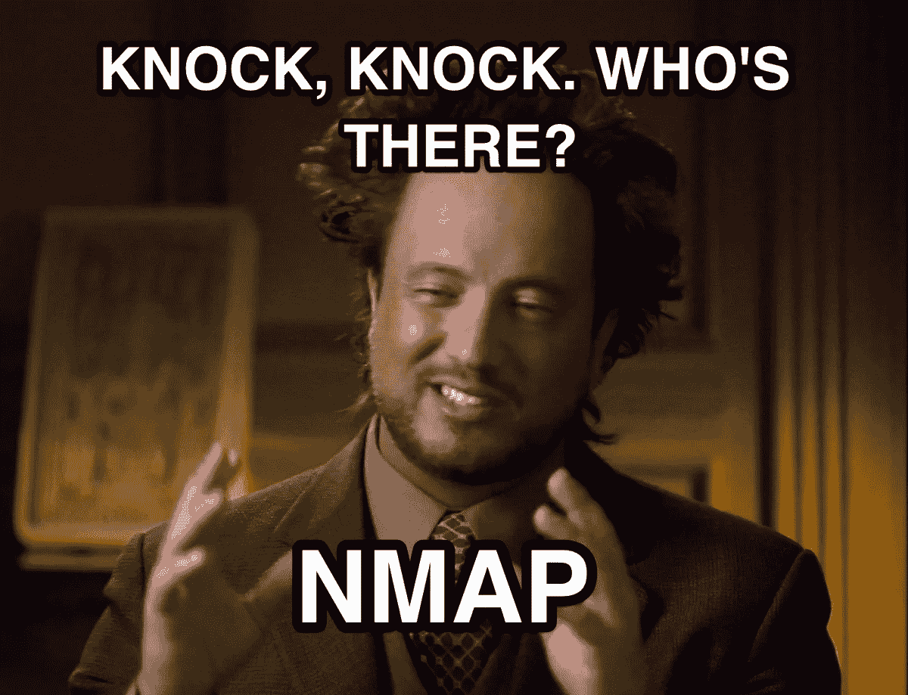
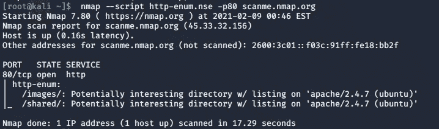
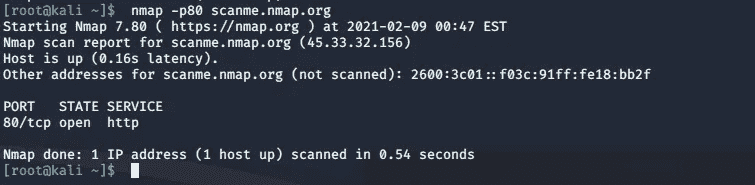
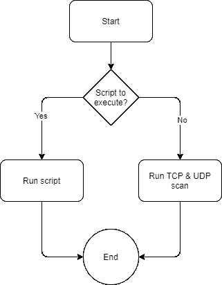
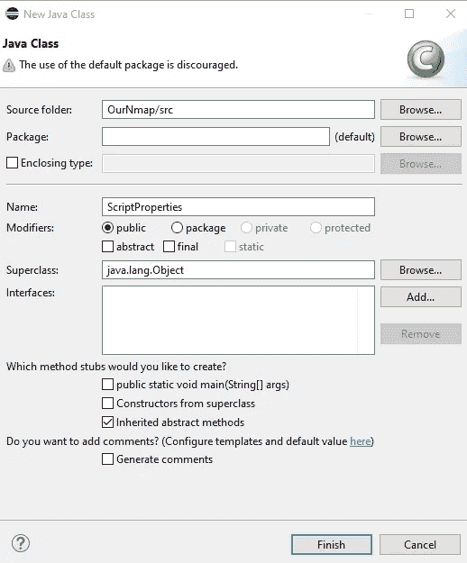
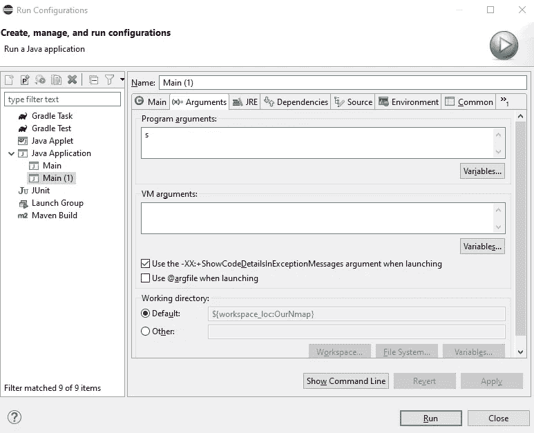
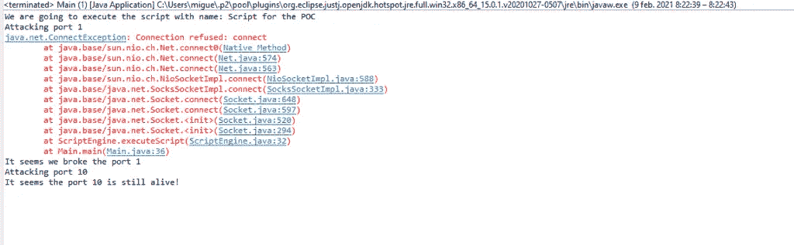
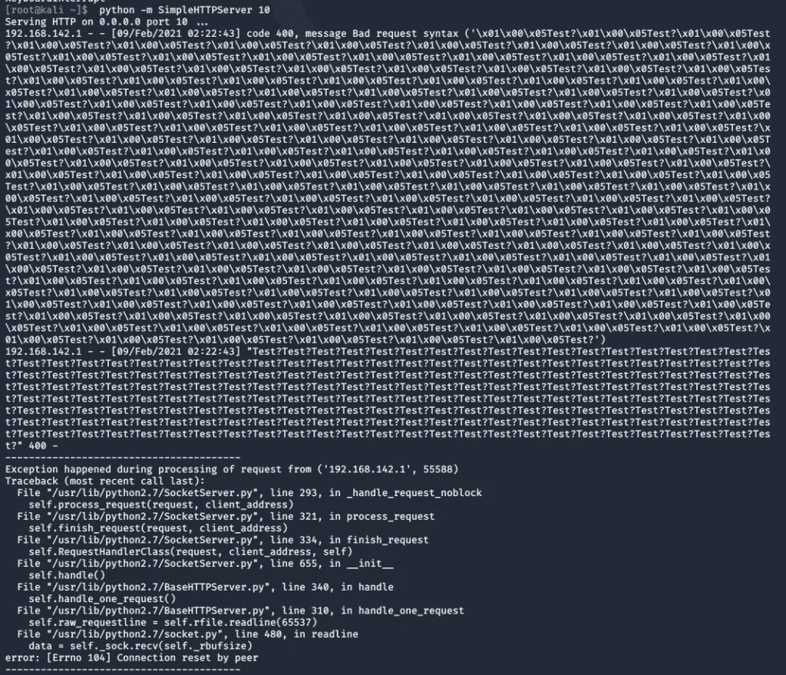

# 如何理解和开发自己的 Nmap 第 4 部分——网络锻造

> 原文：<https://infosecwriteups.com/how-to-understand-and-develop-a-nmap-of-your-own-part-4-cyberforged-c0c47d8ca15a?source=collection_archive---------0----------------------->



嗯嗯嗯…完成这个关于 Nmap 及其发展的系列怎么样？

在本系列的上一部分中，我们看到了如何编写自己版本的 Nmap 来扫描服务器上开放的 UDP 端口。如果你错过了，你可以在这里看:[https://cyber forged . com/how-to-understand-and-develop-a-nmap-of-your-own-part-3/](https://cyberforged.com/how-to-understand-and-develop-a-nmap-of-your-own-part-3/)

在这最后一部分，我们将重现 Nmap 的最佳特性之一。这个功能是能够运行脚本(或现成的食谱)的侦察对服务器。迷茫？让我解释一下。

# NMAP 和它的配方引擎

到目前为止，我们已经看到 Nmap 是一个静态程序:它要么进行 TCP 类型的扫描，要么进行 UDP 类型的扫描。它将总是执行相同的动作和相同的技术来检测相同的东西(开放端口)。但是，如果我们在给定时刻想要检测的只是编号为 10–100 的 TCP 端口，而不是我们已经检测的 0–1024 端口，那该怎么办呢？或者，如果我们想要检测的不是系统上开放的端口，而是我们可以在目标服务器中找到的潜在漏洞，该怎么办？

这正是 Nmap 最大的潜力所在:我们可以制作食谱，让 NMAP 运行它们，并在屏幕上向我们展示结果。例如，我们可以在 https://svn.nmap.org/nmap/scripts/http-git.nse 的[看到一个用 LUA(一种编程和脚本语言)编写的这类食谱的例子:](https://svn.nmap.org/nmap/scripts/http-git.nse)

```
local http = require("http") 
local shortport = require("shortport") 
local stdnse = require("stdnse") 
local string = require("string") 
local table = require("table") 
description = [[Checks for a Git repository found in a website's document root/.git/) and retrieves as much repo information aspossible, including language/framework, remotes, last commitmessage, and repository description.]]
```

事实上，NSE 脚本(或食谱)的描述可以在 https://nmap.org/book/nse-language.html[的官方网站](https://nmap.org/book/nse-language.html)上找到:

*“Nmap 脚本引擎的核心是一个可嵌入的 Lua 解释器。Lua 是一种为可扩展性而设计的轻量级语言。它为与其他软件(如 Nmap)的接口提供了一个强大的、文档完善的 API。*

*Nmap 脚本引擎的第二部分是 NSE 库，它连接 Lua 和 Nmap。这一层处理诸如 Lua 解释器的初始化、并行脚本执行的调度、脚本检索等问题。它也是 NSE 网络 I/O 框架和异常处理机制的核心。它还包括实用程序库，使脚本更加强大和方便。”*

使用这些脚本非常简单，因为我们只需告诉 Nmap 我们希望它运行哪个脚本，以及在什么条件下运行:



如果我们将它与没有任何脚本的情况下运行 NMAP 相比，我们可以看到，当我们运行它时，添加了相当多的信息:



因此，有了这些配方或脚本，我们能够做的就是通过编程与 Nmap 进行交互，并告诉它执行一些预定的操作。有用吧？

# 太好了，现在怎么办？

现在，我们必须在我们自己的 Nmap 版本中复制这种行为。我们要做的事情并不像 Nmap 那样复杂，因为我们的只是一个简单的概念证明。

我们要做的是开发我们自己类型的配方或脚本引擎，使用计算社区的另一个标准:JSON。在这种情况下，我们将在一个单独的 Java 类中定义一些函数，我们将看到如何从 JSON 文件中读取数据，然后能够根据脚本或配方中的内容执行一些函数或其他函数。

让我们去吧！

# 结构

我们必须设计的第一件事是我们的 NMAP 在执行流程方面的外观:



如果要运行的脚本通过 main 函数的参数到达我们这里，我们将执行它。如果没有，我们将运行我们在本指南的前两部分已经看到的功能。很简单，不是吗？

# JSON 脚本设计

为了运行我们将要开发的食谱，我们首先需要知道的是我们在食谱中需要什么，对吗？这些是我们将要使用的功能:

*   *名称*:能够在内部区分每个文件。
*   *IP* :我们需要知道我们应该将这个脚本或配方的操作指向哪个目的 IP。
*   *类型*:对于这个概念证明，我们将只处理一种类型的脚本。这将是拒绝服务类型。我们将尝试模拟如何注入足够的数据包，以了解服务可以抵御这种类型的攻击。
*   *每个端口的数据包*:如果脚本/方法说攻击类型是 DOS，我们将能够在知道它是否影响系统之前，指示每个端口打开多少个连接/数据包。
*   *端口*:我们必须知道我们必须在哪个/哪些端口上发送这些数据包，例如用逗号分隔。
*   *协议*:我们要“用菜谱分析”的是 TCP 还是 UDP 端口。

按照这种结构，我们可以讨论如下示例:

```
{ 
"name": "Script for the POC", 
"IP": "192.168.142.128", 
"type": "DOS", 
"number_packets_per_port": 200, 
"ports": "1,10", "protocol": "TCP" 
}
```

有了这个和适当的类，我们可以告诉我们的 NMAP 做什么和如何表现。

我们开始编程好吗？

# 编程，编程，整天编程。

好了，让我们开始真正的工作:对所有这些进行编程。

第一件事是创建能够读取 JSON 脚本属性的对象。我们可以使用像[https://json2csharp.com/json-to-pojo](https://json2csharp.com/json-to-pojo)或[http://www.jsonschema2pojo.org/](http://www.jsonschema2pojo.org/)这样的页面将 JSON 直接转换成 Java 中相应的类。

我们在 eclipse 中创建了一个名为“ScriptProperties”的新类，并复制我们从这些页面中获得的内容:



```
import com.google.gson.annotations.Expose; 
import com.google.gson.annotations.SerializedName; 

public class ScriptProperties { 

@SerializedName("name") 
@Expose 
private String name; 
@SerializedName("IP") 
@Expose 
private String IP; 
@SerializedName("type") 
@Expose 
private String type; 
@SerializedName("number_packets_per_port") 
@Expose 
private Integer numberPacketsPerPort; 
@SerializedName("ports") 
@Expose 
private String ports; 
@SerializedName("protocol") 
@Expose 
private String protocol; 

public ScriptProperties() { 
  super(); 
} 

public String getName() { 
  return name; 
} 

public void setName(String name) { 
  this.name = name; 
} 

public String getIP() { 
  return IP; 
} 

public void setIP(String iP) { 
  IP = iP; 
} 

public String getType() { 
  return type; 
} 

public void setType(String type) { 
  this.type = type; 
} 

public Integer getNumberPacketsPerPort() { 
  return numberPacketsPerPort; 
} 

public void setNumberPacketsPerPort(Integer numberPacketsPerPort) { 
  this.numberPacketsPerPort = numberPacketsPerPort; 
} 

public String getPorts() { 
  return ports; 
} 

public void setPorts(String ports) { 
  this.ports = ports; 
} 

public String getProtocol() { 
  return protocol; 
} 

public void setProtocol(String protocol) { 
  this.protocol = protocol; 
} 

}
```

在这种情况下，我们决定使用 GSON 库作为解析目标 JSON 的引擎。

现在，我们必须使之成为可能，如果在执行我们的 NMAP 的 main 方法时，我们检测到有一个标志指示一个脚本的执行，我们将不得不跳转到执行它，而不做一个完整的 TCP/UDP 扫描。为此，我们将读取 main 方法的输入参数并调用一个名为 ScriptEngine 的外部类，在这里我们将执行需要执行的内容:

```
public static void main(String[] args) { 

 // Check if a command line argument exists, if it does it should be the script 
  if (args.length > 0) { 

    Gson gson = new Gson(); 

    // Then try to read the script, in this case we are going to have it in 
    // C:\Users\Public 
    ScriptProperties scriptProperties = null; 
    try { 
     scriptProperties = gson.fromJson(new FileReader("C:\\Users\\Public\\scriptPOC.json"), 
ScriptProperties.class); 
    } catch (JsonSyntaxException | JsonIOException | FileNotFoundException e) { 
      e.printStackTrace(); 
    } 
      // Then we call the engine for it to execute the Script 
      ScriptEngine scriptEngine = new ScriptEngine(); 
      scriptEngine.executeScript(scriptProperties); 

} else { 
    // In here it would go the normal TCP and UDP port detection  we saw before this guide 
…...
```

在 ScriptEngine 类中，我们将只为这个 POC 编写基础程序。我们要做的是检查所有的值，并在这种情况下执行 DOS 类型的攻击，发送数据包，告诉我们 JSON:

```
import java.io.DataOutputStream; 
import java.io.IOException; 
import java.net.Socket; 
import java.util.ArrayList; 
import java.util.Arrays; 
import java.util.List; 

public class ScriptEngine { 

  public void executeScript(ScriptProperties scriptProperties) { 

    System.out.println("We are going to execute the script with name: " + scriptProperties.getName()); 

    // The only type of script we admit as of now 
    if (scriptProperties.getType().equals("DOS")) { 

      // As the ports are separated by commas, we read them into a List. 
      List<String> ports = Arrays.asList(scriptProperties.getPorts().split("\\s*,\\s*")); 

      // And if it is a TCP scan... 
      if (scriptProperties.getProtocol().equals("TCP")) { 

      // We start port by port 
      for (String port : ports) { 
        System.out.println("Attacking port " + port); 

        // Opening a connections and sending as much packets as the script tells us in the JSON 
        Socket socket = null; 
        DataOutputStream dataOutput = null; 

        try { 
          socket = new         Socket(scriptProperties.getIP(), Integer.valueOf(port)); 
          dataOutput = new DataOutputStream(socket.getOutputStream()); 
          for (int i = 0; i < scriptProperties.getNumberPacketsPerPort(); i++) { 

          try { 
            // Send packages of data 
            dataOutput.writeByte(1); 
            dataOutput.writeUTF("Test?"); 
            dataOutput.flush(); 

          } catch (Exception ex) { 
            System.out.println("It seems the port " + port + " is closed now!"); 
            ex.printStackTrace(); 
            break; 
          } 

         } 

        socket.close(); 

      } catch (NumberFormatException | IOException e) { 
        e.printStackTrace(); 
      } 

      // Then we check if the port is still alive! 
      try { 
        Socket verifySocket = new          Socket(scriptProperties.getIP(), Integer.valueOf(port)); 
        System.out.println("It seems the port " + port + " is still alive!"); 

      } catch (Exception ex) { 
        System.out.println("It seems we broke the port " + port); 
      } 
    } 

  } else if (scriptProperties.getProtocol().equals("UDP")) { 
     // You would do the same as in TCP but with the UDP packets 
  } else { 
    System.out.println("The only possible values are TCP and UDP"); 
  } 

 } else { 
  System.out.println("We don't support this type of scan....yet"); 
  } 
  } 
}
```

为了告诉 Eclipse 给我们传递一个参数，我们必须转到 Run > Run configuration s > Arguments，并在第一个小框中包含任何字符串:



这样，我们就可以运行它，看看一个端口是否真的能够处理 200 个数据包，就像 JSON 示例中配置的那样。我们可以使用我们的 Kali 机器启动一个 Python 服务器，看看它如何反应(端口 1 将关闭，端口 10 将持有 web 服务器):



我们看到对于端口 1，连接被拒绝，因为没有服务监听，但是我们看到端口 10 可以处理 200 个包，没有任何问题！



好了，关于 NMAP 如何工作以及它的功能如何包含在 Java 项目中的分析到此为止。当然，在代码质量等方面还有很多工作要做，但是你怎么看，你有什么意见吗？在下面的评论里留下吧！

*原载于 2021 年 2 月 12 日*[*【https://cyberforged.com】*](https://cyberforged.com/how-to-understand-and-develop-a-nmap-of-your-own-part-4/)*。*