# 如何用一个断点解开 UPX 打包的恶意软件

> 原文：<https://infosecwriteups.com/how-to-unpack-upx-packed-malware-with-a-single-breakpoint-4d3a23e21332?source=collection_archive---------0----------------------->

从内存中动态解包 UPX 有效负载。

# 什么是 UPX？

可执行文件的终极打包程序(UPX)是一个免费的开源可执行打包程序。

> 这通常是“运行时打包程序”的简称，也称为“自解压存档”。执行“打包文件”时在内存中自行解包的软件。有时这种技术也被称为“可执行压缩”。发明这种类型的压缩是为了使文件更小。因此用户不必在执行之前手动解包它们。但是考虑到目前便携式媒体的大小和互联网的速度，对小文件的需求不再那么迫切了。因此，当你看到现在使用的一些打包程序时，几乎都是出于恶意目的。本质上是使逆向工程更加困难，并在被感染的机器上留下更小的足迹。~【blog.malwarebytes.com 

 [## GITHUB/UPX

### UPX -可执行文件的终极打包器。在 GitHub 上创建一个帐户，为 upx/upx 开发做贡献。

github.com](https://github.com/upx/upx) 

# 恶意软件中 UPX 的出现频率

实际上，这是相当低的，UPX 是一个相对非常简单和记录良好的包装，你不希望作为恶意软件作者。但是，我们仍然看到一些低级恶意软件使用 UPX 作为唯一的打包程序，一些中级恶意软件在其第二阶段或 nᵗʰ阶段使用它。

在我作为一名网络安全学生的有限经验中，我已经看到了足够多的次数，可以得出这样的结论:这个技巧仍然是相关的。

# 设置

为了确保这个技巧仍然适用于最新的 UPX 版本(3.96 版)，我用 C++创建了一个小应用程序，然后用 UPX 打包，再用这个技巧解包，并比较结果。

## 创建简单的有效负载

一个小程序，要求一个整数`**x**`并给出`**x*x**`，

静态链接，PEBear 分析-

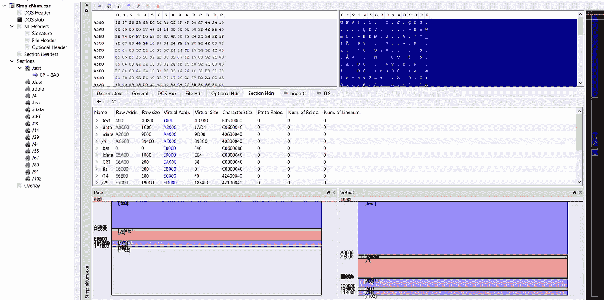

看起来像 IDA 中任何其他典型的 C++代码，

## 用 UPX 包装

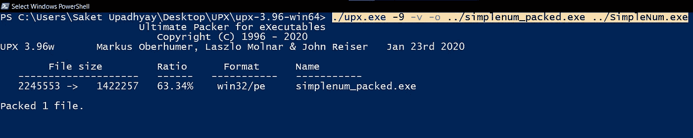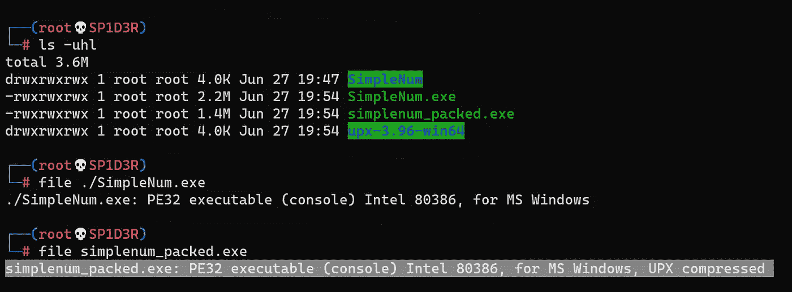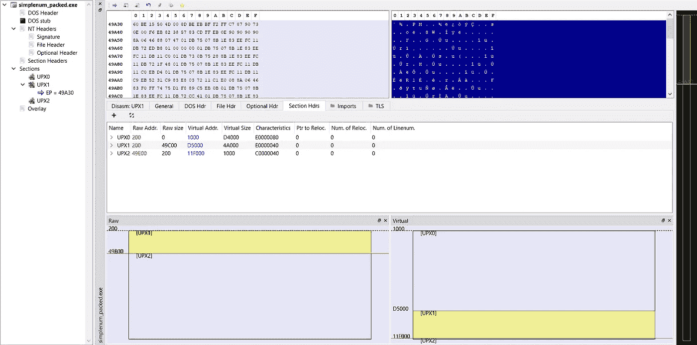

请注意，这些部分减少到只有 3 个——upx 0、UPX1 和 UPX2。此外，文件的大小也减小了(63.34%的压缩比)，让我们看看最终的 IDA 调用图作为参考。

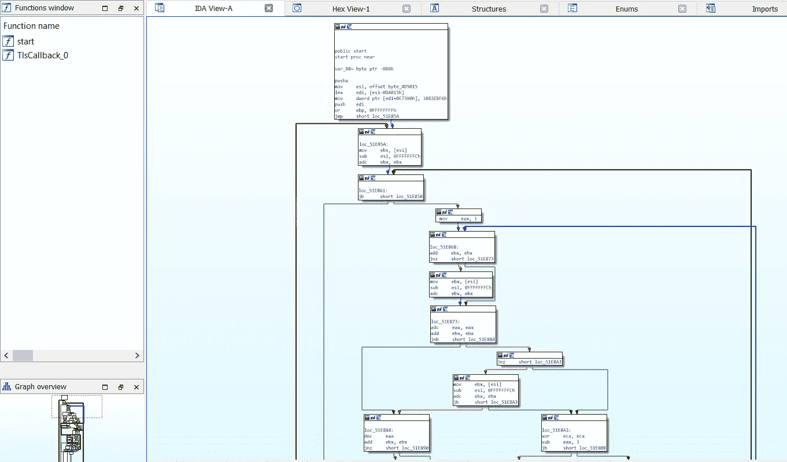

# 一个断点技巧

你可以用任何调试器做到这一点，我打算用 **x32dbg** 做这个。

默认情况下，x32dbg 会在 PUSHAD 的入口点放置一个断点。)

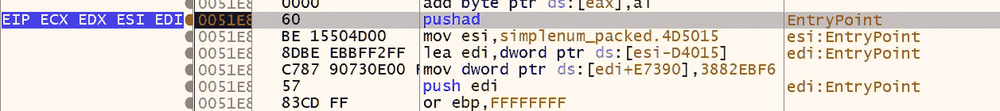 [## PUSHA/PUSHAD—推送所有通用寄存器

### 将通用寄存器的内容推送到堆栈上。寄存器存储在…

www.felixcloutier.com](https://www.felixcloutier.com/x86/pusha:pushad) 

## 第一步(搜索):

在调试器中加载二进制文件，并搜索 **POPAD** 指令。

 [## POPA/POPAD - Pop 所有通用寄存器

### 将堆栈中的双字(POPAD)或字(POPA)弹出到通用寄存器。寄存器加载在…

www.felixcloutier.com](https://www.felixcloutier.com/x86/popa:popad) 

## 第二步(设置血压):

在 **POPAD** 之后立即寻找下一个 **JMP** ，并在那里设置你的**断点**。

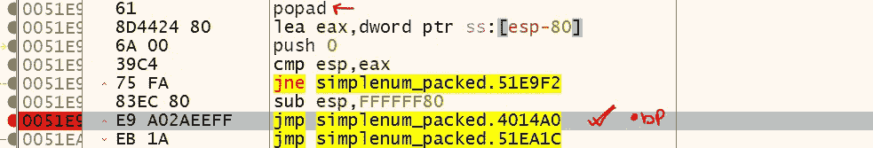

## 步骤 3(查找 OEP):

运行程序，直到遇到 **JMP 断点**

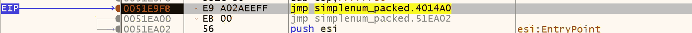

现在 ***单步*** 进入 **JMP，**这将把你带到打包的二进制文件的 **OEP** (原始入口点)。

 [## 入口点的地址和原始入口点有什么区别？

### 感谢贡献一个堆栈溢出的答案！请务必回答问题。提供详细信息并分享…

stackoverflow.com](https://stackoverflow.com/questions/46108236/whats-the-differences-between-address-of-entry-point-and-original-entry-point) 

我们得到`**004014A0**` 作为我们的 OEP，现在我们将从这个 OEP 中提取这个解包的二进制文件。

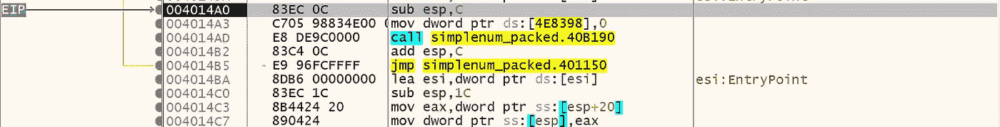

# 转储未包装 PE 并修复导入表

现在我们将从 PE 的 OEP 开始转储 PE，为此我使用了 x32dbg 的 **Scylla** 插件，

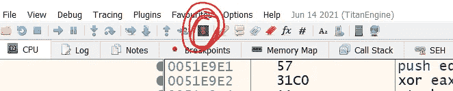

如果您正在使用相同的，请单击工具栏中的“S”按钮。

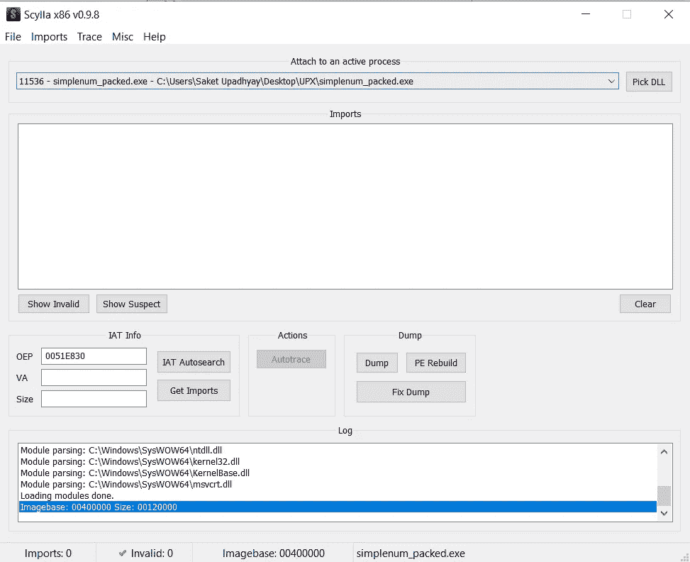

在“附加到一个活动进程”中选择您的 ***当前进程*** ，并且**确保您的 OEP 是正确的**，让我们在我们的例子中修复它-

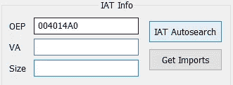

然后点击“IAT 自动搜索”来搜索进口商品。

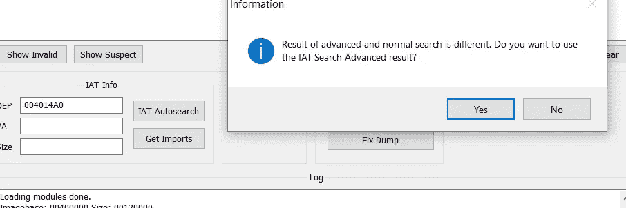

当询问高级结果时，单击“是”。完成后，单击“获取导入”列出找到的所有导入。

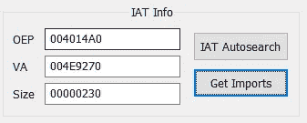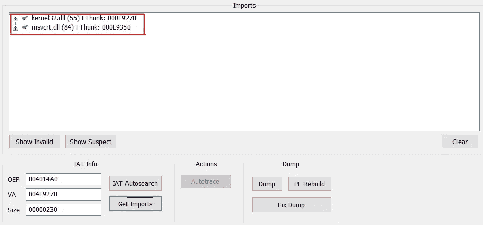

然后单击“转储”转储提取的二进制文件。

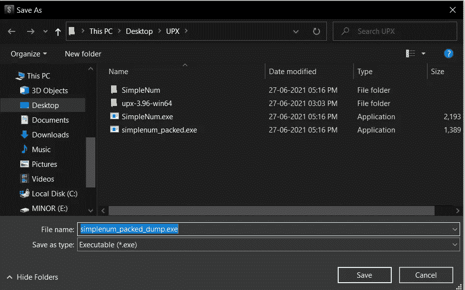

最后单击“修复转储”并选择最近转储的二进制文件来修复其 IAT。

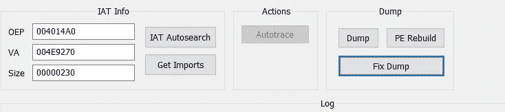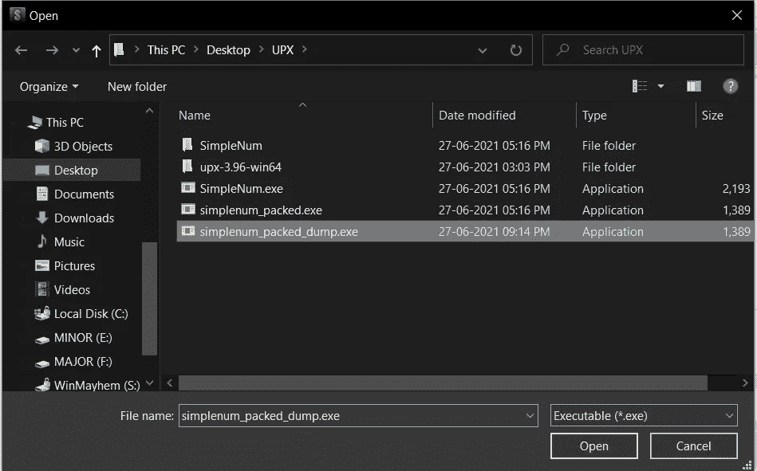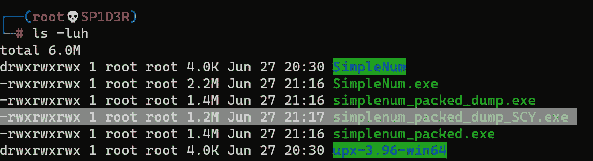

在我们的例子中，`**simplenum_packed_dump_SCY.exe**` 是最终解包的二进制文件，为了检查它，让我们在 IDA 中打开它并比较调用图。

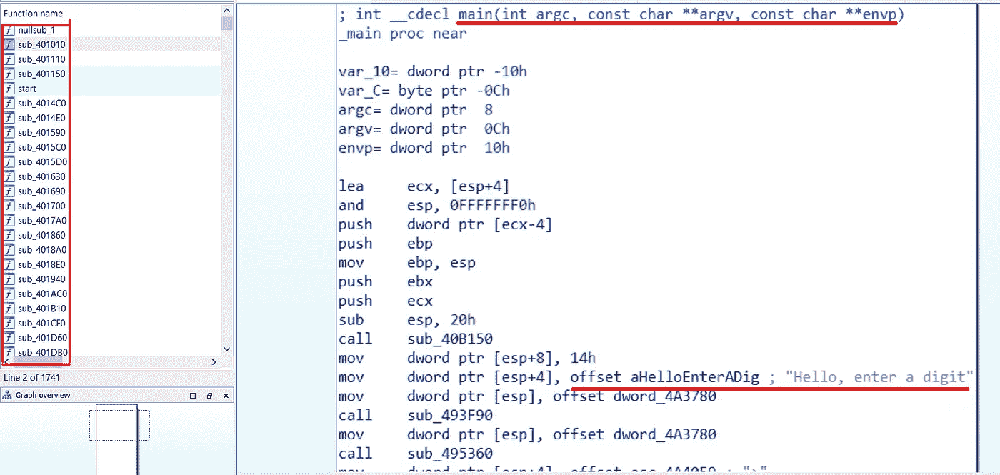

我们可以看到所有的原始字符串和类似的程序结构！我们的方法在这里已经完成了，但是如果你愿意，你可以进一步阅读以了解为什么这个方法有效。

# 为什么会这样？

这是一个众所周知的 UPX 属性的结果，当你用 UPX 打包任何可执行文件时，所有现有的部分(文本、数据等)都被压缩。压缩后，它们被命名为 **UPX0、UPX1** 等。然后，它在文件的末尾添加一个新的代码段，该代码段将在执行时解压缩所有打包的代码段。

在执行过程中，它遵循以下步骤

1.  用**按钮**保存所有寄存器状态
2.  解压缩内存中的所有部分
3.  动态解析 IAT
4.  使用 **POPAD** 恢复寄存器状态
5.  跳转到 **OEP** 并执行主代码。

在我们的技巧中，我们把断点放在第 5 步之后，当它跳到 OEP 时，我们从那里转储 PE 并修复 IAT，而没有完成执行。

# 结论

通过一些实践和经验，您可以很容易地找到这个 JMP 来在调用图中注册，而不用搜索 POPAD，并且您可以快速地解包任何 upx 二进制文件。

## 为什么不使用 UPX 工具本身来解包？

因为有时你可能会在恶意软件的第二或第三阶段得到 UPX 打包的二进制文件，大部分是内存注入和“映射的二进制文件”,因此 UPX 工具将不起作用，但这是另一篇文章的讨论。

在本教程中，我们带你浏览了一个 UPX 打包的二进制文件，如果你有兴趣学习如何解包其他类型的打包程序，请查看引导黑客的[解包教程](https://guidedhacking.com/threads/how-to-unpack-packed-files-tutorial-series.17522/)