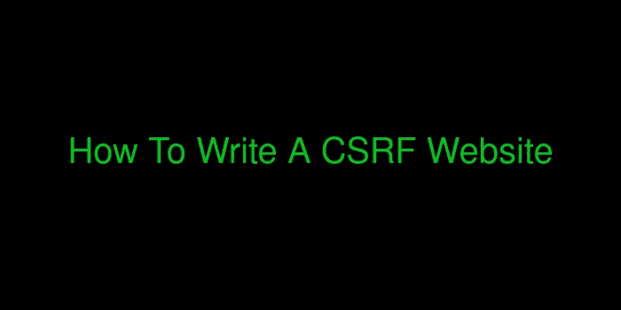
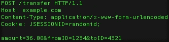

# 如何写一个 CSRF 网站

> 原文：<https://infosecwriteups.com/how-to-write-a-csrf-website-be09801315c3?source=collection_archive---------0----------------------->

上面写着什么。

你好。我叫玛奇纳，今天我们来深入探讨如何为 CSRF 的攻击写一个网站。但首先，让我们打好基础。

# ***CSRF 是什么？***

**CSRF** 代表*跨站请求伪造*。我不打算深入讨论它的要点，因为这篇文章关注的是它的实际方面，但本质上，在一个网站中任何可以发送请求的地方，你都可以编写自己的站点来发送请求，模拟你向其发送恶意链接的用户。这很容易成为恶意的，因为你可以删除帐户，张贴可疑的内容，通常会破坏你的受害者的一天。这是一个相当常见的错误，尽管很容易缓解。

# **现在去哪里？**

让我们假设您已经找到了一个潜在的 CSRF 端点。现在我面临的问题来了。我如何写一个 CSRF 网页？

嗯嗯嗯嗯

我发誓我觉得我是唯一一个真正有这个问题的人。因此，希望我不是一个人，其他人也有，这里是我如何为 CSRF 袭击写一个网站。

# 写网站！

让我们通过下面的例子来说明你需要做什么。这是一个简单的汇款请求，一个非常常见的 CSRF 例子。

请求的示例。

我们必须考虑三件事:

1.  **请求的类型。**通常是一个 ***POST*** 请求。
2.  **URL+协议。**这里是[【http://example.com/transfer】](http://example.com/transfer)
3.  ***正在发送的值。**在这种情况下 ***金额******from id***和 ***toID*** 。*

*我们想要做的是从任何用户那里发送我们想要的数量。这个请求将这三个参数和它们的值发送到它们的服务器。所以本质上，我们想做一个向服务器发送完全相同请求的网站。事情是这样的:*

*如果登录用户成为受害者并查看该页面，在试图加载表单时，将向服务器发送 POST 请求。但是，服务器会将其视为登录用户发出的合法请求，并且会通过。恭喜你，你赚了 36.00 美元！*

# *但是如果呢？*

*这很好，但是如果是一个 **GET** 请求而不是一个 **POST** 请求呢？考虑到我们前面的例子，这是链接:*

*[http://example.com/transfer?amount=36.00&from id = 1234&toID = 4321](http://example.com/transfer?amount=36.00&fromID=1234&toID=4321)*

*因此，我们只需将此 URL 发送到具有以下站点的服务器:*

*在尝试加载图像时(因为源应该是链接)，将发送 get 请求，如果用户登录，您将再次获得 36.00 美元！*

# *无耻的插头*

*本质上这就是如何写一个 CSRF 网站。您不需要在某个地方托管它，只需要在您的机器上进行 POC。你所需要做的就是根据特定的要求改变输入…但是这可能会很烦人。你不想让它自动化吗？只需运行一个程序，选择你想要发送的特定请求、值并自动生成页面？不要害怕，因为我在这里！*

**

*我在这里。*

*就在昨天，我写了[伪造者](https://github.com/Ckrielle/Forgerer)，一个自动创建 CSRF 页面的工具。如果你给它一个眼神，一颗星，当然还有一次尝试，我会非常感激。*

*仅此而已。如果你喜欢这篇文章，请鼓掌、分享并关注。如果你愿意，你可以在[推特](https://twitter.com/3xM4ch1n4)上找到我。*