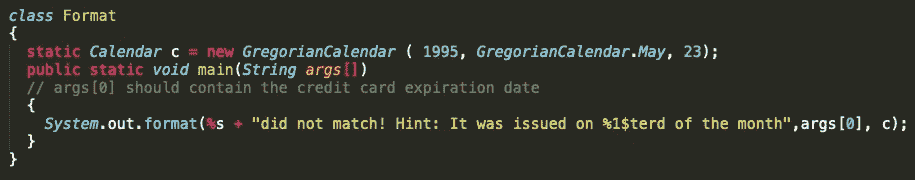
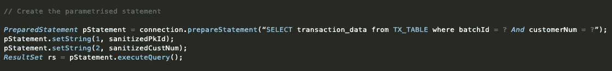
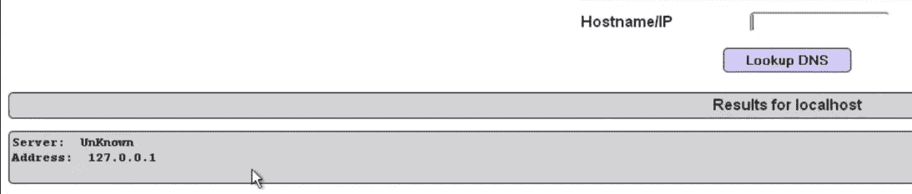
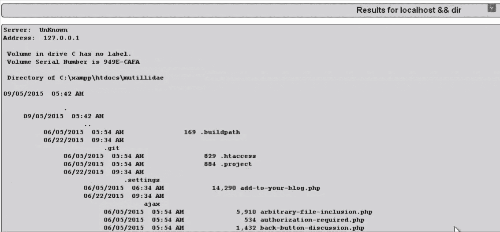
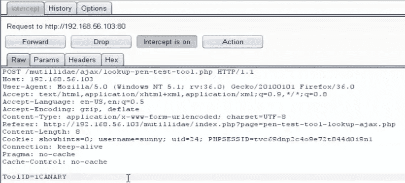
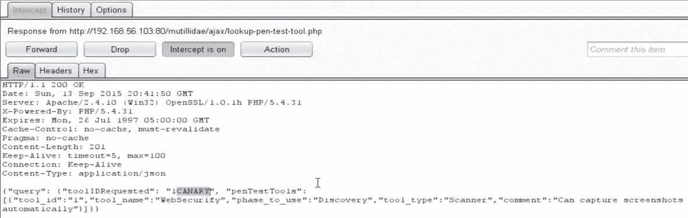
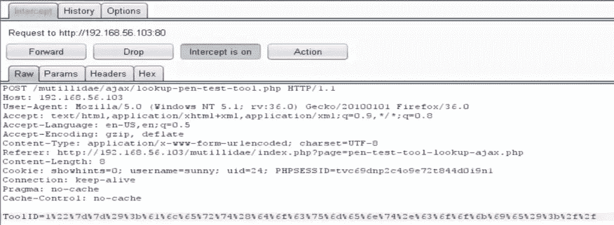
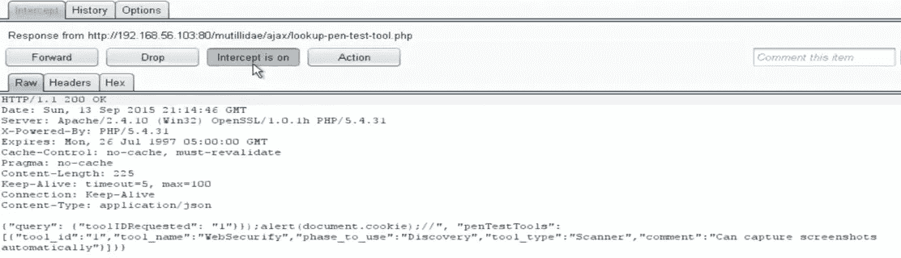
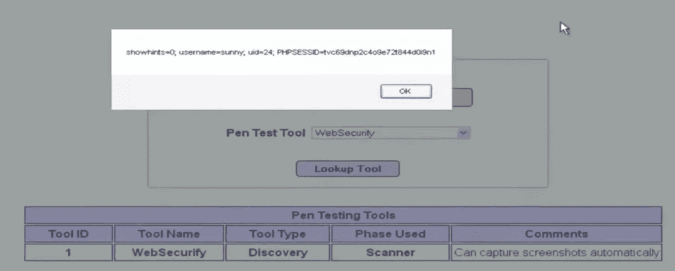

# 如何编写安全的代码？

> 原文：<https://infosecwriteups.com/how-to-write-secure-code-against-injection-attacks-aad4fff058da?source=collection_archive---------0----------------------->

## 保护自己免受注射攻击！

我已经为此工作了几个月，试图理解是什么让代码变得脆弱，我得到了这个简单的答案——糟糕的编程习惯。这看起来很明显，但是编程社区的大部分人仍然不知道这个事实。

# 理解问题！

我的意思是渗透测试和有专门的团队来保护你构建的应用程序的安全是令人惊奇的，也是值得称赞的，但这不是每个人都能负担得起的。大公司可以夸耀他们的安全实践，吹嘘他们的团队如何昼夜不停地保护客户数据的安全，但那些没有资源的人怎么办呢？

我们在银行、航空、网上购物等最重要的应用程序中存在这些易受攻击的代码的最大原因之一。是因为程序员。

最后一行肯定冒犯了很多人，让我说我并不想抨击某个社区。我不会这样做，因为这不是他们的错，在当前的编程时代，代码执行时间需要尽可能低，这是完全可以理解的，他们跳过这些部分，以提高他们的代码。

因此，我开始做笔记，帮助程序员编写安全的代码。我将尝试涵盖不同类型的攻击，以及程序员为保证代码安全而可能做出的小调整，这样他们的组织就不需要再花钱来保证应用程序的安全了。

我想我今天已经说得够多了，所以让我们开门见山吧。

# 让我们开始吧！

让我开始我的定义注射和它为什么发生。攻击者输入恶意有效载荷，可以欺骗解释器执行非预期的命令或访问未经授权的数据。出现注入缺陷的唯一原因是不可信数据作为命令或查询的一部分被直接发送到解释器，而没有检查或清理有效负载，从而导致所有问题。

在本文中，我将介绍三种不同类型的注入攻击，以及您可以用来防范它们的方法

## 1.SQL 注入

这种类型的攻击通常发生在攻击者在语句末尾插入一个勾号(')或在后面跟随一个真值总体的语句上。简单地说，SQL 负载看起来像这样

```
’ or 1 = 1 -- 
```

将上述语句添加到查询中，可以帮助攻击者获得完整数据库的访问权限。为了让您更好地理解，请看下面的查询，它将为攻击者提供整个数据库。

```
SELECT * FROM Users WHERE UserName = 'Aditya' OR 1=1--
```

看看下面的代码，试着判断它是否容易受到 SQL 注入的攻击。


如果你认为上面的代码是安全的，那么你一定要继续阅读这篇文章。

代码不安全的原因是攻击者输入的值直接作为参数传递。只要输入预期的值，一切都很好，但是用户的输入可能包含% 1＄TM、% 1＄te 和% 1＄tY 格式说明符。

如果攻击者为 args[0]传入值%1$tm，结果将如下。

```
05 did not match! Hint: It was issued on the 23rd of some month.
// 05 is the month that the user needs to know to verify himself.
```

你可以看到程序本身会显示出信用卡到期的月份。

为了避免这种攻击，类似下面这样的代码非常有用。



这两个代码之间的唯一区别是，在第一个代码中，攻击者输入的值被直接传递到程序中，而在第二个代码中，我们没有传递值，而是直接打印出来，使整个攻击变得无用。

防范 SQL 注入攻击应该包括输入验证。我们必须检查用户输入的值，我们必须始终假设这些值是不可信的，即它们会损害应用程序。

我们必须使用带有绑定变量的参数化查询，并对用户输入的值进行消毒。



参数化和消毒代码

在上图中，我们可以看到被传递的值在被代码使用之前是如何被净化的。

## 2.命令注入

这是最危险的注射攻击类型之一，在当今的场景中仍然普遍存在，但没有受到太多的关注。这种攻击利用了漏洞，攻击者可以输入并执行应用程序不期望的命令。

让我与您分享一个示例，展示命令注入攻击的基本实现。



在上图中，我们看到有一个文本框，我们需要在其中输入主机名/ IP，有关 IP 地址的详细信息将被提取出来，然后呈现给我们。

整个应用程序看起来非常简单，但是容易受到代码注入的影响。要理解这一点，我们首先需要弄清楚应用程序是如何工作的，然后我们可以尝试弄清楚，然后我们就可以理解代码注入是如何工作的。

当我们输入主机名/IP 时，应用程序实际上会调用终端，然后输出会显示给我们。使用过终端的人都知道，我们可以在终端中使用&&来同时传递两个不同的命令。



因此，上面的图像准确地显示了代码注入是如何工作的。为了避免这种攻击，应用程序需要执行路径验证(规范，然后进行绝对路径检查)，应用程序还需要执行输入验证，以及枚举它允许用户输入和执行的命令。

```
enum { dir, cd, cls }
```

## 3.JSON 注射液

这是一种重要的注入攻击，而且随着 API 在应用程序中的频繁使用，这种攻击正在增加。当我们在 JSON 查询中注入我们的有效负载时，JSON 注入就起作用了，这个 JSON 查询是在 API 进行请求和响应查询时传递的。


这个例子很容易理解，这个应用程序有一个下拉菜单，你需要从中选择一个选项，这是一个 PenTest 工具，应用程序将为你提供你选择的 PenTest 工具的详细信息。

因此，让我们试着理解这个应用程序是如何工作的。让我们打开 burp-suite 并拦截应用程序发出的请求。



因此，在上面的图像中，我们可以看到 ToolId 是在请求查询中发送的，我们将有效负载添加到 ToolId，只是为了检查它是否在响应查询中反映给我们。



我们确实收到了返回的有效载荷，即我们在请求查询中注入的有效载荷，因此我们可以确保我们的注入攻击能够通过。让我们执行攻击载荷，并确认攻击是否有效或可靠。

看到我们之前收到的响应，让我们传递这个值来获取 cookie 值。

```
“}});alert(document.cookie);//
```

在传入参数中的值之前，我们对其进行 url 编码，以避免任何可能的特殊字符限制。



我们可以清楚地看到，cookie 值已经在警报框中返回给我们，它确认攻击已经通过。



我们需要检查攻击在浏览器中的实际情况，以及 cookie 的详细信息是否按预期显示。



Cookie 值

防范 JSON 注入攻击的最有效方法是对 JavaScript 执行编码技术。OWASP 还提供了一个 JSON sanitiser，可用于字符串验证。

```
String someValidation = JsonSanitizer.sanitize(myJsonString);
```

# 道德的

为了防止注入攻击的发生，我们所能做的最重要的事情就是相信来自用户端的任何和所有输入都可能是攻击。程序员大多想当然地认为用户的输入不会对应用程序有害，这是导致应用程序中大多数漏洞的原因。来自使用方的每一个输入都必须经过消毒，并且输入在被应用程序使用之前必须经过验证。用户输入的值绝不能直接传递给程序。

如果程序员记住这几件事，他们肯定可以在注入攻击时抵御多数攻击。

## 阅读我的另一篇关于“安全编码实践”的文章

> ~中断认证和会话管理-[https://bit.ly/2uutoUO](https://medium.com/bugbountywriteup/how-to-write-secure-code-d4823bc2e86d)
> 
> ~跨站点脚本-【https://bit.ly/2TcpU2Y 

**如果你喜欢，请鼓掌&让我们合作。获取、设置、破解！**

网址:[aditya12anand.com](https://www.aditya12anand.com/)|捐赠:[paypal.me/aditya12anand](https://paypal.me/aditya12anand)

电报:【https://t.me/aditya12anand 

推特:[twitter.com/aditya12anand](https://twitter.com/aditya12anand?source=post_page---------------------------)

领英:[linkedin.com/in/aditya12anand/](https://www.linkedin.com/in/aditya12anand/?source=post_page---------------------------)

电子邮件:aditya12anand@protonmail.com

*关注* [*Infosec 报道*](https://medium.com/bugbountywriteup) *获取更多此类精彩报道。*

[](https://medium.com/bugbountywriteup) [## 信息安全报道

### 收集了世界上最好的黑客的文章，主题从 bug 奖金和 CTF 到 vulnhub…

medium.com](https://medium.com/bugbountywriteup)