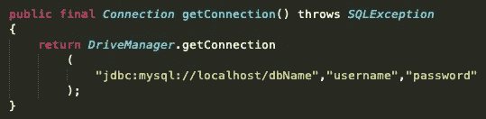
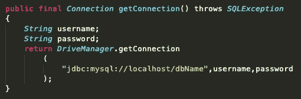
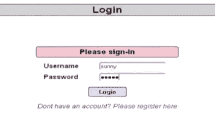
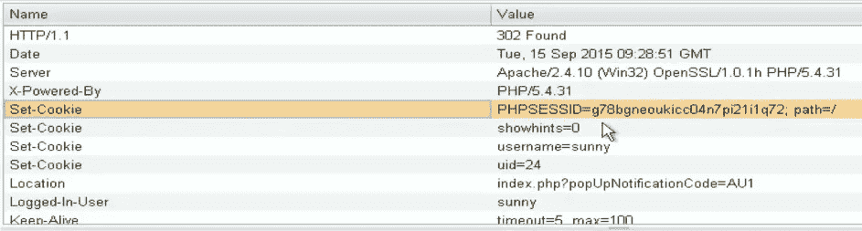
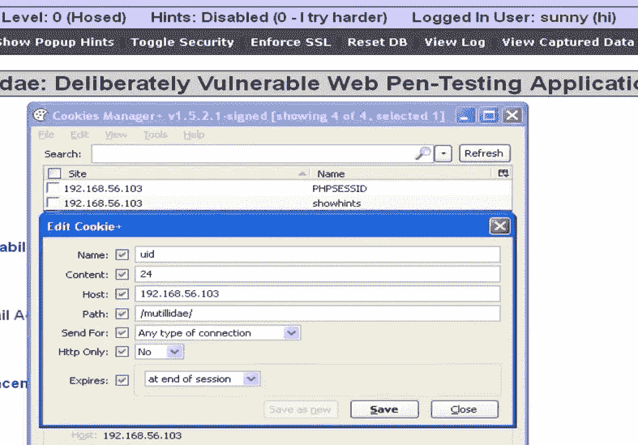
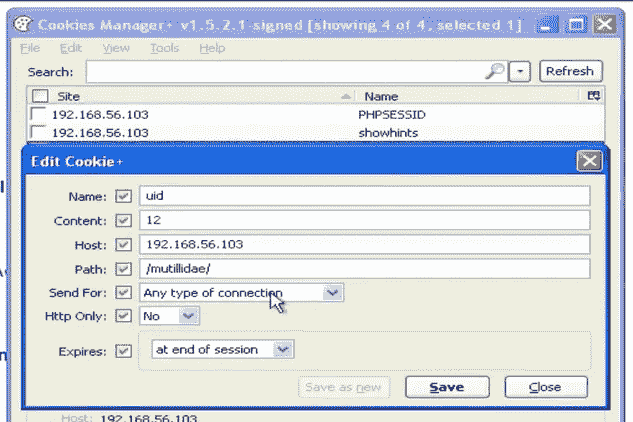
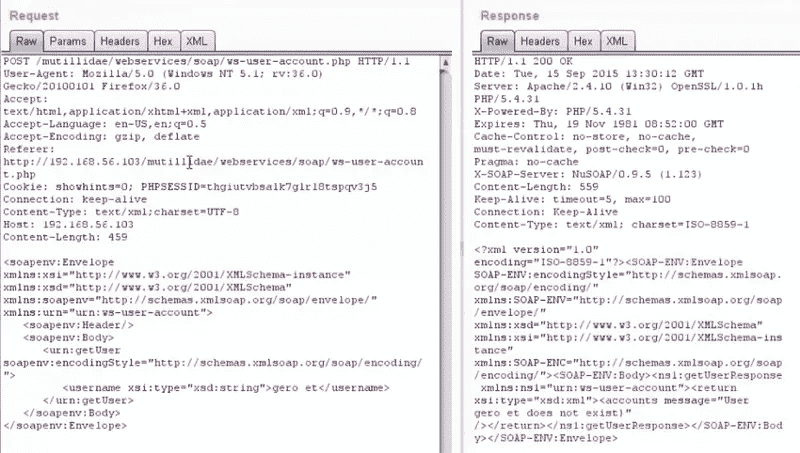
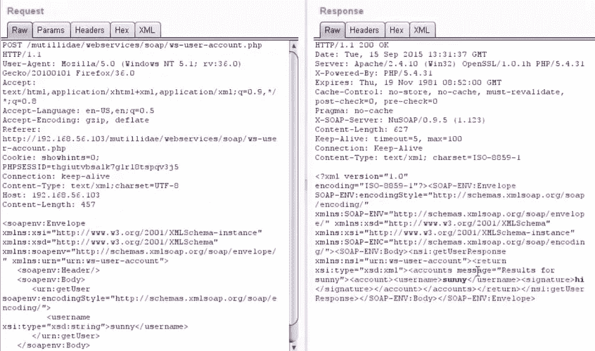
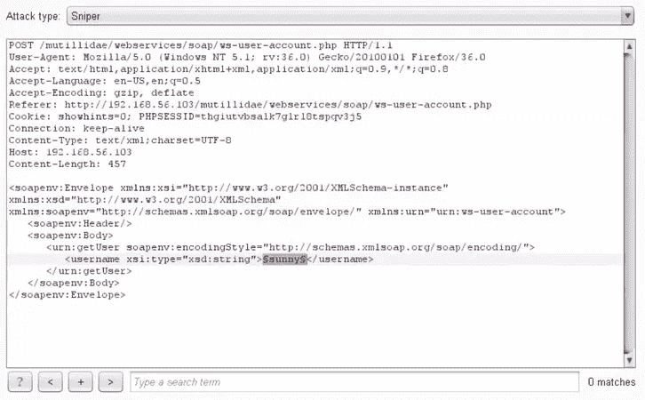
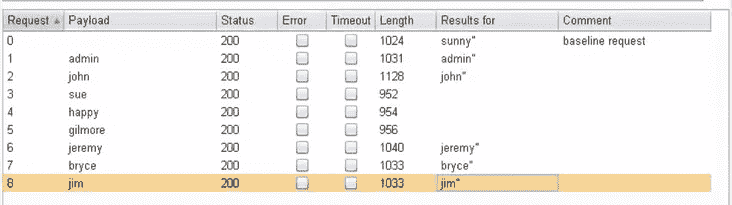

# 如何编写安全的代码？

> 原文：<https://infosecwriteups.com/how-to-write-secure-code-d4823bc2e86d?source=collection_archive---------0----------------------->

## 保护自己免受身份验证和会话管理的破坏！

# 需要安全代码？

我一直致力于安全编码实践，并试图学习尽可能多的要点。在过去几年的信息安全工作中，我意识到一个小小的漏洞会给普通人的生活带来多大的伤害。像 WannaCry 和 Petya 勒索软件这样的网络攻击对一些遭受过攻击的人来说记忆犹新。

尽管如此，每天研究人员都能在网络应用和其他领域发现一个又一个严重的漏洞。除非程序员能够意识到他们正在编写的代码，否则这种趋势不会持续下去。代码不仅应该能够执行预期的工作，还应该能够抵御任何恶意负载和攻击场景。做到这一点的最佳方式是能够在编码和安全社区之间形成一种协同作用，并互相帮助。

# 让我们开始吧！

所以，这篇特别的文章“如何编写安全的代码？”关注的是身份验证中断问题和会话管理问题。

与身份验证和会话管理相关的应用程序功能通常没有正确实现，这使得攻击者能够泄露密码、密钥、会话令牌，或者利用其他实现缺陷来冒充其他用户的身份。

在本文中，我将介绍几种不同类型的攻击，以及您可以用来防范这些攻击的方法

## 1.硬编码登录凭据

硬编码登录凭证是程序员可能犯的最低级的错误之一，因为这就像把凭证放在银盘子里送给黑客一样。敏感数据不应该被硬编码。



不安全的代码-硬编码的凭证

边上的代码是其中一个例子，其中登录凭证被硬编码在程序员编写的代码中。

而下面给出的代码是一个例子，其中凭证没有被硬编码在程序中，这使得它比那些凭证被硬编码的程序更加安全。



安全代码证书不是硬编码的

这种微小的差异会对应用程序的安全性产生巨大的影响。

## 2.Cookie 操作

随着越来越多的身份验证过程通过检查用户提供的 Cookie 详细信息来进行，cookie 操作正在成为当今最危险的攻击之一。

攻击者正在寻找方法破解并弄清楚 web 应用程序如何分配 cookies，这样他们就可以操纵它们，并伪装成其他用户来接管帐户。



让我演示一下攻击者如何利用分配给用户的弱 cookie，或者 cookie 是否保持不变。

旁边的这张图片是一个登录门户，我们将在这里进行攻击&显示弱 cookie 实现的问题。

一旦我们登录到应用程序中，我们就拦截 Burp-Suite 中的流量，以查看它和被传递来验证我们是用户的 cookies。



Cookie 详细信息

上图显示了我们尝试登录时分配的四个“Set-Cookie”参数。这四个不同的 cookies 登录，PHPSESSID，显示提示，用户名和 uid。我们怀疑 uid 对于每个用户都是唯一的。因此，我们继续篡改 uid，检查我们是否可以访问其他人的帐户。



修改 cookie

为了获取 cookie 的值，我们使用浏览器中的 Cookie 管理器扩展，然后传递请求。我们将“uid”从 24 改为 12，如下所示。



修改的 cookie

一旦我们修改了 cookie 值，我们就可以看到我们进行了一次帐户接管攻击，因为我们获得了对其他用户帐户的访问权。

这种攻击发生的原因是 PHPSESSID 在用户登录之前和之后根本没有被修改，使得“uid”成为识别哪个用户刚刚登录到他们的帐户的唯一决定因素。正如我们在上面看到的，这很容易被操纵，允许帐户接管。

为了避免这样的事情发生，我们需要在登录尝试后重新分配 cookie，并且我们需要记住 cookie 也必须是唯一的。这里有一个想法，你可以做以下事情。

```
// Issue is same session object is being used so get current session
HttpSession before_login = request.getSession();//Invalidate that session
before_login.invalidate();//Generate a new session, new JSESSIONID
HttpSession after_login = request .getSession(true);
```

以上代码用于在登录前后更改 SESSIONID cookie。

## 3.通过 Web 服务的用户枚举

枚举的问题是相当严重的，因为它让攻击者计算出应用程序中存在的用户的用户名/电子邮件 id，并且随后可以使用以下细节进行暴力攻击。

我们使用 Widsler 扩展并利用它的“getuser”功能对 Burp-Suite 进行攻击。因此，当我们输入有效的用户名时，我们尝试从系统收集响应，然后我们输入一个不是用户名的随机字符串，然后检查响应。我们可以在下面的图片中看到各自的反应。



用户不存在

上图是当具有特定用户名的用户不存在时，我们收到的请求和响应。我们在中继器中发送请求查询来检查响应。



用户确实存在

上图是我们收到的针对用户存在的条件的请求和响应。我们在中继器中发送请求查询来检查响应，这次得到了不同的响应。这给了我们一个想法，那就是我们可以根据我们收到的回复来列举用户。



因此，我们在“入侵者”选项卡中传递请求，然后执行强力检查，查找使用该应用程序的各种用户。



枚举用户名

这里的主要问题是开发人员实际上在响应查询中放入了太多的细节。在这次攻击中，我们可以清楚地看到，由于响应中的信息太多，我们可以判断出哪些用户有相应的用户名，哪些没有。我们需要制作一些标准化的消息，这样攻击者就不能使用一些简单的枚举技术来计算。

## 4.暴力攻击

这是下一阶段的攻击，一旦攻击者通过前面的方法枚举了用户及其用户名，就会执行该攻击。


旁边的图像显示了登录页面，我们已经列举了用户，需要执行暴力攻击来了解这些用户的登录凭证。

因此，当我们尝试登录时，我们会拦截 Burp-Suite 中的流量，捕获请求数据包并将其发送给入侵者。


请求查询

现在，我们有了已经列举的用户名，我们进行点击尝试，暴力攻击。我们从互联网上获取一组常用密码，并运行我们的攻击来找出相应的密码。


通过打嗝套件进行暴力攻击

暴力攻击在任何情况下都是不允许的。帐户锁定功能应该始终存在，因为它可以防止应用程序受到暴力攻击和泄露用户凭证。也可以通过允许用户不使用字典中的单词，使用特定长度的密码或者更好地要求他们使用密码短语来对抗暴力。用户的密码应该在存储之前进行哈希处理，salt 和哈希的使用也非常重要。

# 道德的

我们可以采取以下预防措施，并在试图解决身份验证和会话管理问题时记住这些内容。

## 身份验证被破坏

*   不显示错误/成功消息
*   从不硬编码凭据
*   密码策略实施(老化、强度、含盐散列)

## 会话管理

*   令牌的不可预测性(即安全随机性)
*   过期策略、登录/注销重置
*   使用强加密
*   复杂 Cookie 安全性

## 阅读我的另一篇关于“安全编码实践”的文章

> ~注射攻击—[https://bit.ly/2OqkRv5](https://medium.com/bugbountywriteup/how-to-write-secure-code-against-injection-attacks-aad4fff058da)
> 
> ~跨站点脚本—【https://bit.ly/2TcpU2Y 

**如果你喜欢，请鼓掌&让我们合作吧。获取、设置、破解！**

网址:[aditya12anand.com](https://www.aditya12anand.com/)|捐赠:[paypal.me/aditya12anand](https://paypal.me/aditya12anand)

电报:[https://t.me/aditya12anand](https://t.me/aditya12anand)

推特:【twitter.com/aditya12anand 

领英:【linkedin.com/in/aditya12anand/ 

电子邮件:aditya12anand@protonmail.com

*关注* [*Infosec 报道*](https://medium.com/bugbountywriteup) *获取更多此类精彩报道。*

[](https://medium.com/bugbountywriteup) [## 信息安全报道

### 收集了世界上最好的黑客的文章，主题从 bug 奖金和 CTF 到 vulnhub…

medium.com](https://medium.com/bugbountywriteup)