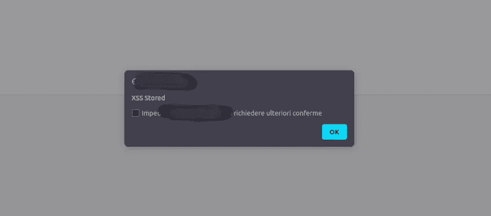
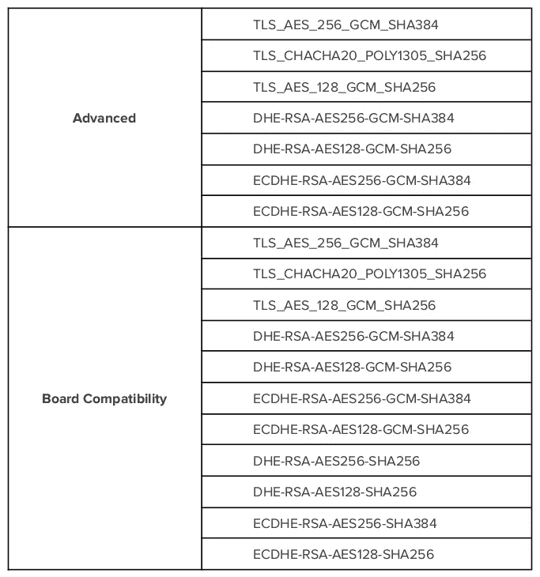

# 我的第一次网络应用渗透测试怎么样

> 原文：<https://infosecwriteups.com/how-was-my-first-web-application-penetration-test-d18fdd78d2d5?source=collection_archive---------3----------------------->

前一阵子我的一个客户要求为他的公司做一个 **WAPT** ( *Web 应用渗透测试*)；这个网络应用程序是在微软的环境下构建的，所以有了 ASP.NET 的*和*。Linux 男孩总是通过的东西:这是我做的第一个真正的 WAPT。**

*为什么我说这是我生命中第一个真正的 WAPT？嗯，我没有关于网络应用程序或背后系统的信息。这使得它比以往任何时候都更具挑战性和更令人兴奋。我仅有的信息是 web 服务器的版本、源代码的语言和一个测试 web 应用程序内部的管理员帐户。
我不得不中断的 web 应用程序位于预生产环境中，但我注意到生产环境也位于相同的 IP 地址上，这使我不再进行 DoS 网络攻击，因为这可能会影响生产(真遗憾！).*

# *第一步:侦察*

*因为我不知道我正在分析哪种应用程序，所以我不得不从基础开始:**侦察**和**信息收集**。*

## *DNS 查找*

*当我有一个 web 应用程序要分析时，这通常是我的第一步。DNS 查找可以提供很多关于目标基础设施的信息，但是这次我没有这么幸运:名称服务器是由 GoDaddy 管理的(这肯定超出了范围)，我无法检索任何其他信息。*

## *NMAP 扫描*

*执行 NMAP 扫描始终是一个很好的起点，即使它是一个 Web 应用程序渗透测试，它可以为您提供有关目标上运行的服务、端口打开(或不打开)以及服务器前面的防火墙/ids 的信息。*

```
*# Nmap 7.80 scan initiated Tue Aug  3 15:11:12 2021 as: nmap -sC -sV -p- -v -oN nmap-1-65535-sV-sC.txt ---OMISSIS---.com
Nmap scan report for ---OMISSIS---.com (xxx.xxx.xxx.xxx)
Host is up (0.042s latency).
Not shown: 65533 filtered ports
PORT    STATE SERVICE  VERSION
80/tcp  open  http     Microsoft IIS httpd 10.0
|_http-favicon: Unknown favicon MD5: 0F7EXXXXXXXXXXXXXXXXXXXXXXXX2C16
| http-methods: 
|_  Supported Methods: GET HEAD POST OPTIONS
|_http-server-header: Microsoft-IIS/10.0
| http-title:         ---OMISSIS---
|_Requested resource was http://---OMISSIS---.com/
443/tcp open  ssl/http Microsoft IIS httpd 10.0
| http-methods: 
|_  Supported Methods: GET HEAD POST OPTIONS
|_http-server-header: Microsoft-IIS/10.0
|_http-title: Did not follow redirect to http://---OMISSIS---.com/
| ssl-cert: Subject: commonName=---OMISSIS---.com/organizationName=---OMISSIS---./countryName=IE
| Subject Alternative Name: DNS:---OMISSIS---.com
| Issuer: commonName=GeoTrust EV RSA CA 2018/organizationName=DigiCert Inc/countryName=US
| Public Key type: rsa
| Public Key bits: 4096
| Signature Algorithm: sha256WithRSAEncryption
| Not valid before: 2021-05-26T00:00:00
| Not valid after:  2022-06-14T23:59:59
| MD5:   7bf5 XXXX XXXX XXXX XXXX XXXX XXXX 1149
|_SHA-1: bb2c XXXX XXXX XXXX XXXX XXXX XXXX XXXX XXXX ce6c
|_ssl-date: 2021-08-03T13:13:37+00:00; 0s from scanner time.
| tls-alpn: 
|   h2
|_  http/1.1
Service Info: OS: Windows; CPE: cpe:/o:microsoft:windowsRead data files from: /usr/bin/../share/nmap
Service detection performed. Please report any incorrect results at https://nmap.org/submit/ .
# Nmap done at Tue Aug  3 15:13:38 2021 -- 1 IP address (1 host up) scanned in 145.48 seconds*
```

*正如你在上面的代码中看到的，我们又一次没有得到任何相关信息，所以继续侦察吧！*

## *SSL 扫描*

*NMAP 扫描之后，我用 sslscan 进行了一次扫描，以查看哪些密码套件正在使用:*

```
*sslscan ---OMISSIS---.com                                                                                                                                    1 ⨯
Version: 2.0.7-static
OpenSSL 1.1.1j-dev  xx XXX xxxxConnected to xxx.xxx.xxx.xxxTesting SSL server ---OMISSIS---.com on port 443 using SNI name ---OMISSIS---.comSSL/TLS Protocols:
SSLv2     disabled
SSLv3     enabled
TLSv1.0   enabled
TLSv1.1   enabled
TLSv1.2   enabled
TLSv1.3   disabledTLS Fallback SCSV:
Server does not support TLS Fallback SCSVTLS renegotiation:
Secure session renegotiation supportedTLS Compression:
Compression disabledHeartbleed:
TLSv1.2 not vulnerable to heartbleed
TLSv1.1 not vulnerable to heartbleed
TLSv1.0 not vulnerable to heartbleedSupported Server Cipher(s):
Preferred TLSv1.2  256 bits  ECDHE-RSA-AES256-GCM-SHA384   Curve 25519 DHE 253
Accepted  TLSv1.2  128 bits  ECDHE-RSA-AES128-GCM-SHA256   Curve 25519 DHE 253
Accepted  TLSv1.2  256 bits  DHE-RSA-AES256-GCM-SHA384     DHE 2048 bits
Accepted  TLSv1.2  128 bits  DHE-RSA-AES128-GCM-SHA256     DHE 2048 bits
Accepted  TLSv1.2  128 bits  RC4-SHA                      
Accepted  TLSv1.2  128 bits  RC4-MD5                      
Preferred TLSv1.1  128 bits  RC4-SHA                      
Accepted  TLSv1.1  128 bits  RC4-MD5                      
Preferred TLSv1.0  128 bits  RC4-SHA                      
Accepted  TLSv1.0  128 bits  RC4-MD5SSL Certificate:
Signature Algorithm: sha256WithRSAEncryption
RSA Key Strength:    4096Subject:  ---OMISSIS---.com
Altnames: DNS:---OMISSIS---.com
Issuer:   GeoTrust EV RSA CA 2018Not valid before: May 26 00:00:00 2021 GMT
Not valid after:  Jun 14 23:59:59 2022 GMT*
```

*这是我得到的第一个相关结果:启用了 SSLv3 和 TLSv1.0(它们不再安全了！).此外，TLSv1.2 的密码套件使用 RC4 和 MD5，不推荐使用，因为它们被认为是脆弱的。*

# *攻击阶段*

*侦察结束后，我开始在那个 web 应用程序上施展一些魔法！*

## *静态代码分析*

*显然，我没有应用程序的源代码，但是我生成了 HTML:这意味着大量的 Javascript 脚本、库、外部资源和(如果你幸运的话)代码中一些有用的注释。*

*我开始查看 HTML，注意到使用了很多库，其中一些很脆弱或者不再维护。
这个分析对我接下来的步骤有所帮助。*

## *登录表单和会话管理*

*登录页面上的第一个分析是在 cookies 上。我测试的 web 应用程序在登录后不刷新会话 ID，如果页面被刷新(当用户没有被认证时)也不刷新，而且有一些 cookies 在注销后仍然有效。*

*其次，密码输入管理不正确，此输入的类型是“*文本*而不是“*密码*”:混淆是由应用于此输入的特殊字体造成的。
此外，该输入不能正确处理单引号( ' )字符，事实上，如果插入该字符，将导致处于等待状态的登录系统崩溃，进而导致消失字段的混乱。原因是密码被发送回客户机(从服务器)到一个使用单引号传递参数(密码)的 Javascript 函数中。*

## *XSS*

*经过一点工作后，我发现了一些可以用自由文本填充的字段。我试着用一个简单的 XSS:*

```
*<script>alert(1)</script>*
```

*没想到，应用程序崩溃了。即使框架意识到了潜在的攻击，我们的 XSS 也会生成一个未处理的异常，显示框架版本和堆栈跟踪。一旦我得到了用于构建 web 应用程序的版本，我就稍微搜索了一下，找到了一种绕过这个崩溃的方法:使用 Unicode 编码。*

*我用 Unicode 尖括号构建了新的 XSS，最后我得到了一个**存储的 XSS** ！*

**

# *报告阶段*

*这个阶段是最重要的，你应该在开始渗透测试的时候就开始。在 Kali 中，您可以找到一些用于 pt 报告的特定工具，但是如果您愿意，甚至可以使用 VI。*

*我写的报告分为 5 个部分和 2 个附录:*

1.  **活动概述* —这一段描述了活动、接洽规则、方法、团队和使用的工具。*
2.  **发现结果*—通常只包含扫描程序或易受攻击软件发现的漏洞的证据。*
3.  **攻击叙述* —本节描述攻击阶段:攻击是如何进行的，特定漏洞是如何被利用的，以及如何补救。*
4.  **补救计划* —补救部分包含所有建议的补救(漏洞和 PT 补救)。*
5.  **结论* —这是包含报告总结的最后部分。*

*记住向你的客户非常清楚地描述所有的步骤，如果他们有任何疑问，写下你的联系人。*

# *有用的资源*

## *国际安全准则*

*   ***NIST 800–100**《信息安全手册》——
    [https://nvl pubs . NIST . gov/NIST pubs/Legacy/SP/nistspecialpublication 800-100 . pdf](https://nvlpubs.nist.gov/nistpubs/Legacy/SP/nistspecialpublication800-100.pdf)*
*   ***NIST 800–95**《安全网络服务指南》——
    https://nvl pubs . NIST . gov/NIST pubs/Legacy/SP/nistspecialpublication 800-95 . pdf*
*   ***https://nvlpubs.nist.gov/nistpubs/SpecialPublications/NIST. NIST 800–53**“信息系统和组织的安全和隐私控制”——
    [SP.800-53r5.pdf](https://nvlpubs.nist.gov/nistpubs/SpecialPublications/NIST.SP.800-53r5.pdf)*
*   ***OWASP Web 安全测试指南**-
    [https://OWASP . org/www-project-we B- Security-Testing-Guide/stable/](https://owasp.org/www-project-web-security-testing-guide/stable/)*
*   ***OSS TMM**——[https://www.isecom.org/OSSTMM.3.pdf](https://www.isecom.org/OSSTMM.3.pdf)*

## *安全密码套件*

**

*OpenSSL 密码套件语法*

***补充链接:***

*   *[https://owasp . deteact . com/Cheat/Cheat sheets/TLS _ Cipher _ String _ Cheat _ sheet . html](https://owasp.deteact.com/cheat/cheatsheets/TLS_Cipher_String_Cheat_Sheet.html)*
*   *[https://cheatsheetseries . owasp . org/Cheat sheets/TLS _ Cipher _ String _ Cheat _ sheet . html](https://cheatsheetseries.owasp.org/cheatsheets/TLS_Cipher_String_Cheat_Sheet.html)*

# *结论*

*我分析的 web 应用程序相当安全，但是仍然需要实现一些技术措施来提高整体安全性。禁用 SSL v3 和 TLS 1.0/1.1 并使用**安全密码套件**通过防止某些类型的**中间人**攻击来提高 HTTPS 连接的安全性。分离开发和生产环境(并使用不同的 IP 地址)对于避免 DoS 网络攻击是必要的。
适当的会话管理大大降低了**会话劫持**攻击和 **CSRF** (跨站点请求伪造)攻击的风险。必须正确管理登录表单中的密码输入，并且需要一些额外的服务器端检查。通过正确使用开发框架、实现适当的编码和异常处理进行更深入的检查，可以避免 XSS。
限制公开的信息(web 服务器版本、框架版本和堆栈跟踪)会给攻击者带来困难。确保正确处理所有可能抛出的异常，以避免不可预见的情况。*

*始终遵循最佳实践:NIST、OWASP、ISECOM 和整个安全社区将是您最好的朋友。*

*我能给你的唯一建议是尝试，尝试，再尝试，因为每个应用或系统都是不同的:没有一个应用是 100%安全的，即使你是 n00b。*