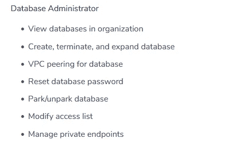
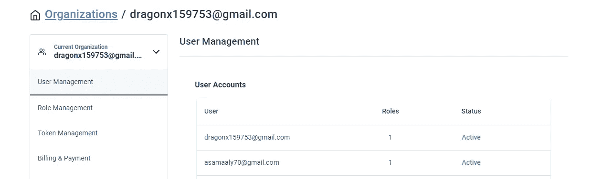
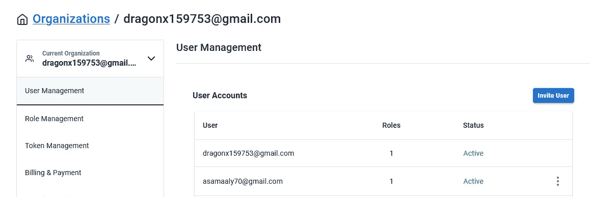
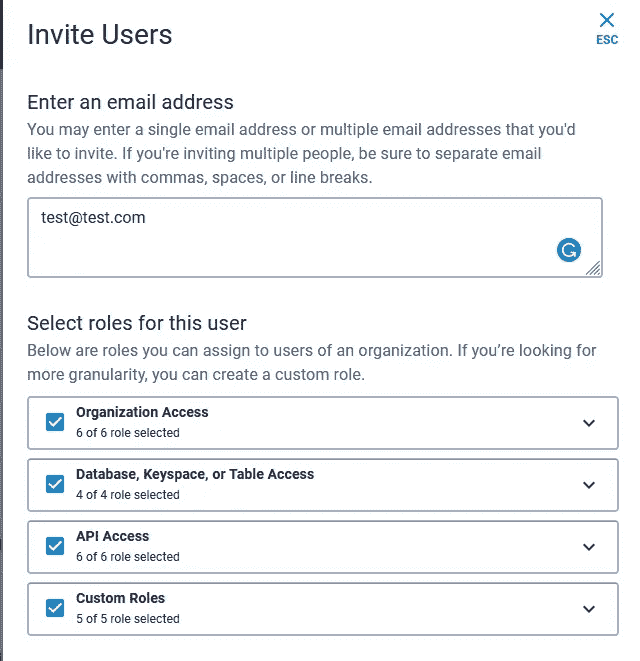
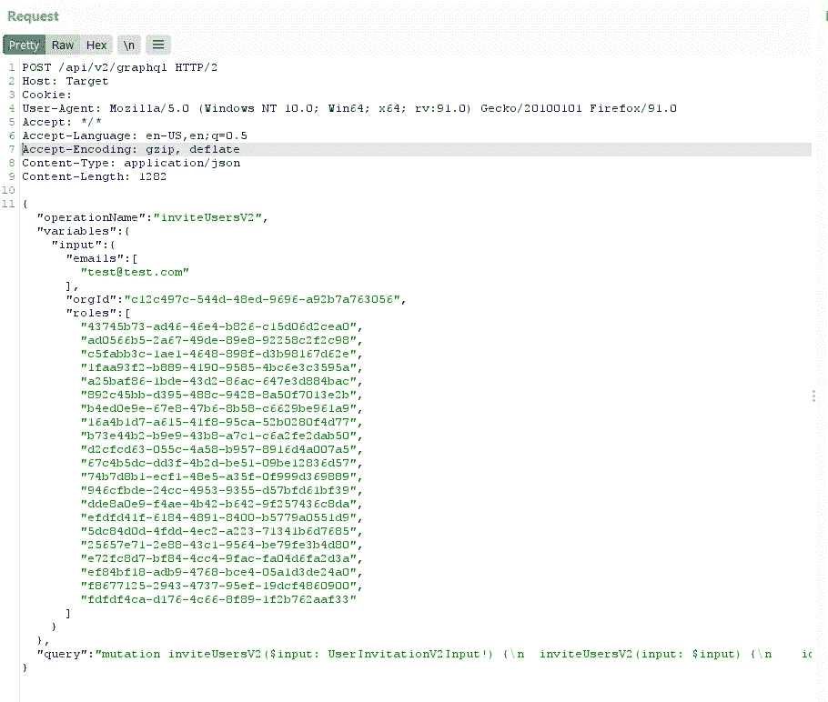

# 我们如何通过权限提升接管整个组织

> 原文：<https://infosecwriteups.com/how-we-was-able-to-takeover-whole-organization-via-privilege-escalation-4f74b31a84a6?source=collection_archive---------0----------------------->

我和我哥哥用 HTML 入侵世界

大家好，我又是亚瑟(又名内罗利)

我的兄弟正在学习编程，我正在教他一些东西，他想开始学习 bug-bounty，所以我指导了他(我将分享我告诉他开始做的简单技巧)，我们走吧

# 选择目标

我们选择了一个有许多角色的目标，这样我们就可以处理访问控制错误配置，我们这样做的目的是允许我们创建一个组织，并为每个用户授予权限，

我哥哥开始扮演角色，盲目地测试每个权限(这不是最佳实践，但对于新来的人来说，他试图发现问题)。

# 找到奇怪的许可

我哥找了个角色叫`Database Administrator`

因此，打开文档来理解这个权限允许我们做什么显示了以下内容

数据库管理员权限

hmmm 有趣，因为用户可以访问数据库并编辑它，但同时我们不能控制任何用户权限或改变它

asamaaly70@gmail.com 是数据库管理员
dragonx159753@gmail.com 是完全管理员

数据库管理员不能更改用户权限或邀请用户

数据库管理员

但是管理员可以

完全管理

# 思维违背逻辑

现在我们知道`Database Administrator`可以访问数据库，并且查看发送的请求，我们发现它包含一个`Graphql`查询，那么为什么数据库管理员不能执行这些查询呢？所以当我告诉我的小弟弟他就像

# 发现问题

拦截负责邀请用户的请求后

邀请具有完全权限的用户

我们注意到了 graphql 查询

邀请用户请求

我们对`Database Administrator` 用户 cookie 使用了相同的请求，我们注意到请求发送成功！

我哥哥非常高兴，他在一个许多用户使用的产品上发现了他的第一个 bug，我们意见不一致，他非常大声 XD。

# 复制的步骤

1.  登录为`Database Administrator`
2.  创建临时帐户
3.  复制上述请求并向创建的帐户发送邀请
4.  接受新帐户的邀请，你将成为完全管理员

注意，请求中的`roles` 是静态 id，因此我们可以通过创建一个临时组织来获取它们，并拦截请求。

之后，我们发现这个问题也适用于编辑用户权限请求，所以我们有两种方法来做

但是 h1 说这是重复的，是同一个问题(请不要对此发表评论！反正我们还在争论这一点，祝我们好运吧:)。

# 分流小组的有趣故事

该报告最初以不适用结束，因为 triager 没有遵循步骤并选择了错误的角色，所以他得到了禁止响应，

我们重新提交了它，也获得了 N\A bcs。另一个 triager 认为角色 id 是动态的，会从一个组织更改到另一个组织，因此我们无法获得值，除非我们获得完整的管理员帐户。

我哥哥真的很失望，我花了一周时间向三人组证明这个问题是正确的，

最后，我们被判了中等严重程度，并获得了 500 美元的奖金。

我希望分流过程会更顺利，如果我没有争辩的话..这个问题只是不适用。

# 经验教训

*   当你测试访问控制问题时，总是试图理解每一个角色，而不仅仅是随机测试。
*   当你相信这个问题的时候，试着让报告尽可能的清晰，triagers 每天面对大量的报告，他们不明白每个应用程序是如何工作的。
*   你想赚钱…不要对 triagers 不礼貌，我总是去 h1 支持，他们总是帮助。

等待我们的报告，我们从路径遍历中得到一个 Xss，再见。