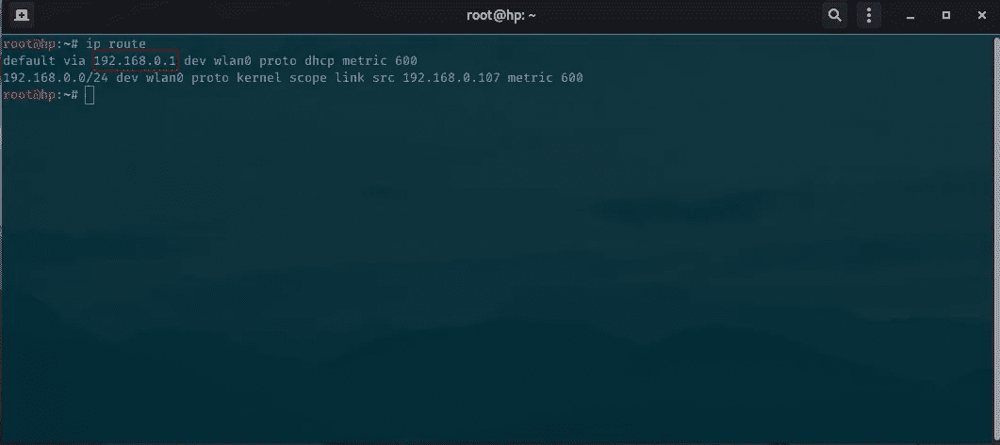
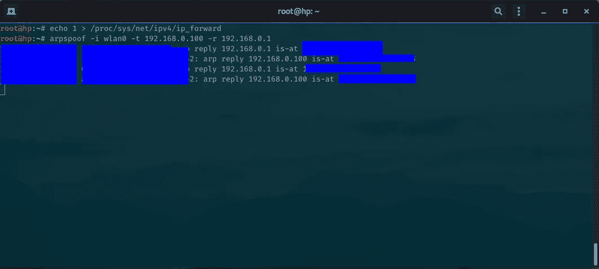
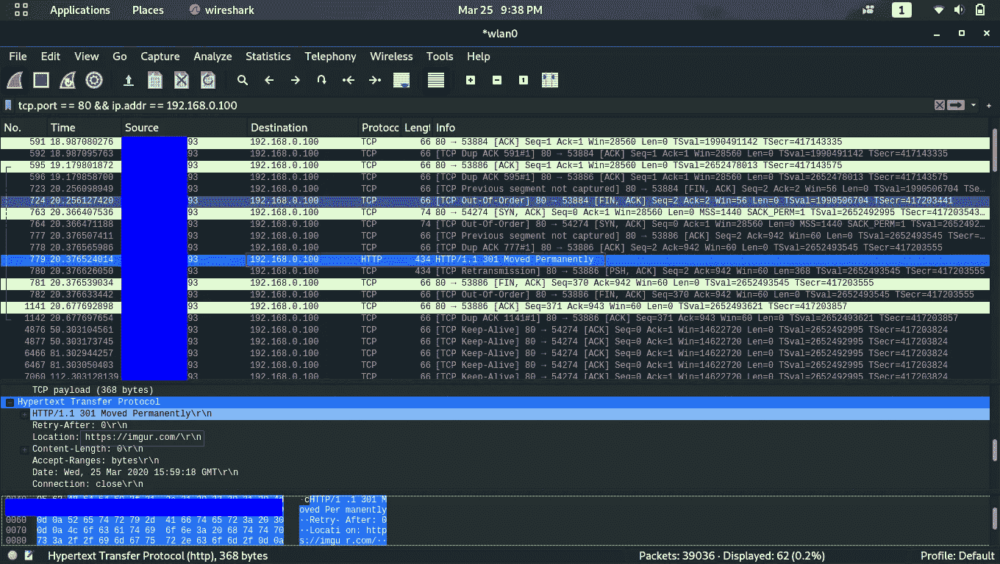
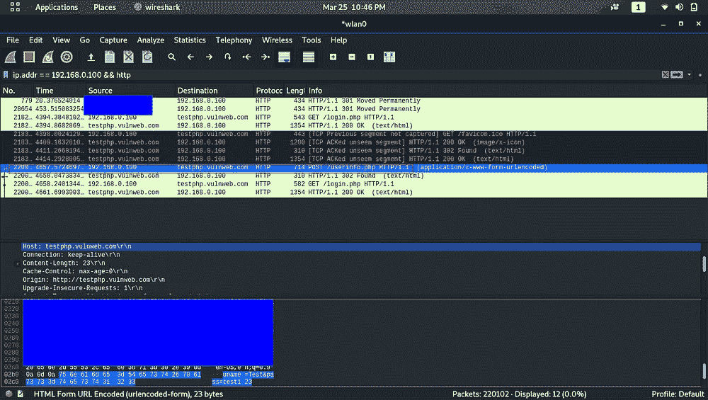
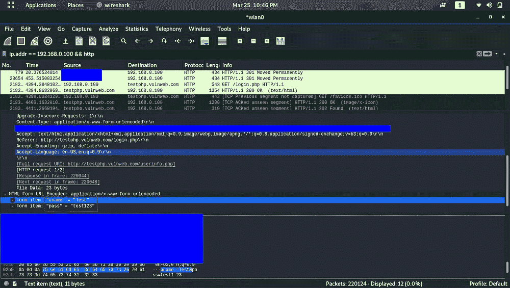

# 你怎么会在咖啡店被黑

> 原文：<https://infosecwriteups.com/how-you-could-get-hacked-at-a-coffee-shop-3a81a53c0b4f?source=collection_archive---------0----------------------->

***注*** *:此条与上一条有联系。所以，如果你还没有读过，现在就去读吧—[*[*https://blog . use journal . com/how-hackers-love-your-http-data-157 e 76 F2 c 66 a*](https://blog.usejournal.com/how-hackers-love-your-http-data-157e76f2c66a)*】*

***注 2*** *:本文仅供教育学习之用。它给你一个想法，为什么你应该尽可能避免使用公共网络。*

你带着笔记本电脑来到了你最喜欢的咖啡店。你拿起一杯拿铁，打开你的笔记本电脑。你看到那个免费的无线网络，立刻连接到它，进行你的常规浏览——登录网站或进行你的银行交易。

这听起来像是你已经做过或可能会做的事情吗？

如果我告诉你，有一个狡猾的黑客藏在同一个网络上——监视你的所有活动。

卑鄙的黑客

在上一篇文章中，我们看到了黑客如何嗅探同一网络中每个用户的敏感数据。在这篇文章中，我们将看到黑客如何瞄准网络上的特定用户，并嗅探他/她的活动。

现在让我们在这里交换角色，开始思考黑客可能是如何思考的。让我们来分析一下黑客是如何实施这种有针对性的攻击的。

# 免费开放 WiFi？黑客的天堂！！

黑客会做的第一件事是找到一个公共 WiFi，那里已经有很多人连接到那个网络。你会发现这样的“开放 WiFi”在咖啡店或酒店大堂等地方提供服务。

> 黑客们渴望公共/开放的 WiFi 网络，在那里他们可以从一大堆目标中挑选任何目标。

黑客找到并连接到这样的网络。现在，对于接下来的步骤，您需要:

*   Kali Linux OS(只要您手动安装所需的工具，任何 Linux 机器都可以工作)
*   Nmap
*   ARP 欺骗
*   Wireshark

# 枚举网络

这是第一步，也是非常重要的一步。枚举只不过是一个过程，通过这个过程，我们将尝试与我们的目标网络建立连接，并尝试找出连接到它的不同主机/用户。

> 简而言之，我们将尝试扫描网络，找出**每台连接到网络(公共 WiFi)的设备**

为此，我们将简单地使用一个非常方便的工具— **nmap** 。

nmap 是一个非常著名的网络扫描工具，被网络管理员、黑客、系统管理员等广泛使用。你可以在这里 阅读更多关于 nmap [**。**](https://nmap.org/docs.html)

在我们运行 nmap 命令之前，我们将找到我们的**网关地址**，我们的流量从这里流出。这个网关通常是我们的路由器或其他设备。要做到这一点，我们只需输入，

> ip 路由

我们发现我们的网关地址，如上面的截图所示，以红色矩形为边界。在接下来的步骤中，我们需要我们的网关地址。

现在，我们运行以下 nmap 命令来快速扫描整个网络，并给出连接到该网络的所有设备的列表。

> nmap -sP -n 192.168.0.1/24

上面的命令通过 ping 所有设备来检查它们是否活动，从而扫描我们的 IP 地址范围。

您将获得以下输出:

nmap 扫描

您将看到主动连接到公共网络的主机/设备的 IP 地址，以及它们的设备/硬件名称和 MAC 地址。IP 地址(红色矩形)是网络上的不同用户。我已经在我的无线网络上找到了一些。你身上可能有多或少的。

我们来选一个受害者。我将选择“ **192.168.0.100** ，这是我的另一台笔记本电脑，用于演示目的。

如果您读过上一篇文章，您就会知道我们使用了“tcpdump”工具来执行中间人攻击。我们在本地机器上执行了攻击。因此，为了对我们网络上的某个用户进行攻击，我们将使用“**ARP 欺骗**工具。

# 但是坚持住..什么是 ARP？

ARP 代表“地址解析协议”，它的工作只是帮助我们的网络(路由器)映射或关联每个设备的 IP 地址与它们的 MAC 地址，并存储它。

因此，每当你将手机连接到一个新的 WiFi 网络时， **ARP** 的职责就是为你分配一个唯一的 IP 地址，并存储你手机的 MAC 地址。

# 但是你会问，它将在哪里存储这些 IP 地址和 MAC 地址呢？

它在一个名为 **ARP 表**的表中维护这些记录。该表记录了连接到网络的每台设备。

简单地说，我们的计算机有一个 ARP 表，表中有一个 IP 地址和 MAC 地址的列表。因此，当一个独特的设备连接到我们的网络时，我们的计算机将简单地发送一个 **ARP 请求**，询问网络中是否有人拥有特定的 IP 地址，如果有人拥有该 IP 地址，我们的计算机将得到响应。

ARP 请求的结构是:

> 谁有**设备-1** 告诉**我(电脑)**

作为响应，如果设备 1 存在，我们将得到以下答案:

> **设备-1** 位于 **MAC-ADDRESS-1**

因此，在我们的例子中，我们的计算机将发送以下 ARP 请求:

> 谁有 **192.168.0.100** 告诉 **192.168.0.1**

**192.168.0.100 →** 受害者 IP 地址

192.168.0.1 → 我们路由器的 IP 地址

以上就是 ARP 的工作原理，获取网络上连接的每台设备的信息。

# 但是我为什么需要这些信息呢？

> 要知道如何打破某物，你需要知道它是如何工作的。

如果您还没有猜到，我们将使用所有这些信息来攻击我们的受害者。我们的攻击名称叫做“ **arp 欺骗**或“ **arp 欺骗**攻击”。

> 那么如果我们把路由器的 IP 地址伪造成我们的 IP 地址呢？这是否意味着，我们将能够监视受害者的网络流量？

# 是啊！

ARP 欺骗攻击通过欺骗或向受害者发送虚假/带毒的 ARP 请求使这种情况成为可能。

> 谁有 **192.168.0.100** 告诉 **192.168.0.104**

其中 **192.168.0.104** 是攻击者又名 US 的 IP 地址！

这只会欺骗受害者的设备，使其相信我们是路由器，受害者的互联网流量/数据在到达路由器之前会流经我们的计算机。这将使我们有可能看到我们的受害者在互联网上的活动。

等待请求到达的路由器

# 实施袭击。终于！

最后，让我们看看如何利用所有这些信息来实施我们的攻击。

我们将向我们的受害者发送带毒的 ARP 请求，并使用我们在上一篇文章中学到的知识来嗅探他们的活动。因此，要发送中毒的 ARP 请求，我们将使用工具— **arpspoof**

在终端上键入以下命令:

> echo 1 >/proc/sys/net/IP v4/IP _ forward

上述命令启用 ip 转发。

接下来找到我们将进行攻击的接口。键入" **ifconfig** "并找到您的接口。如果您使用 WiFi 连接，它通常是“wlan0”，如果是有线连接，您也可以使用“eth0”。

现在打字，

> ARP 欺骗-I WLAN 0-t 192 . 168 . 0 . 100-r 192 . 168 . 0 . 1

-t 是我们的目标。-r 是我们的路由器/网关

该命令现在将向受害者的设备发送一个带毒的 ARP 响应负载，称我们路由器的 MAC 地址已更改为**我们的 MAC 地址**(如上面的截图所示)。

让那扇窗开着。现在一切都准备好了，你可以监视你的受害者。使用上一篇[文章](https://blog.usejournal.com/how-hackers-love-your-http-data-157e76f2c66a)中的信息。但是在本文中，我们将使用另一个方便的工具——Wireshark。

它非常容易使用。您启动 Wireshark 并在第一个屏幕上选择您的界面。对我们来说是 wlan0。

现在，如果您想捕获流经受害者的所有流量，您可以在 wireshark 顶部的过滤屏幕中键入以下内容，

> ip.addr == 192.168.0.100

要捕获 TCP 流量，

> TCP . port = = 80 & & IP . addr = = 192 . 168 . 0 . 100

要仅查看 HTTP 流量，

> http && ip.addr == 192.168.0.100

正如你在上面看到的，我们嗅探了受害者的所有 TCP 流量。在“协议”栏中，您可以找到 HTTP，并看到我们的受害者(我的另一台笔记本电脑)访问了“imgur.com”。

# 找到受害者的用户名和密码

您可以使用上一篇文章中讨论的相同技术来嗅探 HTTP 密码，但这次是使用 Wireshark。为了演示，我访问并尝试登录[http://testphp.vulnweb.com/](http://testphp.vulnweb.com/userinfo.php)。

我们可以在 wireshark 上看到用户名和密码:

## 如果您想查看整个请求和响应，

> 右键点击看到 HTTP →Follow →HTTP Stream 的那一行。

你可以试着穿过其他的交通，找出你的受害者在做什么。

# **结论**

是的，当你不小心使用公共 WiFi 网络浏览不同的网站和啜饮咖啡时，这是黑客监视你活动的方式之一。

所以，下次你走进你最喜欢的咖啡馆时，在你连接到你设备上弹出的那个发光的**开放 WiFi** 之前，你最好小心点，三思而后行。

别像这家伙一样

如果你喜欢读这篇文章，分享它，如果你有任何疑问，留下你的回复。请务必查看我的，

**Github**——[https://github.com/mqst](https://github.com/mqst)

**领英**——[https://www.linkedin.com/in/muqsit-baig-45a57214b](https://www.linkedin.com/in/muqsit-baig-45a57214b/)

感谢阅读！

*关注* [*Infosec 报道*](https://medium.com/bugbountywriteup) *获取更多此类精彩报道。*

 [## 信息安全报道

### 收集了世界上最好的黑客的文章，主题从 bug 奖金和 CTF 到 vulnhub…

medium.com](https://medium.com/bugbountywriteup)