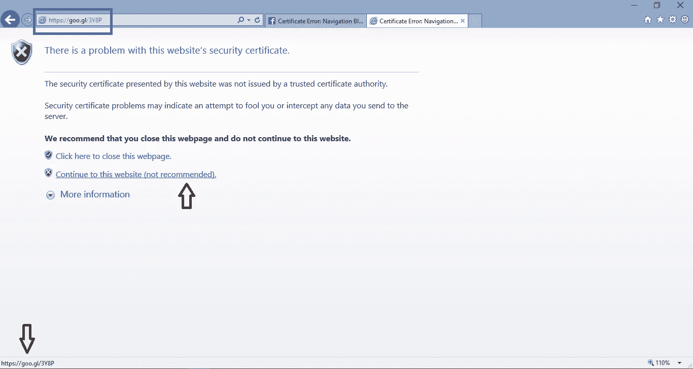
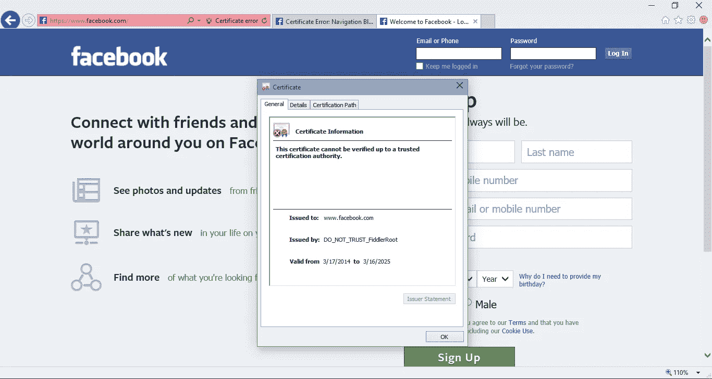
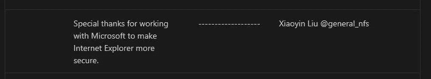

# IE 预览版中的 HSTS 绕过漏洞

> 原文：<https://infosecwriteups.com/hsts-bypass-vulnerability-in-ie-preview-fa956161fa8?source=collection_archive---------1----------------------->

这是我在 2015 年发现的 Internet Explorer preview 中的一个旧漏洞的书面报告。这是部分 HSTS 旁路漏洞。这是我在微软软件中发现的第一个漏洞。没有 bug 奖金，也没有 CVE 奖分配给这个 bug，但是我在 2015 年 6 月因为我的报告而受到了微软的表扬。我完全是偶然发现的。在这篇文章中，我将分享这个漏洞的细节。

# 背景

正如我在我的文章 [*Find Edge 的 HSTS 预载列表(第一部分)*](https://medium.com/bugbountywriteup/find-edges-hsts-preload-list-part-i-2ee5ce6bc5aa) 中提到的，HTTP 严格传输安全(HSTS)允许网站指示 web 浏览器应该只使用 HTTPS 连接到它们的服务器。HSTS 对浏览器有两个要求:

1.  如果一个链接使用“http:”协议，并且 URL 的域部分是一个已知的 HSTS 域，那么浏览器必须在发送请求之前将协议重写为“https:”协议。(例如，如果用户在地址栏中键入`http://github.com/`，浏览器应该使用[https://github.com/](https://github.com/))
2.  如果服务器提供的证书不可信，浏览器一定不允许用户忽略证书错误。

第二个要求背后的原因是，一些证书错误不是由于真正的攻击，而是由于服务器配置错误、客户端时钟偏差、强制网络门户等。但正因为如此，一些用户习惯点击警告信息。通过删除这个不安全的选项，HSTS 帮助用户始终保持安全。

# 弱点

Windows 10 技术预览版 Build 10041 上的 IE 11 中存在该漏洞。这并不影响 Windows 的已发布版本，因为当时 HSTS 仅在 Windows 10 预览版中受支持，而在 Windows 7、8 或 8.1 中不受支持。

该漏洞绕过了 HSTS 的第二个要求。它的工作原理是将任何 HTTP 或 HTTPS 请求重定向到 HSTS 域，然后 IE 允许用户忽略证书警告。例如，一个用户访问了 http://example.com/。一个 MITM 攻击者将 http://example.com 的[重定向到 https://github.com/](http://example.com/)的[，然后用一个自签名证书拦截 TLS 请求。因为证书是自签名的，IE 向用户显示一个错误页面，但令人惊讶的是，用户可以选择继续访问网站。更糟糕的是，当你悬停在“继续浏览本网站”链接上时，左下方显示的网址是“](https://github.com/)[http://example.com](http://example.com/)”，而不是“[https://github.com](https://github.com/)”。如果你真的忽略了这个警告，github.com 的饼干会被送到 MITM。

直接拜访[https://www.facebook.com](https://www.facebook.com/):

当 MITM 重定向到 https://www.facebook.com[时的错误页面](https://www.facebook.com/):

用户点击警告后:

由于这个漏洞只影响测试版的 IE，微软说他们不会给这个问题分配一个 CVE，但是他们在[公告](https://docs.microsoft.com/en-us/security-updates/Acknowledgments/2015/acknowledgments2015)中提到了我。我真的很感激的承认和快速修复。

# 时间表

1.  2015 年 3 月 19 日:漏洞发送到 MSRC
2.  2015 年 3 月 19 日:MSRC 立案 21780
3.  2015 年 6 月 9 日:向用户发布补丁