# HTB 学院[报道]

> 原文：<https://infosecwriteups.com/htb-academy-writeup-bf518031e7f?source=collection_archive---------1----------------------->

## 业务逻辑漏洞| ADM 组

# 摘要

这台机器是关于业务逻辑问题、易受攻击的框架和暴露的凭证。首先，在注册期间，我可以通过 burpsuite 更改角色 id，使自己成为管理员，并成功登录到管理页面。接下来，在管理页面上发现的子域泄漏了一个易受攻击的 PHP Laravel 框架的错误细节，其应用程序密钥哈希被暴露。利用这一点，我得到了低反向壳。通过这个 shell，找到了一个用户凭证，我用它来登录和访问。然后，我在该用户帐户中找到了另一个用户凭证，并获得了进一步的垂直权限提升。

对于 root 用户，该用户可以使用超级用户权限执行命令，从而获得 Root 用户权限。

**计算平台:** Ubuntu

**关键词:** PHP | MySQL | PHP Laravel 框架

# 侦察和计数

**Nmap TCP 扫描输出**

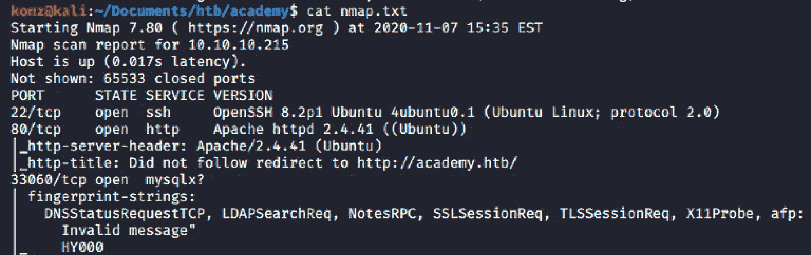

## 端口 80/tcp 开放 http Apache httpd 2.4.41

输入这台机器的 IP，它将解析为 **academy.htb**

IP 地址被添加到我的本地 DNS 服务器文件，并显示该网站。

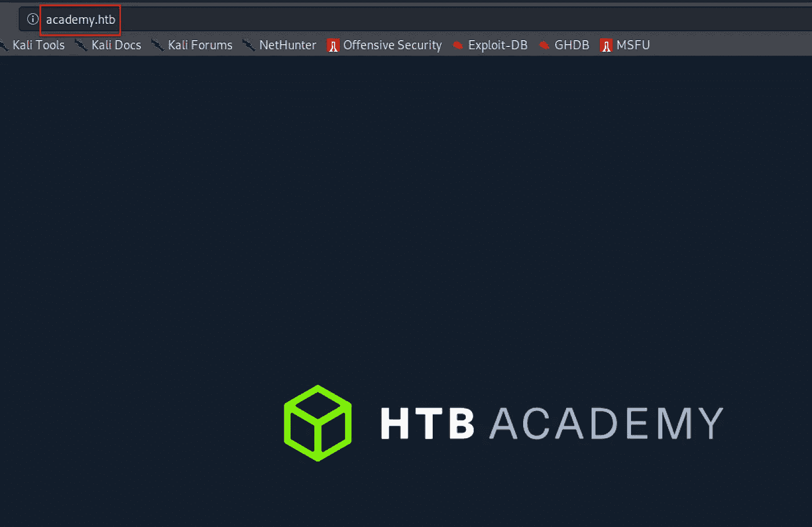

在[http://academy.htb/](http://academy.htb/)源代码中，你会发现 **/login.php** 和 **/register.php**

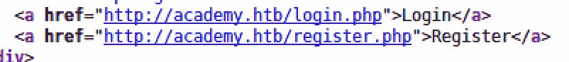

`Dirsearch.py`揭示了**admin.php**页面。

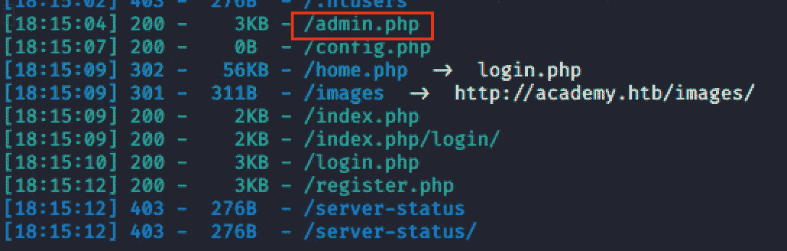

# 据点

在[http://academy.htb/register.php](http://academy.htb/register.php)上注册期间，通过打嗝发送请求。将**角色 id** 从 **0** 更改为 **1** 并转发请求。然后，您将被重定向到“成功页面”，然后是“login.php”页面。但是，你需要访问[http://academy.htb/admin.php](http://academy.htb/admin.php)并登录。

您已更改为 1 的 roleid 属于 admin。现在，您已经使自己成为管理员，能够使用您注册的用户名登录到管理页面。

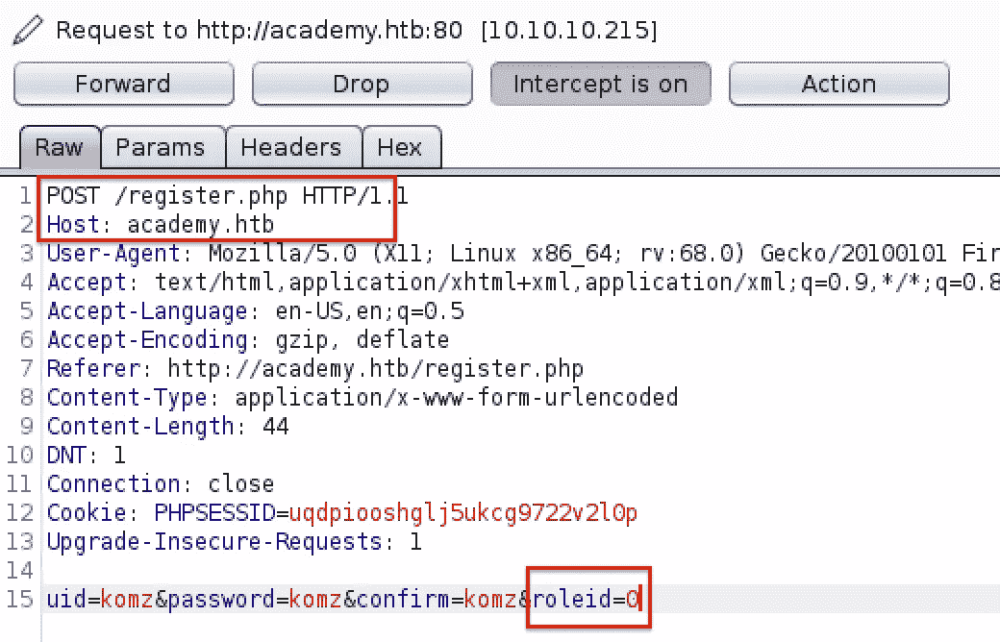

**将 roleid 从 0 更改为 1**

我以管理员身份成功登录。

在这里，我可以看到两个用户名，它们可以在以后用于垂直权限提升。我们还可以在这里看到我添加到本地 DNS 服务器的子域。

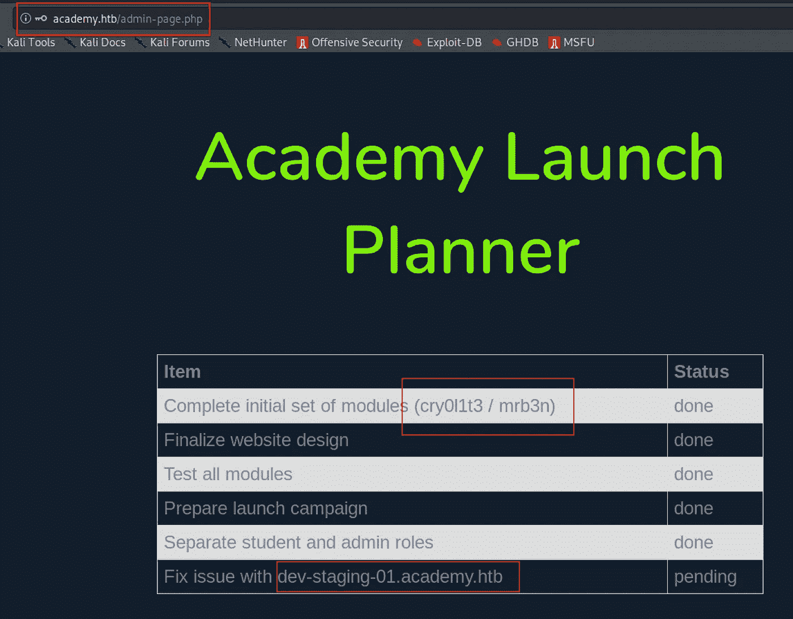

这个站点有很多错误信息和异常被抛出。

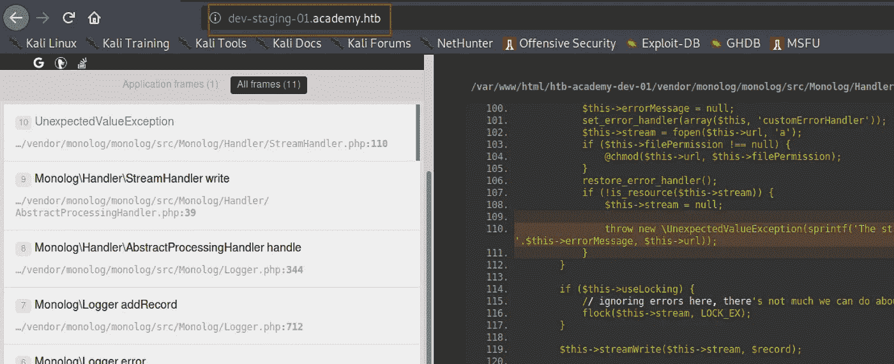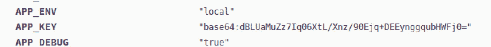

**APP_KEY 哈希**

# 反向外壳

通过一些研究，我发现这个网站容易受到 **PHP Laravel 框架漏洞**的攻击。

发现漏洞[在这里](https://www.exploit-db.com/exploits/47129)。

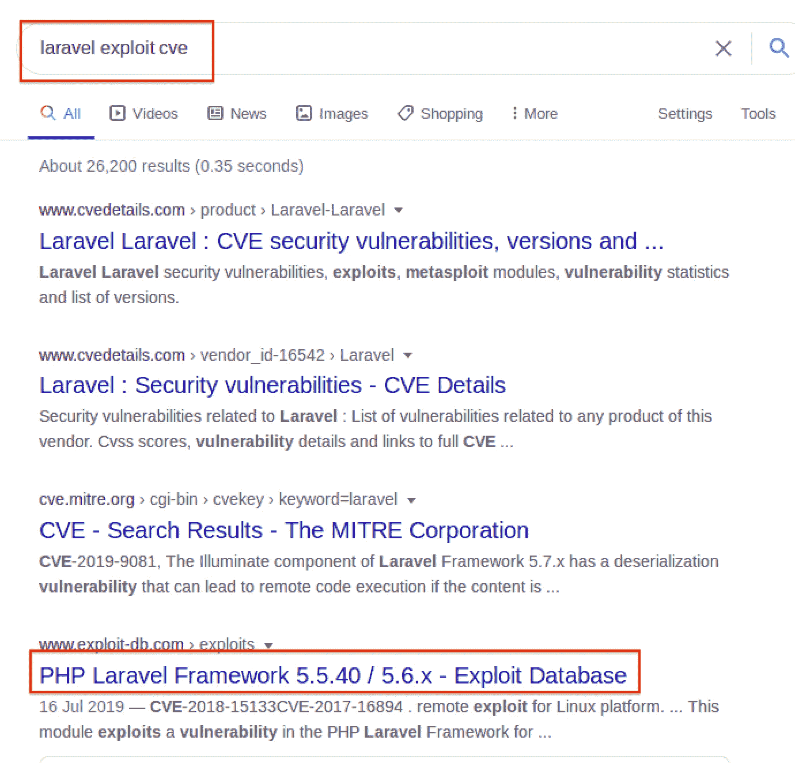

在 msfconsole 上搜索 **PHP Laravel 框架令牌 Unserialize 远程命令执行**取自站点(如下)。

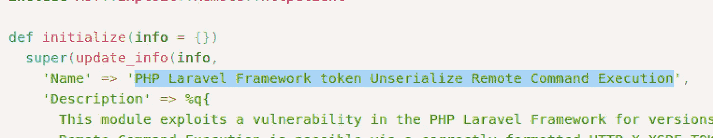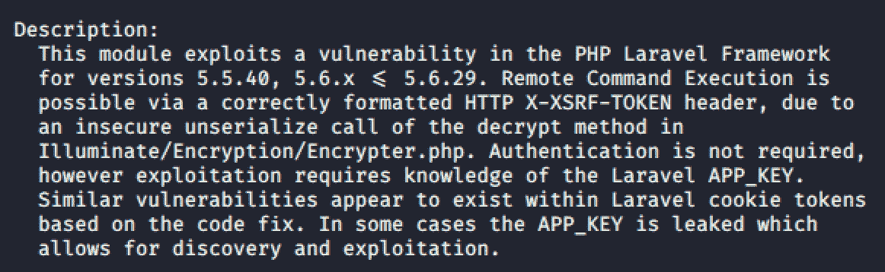

**msfconsole PHP Laravel 框架漏洞**

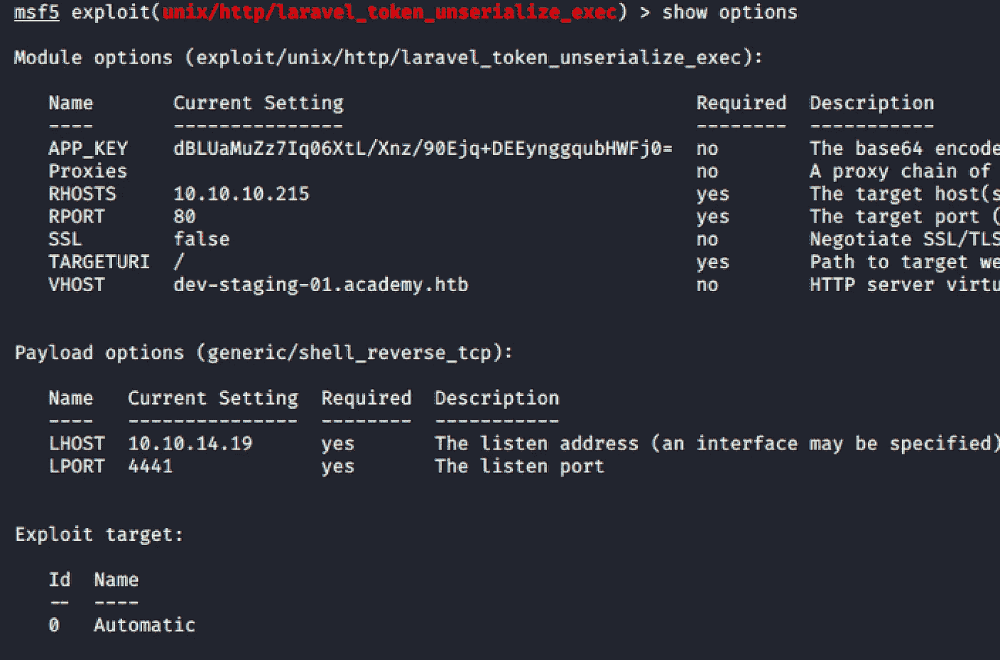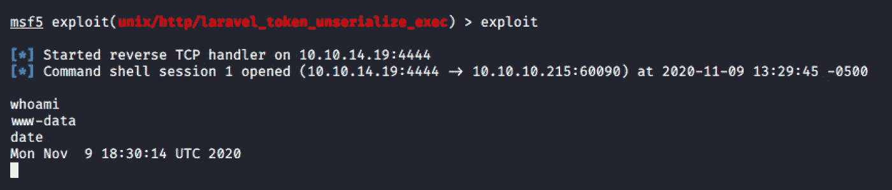

**成功！！！**

# 横向运动

我们在这里可以看到**很多用户**。**注**:在管理页面上我们看到了用户名:cry0l1t3 和 mrb3n。所以我会特别先对这两个用户感兴趣。cry0l1t3 有 **user.txt** 文件。

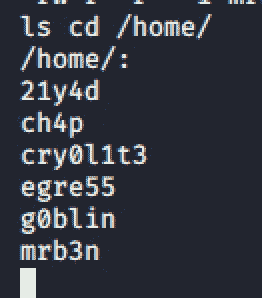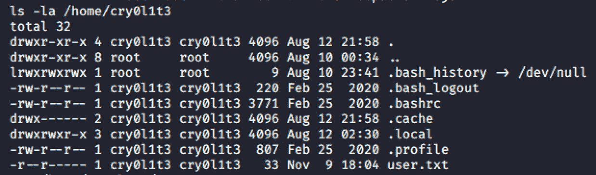

经过一番枚举，在 **/var/www/html/academy/下找到了密码。env** 文件。

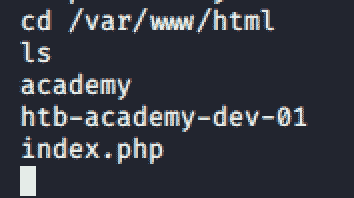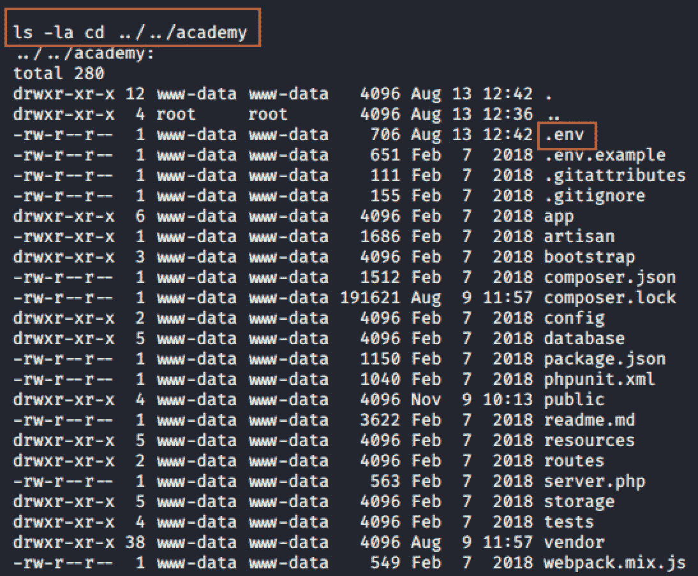

该密码与用户 cry0l1t3 配合良好，并且能够登录到用户帐户。您也可以通过 SSH 登录。

`ssh cry0l1t3@10.10.10.215`

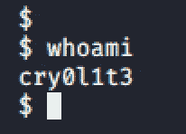

如你所见 cry0l1t3 是 **adm 集团的成员。**这里先问自己一个问题— *如果用户是 adm 组的成员，可以做什么？！*

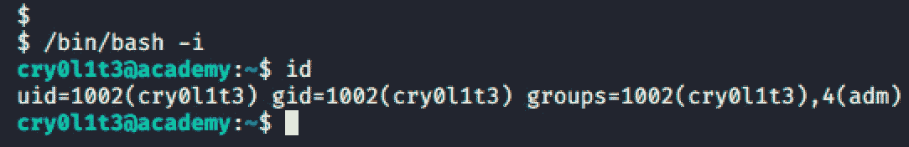

我很快进行了搜索——“*Linux ADM group pentest*”，我找到了一个来源，上面写着:

# 垂直权限提升

经过长时间的搜索，发现 mrb3n 的密码是十六进制的。把它转换成一个纯文本就泄露了密码。

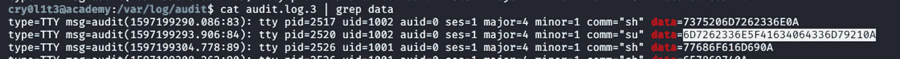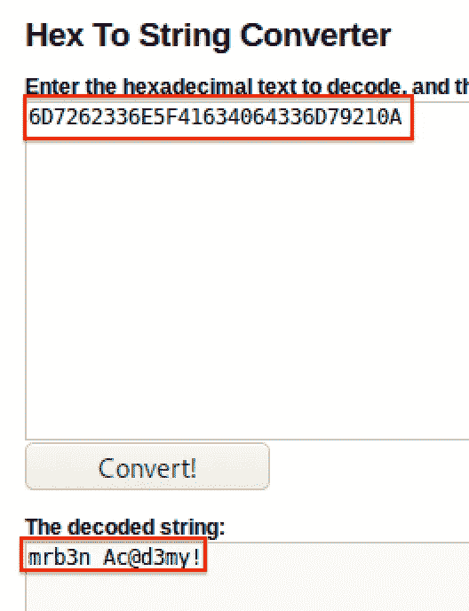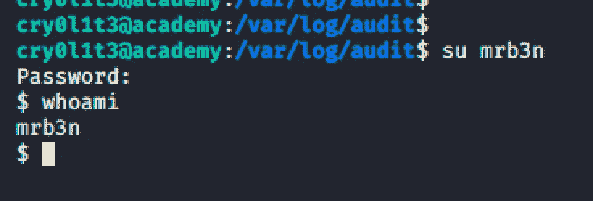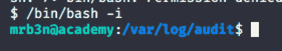

# 根

在这里，我们可以看到用户可以作为超级用户运行/usr/bin/composer 命令。这意味着这个命令可以用来调用根 shell。

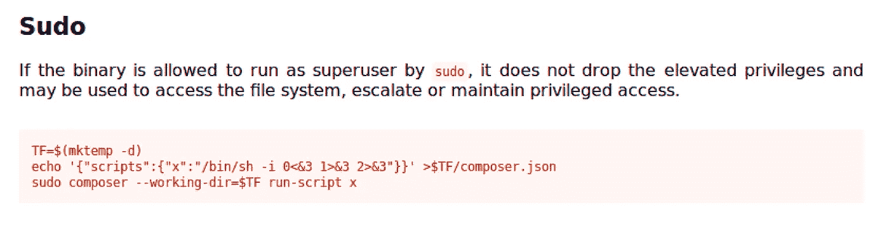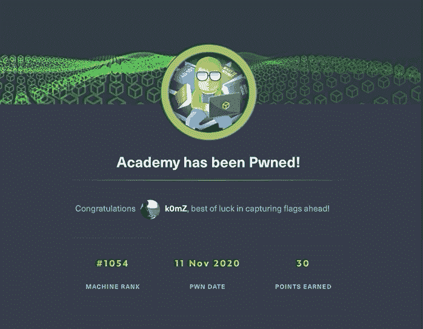

# 补救

*   确保应用程序框架安装了最新的补丁程序。
*   使用强加密
*   请求标头中的 roleid 参数有风险；使得攻击者能够操纵请求来提升权限。

# 参考

1.  【https://www.exploit-db.com/exploits/47129】
2.  [https://book . hack tricks . XYZ/Linux-UNIX/privilege-escalation/interest-groups-Linux-PE](https://book.hacktricks.xyz/linux-unix/privilege-escalation/interesting-groups-linux-pe)
3.  [https://gtfobins.github.io/gtfobins/composer/](https://gtfobins.github.io/gtfobins/composer/)