# HTB·布莱克菲尔德[特写]

> 原文：<https://infosecwriteups.com/htb-blackfield-writeup-e7c3570aca00?source=collection_archive---------1----------------------->

## **ASREPRoast** |字典攻击|

照片由[亚伦·伯顿](https://unsplash.com/@aaronburden?utm_source=medium&utm_medium=referral)在 [Unsplash](https://unsplash.com?utm_source=medium&utm_medium=referral) 上拍摄

## 摘要

我迄今为止尝试的第一台硬机器。用户需要大量的枚举和耐心来慢慢爬上梯子。对于该机器，来自开放 SMB 端口的暴露用户列表进一步允许主动域侦测提升权限并成为根用户。这台机器不需要利用漏洞。

**计算平台:** Windows

**使用的工具:** nmap | john the ripper 用于破解哈希

**CVE(美国):**不适用

## 列举

Nmap TCP 扫描输出

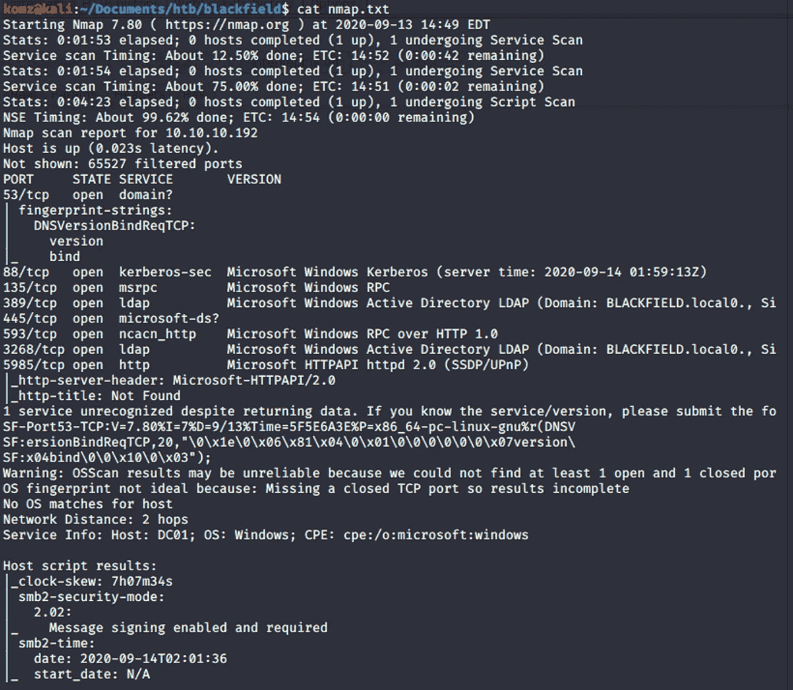

nmap 的结果让我们得到了域名 **blackfield.local** 。将此保存在 **/etc/hosts** 文件中。还要注意这里的关键词: **Kerberos，msrpc，Active Directory LDAP，domain，smb(微软-ds)。**

*** * * * * * * *端口 445 微软-ds(SMB)* * * * * * * * * * * * * * * * * * * * * * * * * * * * * * * ***

该机器有一个开放的 SMBserver，不需要任何身份验证。发现的两个有趣的文件是:**法医**和**个人资料$** 。

**取证**共享需要认证，但**配置文件$** 共享不需要。

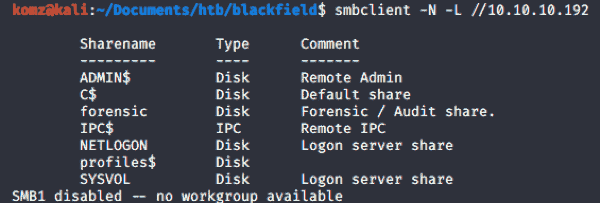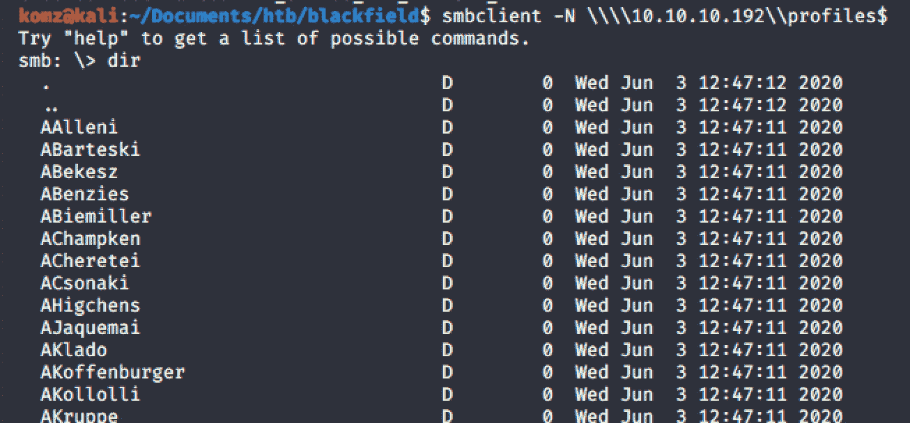

配置文件$ share 包含用户名列表。我将这个列表保存在另一个文件中，并使用以下命令删除了剩余的数据:

`cut -d “ ”-f 3 users.txt`

发现的项目:(1。)域名(blackfield.local)来自 nmap (2。)通过 smb 的用户列表。

接下来，我们检查这些用户的有效性。

**作为重新发布**

在搜索与 Kerberos 相关的攻击时，根据这篇[文章](https://gist.github.com/TarlogicSecurity/2f221924fef8c14a1d8e29f3cb5c5c4a)，我们了解到 **Impackets** 库中的工具`GetNPUsers.py`不需要凭据就可以运行该命令。只有域和用户文件。这种攻击被称为**重发**。

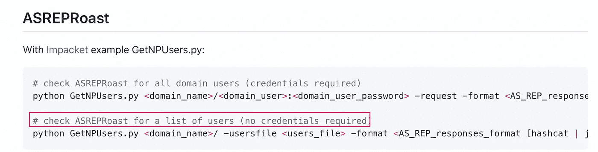

— — — — — — — — — — — — — — — — — — — — — — — — — — — — — —

根据这篇[文章](https://www.ired.team/offensive-security-experiments/active-directory-kerberos-abuse/as-rep-roasting-using-rubeus-and-hashcat)，AS-REP **烘焙**是“*一种允许为选择了* `*Do not require Kerberos preauthentication*` *属性的用户检索密码哈希的技术”。*

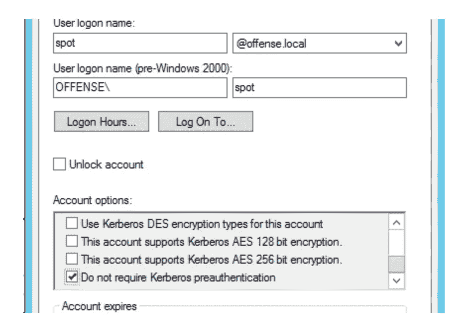

[https://www . ired . team/offensive-security-experiments/active-directory-Kerberos-abuse/as-rep-baking-using-rube us-and-hashcat](https://www.ired.team/offensive-security-experiments/active-directory-kerberos-abuse/as-rep-roasting-using-rubeus-and-hashcat)

[ldapwiki](https://ldapwiki.com/wiki/Kerberos%20Pre-Authentication) 声明**"*Kerberos Pre****-****认证*** *是一种安全特性，可提供针对密码猜测攻击的保护。AS 请求以明文形式向 KDC 标识客户端。如果****Kerberos Pre****-****认证*** *启用，时间戳将使用用户的密码哈希作为加密密钥进行加密。*

— — — — — — — — — — — — — — — — — — — — — — — — — — — — — —

`GetNPUsers.py`需要域名，确保 **blackfield.local** 设置在 **/etc/hosts** 下。

运行此命令引发了以下两个图像中显示的错误。

我们发现用户 **audit2020** 和 **svc_backup** 不需要 kerberos 预认证。

因此，密码哈希已通过此攻击被检索到。

`python3 /usr/local/bin/GetNPUsers.py blackfield.local/ -usersfile users.txt`

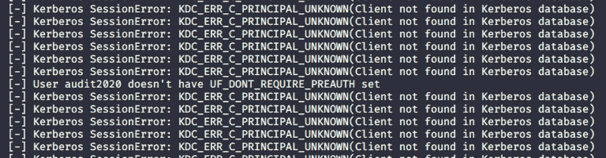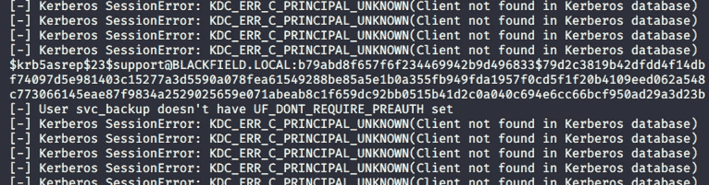

…约翰破解了这个散列的密码。

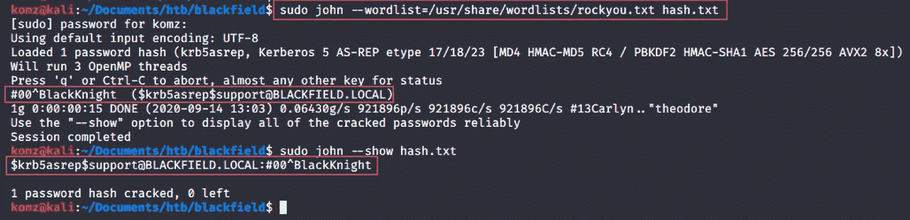

*** * * * * * * * * *端口 135 RPC 客户端* * * * * * * * * * * * * * * * * * * * * * * * * * * * * * * ***

使用找到的凭证，我能够登录到 rpcclient。

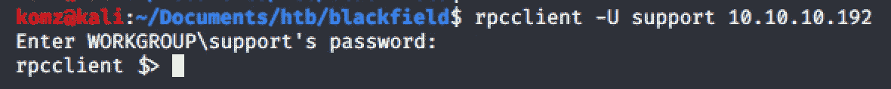

对于 rpcclient 的 active directory 侦察，我使用了这篇[文章](https://bitvijays.github.io/LFF-IPS-P3-Exploitation.html)，并发现在这里可以重置用户密码。

从用户列表中，尝试重置所有用户的密码，并尝试登录需要用户身份验证的 SMB:

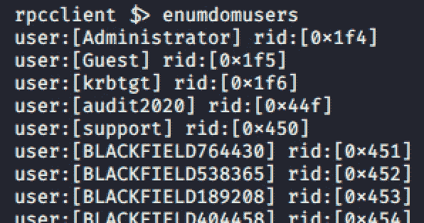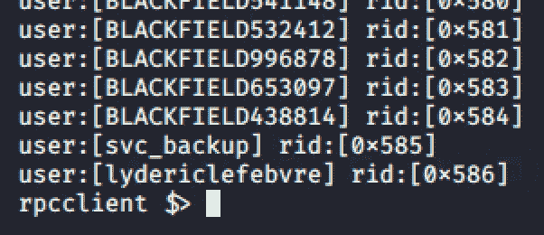

在这里，我更改了 **audit2020** 用户的密码。

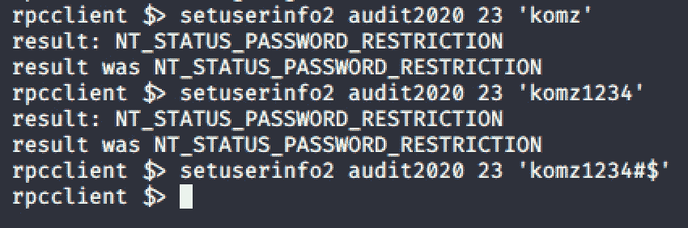

## 据点

现在回到 **SMBClient** ，以 **audit2020** 登录并访问最初需要认证的 **forensic** 共享。

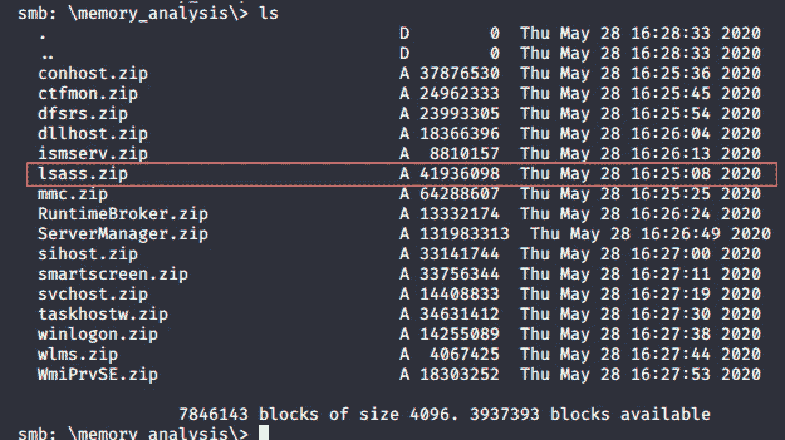

使用`get lsass.zip`命令将其下载到您的本地机器上。

我安装了 pypykatz 并从 lsass 获取了内容。DMP 档案。

`python3 /usr/local/bin/pypykatz lsa minidump lsass.DMP`

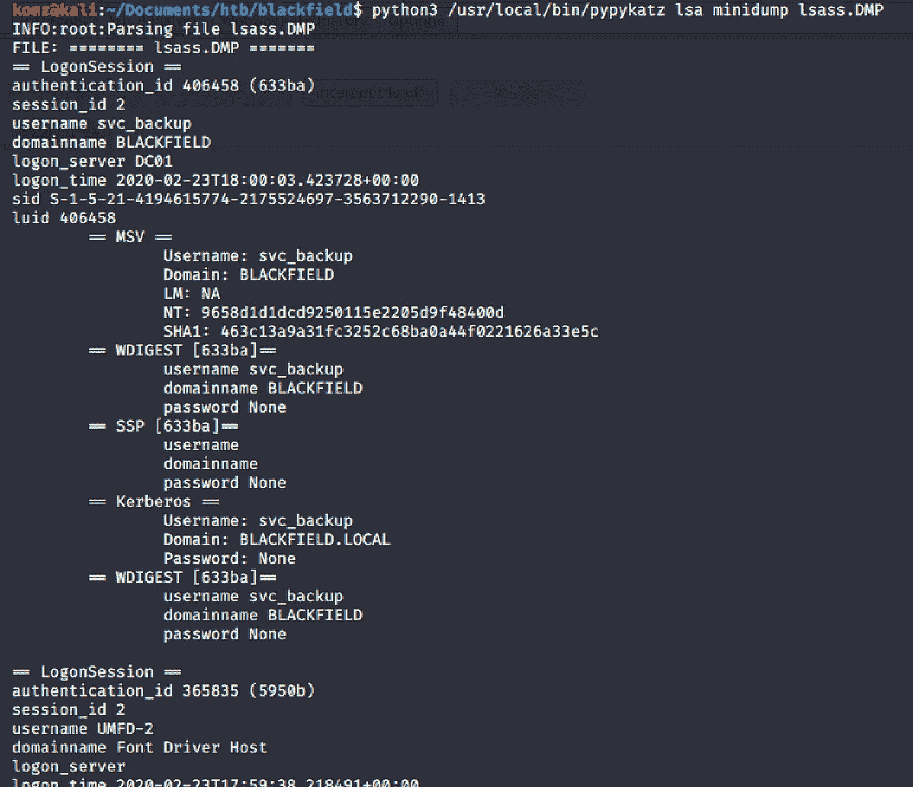

*** * * * * * * * * *端口 5985 WinRM * * * * * * * * * * * * * * * * * * * * * * * * * * * * * * * ***

## 反向外壳

`ruby /var/www/html/windows/evil-winrm/evil-winrm.rb -i 10.10.10.192 -u svc_backup -H 9658d1d1dcd9250115e2205d9f48400d`

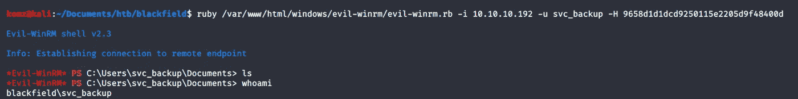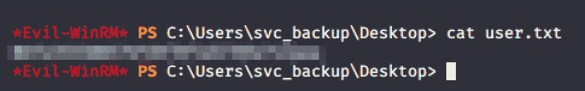

**成功了！！！**

## 来自 Infosec 的报道:Infosec 每天都有很多内容，很难跟上。[加入我们的每周简讯](https://weekly.infosecwriteups.com/)以 5 篇文章、4 个线程、3 个视频、2 个 GitHub Repos 和工具以及 1 个工作提醒的形式免费获取所有最新的 Infosec 趋势！