# HTB 失策[报道]

> 原文：<https://infosecwriteups.com/htb-blunder-writeup-6785bd826bfa?source=collection_archive---------1----------------------->

## Bludit 3.9.2 密码暴力|安全策略绕过

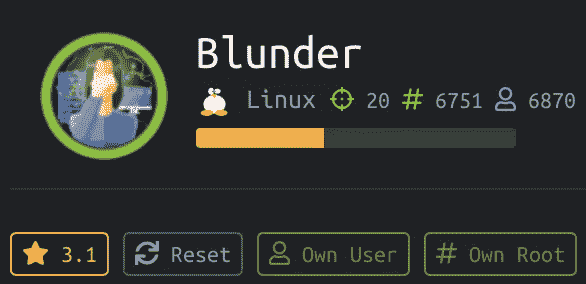

# 摘要

机器- 10.10.10.191 正在端口 80 上运行 **bludit** web 应用 v3.9.2。该应用程序易受其 **PHP 代码**的**反暴力功能**攻击；修改这段代码允许**密码暴力攻击**也就是说，攻击者即使在几次登录失败后也不会被锁定。利用此 bludit 反暴力功能成功找回密码。

对于垂直提升权限，检查用户 sudo 权限发现，用户可以以除 root 之外的任何用户身份运行所有命令。但是，sudo 不会检查负值中的特定用户 id，并且能够绕过这个排除来获得 root。

## 计算平台:Linux Ubuntu

## 使用的工具:

*   **侦察** — `cewl` | `source code review`
*   **枚举**——`Nmap`|`wfuzz`|`dirb`|`msfconsole`
*   **利用** — Bludit 密码暴力破解脚本| Bludit CMS 任意文件上传(CVE-2019–16113)

## 关键词:Bludit | PHP | sudo |源代码

# **侦察& E** 计数

## **Nmap TCP 扫描输出**

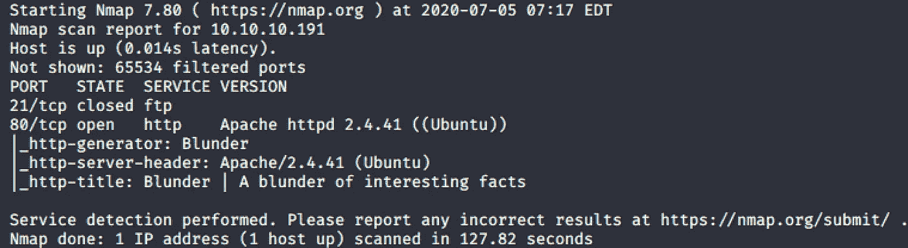

大错特错

**Dirb 扫描结果**

正如我们所看到的，有一个**管理目录**将我们带到**登录门户**页面。

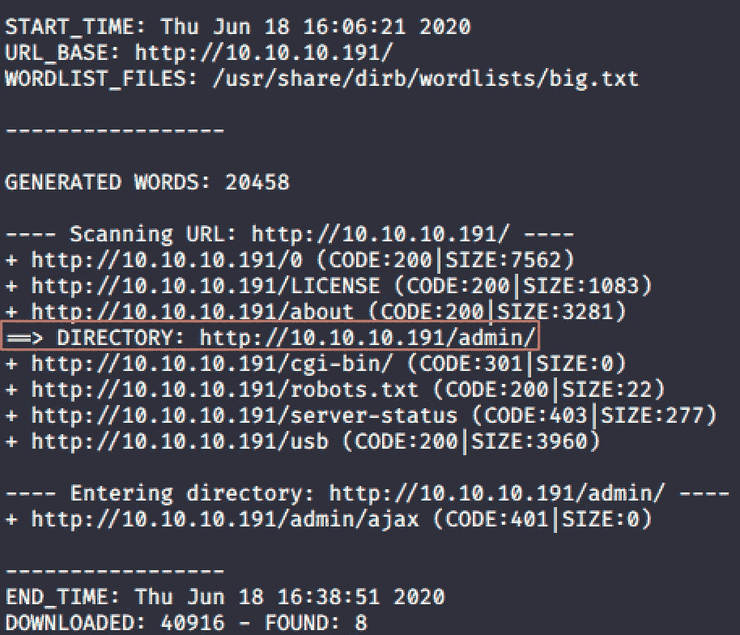

## *** * * * * * * * * * * * * * * * * * * *端口 80/TCP Apache 2 . 4 . 41 * * * * * * * * * * * * * * * * * * * * ***

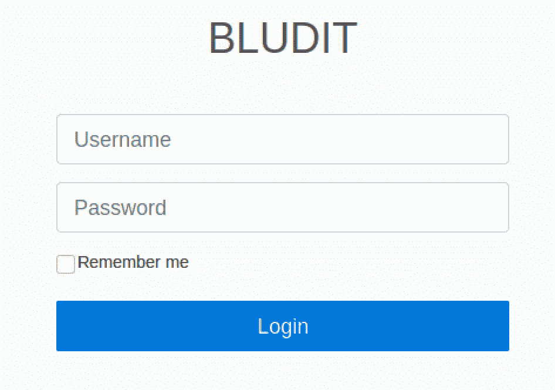

## **Bludit 源代码**

在源代码内，我发现 **Bludit** **web 应用版本**为 **3.9.2。**

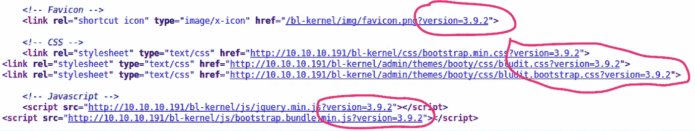

## Bludit 暴力缓解旁路

经过对 **bludit 3.9.2** 漏洞的一些研究，我了解到密码可以被**使用**技术**被 [**光栅化**](https://rastating.github.io/bludit-brute-force-mitigation-bypass/) 所使用的**暴力破解。

从这篇文章来看，在我们使用暴力破解密码之前，似乎需要一个确认的用户名(而不是用户名列表)。

## 用户名搜索。

我运行下面的`wfuzz`命令来查找任何隐藏的`.txt`文件

`$ wfuzz -c -w /usr/share/dirbuster/wordlists/directory-list-2.3-medium.txt --hc 404,403 -u “[http://10.10.10.191/FUZZ.txt](http://10.10.10.191/FUZZ.txt)" -t 100`

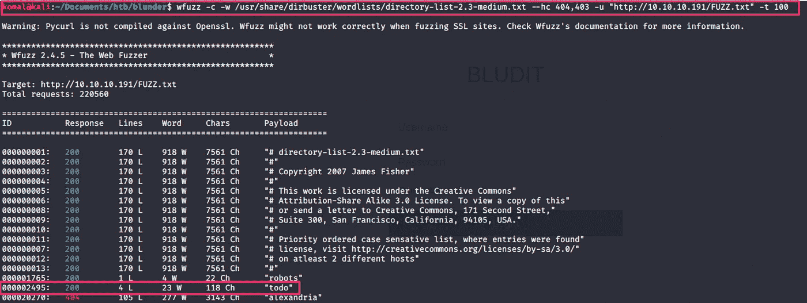

上面，我们看到一个名为`todo`的文本文件。

下面，在`todo.txt`之内，有一个独特的名字。

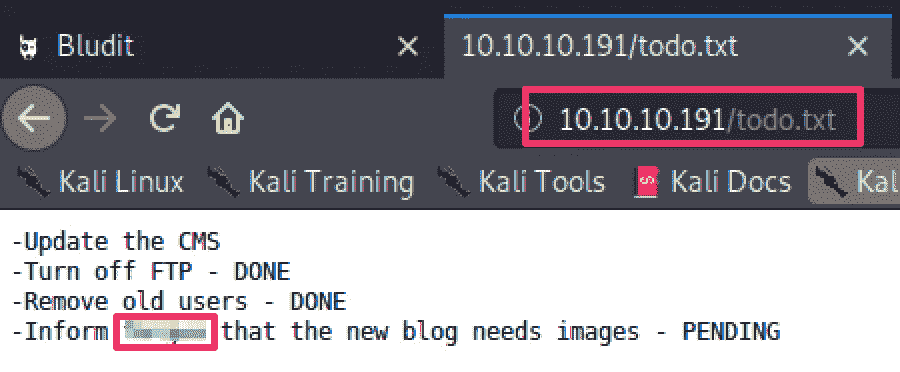

# 据点

## 密码单词表

**对于暴力破解密码**，我使用 **cewl** 从站点构建了一个**自定义单词列表**。

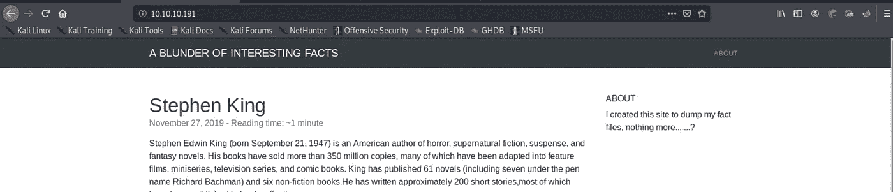

在[光栅化](https://rastating.github.io/bludit-brute-force-mitigation-bypass/) PoC 之后，我对脚本进行了细微的修改，以便能够从‘wlist . txt’文件中读取密码文件。

回到 **Bludit 密码暴力破解脚本**，我修改了脚本以包含在`todo.txt`中找到的**用户名**，然后再次运行脚本以查看来自**自定义创建的单词列表**中的**单词**是否与提供的用户名匹配。

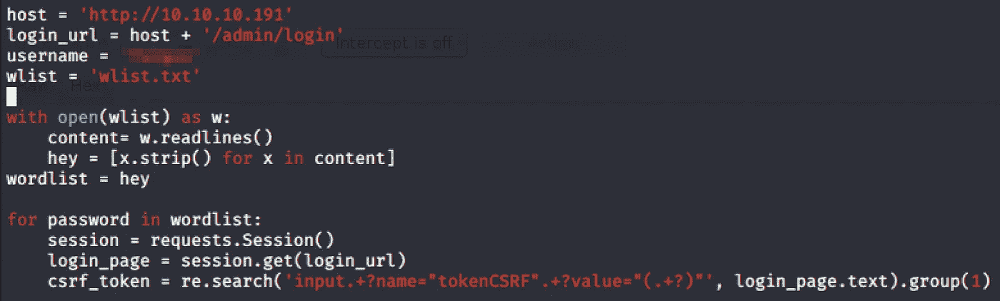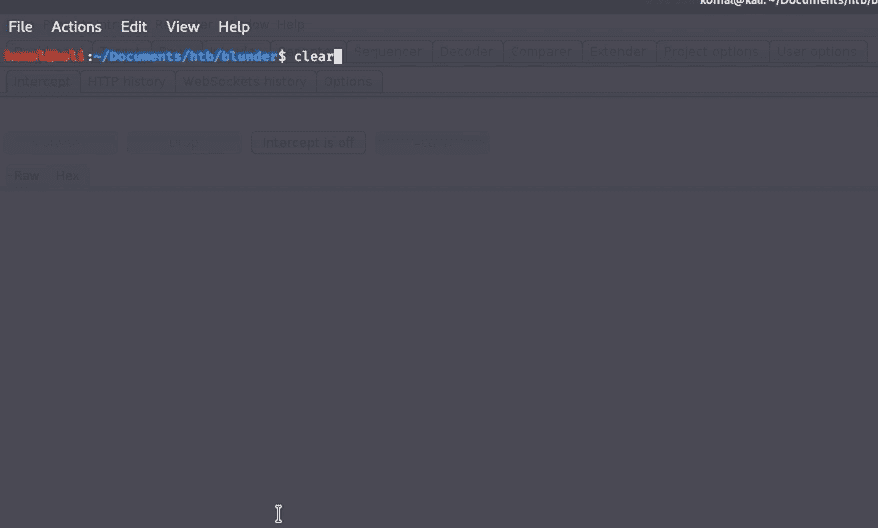

Bludit Python 密码暴力脚本

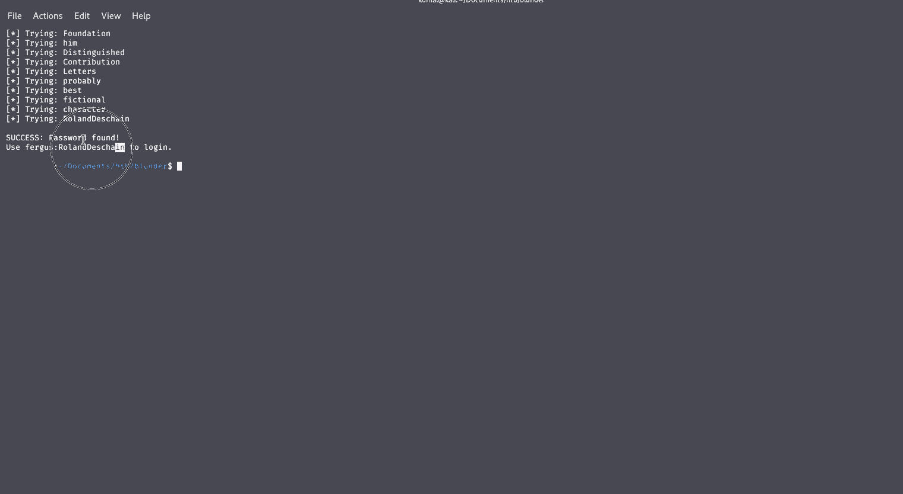

# 反向外壳

## Bludit CMS 任意文件上传(CVE-2019–16113)

在 msfconsole 上，CVE-2019–16113 的漏洞很容易被访问。

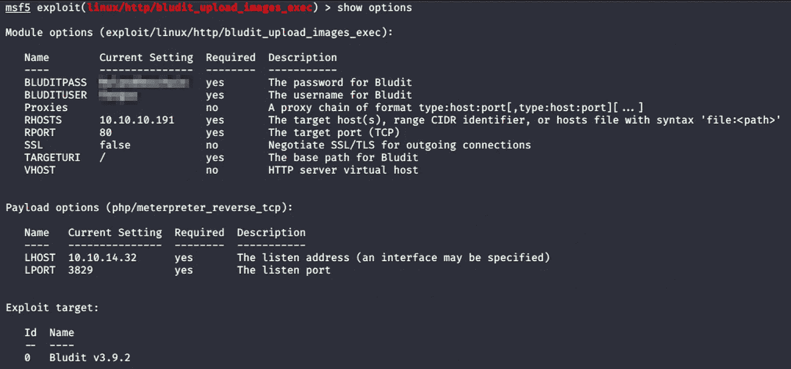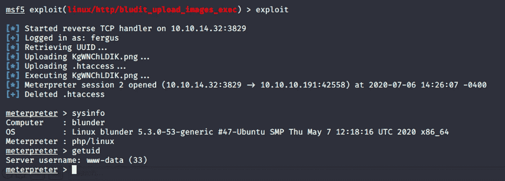

# 横向运动

这台机器上还有另外两个用户:`hugo`和`shaun`

在`var/www`下，我看到了两个不同版本的 bludit 文件夹。

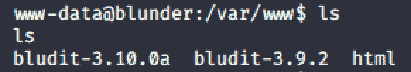

所以我在这里运行了一个简单的命令:`grep -rl password`这个命令获取包含单词“password”的文件列表。我终于找到了一个包含用户`Hugo`密码散列的文件

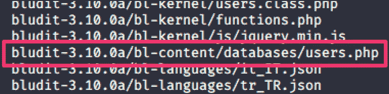

我使用`[md5decrypt](https://md5decrypt.net/en/) site`检索了这个密码的散列。

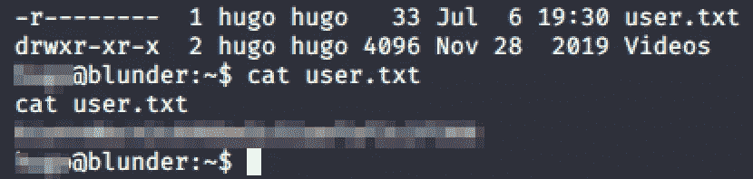

# 权限提升

运行`sudo -l`命令，`(ALL, !root) /bin/bash`表示**用户**‘Hugo’可以以任何用户的身份运行`/bin/bash`命令，不需要密码；除了根用户。

这个漏洞就是[sudo 1 . 8 . 27——安全绕过](https://www.exploit-db.com/exploits/47502)。

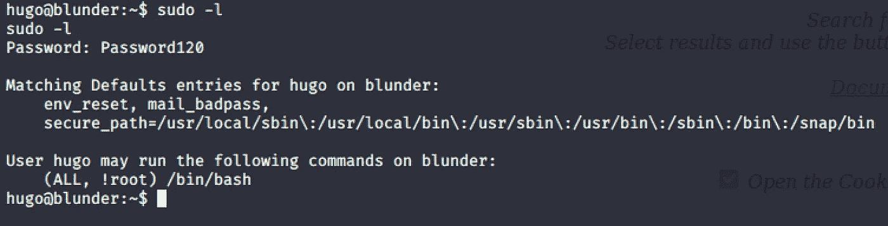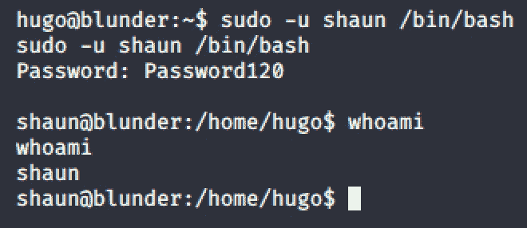

注意:此处不需要 shaun 密码

*或者，您也可以运行下面的命令，它会工作得很好……*

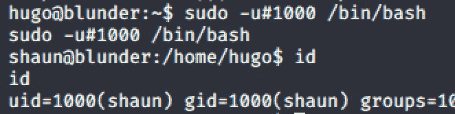

可以在“etc/passwd”文件中找到 uid。另外，请注意，这里不需要 Hugo 的密码。

然而，尽管不允许用户“hugo”作为根用户运行`/bin/bash`(( ALL，！根))。

下面的命令`sudo -u#-1 /bin/bash`工作正常，因为无法正确解析'-1 '值，而是给出了根！

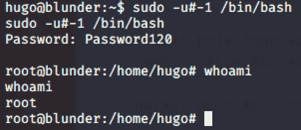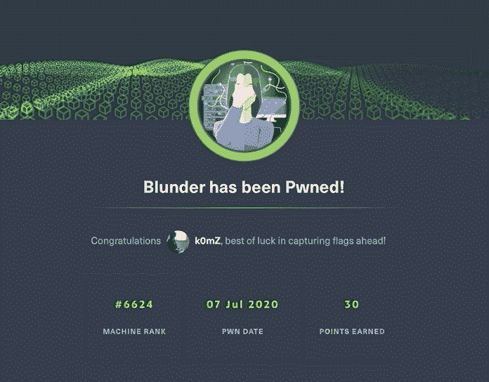

# 补救

*   代码扫描审查，在开发的初始阶段检测漏洞
*   请使用 3.9.2 以上的 Bludit 版本，其中已修复了此漏洞
*   在 1.8.27 版本中发现的 sudo 漏洞在 sudo 1.8.28 中得到修复

# 参考

*   https://md5decrypt.net/en/
*   【https://www.exploit-db.com/exploits/47502 
*   [https://rastating . github . io/bludit-蛮力-缓解-旁路/](https://rastating.github.io/bludit-brute-force-mitigation-bypass/)