# HTB-CTF 商业

> 原文：<https://infosecwriteups.com/htb-business-ctf-e388db78649?source=collection_archive---------0----------------------->

# 回报 PWN 挑战

你好。我知道我已经很久没有写博客了，但是我现在又回来了！

我总是喜欢 CTF 的 pwn 挑战赛，尽管我并不擅长。但是，我仍然试着去学习它们，练习它们，以便有一天我能在这方面做得很好。今天就是这样的一天，我学到了一些非常酷的东西，我很高兴与你分享，我的朋友！

所以让我直接进入挑战吧！

请读者注意，我在 CTF 期间没有解决这个挑战，因为我被困在一个点上，毫无头绪，但我确实学到了一个新东西，它帮助我在 CTF 之后解决了这个问题。

所以挑战在于，我们得到了一个二进制文件、源代码、加载器、libc 和其他一些东西，如下所示。

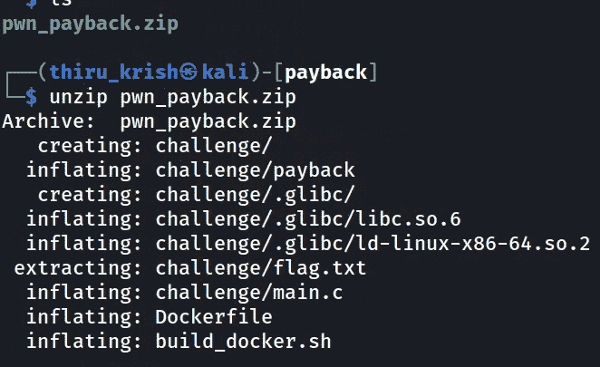

挑战文件

对于每一项挑战，首先要了解二进制文件，以及现有的不同保护措施，我们会选择二进制文件利用中最常用的工具，

> 检查秒

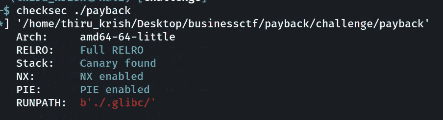

由此获得的信息:

架构是 **amd64。**

1.  **NX** 位被置位:这意味着我们不能从堆栈中执行外壳代码，即使我们在二进制中得到一个缓冲区溢出。但这并没有阻止我们，因为我们是**最有创造力的人**(但我不会在这篇文章中谈论方法)
2.  **PIE(独立于位置的可执行文件)**:这是我从这次挑战中了解到的一件很酷的事情。这种保护会在每次执行时将程序及其各种依赖项加载到不同的内存区域中。因此，在 gdb 这样的调试器中，你看不到程序的确切内存地址，相反，你看到的是从 elf 二进制文件开始的偏移量。

我知道这真的很无聊和枯燥，所以我会给你看一些很酷的图片来描述上面的内容。

既然我们有了源代码，我将在不启用 PIE 的情况下编译程序(是的，这确实是可能的),并向您展示不同之处。

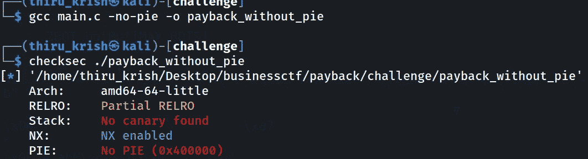

编译源代码

差别

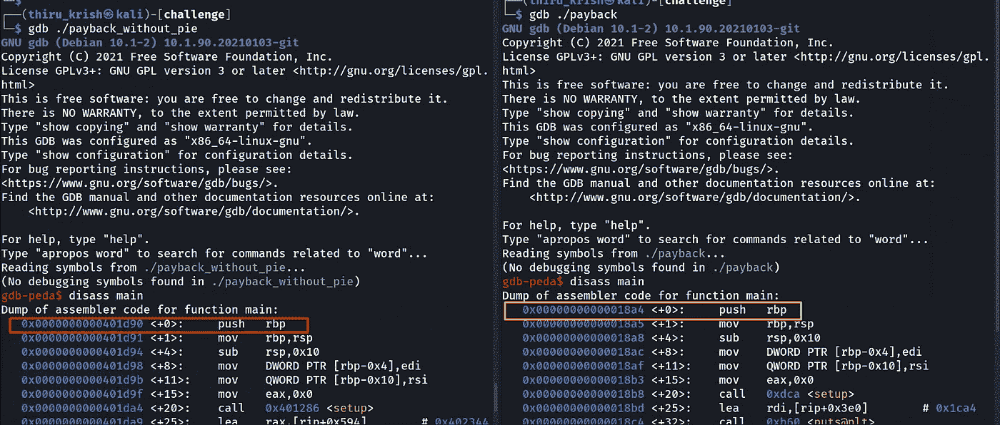

您可以看到，没有禁用 PIE 的二进制文件(左边一个)具有每个指令的内存位置的确切地址，而启用 PIE 的二进制文件(右边一个)具有从 ELF 二进制文件的基址的偏移量。所以当程序被执行时，二进制文件被加载到一个随机的内存位置，指令的加载是通过把偏移量加到基数上来实现的。

虽然这可能对挑战没什么用，但我希望你能理解这位朋友。

4.这就是阻止我并让我对挑战一无所知的原因。这种保护在启用时不允许在执行期间对全局偏移表进行任意写入。

链接器将在链接时(在执行开始之前)执行所有的符号查找，然后它将从 get 中移除写权限。

过程链接表成为全局偏移表的一部分。

如果上面的一些术语听起来很吓人或者让你不知所措，请参考下面 LiveOverFlow 的视频。

5)最后一个 boss 是 **ASLR** 使能的:这可能不直接可见，但大多数现代系统都默认使能。这种保护使每次执行时系统可执行文件在内存中的位置随机化。系统可执行文件包括 LIBC，它是 C 程序使用的库，用于使用 printf、scanf 等普通函数。！！

如果你曾经想知道这些函数是在哪里定义和声明的，现在明白了吧，伙计，它们都在 LIBC 内部！！！！！

## 现在让我们看看 ASLR 的行动

我们使用 **ldd** 工具打印可执行文件的**(运行时成功执行程序所需的文件和可执行文件)**。

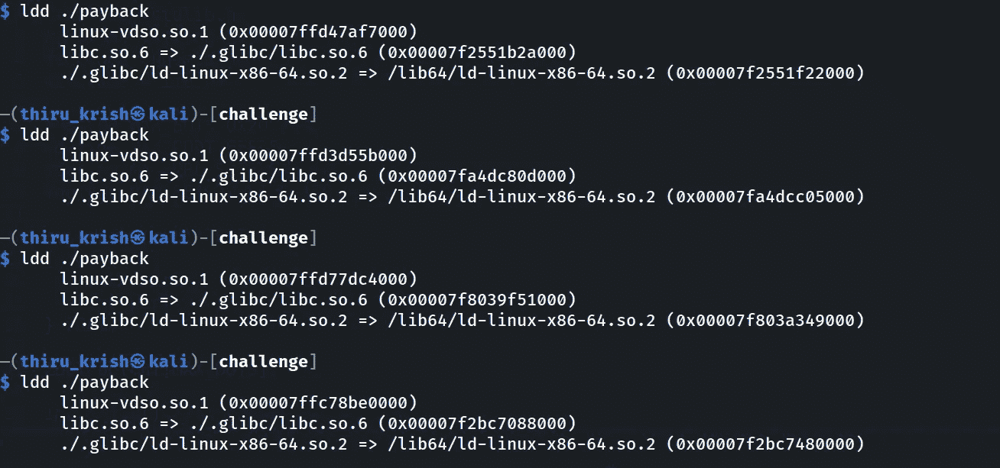

每次将 libc.so.6 加载到不同的内存位置。

## 剥削:

现在来看挑战的源代码，我们基本上看到了 3 个实际有效的操作。

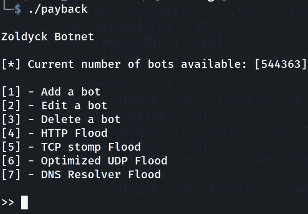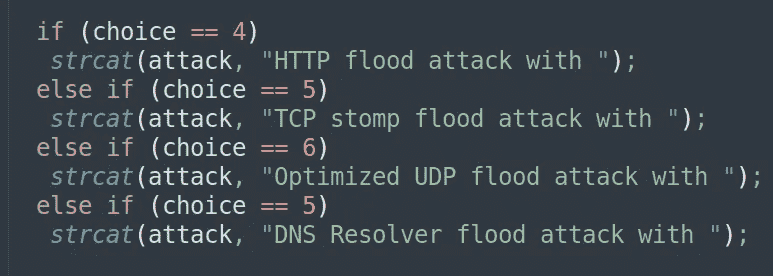

假的

5，6，7 只是在控制台中打印字符串，什么也不做！

所以**有趣的**是**添加、编辑和删除** bot 功能。

bot 是一个用户定义的结构，其中包含 id 和 URL 变量。

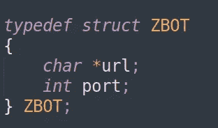

Bot 结构

在阅读源代码后，我们找到了罪魁祸首……..

# **删除 bot 功能。**

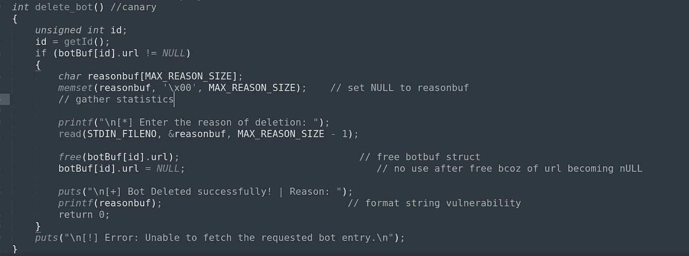

这些漏洞是:

> 用户输入直接传递给 printf 函数，导致**格式字符串漏洞**
> 
> 我在 CTF 之后学到的另一个是另一个用户输入被传递到免费函数，没有保护。(**滥用自由钩函数指针**)

## 自由钩:

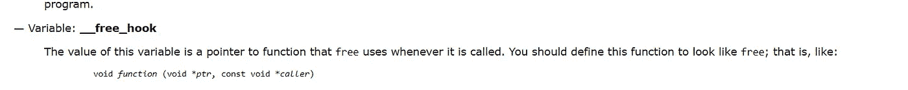

这基本上是给开发人员一种方法来定义他们自己的函数，每当 free、malloc 或任何类似的函数被调用时，这些函数就会被执行。

所以开发开发如下，

> **a)** 利用**格式字符串漏洞**从堆栈中泄漏一些内容
> 
> **b)** 找到一个 **libc 地址**，这个地址在二进制每次运行时都在堆栈中的一个固定位置。
> 
> **c)** 使用 gdb 找到你从 libc 基址泄露的 libc 地址的偏移量**找到 libc 基址**。(ASLR 战败)
> 
> **d)** 现在计算**自由钩**、**系统 libc 函数**的地址，用**格式字符串用给我们一个 shell 的系统 libc 函数覆盖**自由钩指针。
> 
> **e)** 调用 delete bot，**将参数 as /bin/sh** 传递给自由函数(它现在指向系统)
> 
> 现在，看看弹开的外壳，享受一下这种感觉吧！！！

## **第一步**:

添加一个随机数据的机器人，并选择删除机器人，并提供一个有效的 id 是 0 在这里，并在原因输入有效载荷，以收集一些信息。

## 初始有效载荷:

> AAAAAAAA | % p % p % p % p % p % p % p % p % p % p % p % p % p % p % p % p % p % p % p % p % p % p % p % p % p % p % p % p % p % p % p % p

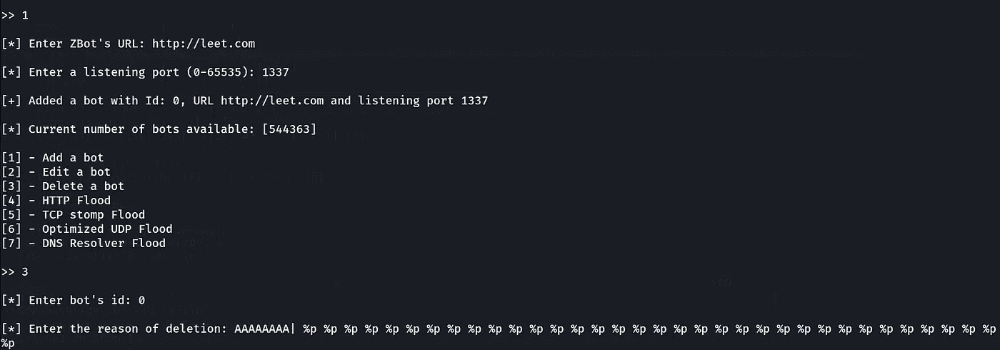

%p 是打印堆栈中的 64 位内存地址！

## **输出:**

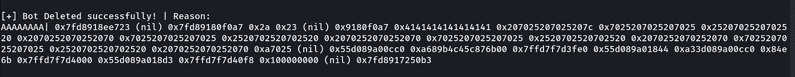

首先，我们看到 0x4141…这是 AAA…我们提供的输入。这很直观，因为我们提供的输入也在堆栈中，作为传递给 printf 函数的参数。

所以堆栈的第 8 个位置是 out 输入。

步骤 2:现在，我们有一些以 0x7f 开头的地址，它们通常是堆栈地址。你可以看到这是 gdb，现在我们需要找到其中哪个是有效的 libc 地址来击败 ASLR。

为此，如下所示将 gdb 连接到正在运行的进程，并调查地址。

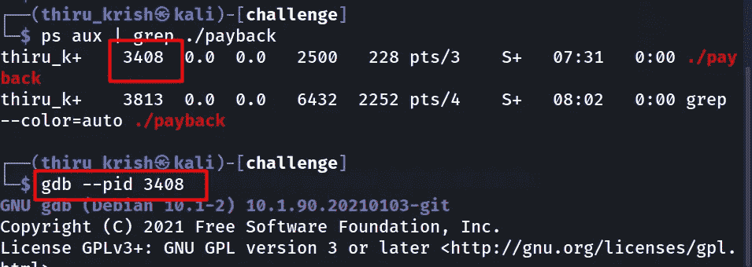

检查我们看到的 gdb 中的最后一个地址

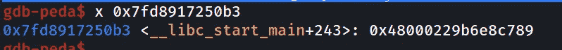

## 嘣！！！

我们找到了一个有效的 libc 地址太好了！这不会在每次运行中改变。

现在按照下面的步骤，找出这个从 libc 基址的偏移量。

> 在同一个 gdb 窗口中输入 vmmap。

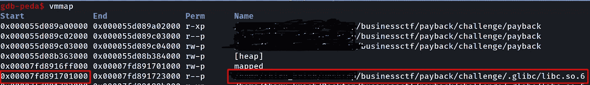

> 第一个看到 libc.so.6 的地址是它的基址。
> 
> 计算泄漏地址的偏移量—基址

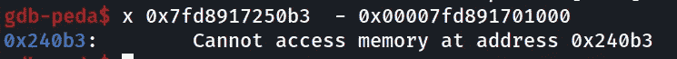

至此，整个挑战基本完成。是的，已经结束了，相信我！！

现在我们需要计算 free-hook 和系统的 libc 地址，并使用 printf 而不是打印堆栈来写入它们。

有关格式字符串漏洞的更多信息，请参见下面的链接。

使用 pwntools，格式字符串攻击变得非常容易。它们是二进制开发的最通用和最好的工具，这使得工作变得有点容易！！

您可以通过以下方式生成进行写入的有效负载

从格式字符串计算 libc 基数

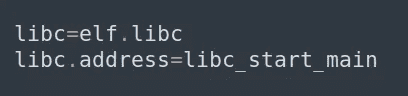

用计算的值更新 libc

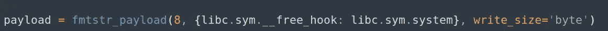

您只需要用您计算的 libc 基数更新 libc 变量，并使用 fmt_str 生成一个有效负载来覆盖。

## **所以现在下一次我们调用删除 bot 函数时，这个函数是免费的。url)将执行系统 libc 函数。**

为此，您必须再次添加一个 URL 为 **/bin/sh** 的机器人。

> 这是因为这个字符串实际上被传递给了 free，它现在指向系统。现在，它执行 system("/bin/sh ")，打开一个 shell。

现在删除你在上面创建的机器人，并看到你的外壳弹出打开！！！

# 伙计，你成功了！太棒了。！

这是我曾经解决过的一个很好的挑战，它让我学到了很多东西，并将我的理解推向了一个很好的程度。我希望这对你也有用！

请务必参考我的 Github 的挑战文件和漏洞！

> [https://github.com/Thirukrishnan/Payback-PWNchallenge](https://github.com/Thirukrishnan/Payback-PWNchallenge)