# HTB·开克斯[报道]

> 原文：<https://infosecwriteups.com/htb-openkeys-writeup-531264648200?source=collection_archive---------0----------------------->

## OpenBSD 身份验证旁路| HTTP 头篡改|内核操作系统本地根漏洞

# **总结**

**用户-** 这台机器正在运行 OpenBSD httpd 站点，该站点有一个登录门户，只有登录功能有效。经过研究，发现它有一个漏洞，暴露了用户的私钥，使我们能够使用 SSH 登录。

**Root -** 发现 openbsd 的本地漏洞；执行哪个给了我根！

**使用的工具:** `nmap` | `ssh` | `dirbuster` | `wget`

**CVE(美国):**[CVE-2019-19520](https://github.com/bcoles/local-exploits/blob/master/CVE-2019-19520/openbsd-authroot)|[CVE-2019–19521](https://github.com/bcoles/local-exploits/blob/master/CVE-2019-19520/openbsd-authroot)

**关键词:** openbsd httpd | ssh | jennifer

# 侦察列举

**Nmap 扫描 TCP 输出**

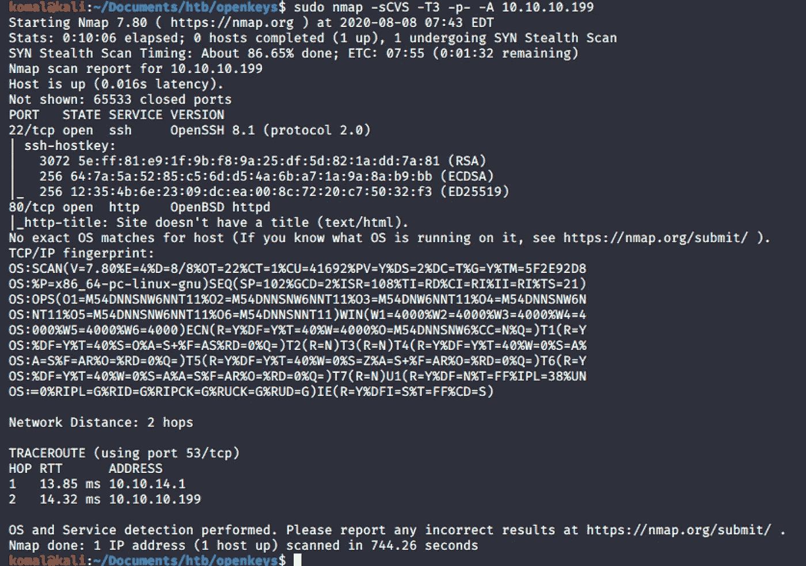

****************端口 80 OpenBSD httpd * * * * * * * * * * * * * * * * * * * * * * * * * ***

该网站有一个登录门户。

尝试了一些常用的凭证，但没有工作。

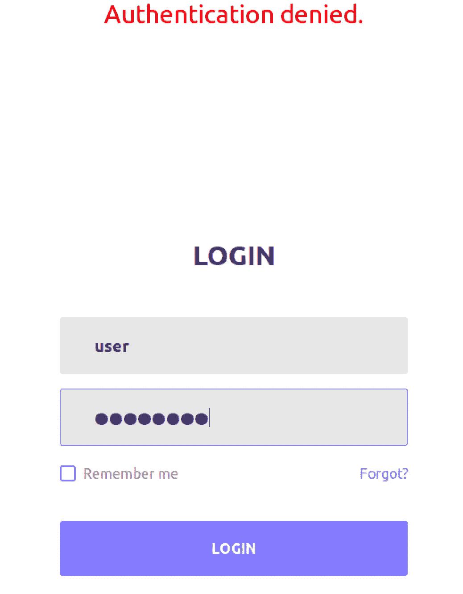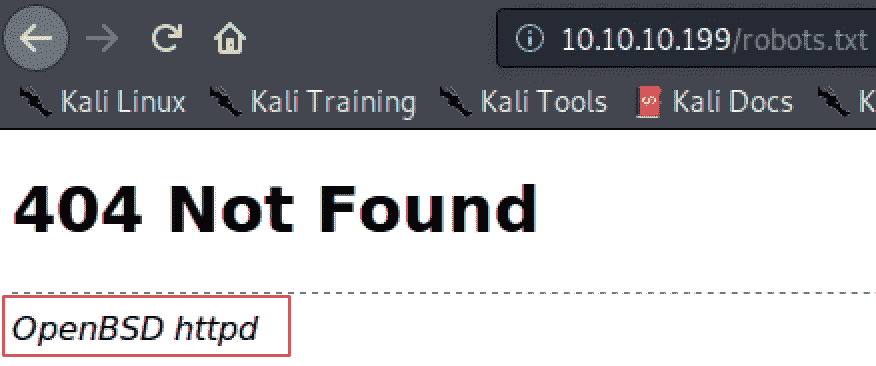

**robots.txt**

`dirbuster`透露了一个文件/includes/auth.php.swp 曝光了**用户名**、**主机名**和**其他数据**。

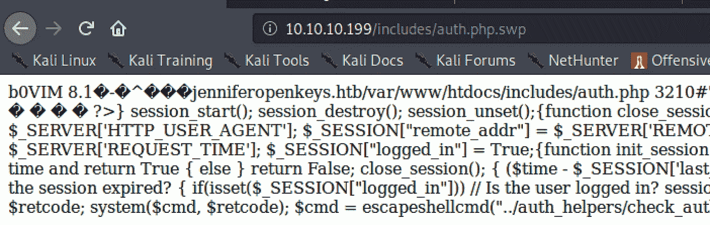

# 据点

> CVE-2019–19521:OpenBSD 认证旁路

[secpod](https://www.secpod.com/blog/openbsd-authentication-bypass-and-local-privilege-escalation-vulnerabilities/) 的一篇文章展示了如何通过输入 **-schallenge** 作为用户名和任意随机密码来绕过 openbsd 服务器上运行的登录门户。

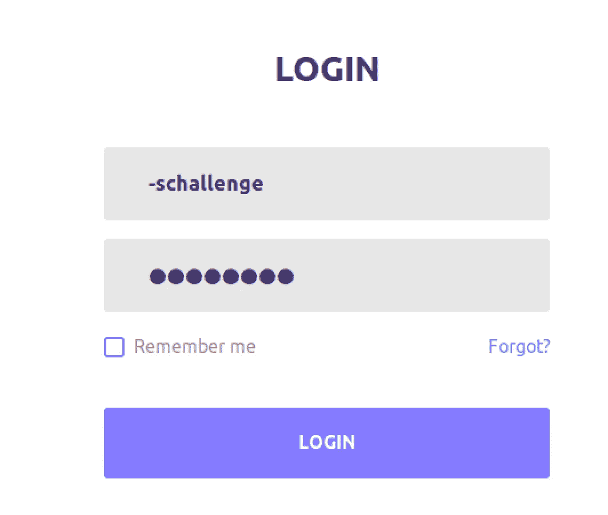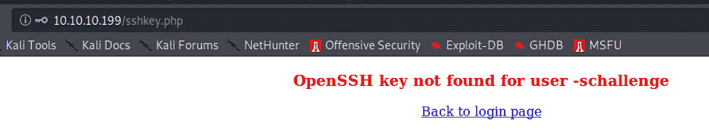

登录成功，但显示**“找不到 user -schallege 的 OpenSSH 密钥”。**

记得找到的用户名是**詹妮弗**

# SSH Shell

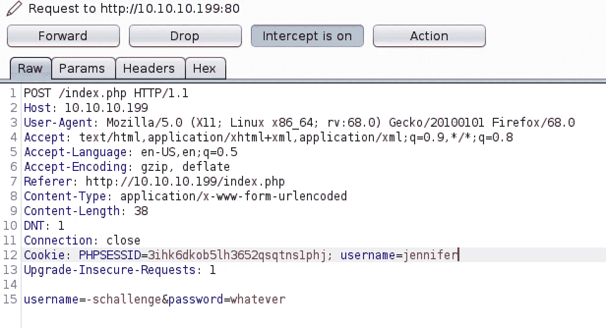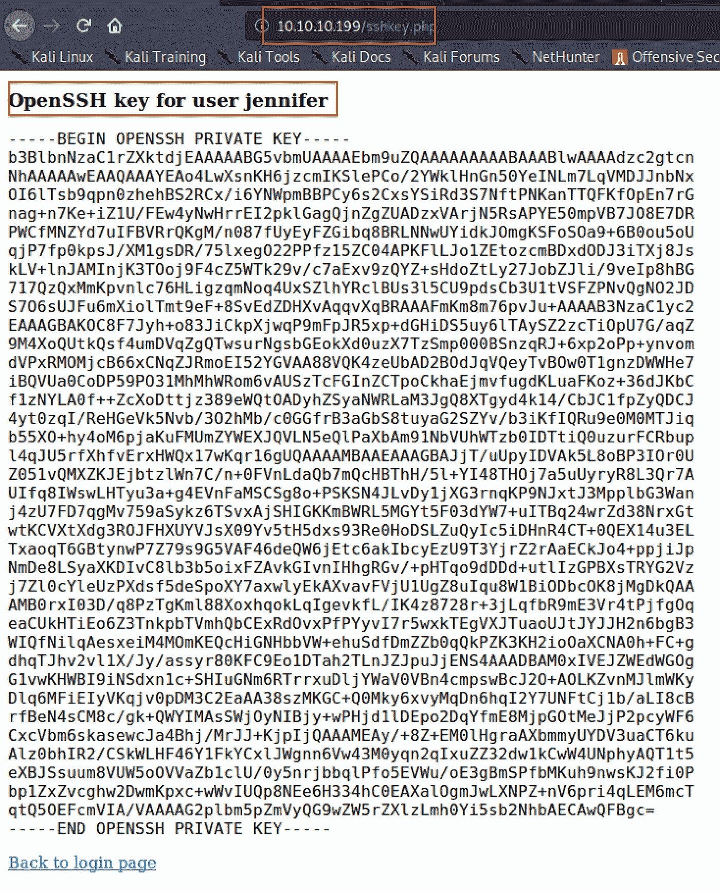

将私钥复制到一个文件中并命名为 *jennifer.keys* ，将权限更改为 *600* 并通过 **ssh** 登录

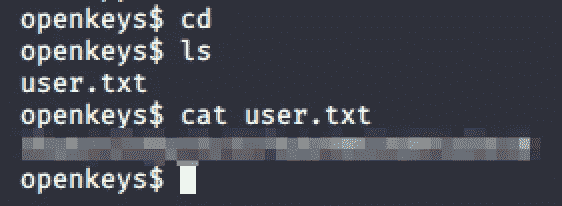

**成功了！！！**

# 横向运动

## 下载并执行 LinEnum.sh

使用`ksh`执行 *LinEnum.sh* 脚本，因为这是 OpenBSD。

`ksh ./LinEnum.sh`

# 权限提升

> 找到正确的利用方式

在 github 搜索中专门搜索了 cve 漏洞 2019–19520/2019–19522 后，终于找到了正在工作的[漏洞](https://github.com/bcoles/local-exploits/tree/master/CVE-2019-19520)。

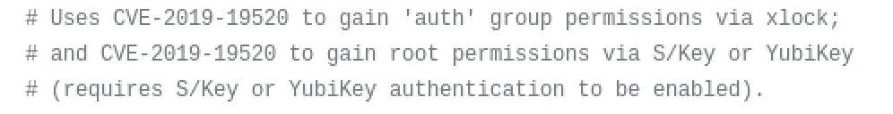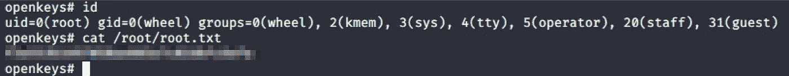

# 补救

*   确保使用的版本没有过时或没有任何已知的 CVE。
*   通过 HTTP 使用 HTTPS
*   在网页上显示用户的私钥有安全风险。

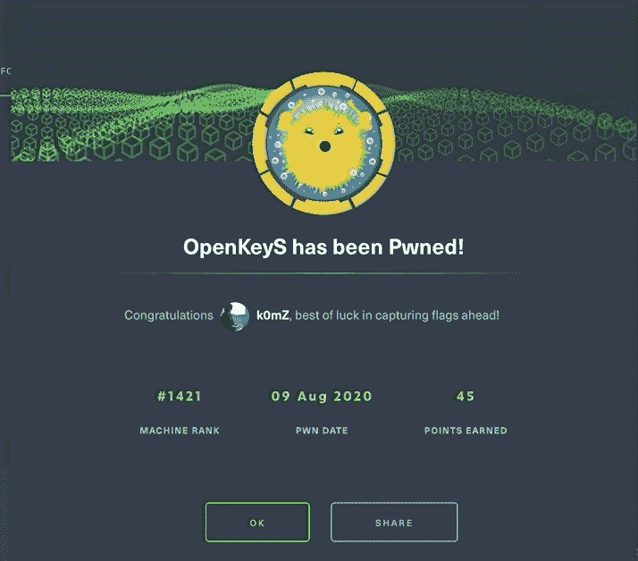