# HTB-修卡(轻松系列)

> 原文：<https://infosecwriteups.com/htb-shocker-take-it-easy-series-bc28254259b2?source=collection_archive---------2----------------------->

在 7 月份，Hack the Box ( HTB)提出了一个概念，让所有用户都可以使用 10 台退役的机器进行 pwn 并培养他们的技能。请查看 HTB 的公告。

作为这个系列的一部分，我已经开始尝试一个退役的盒子，即修卡。这些机器在退役机器中是免费的

让我们访问机器并获得 root 访问权限。

基本上，这是一台 Linux 机器。我们将运行 Nmap 扫描来识别开放的端口和服务。

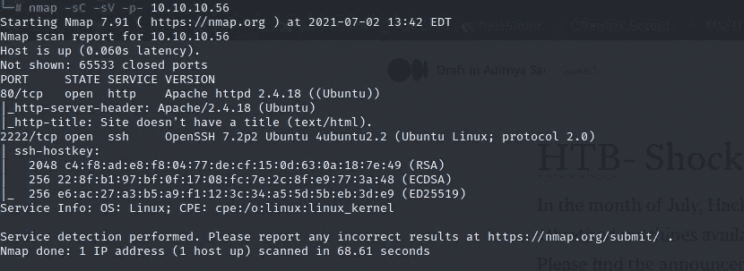

Nmap 扫描

输出显示这是一台在 2222 上运行 SSH 的 Ubuntu 机器，在端口 80 上运行 HTTP Apache 服务器。所以没有任何延迟，打开浏览器，进入网页。

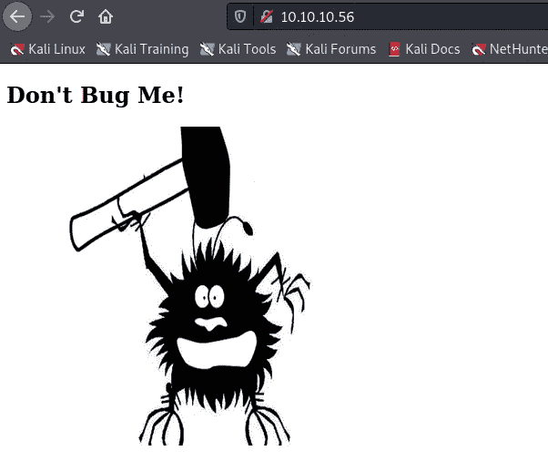

网页中没有内容。让我们来看看页面源代码。

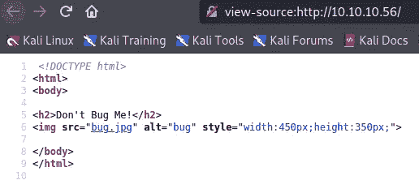

源页面上也没有。

现在，使用 go buster 来识别敏感方法的隐藏目录。我们主要关注显示状态代码 200、403 的目录。

我们可以看到定期索引，服务器状态目录。等等，除此之外，我们还有一个名为 CGI-bin 的目录。

当我试图谷歌了解它，我得到了以下信息，这是一种类型的文件夹主机脚本。因为它给出了一个 403 状态代码，所以让我们在那个目录中进行目录枚举，看看是否有我们可以使用的脚本。

```
A CGI-bin is a folder used to house scripts that will interact with a Web browser to provide functionality for a Web page or website. Common Gateway Interface (CGI) is a resource for accommodating the use of scripts in Web design. As scripts are sent from a server to a Web browser, the CGI-bin is often referenced in a url.
```

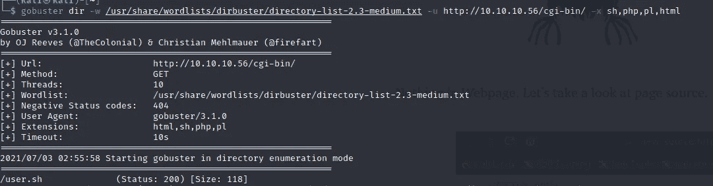

我们有发现了。CGI-bin 目录中有一个名为“user”的 shell 脚本文件。令人惊讶的是，它没有在浏览器中执行，而是给出了下载的提示。

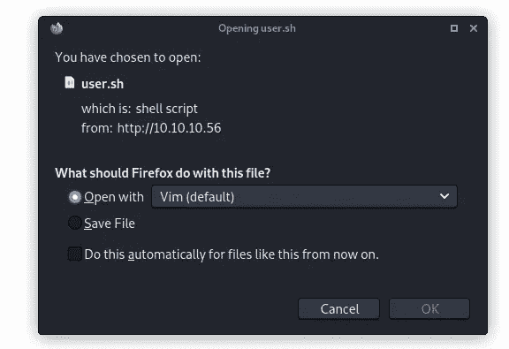

当我运行脚本时，它只显示服务器的正常运行时间。

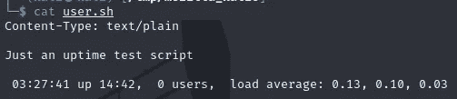

现在是时候利用机器了。根据机器名称和它的 CGI-bin，我们可以关联到它可能容易受到 2014 年检测到的 Shellshock 漏洞(CVE-2014–6271)的攻击。

有两种方法可以利用它。
1。Metasploit
2。公开攻击(命令注入)

# 使用 Metasploit 的根访问

安全研究人员对 Metasploit 并不陌生。有很多漏洞可以完成这个任务。让我们运行 msfconsole 并开始探索。

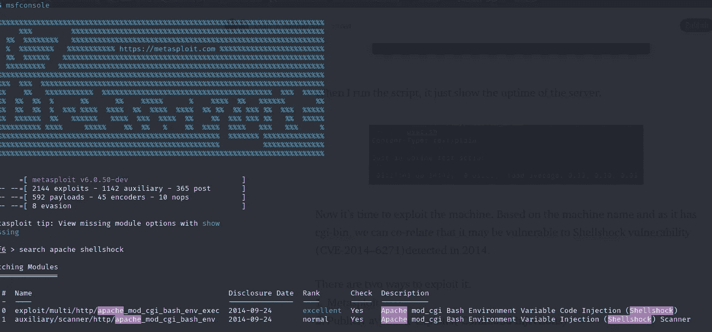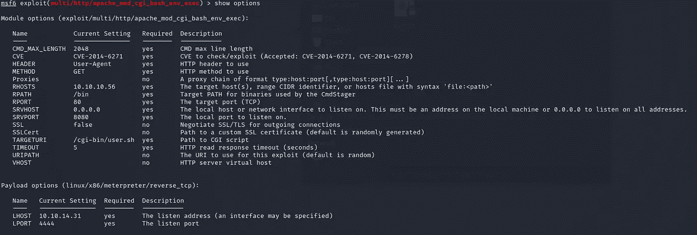

更新了详细信息的 MSF 漏洞利用(RHOST，RPORT TARGETURI)

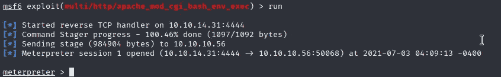

我们拿到了抄表员的权限。现在搜索标志并获得根 shell。让我们看看这台机器上有哪些用户。

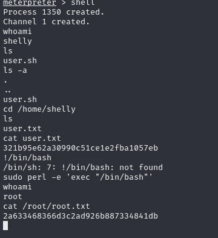

这台机器里有一个叫雪莉的用户，他给了我们第一面旗帜。
使用 Perl，我可以访问 bash shell，现在我是 root 用户了。使用 root
我可以访问第二面旗帜。

# 使用公共漏洞的超级用户访问

我们有多种利用工作 POC 的方法来利用此漏洞。下面是其中的一个，我将在这里使用。

[](https://www.exploit-db.com/exploits/34900) [## 攻击性安全利用数据库档案

### Apache mod_cgi - 'Shellshock '远程命令注入。CVE-2014-6278Linux 平台的远程利用

www.exploit-db.com](https://www.exploit-db.com/exploits/34900) 

这是一个利用和创建反向外壳的 python 脚本。这需要像 RHOST、RPORT、URL、LHOST、LPORT 这样的输入。

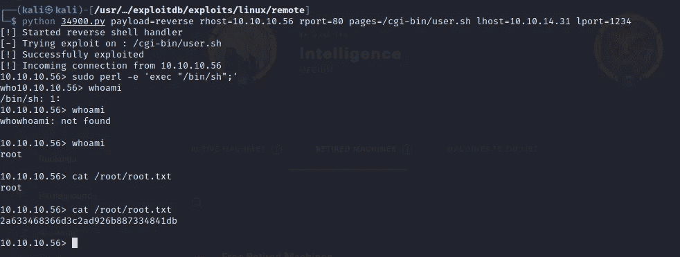

一旦我输入数据，我们就能进入外壳。为了获得根 shell 访问权限，我们使用 Perl shell 命令。一旦你是根，导航到该文件夹并抓住标志。

感谢您阅读这篇文章。这是 Hack the Box 的轻松系列的一部分。我将继续制作剩余的盒子，并分享我的心得。

从这个盒子中，我能够理解在 apache 中配置时与 CGI-BIN 相关的漏洞。