# HTB·塔比

> 原文：<https://infosecwriteups.com/htb-tabby-writeup-e5d25fb57329?source=collection_archive---------1----------------------->

## 目录遍历| LXD | RCE |弱密码

# 摘要

该网站利用了一个不充分的安全验证，即回溯系统的敏感文件。信息泄漏导致访问 host-manager 门户，暴露其版本易受远程代码执行的攻击。

发现该用户是某个组的成员，如果该组被利用，就会让该用户成为超级用户！

**使用的工具:** `nmap` | `apt-file` | `fcrackzip` |囊袋| `msfconsole`

# 侦察和计数

**Nmap 扫描**

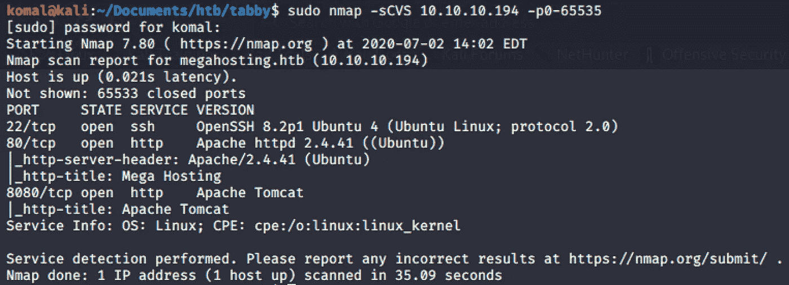

运行 nmap 以查找开放的端口

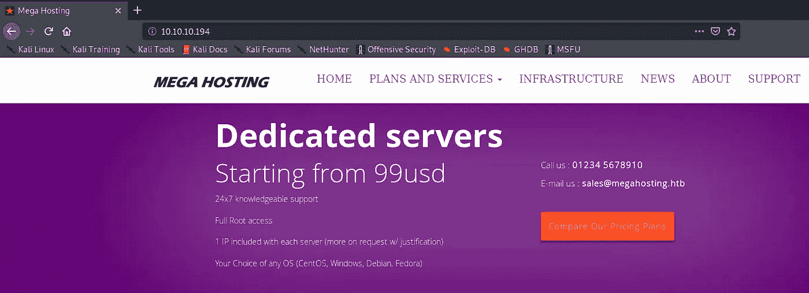

该网站的源代码揭示了一个可能被利用的`file` 参数:

`http://megahosting.htb/news.php?files=statment`

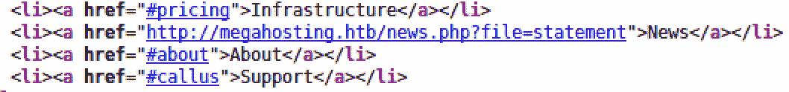

在本地机器的 **/etc/hosts** 文件中添加 IP 地址主机名。

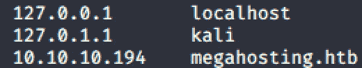

在 burpsuite 中，我尝试了如下所示的点点斜线攻击:

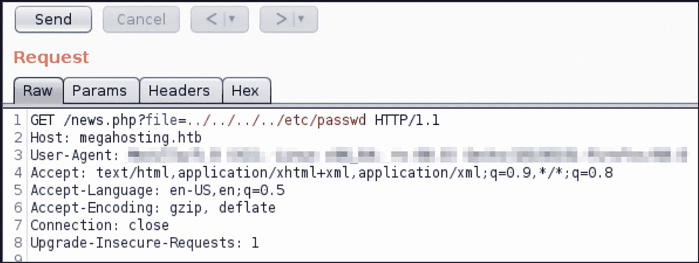

文件参数确实容易受到**点点斜线攻击**。它不限制用户访问上层文件系统目录。

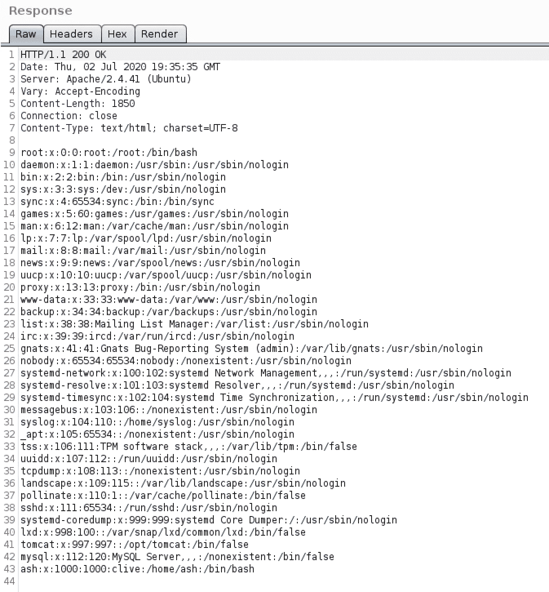

## 端口 8080 上的 Tomcat9

在[http://10 . 10 . 10 . 194:8080](http://10.10.10.194:8080)上，在页面底部提到了以下内容。

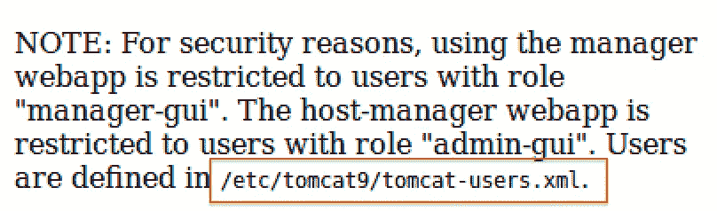

## Tomcat9 用户文件位置搜索

*我试图通过我们发现的 LFI 漏洞来搜索上述 xml 文件。但是没有快乐。*

所以现在为了理解 Tomcat 文件系统结构以找到潜在的用户名/密码，我使用了工具`apt-file` **。**

我安装了`apt-file`命令来理解 tomcat 文件的结构和敏感文件的位置。这样，我就可以在端口 80 上发现 LFI 漏洞中注入相同的文件位置。

> $ sudo apt-get 安装 apt 文件
> 
> $ sudo apt-文件更新
> 
> $ sudo apt-文件搜索 tomcat | grep 用户

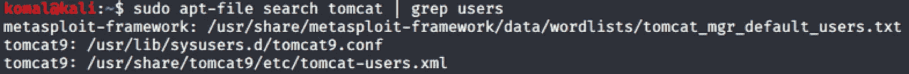

在浏览器上，您会注意到 **tomcat-users.xml** 文件中的内容是空白的。

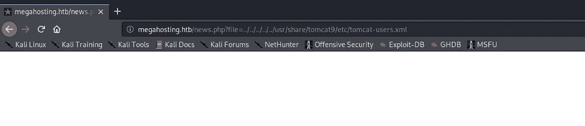

但是，如果您使用 burpsuite 并访问“tomcat-users.xml”文件的相同位置，您将能够看到响应头中的内容。

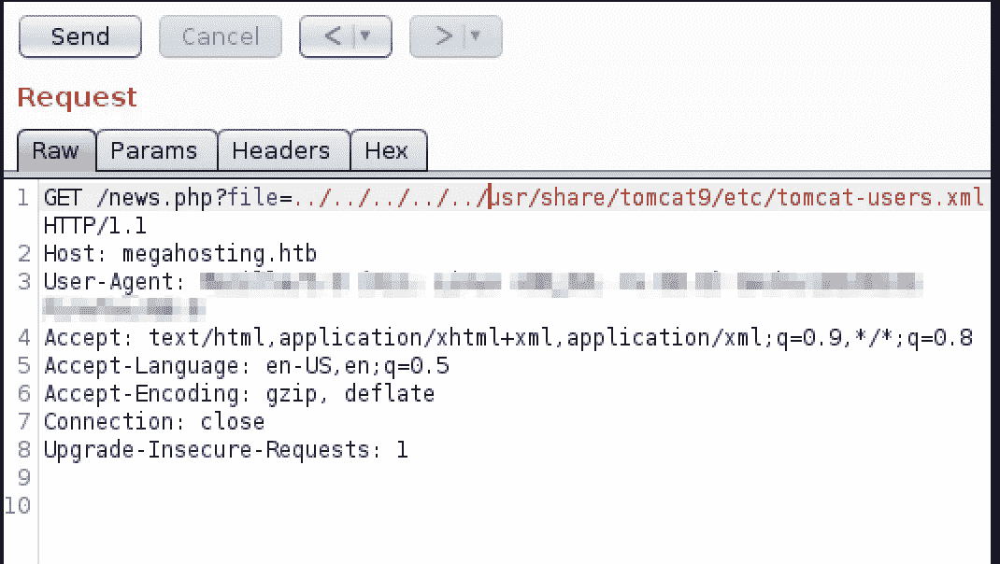

下面是回复标题，您可以在其中找到用户名和密码，如下所示。

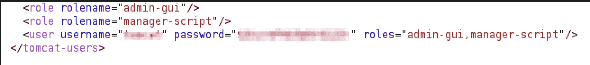

## 端口 8080 上的主机管理器

以上凭据适用于以下门户:

> [http://megahosting.htb:8080/host-manager](http://megahosting.htb:8080/host-manager)

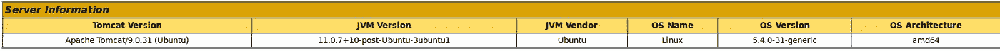

# 反向外壳

CVE 2020–1938 版本 9.0.31

[Tomcat 9.0.31](https://cve.mitre.org/cgi-bin/cvename.cgi?name=CVE-2020-1938) 的默认配置易受攻击，从而导致远程代码执行(RCE)。关于这个漏洞的更多信息可以在[这里](http://tomcat.apache.org/security-9.html#Fixed_in_Apache_Tomcat_9.0.31)找到。

> 在运行任何漏洞利用之前，我会将机器重置为全新安装，以确保正确的漏洞利用正常工作。

使用`msfconsole`，我在`exploit/multi/http/tomcat_mgr_deploy`模块下创建了以下设置。

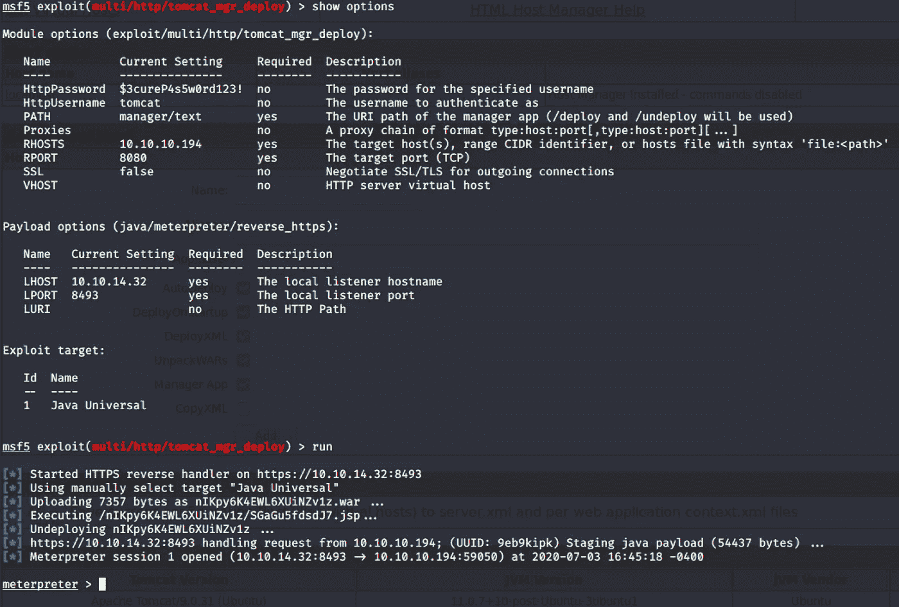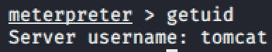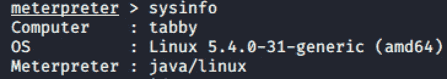

## 成功！！！

> 但是坚持住！

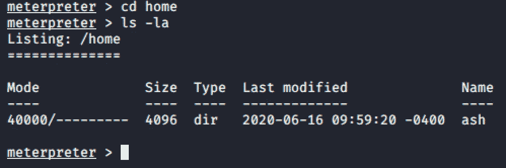

无法从`tomcat`用户处检索到`user.txt`文件。

我们需要`ash`用户账号密码来获取`user.txt`文件。

# 横向运动

**横向权限提升**

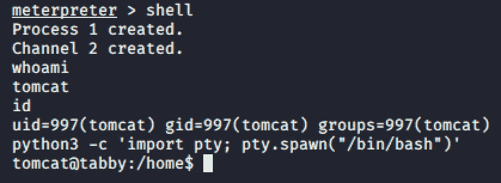

在`/var/www/html/files`中你会发现一个有趣的`16162020_back.zip`文件。

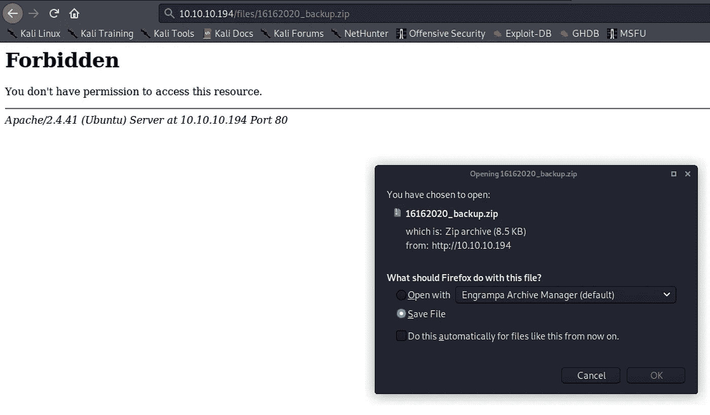

**我发现下载 zip 文件最简单的方法是这样的！**

在尝试解压这个文件时，我发现它有密码保护。

我运行命令`fcrackzip -u -c a -D -p /usr/share/wordlists/rockyou.txt '/home/komal/Documents/htb/tabby/16162020_backup.zip'`来破解密码。

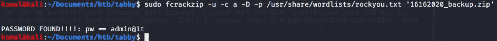

解压文件夹并查看文件内容后，我没有找到任何感兴趣的东西:-(

**直到……我这样做了……**

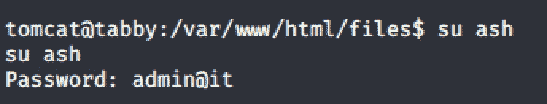

这是一个糟糕的密码策略

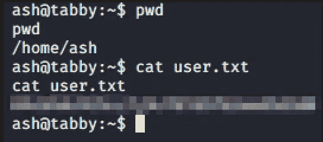

成功了！！！

> 第二阶段的任务一已经完成了！

# 垂直权限提升

用户`ash`群透露是 LXD 群成员。

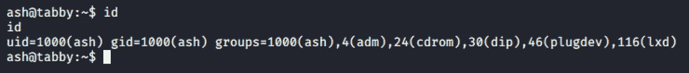

LXD (Linux 守护进程)—Linux 容器管理程序

LXC (Linux 容器)

*   如果用户是`lxd`组的成员，那么这可能会导致获得根用户访问权限。更多关于 lxd 漏洞的信息可以在[这里](https://www.exploit-db.com/exploits/46978)找到。

> `'lxc'`是一个 linux 命令，通过它可以运行 LXD 的所有功能。

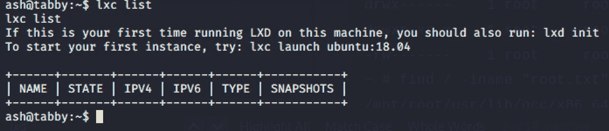

通过运行如上所示的`lxc list`命令，我们可以看到如何开始运行我们的第一个 LXD 实例:

> `*lxd init*`
> 
> `*lxc launch ubuntu:18.04*` —运行这个命令对我不起作用，所以我采取了不同的方法。

**但首先:**

在我的攻击者机器上，我从 github 下载了 Alpine container builder 脚本’,并运行以下命令:

> git 克隆[https://github.com/saghul/lxd-alpine-builder.git](https://github.com/saghul/lxd-alpine-builder.git)T2【CD lxd-alpine-builder . git
> 。/build-阿尔卑斯山

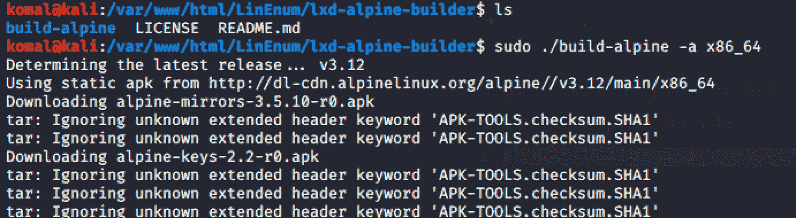

成功执行后，您将看到“alpine-v 3.12-x86 _ 64–2020 07 01 _ 1615 . tar . gz”文件已创建。现在，把这个文件放在你的本地网络主机上，然后传输到 ash。

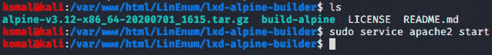

启动 apache2 web 服务器来托管 gz 文件。

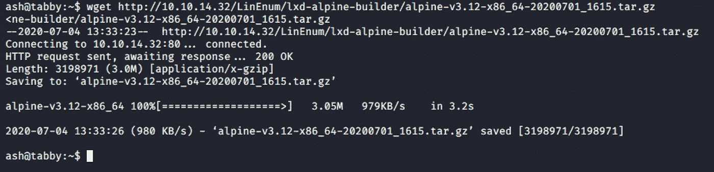

gz 文件通过 wget 检索到 ash@tabby 机器中。

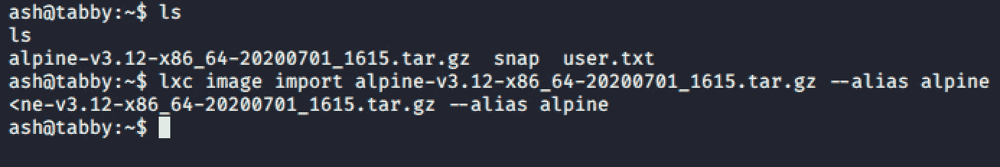

导入 lxc 图像，并将图像名称设置为“alpine”

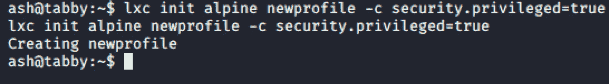

在这里，我们创建了一个名为“newprofile”的新容器，并将其设为特权容器。

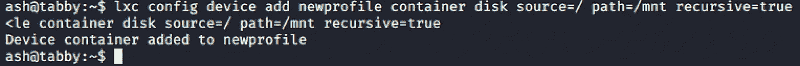

在这里，通过特权容器(newprofile)，我们将主机的文件系统(容器磁盘源=/)挂载到路径“mnt”目录(路径=/mnt)以获得根目录。

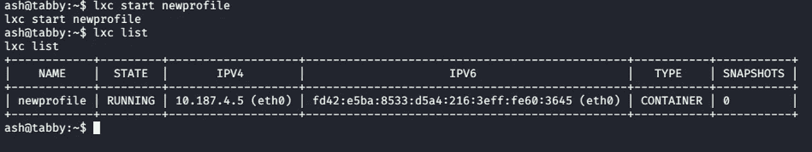

启动容器后，我们现在可以在“lxc list”下看到其活动状态为“running”。

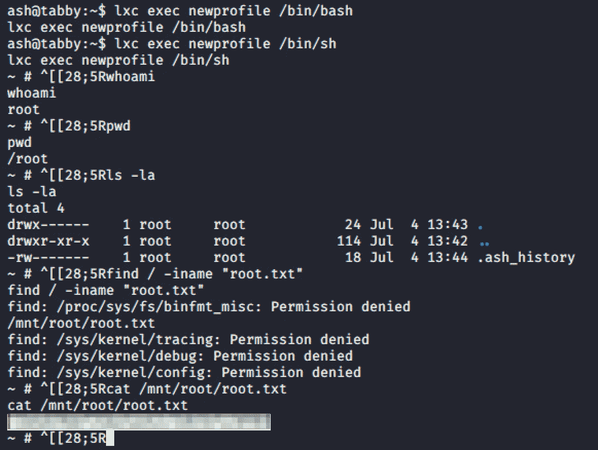

最后，特权容器被滥用来获取外壳

> 第二阶段的任务 II 已经完成了！

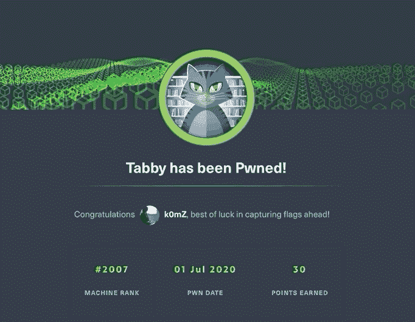

# 补救

*   实施适当的 ACL 控制来停止回溯文件和目录。
*   从标准用户帐户中删除 LXD 组。
*   避免出于不同目的使用相同的密码。
*   始终使用至少 10 个字符的唯一密码/密码短语。

# 参考资料:

*   [https://www . RS-online . com/design spark/an-intro-to-Linux-file-system-management](https://www.rs-online.com/designspark/an-intro-to-linux-file-system-management)
*   [https://github.com/saghul/lxd-alpine-builder.git](https://github.com/saghul/lxd-alpine-builder.git)