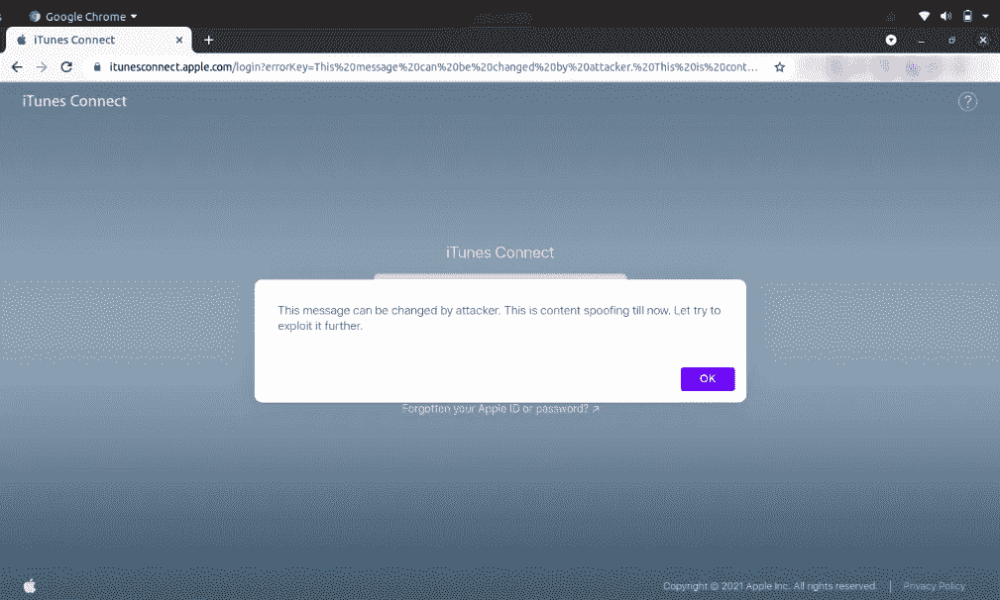
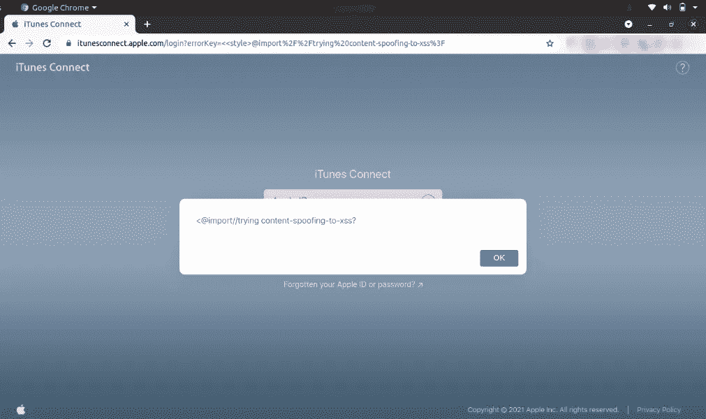
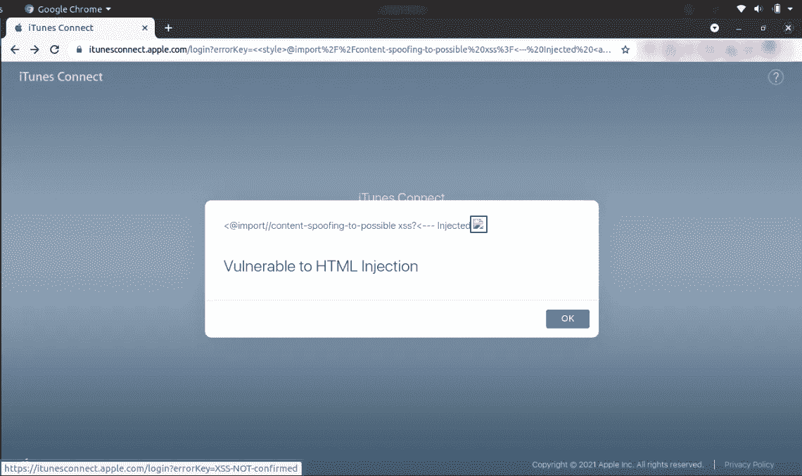
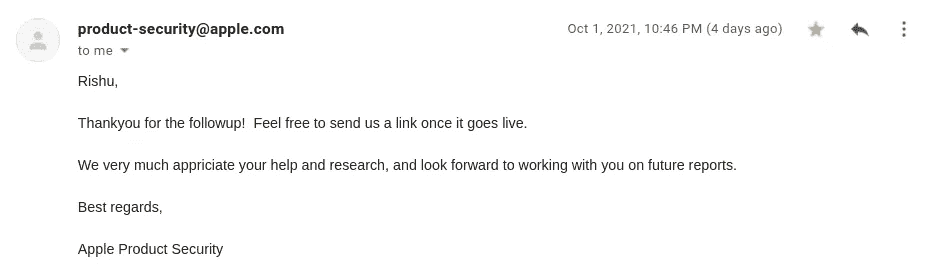

# 苹果使用悬空标记注入将内容欺骗为 HTML 注入的小故事

> 原文：<https://infosecwriteups.com/html-injection-in-itunesconnect-apple-com-3f8a898f21ee?source=collection_archive---------0----------------------->

内容欺骗是一种注入，其中用户输入反映在应用程序响应中，可用于网络钓鱼攻击。

在侦察阶段，我发现了******的一个**子域苹果和深入查看后，我观察到**错误键**参数的内容反映回如下页面****

******有效载荷-**https://itunesconnect.apple.com/login?[errorKey =此% 20 消息% 20 可能被% 20 攻击者% 20 更改。% 20 这% 20 是% 20 内容% 20 欺骗% 20 现在将% 20 停止。% 20 让% 20 尝试% 20 到% 20 进一步利用% 20it %。](https://itunesconnect.apple.com/login?errorKey=This%20message%20can%20be%20changed%20by%20attacker.%20This%20is%20content%20spoofing%20till%20now.%20Let%20try%20to%20exploit%20it%20further.)****

********

****内容欺骗到此为止****

****对于普通的内联跨站点脚本(XSS)有效负载，应用程序给出一个空白的弹出窗口。在尝试了不同的场景后，我观察到在易受攻击的参数(errorKey)上可能存在悬空标记注入****

******让我们来理解悬空标记注入的概念******

****当我们由于输入过滤器、内容安全策略或其他障碍负载而无法找到执行 JavaScript 的方法时，悬空标记注入非常有用，但我们可以注入一些 HTML 标签。它利用图像等资源将数据发送到攻击者控制的远程位置，从而在没有脚本的情况下窃取页面内容。****

****对于我们的开发，我使用 CSS `**@import**`作为有效载荷。@import 方法的主要目的是在一个页面上使用多个样式表。****

********

****时间的最后有效载荷有一个破碎的图像链接到 itunesconnect.apple.com 本身，导致 HTML 注入。****

******有效载荷-**https://itunesconnect.apple.com/login?[error key = % 3C % 3C style % 3E @ import % 2F % 2f content-spoofing-to-possible % 20 XSS % 3F % 3C-% 20 injected % 20% 3Ca % 20 href % 3D https:% 2F % 2f tunes connect . apple . com % 2f login % 3f orkey % 3D XSS-NOT-confirmed % 3E % 3C img % 20 src % 3D % 22 https:% 2F % 2f bite napple . com % 2 fmytest . JPEG % 22% 3E % 3C %](https://itunesconnect.apple.com/login?errorKey=%3C%3Cstyle%3E@import%2F%2Fcontent-spoofing-to-possible%20xss%3F%3C---%20Injected%20%3Ca%20href%3Dhttps:%2F%2Fitunesconnect.apple.com%2Flogin%3FerrorKey%3DXSS-NOT-confirmed%3E%3Cimg%20src%3D%22https:%2F%2Fbitenapple.com%2Fmytest.jpeg%22%3E%3C%2Fa%3E%3C%2Fbr%3E%3C%2Fbr%3E%3C%2Fbr%3E%3Ch1%3EVulnerable%20to%20HTML%20Injection%3C%2Fh1%3E)****

********

******时间线******

****2021 年 7 月 28 日-向苹果产品安全团队报告了该问题。****

****2021 年 7 月 29 日——收到了苹果公司的回复，带有后续 ID。****

****2021 年 9 月 14 日-该问题已被修补。向苹果团队要求更新。****

****2021 年 9 月 20 日——苹果团队承认并要求在下一个更新周期在他们的信用页面上提及细节。所需的细节在同一天分享。****

****2021 年 9 月 22 日——给苹果团队发邮件，请求批准围绕这个问题发表一篇博客。****

****2021 年 9 月 23 日——苹果团队希望对博客进行审核并提供反馈。用博客草稿回复了苹果。****

****2021 年 10 月 1 日——苹果团队同意发布博客。****

********

******参考******

**** [## 悬空标记注入|网络安全学院

### 在这一节中，我们将解释悬空标记注入，典型的利用方式，以及如何防止悬空…

portswigger.net](https://portswigger.net/web-security/cross-site-scripting/dangling-markup)  [## 悬空标记- HTML 无脚本注入

### 编辑描述

book.hacktricks.xyz](https://book.hacktricks.xyz/pentesting-web/dangling-markup-html-scriptless-injection)****