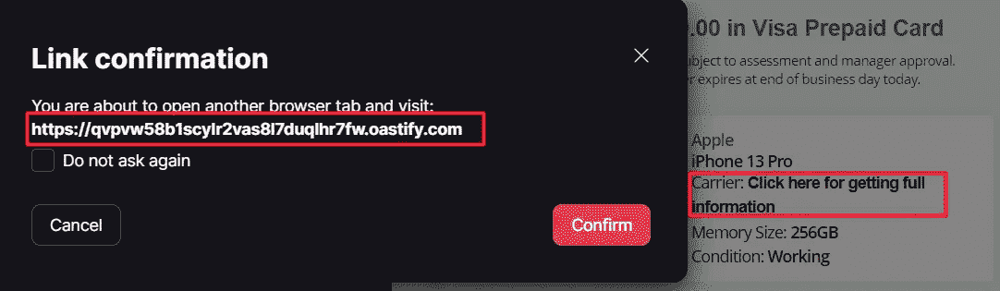

# 电子邮件正文中的 HTML 注入——我在 Bug Bounty 平台上追捕到的第一个 BUG！

> 原文：<https://infosecwriteups.com/html-injection-inside-email-body-the-first-bug-i-hunted-in-a-bug-bounty-platform-3c96b1e0ae9f?source=collection_archive---------0----------------------->

你好，朋友！！

今天，我在 Hackerone 上发现了我的第一个 Bug，这对我来说很有趣，希望你也一样！

我在工作场所的一次接触(Web 应用渗透测试)中观察并利用了这个 Bug，并想到在我在 Hackerone 中测试的一个应用程序中寻找它，从标题中可以明显看出它确实有效。

所以在谈论这个漏洞之前，我想让你知道这个程序不允许暴露这个漏洞，所以让这个域成为***【target.com】***。

# **易受攻击特征:**

*target.com*有一个功能，允许用户**出售二手电子产品**，包括手机、游戏机、键盘、耳机等。

该应用程序提示用户输入一些关于他们有兴趣销售的产品的详细信息，并使用这些信息来估计用户可能获得的金额，如果他们准备在附近的商店销售该产品的话。

漏洞出现在应用程序计算和**通过电子邮件**将估算发送给用户的地方。

# **功能的实际问题:**

此功能有两个问题**允许成功利用漏洞，它们是**

> 网络应用程序无法控制发送估价的电子邮件，允许用户输入他/她想要的任何电子邮件 id，并接收来自*target.com*的电子邮件。
> 
> 另一个问题是，应用程序从用户那里获取产品信息，并且在将其嵌入到电子邮件正文之前没有进行任何清理，从而导致 HTML 注入。

# **开采和影响:**

综上所述，攻击者有可能编制一封恶意电子邮件，用于**社会工程攻击**，并使用*target.com*邮件服务器和他们的官方电子邮件 ID 发送邮件。

因此，我输入了一些关于要销售的产品的随机信息，并使用负责生成电子邮件的 Burp 代理来捕获请求，然后**将 HTML 标签**注入到参数中，使**反映在电子邮件正文**中。

瞧啊。！！！注入的 HTML 标签在发送给受害者的邮件正文中得到渲染(在这种情况下，这是我的个人邮件)。

> 我精心制作了一封带有锚标签的电子邮件，并使用 Burp Collaborator URL 来演示这次攻击。
> 
> 但是恶意攻击者可以使用相同的技巧在受害者的机器上钓鱼或安装任何恶意软件，也可以使用 **target.com 的邮件服务器**。

这可能会给公司造成巨大的声誉损失，如果他们使用任何付费服务来生成此类电子邮件，那么在大规模进行时甚至会造成财务损失。

所以，我的朋友，如果你曾经在应用程序中遇到过这样的特性，一定要寻找这个问题，并享受狩猎！

## 来自 Infosec 的报道:Infosec 每天都有很多内容，很难跟上。[加入我们的每周简讯](https://weekly.infosecwriteups.com/)以 5 篇文章、4 条线索、3 个视频、2 个 GitHub Repos 和工具以及 1 个工作提醒的形式免费获取所有最新的 Infosec 趋势！