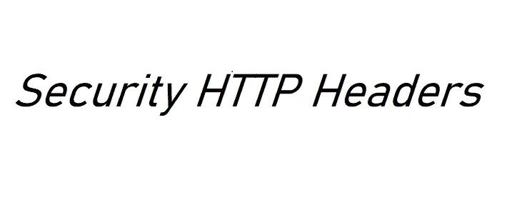

# HTTP 头:Web 应用程序安全基础

> 原文：<https://infosecwriteups.com/http-headers-web-app-security-basics-d3d08ffc38ea?source=collection_archive---------1----------------------->



**HTTP headers** 让客户机和服务器通过 HTTP 请求或响应传递附加信息。HTTP 头由不区分大小写的名称、冒号和值组成。

示例:

```
Strict-Transport-Security: max-age=31536000
```

一些与隐私和安全间接相关的 HTTP 头也可以被认为是 HTTP 安全头。通过在 web 应用程序和 web 服务器设置中启用合适的头，可以改进 web 应用程序针对常见漏洞的防御机制。以下是一些常见的安全标头:

*   [**内容-安全-策略**](https://developer.mozilla.org/en-US/docs/Web/HTTP/Headers/Content-Security-Policy) (响应头):这允许网站管理员控制允许用户代理为给定页面加载的资源。CSP 提供了一个额外的安全层来抵御多种漏洞，如 XSS、点击劫持、协议降级和帧注入。它也可以作为安全头的替代品，如 *X-Frame-Options* 和 *X-XSS-Protection。*

在 CSP 中，白名单用于定义规则。我们可以过滤掉任何不符合我们规则的资源。

示例:

```
Content-Security-Policy: <policy-directive>; <policy-directive>
<policy-directive> consists of: <directive> <value> with no internal punctuation. **Content-Security-Policy: script-src 'self' https://example.com**#Few Policy-directives and their details:
- **frame-ancestors:** specifies the sites that have the authority to load the current page in a  frame, iframe, object, embed, and applet tag. It is a substitute for  X-Frame-Options, since it can also help prevent Clickjacking and UI  Redressing attacks.
- **object-src:** defines or restricts the sources from <object>,  <embed>, and <applet>, which helps preventing Cross-Site  Scripting attacks.
- **upgrade-insecure-requests:** Instructs user agents to treat all of a site's insecure URLs (those  served over HTTP) as though they have been replaced with secure URLs(those served over HTTPS).
```

*   [**X-Frame-Options**](https://developer.mozilla.org/en-US/docs/Web/HTTP/Headers/X-Frame-Options)(Response Header):这可以用来表示是否允许浏览器在<框架>、< iframe >、< embed >或< object >中呈现页面。应用程序可以利用这一点来避免[点击劫持](https://developer.mozilla.org/en-US/docs/Web/Security/Types_of_attacks#Click-jacking)攻击。

示例:

```
**X-Frame-Options: DENY | SAMEORIGIN | ALLOW-FROM URL**
#Further Details:
- **Deny**: The page cannot be displayed in a frame, regardless of the site attempting to do so.
- **SAMEORIGIN**: The page can only be displayed in a frame on the same origin as the page itself.
- **ALLOW-FROM-URL**: The website can only be framed by the URL specified here.
```

**注意**:Content-Security-Policy HTTP 报头有一个 frame-ancestors 指令，它废弃了这个报头以支持浏览器。

*   [**X-XSS-保护**](https://developer.mozilla.org/en-US/docs/Web/HTTP/Headers/X-XSS-Protection) (响应头):这个头是 Internet Explorer、Chrome 和 Safari 的一个功能，当它们检测到反射的跨站脚本( [XSS](https://developer.mozilla.org/en-US/docs/Glossary/XSS) )攻击时，会阻止页面加载。

示例:

```
**X-XSS-Protection: 0 | 1 | 1; mode=block | 1; report=<reporting-uri>**
#Further Details:
**0**: Disables XSS filtering.
**1**: Enables XSS filtering.
**1; mode=block**: Enables XSS filtering. In case of attack, the browser will prevent rendering of the page, rather than sanitizing the page.
**1; report=<reporting-URI>** (Chromium only): Enables XSS filtering. If a XSS attack is detected, the  browser will sanitize the page and report the violation.
```

*   [**HTTP 严格的传输安全**](https://developer.mozilla.org/en-US/docs/Web/HTTP/Headers/Strict-Transport-Security) (响应头):HSTS 告诉浏览器只能使用 HTTPS 访问网站，而不能使用 HTTP。

示例:

```
**Strict-Transport-Security: max-age=63072000; includeSubDomains; preload**
#Further Details:
- **max-age=<expire-time>** : The time, in seconds, that the browser should remember that a site is only to be accessed using HTTPS (Recommendation of 2 years of time period).
- **includeSubDomains** (optional parameter): rule applies to all of the site's subdomains as well.
- **Preload**: whether the site should be included in the HSTS preload list
```

**注意** : HSTS 是基于第一次使用的信任(豆腐)，这意味着我们必须手动重定向用户，在他们的第一个 HTTP 请求，到我们网站的 HTTPS 版本。在它的响应中，会有一个 HSTS 头，浏览器会把它存储在缓存中。下一次出现不安全(HTTP)连接时，它将自动重定向到安全连接。攻击者可以对第一个 HTTP 请求使用 MITM 攻击，并使用 SSL 剥离或 SSL 劫持等技术。为了防止这种情况，我们需要将站点添加到 [*HSTS 预加载列表*](https://hstspreload.org/) 中，并在标题中添加预加载指令。浏览器将检查该站点是否在预加载列表中，并拒绝通过不安全的连接加载它。

*   [**X-Content-Type-Options**](https://developer.mozilla.org/en-US/docs/Web/HTTP/Headers/X-Content-Type-Options)(Response Header):用于控制 web 浏览器中的 MIME 类型嗅探功能。如果 [*内容类型*](https://developer.mozilla.org/en-US/docs/Web/HTTP/Headers/Content-Type) 标题为空或缺失，浏览器会“嗅探”内容并尝试以最合适的方式显示源文件。要防止浏览器嗅探页面内容并决定使用哪种 MIME 类型，请使用带有' *nosniff'* 指令的 X-Content-Type-Options 头:

示例:

```
**X-Content-Type-Options: nosniff**
```

*   [**Expect-CT**](https://developer.mozilla.org/en-US/docs/Web/HTTP/Headers/Expect-CT) (响应头):允许站点选择报告和/或执行[证书透明度](https://developer.mozilla.org/en-US/docs/Web/Security/Certificate_Transparency)要求，以防止该站点使用错误颁发的证书而不被注意到。当一个站点启用 Expect-ct 报头时，它们请求浏览器检查该站点的任何证书是否出现在 [**公共 CT 日志**](https://www.certificate-transparency.org/known-logs) 中。

示例:

```
**Expect-CT: report-uri="<uri>",enforce, max-age=<age>**
#Further Details:
- max-age: This is the duration (in seconds) of the data being stored in the browser cache.
- **report-uri:** This is the URL to which the breach report will be sent.
- **enforce:** This indicates whether the connection should be established, if a certificate that doesn’t comply with CT is present.
```

**注**:Expect-CT 很可能在 2021 年 6 月被淘汰。自 2018 年 5 月起，预计新证书将默认支持 SCT。2018 年 3 月之前的证书的有效期为 39 个月，这些证书将于 2021 年 6 月到期。

*   [**Access-Control-Allow-Origin**](https://developer.mozilla.org/en-US/docs/Web/HTTP/Headers/Access-Control-Allow-Origin)(Response header):表示响应是否可以与来自给定[原点](https://developer.mozilla.org/en-US/docs/Glossary/origin)的请求代码共享。

示例:

```
**Access-Control-Allow-Origin: * | <origin> | null**
#Further Details:
***:** Allows request code from any origin to access the resource.
**<origin>**: Specifies an origin. Only a single origin can be specified.
```

参考资料:

[](https://developer.mozilla.org/en-US/docs/Web/HTTP/Headers) [## HTTP 标题

### HTTP 头让客户机和服务器通过 HTTP 请求或响应传递附加信息。一个 HTTP 头…

developer.mozilla.org](https://developer.mozilla.org/en-US/docs/Web/HTTP/Headers)  [## 网络安全

### 本文档的目标是帮助运营团队创建安全的 web 应用程序。所有 Mozilla 网站和…

infosec.mozilla.org](https://infosec.mozilla.org/guidelines/web_security)