# HTTP-主机标头攻击

> 原文：<https://infosecwriteups.com/http-host-header-attacks-55ca4b7786c?source=collection_archive---------0----------------------->

嗨！我的名字是 Hashar Mujahid，今天我们将学习如何在 web 应用程序中进行主机头攻击。

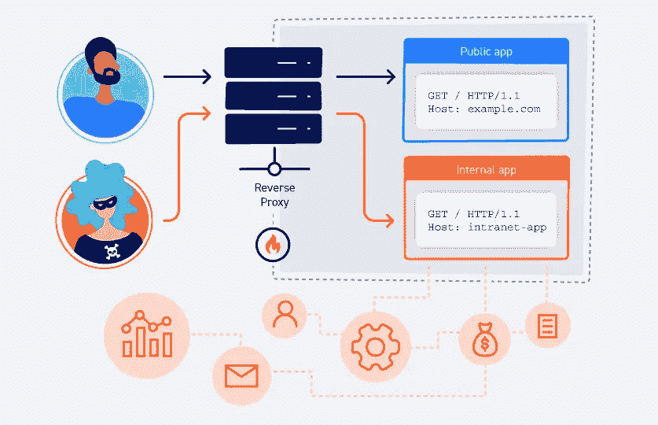

HTTP 主机标头攻击

# **主机头是什么？**

通俗地说，HTTP 主机头在请求中是强制的，它包含用户想要访问的网站的域名。

例如，如果用户想要访问`youtube.com`。当他发送请求时，该请求的主机报头将包含 youtube.com 的地址。

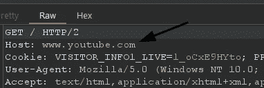

例子

# 什么是 HTTP 主机头攻击？

如果 web 应用程序不验证主机头中的值，那么攻击者可以操纵该值，并利用它将有害的有效负载注入 web 应用程序。此漏洞可能导致许多其他漏洞，如

*   Web 缓存中毒
*   SSRF

在某些情况下还包括 SQL 注入。

# 它们是如何产生的？

HTTP 主机头漏洞的出现是由于开发人员错误地认为用户无法控制主机头值。

web 应用程序天生信任主机头中的所有值，并且不验证它们。即使在某些情况下进行了验证，也是非常薄弱的，简单的注射可以绕过验证。

# 主机头注入测试？

主机头注入的初始测试很简单，只需在主机头中提供一个任意值，看看是否还能得到有效的响应。

例如:

```
GET / HTTP/1.1
Host: www.attacker.com
[...]
```

回应:

```
HTTP/1.1 302 Found
[...]
Location: http://www.attacker.com/login.php
```

如果您得到了有效的响应，这意味着目标容易受到主机标头注入的攻击。

如果应用了某种验证，您仍然可以尝试使用各种技术来绕过它，我们稍后将会看到这些技术。

# 可以进行哪些攻击？

攻击者可以利用此漏洞进行多次攻击。

**密码重置中毒:**

攻击者可以获得用户名或电子邮件来代表他们提交密码请求，然后他需要拦截该请求并操纵主机头，将该值更改为指向攻击者控制的域。如果主机头注入存在，攻击者将收到重置令牌，并根据自己的喜好重置密码。

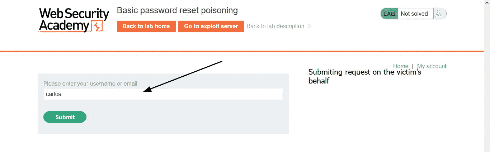

代表受害者提交请求

拦截请求:

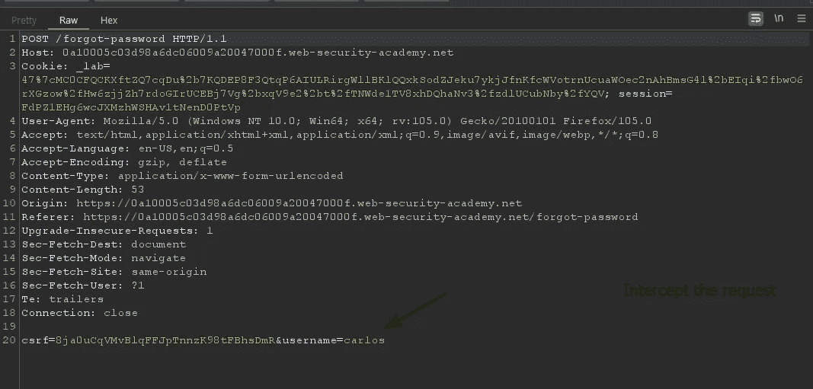

现在操纵主机头指向您的域。

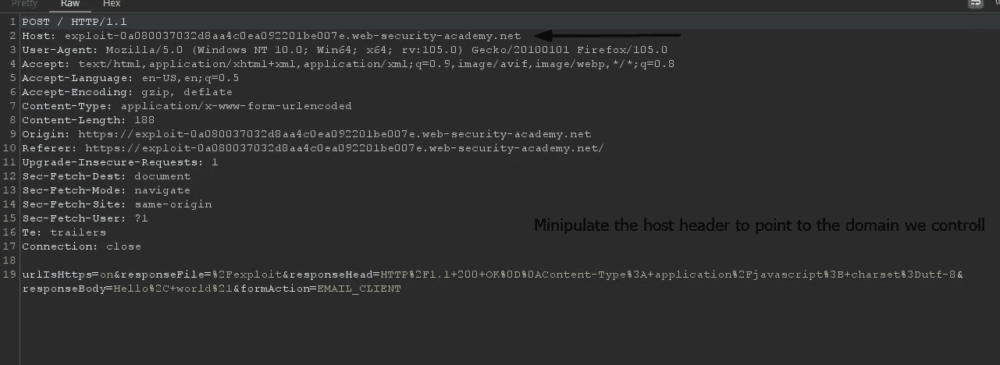

我们可以在访问日志中看到我们有一个重置令牌


现在只需使用这个令牌为 Carlos 设置一个新密码。

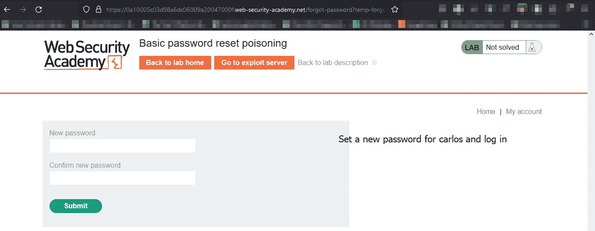

登录

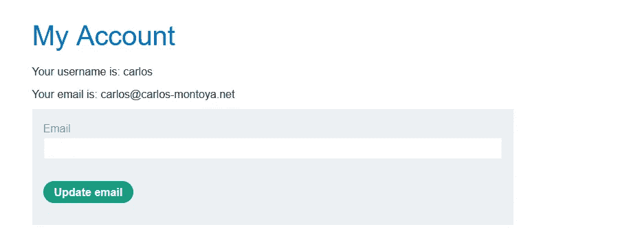

解决

我们可以看到主机标头注入漏洞如何导致另一个用户的完全帐户接管。

**使用主机报头注入的认证旁路:**

网站仅对内部用户隐藏一些功能，如管理员和网站管理员。但是，如果主机注入漏洞存在，这可以被绕过，因为开发人员作出了错误的假设，即主机标头不是用户可控制的。

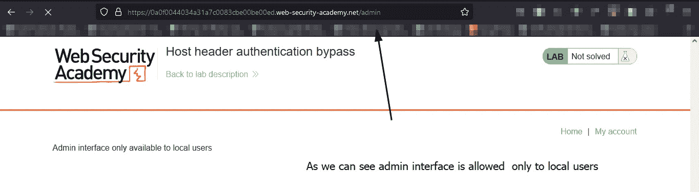

管理

我们没有任何凭证，也不能注册一个帐户，所以我们如何解决这个问题…

让我们拦截访问管理面板的请求，并尝试不同的注入。

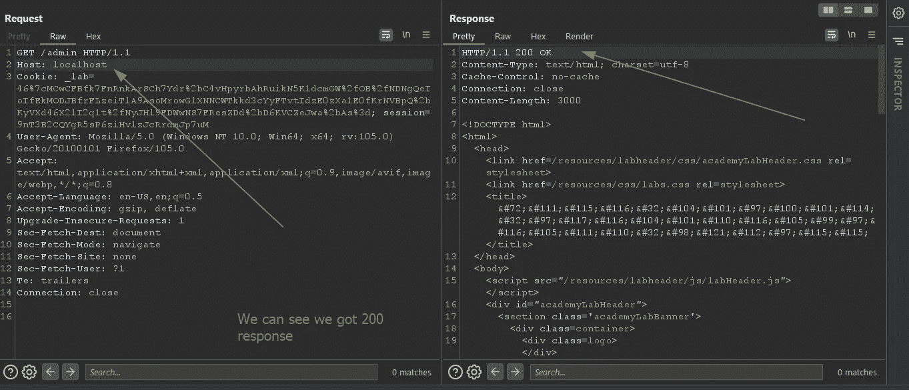

我们可以看到我们得到了一个 200 的响应代码，但是怎么做呢！！！

本地主机解析为`127.0.0.1`，其中管理面板也是活动的，因此通过更改主机头，我们能够访问管理面板，从而绕过认证机制。

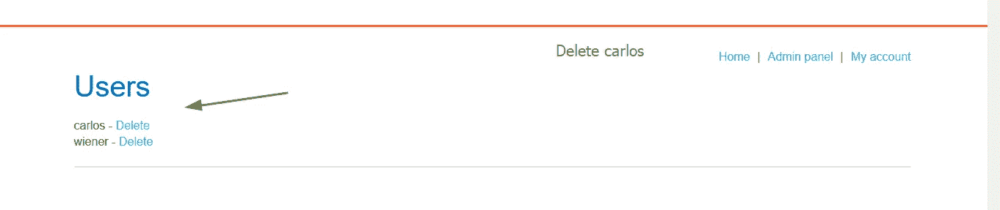

解决

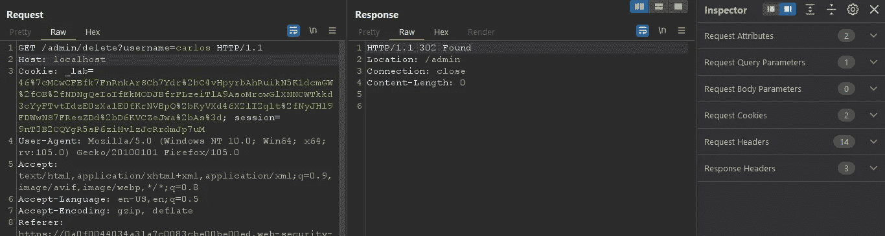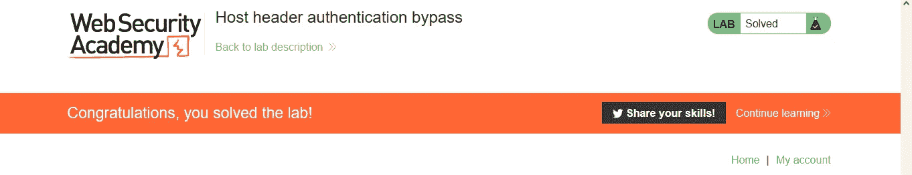

在接下来的博客中，我们将看到如何利用这个漏洞来执行 SSRF 和 Web 缓存中毒以及许多其他高级技术。

## 现在终于到了讨论如何绕过主机标头中的验证的时候了，这将有助于执行未来的实验。

## **绕过主机头注入验证:**

有时 web 应用程序确实会验证主机头中的内容，但是这种验证有时也可以使用各种技术绕过。

我们将在这里讨论其中的一些。

**主机头重复:**

我们将插入 2 个主机头，其中一个将包含恶意的有效载荷，另一个将是原始的，但你可能会有一个问题，这将如何帮助我们绕过验证。

答案是，其中一个主机头将覆盖另一个主机头的值。我们无法确定哪个主机头将工作并被接受，但不同的技术和系统会以不同的方式处理这一过程。

```
GET /example HTTP/1.1 
Host: vulnerable-website.com 
Host: evil.com
```

**或**

```
GET /example HTTP/1.1 
Host: bad-stuff-here
Host: vulnerable-website.com
```

**添加换行:**

这与插入重复的主机头是一样的，但在主机头中有缩进，服务器将把缩进的头解释为换行，因此，把它作为前一个头的值的一部分。不同的服务器对这种技术会有不同的反应。

```
GET /example HTTP/1.1 
    Host: bad-stuff-here
Host: vulnerable-website.com
```

**注入主机覆盖头:**

如果主机头被验证，你可以尝试注入一些 HTTP 方法来覆盖主机头中的值。

```
GET /example HTTP/1.1 
Host: vulnerable-website.com
**X-Forwarded-Host: evil.com** **X-Forwarded-Server:** **evil.com** **X-HTTP-Host-Override:** **evil.com** **Forwarded:** **evil.com**
```

**提供绝对 URL:**

我们可以尝试在`GET`请求中注入绝对路径或 URL，将主机改为 evil，看看服务器是否用 200 响应码响应我们。

例如:

```
GET **https://vulnerable-website.com/** HTTP/1.1 
**Host: evil.com**
```

在下一篇博客中，我们将看到如何通过链接主机头注入漏洞来执行不同的攻击。

在那之前，快乐的黑客❤

## 来自 Infosec 的报道:Infosec 每天都有很多内容，很难跟上。[加入我们的每周简讯](https://weekly.infosecwriteups.com/)以 5 篇文章、4 个线程、3 个视频、2 个 GitHub Repos 和工具以及 1 个工作提醒的形式免费获取所有最新的 Infosec 趋势！